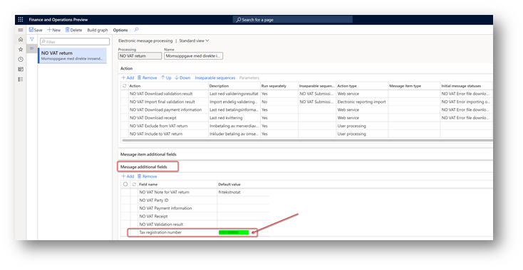

---
# required metadata

title: Prepare your environment to interoperate with ID-porten and Altinn web services
description: This topic explains how to prepare your environment to interoperate with ID-porten and Altinn web services.
author: liza-golub
ms.date: 11/18/2021
ms.topic: article
ms.prod: 
ms.technology: 

# optional metadata

# ms.search.form: 
# ROBOTS: 
audience: Application User
# ms.devlang: 
ms.reviewer: kfend
# ms.tgt_pltfrm: 
# ms.custom: 
ms.search.region: Norway
# ms.search.industry: 
ms.author: elgolu
ms.search.validFrom: 2021-11-18
ms.dyn365.ops.version: AX 10.0.22

---

# Prepare your environment to interoperate with ID-porten and Altinn web services

After your company [registered integration point](emea-nor-vat-return-integration-point.md) in ID-porten web portal, complete the following tasks. 
These tasks will prepare your Microsoft Dynamics 365 Finance environment to interoperate with ID-porten and Altinn web services to submit VAT returns.

- [Import and set up Electronic reporting (ER) configurations](#er-setup)
- [Set up application-specific parameters for the VAT Declaration format](#application-specific-parameters)
- [Import a package of data entities that includes a predefined Electronic messaging (EM) setup](#em-setup)
- [Set up the VAT registration number of the company that is reporting VAT return](#vat-registration-number)
- [Set up paper format to preview VAT return](#preview-format)
- [Enable VAT return reporting for companies that report as a VAT group in the same system database](#vat-group)
- [Define a sales tax settlement period](#settlement-period)
- [Set up number sequences for Electronic messages functionality](#number-sequences)
- [Set up document management parameters](#document-management-parameters)
- [Set up validation results transformation schema](#transformation-schema)
- [Set up security roles for electronic message processing](#em-security-roles)
- [Set up security roles to interoperate with ID-porten and Altinn web services](#web-security-roles)
- [Set up client ID and client secret of your ID-porten integration point in Finance](#client-credentials)
- [Set up the internet address of ID-porten and Altinn web services](#internet-address)

ID-porten and Altinn web services require that you use TLS 1.2. For more information about how to enable TLS 1.2, see [How to enable TLS 1.2](https://docs.microsoft.com/en-us/mem/configmgr/core/plan-design/security/enable-tls-1-2).

## Import and set up Electronic reporting (ER) configurations

To prepare Finance to generate VAT return format valid for periods starting from January 1, 2022 in Norway and interoperate with ID-porten and Altinn web services, import the following ER configurations.

| Number | ER configuration name | Type | Description |
|--------|-----------------------|------|-------------|
| **1**	|**Tax declaration model**	|**Model**	|**A generic model for different tax declarations.**|
|2	|Tax declaration model mapping	|Model mapping	|A generic model mapping for VAT declarations.|
|3	|VAT Declaration XML (NO)	|Format (exporting)	|A VAT return in XML format for submission to Altinn.|
|4	|VAT Declaration Excel (NO)	|Format (exporting)	|A VAT return in Excel format for preview.|
|5	|Altinn VAT interoperation (NO)	|Format (exporting)	|A format that is used to create a URL path for ID-porten and Altinn web services endpoints.|
|**6**	|E**lectronic Messages framework model**	|**Model**	|**The model for the Electronic messages framework.**|
|7	|Altinn VAT model mapping	|Model mapping (exporting, importing)	|A model mapping that supports interoperation with ID-porten and Altinn web services for Norway.|
|8	|Altinn VAT authorization format (NO)	|Format (exporting)	|The request parameters for the authorization code and access token and building URLs, where the request will be sent.|
|9	|Altinn VAT import Altinn token format (NO)	|Format (importing)	|The ER format that is used to import the access token that is received from Altinn web service into the database.|
|10	|Altinn VAT import feedback status format (NO)	|Format (importing)	|The ER format that is used to import feedback status received from Altinn web service into the database.|
|11	|Altinn VAT import ID-Porten token format (NO)	|Format (importing)	|The ER format that is used to import the access token that is received from ID-porten web service into the database.|
|12	|Altinn VAT import instance format (NO)	|Format (importing)	|The ER format that is used to import the parameters of instance received from Altinn web service into the database.|
|13	|Altinn VAT import validation result format (NO)	|Format (importing)	|The ER format that is used to import the results of VAT return validation received from Altinn web service into the database.|
|14	|Altinn VAT web request headers format (NO)	|Format (exporting)	|A format that is used to create headers for the Hypertext Transfer Protocol over Secure Sockets Layer (HTTPS) request.|

Import the latest versions of these configurations. The version description usually includes the number of the Microsoft Knowledge Base (KB) article that explains the changes that were introduced in the configuration version. Use the number of the KB in the [LCS Issue search portal](https://lcs.dynamics.com/v2)  to learn more about the changes introduced. If the latest configuration version contains references to the objects that aren't available in your Finance version, the import process will be locked for that configuration version. In this case, import the latest version of the configuration that is available for your Finance version.

Import the latest versions of these configurations. The version description usually includes the number of the Microsoft Knowledge Base (KB) article that explains the changes that were introduced in the configuration version. Use the number of the KB in the [LCS Issue search portal](https://lcs.dynamics.com/v2) to learn more about the changes introduced. If the latest configuration version contains references to the objects that aren't available in your Finance version, the import process will be locked for that configuration version. In this case, import the latest version of the configuration that is available for your Finance version.

> [!NOTE]
> After all the ER configurations from the preceding table are imported, set the **Default for model mapping** option to **Yes** for the following configurations:
>
> - **Tax declaration model mapping** under **Tax declaration model**
> - **Altinn VAT model mapping** under **Electronic Messages framework model**

For more information about how to download ER configurations from the Microsoft global repository, see [Download ER configurations from the Global repository](../../fin-ops-core/dev-itpro/analytics/er-download-configurations-global-repo.md).

## Set up application-specific parameters for the VAT Declaration format

The format that is used to report VAT return to the Tax Administration of Norway requires specific values from enumerated lists for some elements (for example, standard tax codes). For these elements, before you start to use **VAT Declaration XML (NO)** and V**AT Declaration Excel (NO)** ER formats, you must set up application-specific parameters for these formats. Application-specific parameters helps to associate master data from your Finance with the enumerated lists of elements of the report required by the Tax Administration of Norway.

> [!NOTE]
> We recommend that you enable the feature, **Use application specific parameters from previous versions of ER formats** in the **Feature management** workspace. When this feature is enabled, parameters that are configured for the earlier version of an ER format automatically become applicable for the later version of the same format. If this feature is not enabled, you must configure application-specific parameters explicitly for each format version. The **Use application specific parameters from previous versions of ER formats** feature is available in the **Feature management** workspace starting in Finance version 10.0.23. For more information about how to set up the parameters of an ER format for each legal entity, see [Set up the parameters of an ER format per legal entity](../../fin-ops-core/dev-itpro/analytics/er-app-specific-parameters-set-up.md).

Application-specific parameters of the **VAT Declaration XML (NO)** and **VAT Declaration Excel (NO)** ER formats include the following lookup fields for setup.

|Lookup field name	| Description	| Impact |
|-------------------|-------------|--------|
|[NoteForTaxCode_Lookup](#note-for-tax-code)	|Code list to show the connection between structured notes and VAT codes in the VAT notification	|During runtime of the report this lookup field is used to find value from the enumerated list of values required by the Tax Administration basing on master data from Finance and report it in <merknad/utvalgtMerknad> tag under the <mvaSpesifikasjonslinje> node.|
|[VATSpecification_Lookup](#vat-specification)	|Code list for further specification of VAT	|During runtime of the report this lookup field is used to find value from the enumerated list of values required by the Tax Administration basing on master data from Finance and report it in <spesifikasjon> tag under the <mvaSpesifikasjonslinje> node.|
|[StandardTaxCodes_Lookup](#standard-tax-code)	|VAT code provided by the Tax Administration	|During runtime of the report this lookup field is used to find standard tax code for sales tax code used in sales tax posting in Finance and report it in <mvaKode> tag of the report.|

1.	In the **Electronic reporting** workspace, select the **Reporting configurations** tile.
2.	On the **Configurations** page, expand **Tax declaration model**, and select **VAT Declaration XML (NO)**.
3.	On the Action Pane, on the **Configurations** tab, in the **Application specific parameters** group, select **Setup**.
4.	On the **Application specific parameters** page, select the latest version of the format that you want to define conditions for.
5.	On the **Lookups** FastTab, select each lookup, and define appropriate conditions for it.
6.	On the **Conditions** FastTab, define which tax codes or other available criteria must correspond to a specific lookup result.
7.	If conditions are defined on one line, the system generally applies them to a source tax transaction by using the AND operator. If conditions must be applied by using the OR operator, define them on separate lines. When a tax transaction from the reporting period meets a condition in the list, the value specified in related Result column will be reported for the related document. For more information about the setup of each lookup field, continue with this topic.
8.	When you've finished setting up conditions, in the **State** field, select **Completed**, and then save the configuration.

You can easily export the setup of application-specific parameters from one version of a report and import it into another version. You can also export the setup from VAT **Declaration XML (NO)** and import it into **VAT Declaration Excel (NO)**, provided that both reports have the same structure of lookup fields.
  
>Note
>We recommend that you enable the Align ER application specific parameters while importing feature in the Feature management workspace. This feature is available as of Finance version 10.0.24. When it's enabled, if the structure of application-specific parameters that you're importing differs from the structure of the corresponding data sources in the target ER format that is selected for import, the import will succeed in some cases. For more information about how to set up the parameters of an ER format for each legal entity, see [Set up the parameters of an ER format per legal entity](https://docs.microsoft.com/en-us/dynamics365/fin-ops-core/dev-itpro/analytics/er-app-specific-parameters-set-up).

### Note for tax code (NoteForTaxCode_Lookup)
  
`<merknad>` tag is an optional tag under `<mvaSpesifikasjonslinje>` node. Nevertheless, reporting of this tag can be required by Tax Administration in some scenarios. To be able to report this tag from your Finance, you must enable [Enable extended support of Financial reason code](https://docs.microsoft.com/en-us/dynamics365/finance/localizations/emea-financial-reason) feature in **Feature management** workspace. 
  
1.	Go to **Workspaces** > **Feature management**.
2.	Open **All** tab and select **Enable extended support of Financial reason code** feature in the list.
3.	Click **Enable now** button to enable the feature.

When the feature is enabled in your Finance, tax transactions posted in the system will include financial reason code and comment from the original documents. This allows to report `<merknad>` tag under `<mvaSpesifikasjonslinje>` node in your VAT return. Use **NoteForTaxCode_Lookup** to associate master data from your Finance with enumerated list of values required by Tax Administration.  For this lookup field, the following master data sources are available for setup:
  
-	**Tax code** (Sales tax code)
-	**Tax classifier** (Enumerated list of values representing different combinations of tax transaction directions and credit note criteria in Finance. For more information about how tax classifier is calculated for a tax transaction, see [Detailed description of tax transaction classifier](#tax-transaction-classifier))
-	**Financial reason** (Reason, composed of financial reason code and comment)
  
Define conditions from the current company's master data sources to determine which value from enumerated list of values required by Tax Admiration of Norway must be reported for corresponding combination of master data from your Finance.
  
The following table shows the lookup results for **NoteForTaxCode_Lookup**.

| Lookup result (Norwegian)	|Lookup result (English)|
|---------------------------|-----------------------|
|periodisering	|accrual |
|feil mva-kode brukt tidligere	|incorrect VAT code used previously |
|feil i regnskapsprogram	|errors in accounting software |
|omsetning før registrering	|turnover before registration|
|omberegning/retur	|recalculation / return| 
|midlertidig innførsel	|temporary importation |
|gjeninnførsel	|re-importation |
|tolldeklarasjon på feil organisasjonsnummer	|customs declaration on incorrect organization number |
|gjenutførsel	|re-export|
|gjenutførsel  eller retur	|re-export or return |
|midlertidig utførsel	|temporary export |
|tjenesteeksport	|service exports |
|store anskaffelser|	large procurements |
|anskaffelser foretatt før mva-plikt	|procurements made before VAT liability |
|forsikringsoppgjør|insurance settlement |
|sesongvariasjon	|seasonal variation |
|kreditnota	|credit note |
|Annet	|Other|
  
> [!IMPORTANT]
> It's important that you add **Annet** (Other), which must collect data from other cases as the last item in the list. The **Line value** must be the last value in your table. In the all the other columns, select **\*Not blank\***.
  
In case user specified financial reason or a comment for a document that is not associated with any value from the previous table, system will not be able to report this reason as one of the values from enumerated list required by Tax Administration. In this case the reason code and comment will be reported in `<merknad/beskrivelse>` tag under the `<mvaSpesifikasjonslinje>` node with the content specified in the related fields of the original document.

#### Detailed description of tax transaction classifier
  
Tax transaction classifier is associated with the direction of the tax transaction and the credit note identifier. The following table provides a definition of this classifier.

| Classifier value                | Condition |
|---------------------------------|-----------|
| PurchaseCreditNote              | <ul><li>Credit note</li><li>Tax direction = Sales tax receivable</li></ul> |
| Purchase                        | <ul><li>Not credit note</li><li>Tax direction = Sales tax receivable</li></ul> |
| SalesCreditNote                 | <ul><li>Credit note</li><li>Tax direction = Sales tax payable</li></ul> |
| Sales                           | <ul><li>Not credit note</li><li>Tax direction = Sales tax payable</li></ul> |
| PurchaseExemptCreditNote        | <ul><li>Credit note</li><li>Tax direction = Tax-free purchase</li></ul> |
| PurchaseExempt                  | <ul><li>Not credit note</li><li>Tax direction = Tax-free purchase</li></ul> |
| SalesExemptCreditNote           | <ul><li>Credit note</li><li>Tax direction = Tax-free sales</li></ul> |
| SaleExempt                      | <ul><li>Not credit note</li><li>Tax direction = Tax-free sales</li></ul> |
| UseTaxCreditNote                | <ul><li>Credit note</li><li>Tax direction = Use tax</li></ul> |
| UseTax                          | <ul><li>Not credit note</li><li>Tax direction = Use tax</li></ul> |
| PurchaseReverseChargeCreditNote | <ul><li>Credit note</li><li>Tax direction = Sales tax receivable</li><li>ReverseCharge\_W = Yes</li></ul> |
| PurchaseReverseCharge           | <ul><li>Not credit note</li><li>Tax direction = Sales tax receivable</li><li>ReverseCharge\_W = Yes</li></ul> |
| SalesReverseChargeCreditNote    | <ul><li>Credit note</li><li>Tax direction = Sales tax payable</li><li>ReverseCharge\_W = Yes</li></ul> |
| SalesReverseCharge              | <ul><li>Not credit note</li><li>Tax direction = Sales tax payable</li><li>ReverseCharge\_W = Yes</li></ul> |

### VAT specification (VATSpecification_Lookup)
  
For this lookup field, the following master data sources are available for setup:
  
-	**Tax code** (Sales tax code)
-	**Tax classifier** (Enumerated list of values representing different combinations of tax transaction directions and credit note criteria in Finance. For more information about how tax classifier is calculated for a tax transaction, see [Detailed description of tax transaction classifier](#tax-transaction-classifier))
-	**Item sales tax group**
-	**Sales tax group**
  
Define conditions from the current company's master data sources to determine which value from enumerated list of values required by Tax Admiration of Norway must be reported in `<spesifikasjon>` tag under the `<mvaSpesifikasjonslinje>` node for corresponding combination of master data from your Finance.
  
The following table shows the lookup results for **VATSpecification_Lookup**.

|Lookup result (Norwegian)	|Lookup result (English)|
|---------------------------|-----------------------|
|justering	|Adjustment|
|tap på krav	|Losses on claims|
|tilbakeføringAvInngåendeMerverdiavgift	|Reversal of input value added tax|
|uttak	|Withdrawals|
|varer	|Goods|
|tjenester	|Services|
|Annet	|Other|

> [!IMPORTANT]
> It's important that you add **Annet** (Other), which must collect data from other cases as the last item in the list. The **Line value** must be the last value in your table. In the all the other columns, select **\*Not blank\***.

### Standard tax codes (StandardTaxCodes_Lookup)
  
For this lookup field, the following master data sources are available for setup:
  
-	**Tax code** (Sales tax code).
-	**Tax classifier** (Enumerated list of values representing different combinations of tax transaction directions and credit note criteria in Finance. For more information about how tax classifier is calculated for a tax transaction, see [Detailed description of tax transaction classifier](#tax-transaction-classifier))

Define conditions from the current company's master data sources to determine which value from enumerated list of values required by Tax Admiration of Norway must be reported in `<mvaKode>` tag under the <mvaSpesifikasjonslinje> node for corresponding combination of master data from your Finance.
The following table shows the lookup results for **StandardTaxCodes_Lookup**.

|Lookup results	|Description (Norwegian)	|Description (English)|
|---------------|-------------------------|---------------------|
|1	|Fradragsberettiget innenlands inngående merverdiavgift, 25%	|Deductible domestic input VAT, 25%|
|11	|Fradragsberettiget innenlands inngående merverdiavgift, 15 %	|Deductible domestic input VAT, 15%|
|12	|Fradragsberettiget innenlands inngående merverdiavgift, 11,11%	|Deductible domestic input VAT, 11,11%|
|13	|Fradragsberettiget innenlands inngående merverdiavgift, 12%	|Deductible domestic input VAT, 12%|
|14	|Fradragsberettiget innførselsmerverdiavgift, 25%	|Input VAT deductible (paid on import), 25%|
|15	|Fradragsberettiget innførselsmerverdiavgift, 15%	|Input VAT deductible (paid on import), 15%|
|3	|Utgående merverdiavgift, 25 %	|Outgoing VAT, 25%|
|31	|Utgående merverdiavgift, 15 %	|Outgoing VAT, 15%|
|32	|Utgående merverdiavgift, 11,11 %	|Outgoing VAT, 11,11%|
|33	|Utgående merverdiavgift, 12 %	|Outgoing VAT, 12%|
|5	|Innenlands omsetning og uttak fritatt for merverdiavgift	|Domestic sales and withdrawals exempt from VAT |
|51	|Innenlandsk omsetning med omvendt avgiftplikt	|Domestic turnover with reverse charge |
|52	|Utførsel av varer og tjenester	|Export of goods and services |
|6	|Omsetning utenfor merverdiavgiftsloven |	Turnover outside the VAT Act |
|81	|Grunnlag innførsel av varer med fradragsrett for innførselsmerverdiavgift, 25%	|Basis for import of goods with a right to deduct import VAT, 25%|
|82	|Grunnlag innførsel av varer uten fradragsrett for innførselsmerverdiavgift, 25%	|Basis of importation of goods without the right to deduct import VAT, 25%|
|83	|Grunnlag innførsel av varer med fradragsrett for innførselsmerverdiavgift, 15%	|Basis for import of goods with a right to deduct import VAT, 15%|
|84	|Grunnlag innførsel av varer uten fradragsrett for innførselsmerverdiavgift, 15%	|Basis of importation of goods without the right to deduct import VAT, 15%|
|85	|Grunnlag innførsel av varer som det ikke skal beregnes merverdiavgift av	|Basis of import of goods from which VAT is not to be calculated |
|86	|Tjenester kjøpt fra utlandet med fradragsrett for merverdiavgift, 25%	|Services purchased from abroad with a right to deduct VAT, 25%|
|87	|Tjenester kjøpt fra utlandet uten fradragsrett for merverdiavgift, 25%	|Services purchased from abroad without the right to deduct VAT, 25%|
|88	|Tjenester kjøpt fra utlandet med fradragsrett for merverdiavgift, 12%	|Services purchased from abroad with a right to deduct VAT, 12%|
|89	|Tjenester kjøpt fra utlandet uten fradragsrett for merverdiavgift, 12%	|Services purchased from abroad without the right to deduct VAT, 12%|
|91	|Kjøp av klimakvoter eller gull med fradragsrett for merverdiavgift, 25%	|Purchase of emissions trading or gold, VAT deductible, 25%|
|92	|Kjøp av klimakvoter eller gull uten fradragsrett for merverdiavgift, 25%	|Purchase of emissions trading or gold, without deduction of VAT, 25%|

> [!IMPORTANT]
> It's important that you define conditions for all sales tax codes used in tax transactions in the reporting period. In case there is no appropriate lookup result defined for a sales tax code used in transactions during reporting period, generation of VAT return in XML format will be stopped. 

## Import a package of data entities that includes a predefined Electronic messaging (EM) setup
  
The process of setting up the EM functionality for VAT return with direct submission to Altinn has many steps. Because the names of some predefined entities are used in the ER configurations, it's important that you use a set of predefined values that are delivered in a package of data entities for the related tables. Some records in the data entities in the package include a link to ER configurations. Before you start to import the data entities package, import ER configurations into Finance.
  
1.	In [LCS](https://lcs.dynamics.com/v2), go to the **Shared asset library**, and select **Data package** as the asset type. Then find **NO VAT return – Altinn** in the list of data package files, and download it to your computer.
2.	After the **NO VAT return – Altinn** setup file is downloaded, in Finance, select the company that you will interoperate with Altinn from, and then go to **Workspaces** > **Data management**.
3.	Before you import setup data from the package of data entities, make sure that the data entities in your application are refreshed and synced. In the **Data management** workspace, go to **Framework parameters** > **Entity settings**, and then select **Refresh entity list**. Wait for confirmation that the refresh has been completed. For more information about how to refresh the entity list, see [Entity list refresh](https://docs.microsoft.com/en-us/dynamics365/fin-ops-core/dev-itpro/data-entities/data-entities#entity-list-refresh).
4.	Validate that the source data and target data are correctly mapped. For more information, see [Validate that the source data and target data are mapped correctly](https://docs.microsoft.com/en-us/dynamics365/fin-ops-core/dev-itpro/data-entities/data-import-export-job#validate-that-the-source-data-and-target-data-are-mapped-correctly).
5.	In the **Data management** workspace, select **Import**, and then, on the **Import** FastTab, set the **Group name** field.
6.	On the **Selected entities** FastTab, select **Add file**.
7.	Select **Package** in the **Source data** format field and click **Upload and add** button. Find and select the **NO VAT return – Altinn** setup file that you downloaded in step 1.
8.	Wait until the data entities from the file are listed in the grid on the **Selected entities** FastTab. Then select **Close**.
9.	Before the data entities are used for the first time to import the data from the package, sync the mapping of source data and target data. In the list for the package, select a data entity, and then, on the Action Pane, select Modify target mapping. Then, above the grid for the package, select **Generate mapping** to create a mapping from scratch.
10.	Save the mapping.
11.	Repeat steps 9 and 10 for each data entity in the package before you start the import.
12.	You can now import data from the **NO VAT return – Altinn** setup file into the selected company. On the Action Pane, select **Import** to start the import.

For more information, see [Data management](https://docs.microsoft.com/en-us/dynamics365/fin-ops-core/dev-itpro/data-entities/data-entities-data-packages?toc=/fin-and-ops/toc.json).
  
For more information about the predefined setup that is included in the data entities in the package for N**O VAT return with direct submission to Altinn** feature, see [Checklist for Electronic messages setup for VAT return](emea-nor-vat-return-checklist.md).
  
## Set up the VAT registration number of the company that is reporting VAT return
  
The **NO VAT return – Altinn** setup file provides the Tax registration number additional field for **NO VAT return** EM processing. This field enables a VAT registration number that is independent of the legal entity's primary address and registration ID to be defined for the company that must report VAT returns by using the **NO VAT return with direct submission to Altinn** feature in Finance. Therefore, legal entities that have multiple VAT registrations can easily submit VAT returns that are specific to their VAT registration in Norway. For more information about how to support filing for multiple VAT registrations, see [Multiple VAT registration numbers](https://docs.microsoft.com/en-us/dynamics365/finance/localizations/emea-multiple-vat-registration-numbers).
  
Follow these steps to define the VAT registration number that the **NO VAT return with direct submission to Altinn** feature in Finance must use to submit VAT returns.
  
1.	Go to **Tax** > **Setup** > **Electronic messages** > **Electronic messages processing**, and select the **NO VAT return** processing.
2.	On the **Message additional fields** FastTab, in the **Tax registration number** field, define the VAT registration number that should be used to send the VAT return to Altinn.
3.	Save your changes.

If the VAT registration number isn't specified in the **Tax registration number** additional field of the **NO VAT returns** processing, the system retrieves it from the registration ID that is defined in the properties of the legal entity that is associated with the **VAT ID** registration category. For more information, see [Registration type](https://docs.microsoft.com/en-us/dynamics365/finance/localizations/emea-registration-ids#registration-type-creation) and [Registration category](https://docs.microsoft.com/en-us/dynamics365/finance/localizations/emea-registration-ids#supported-registration-categories).
  
## Set up paper format to preview VAT return
  
You can generate the VAT return in Excel format to preview amounts of VAT during the period. To enable this capability, do the following tasks:
  
1.	Go to **Workspaces** > **Feature management**.
2.	Open **All** tab and select **VAT statement format reports** feature in the list.
3.	Click **Enable now** button to enable the feature.
4.	Go to **Tax** > **Setup** > **General ledger parameters**.
5.	On the **Sales tax** tab, in the **Tax options** section, in the **VAT statement format mapping** field, select **VAT Declaration Excel (NO)**.
6.	Go to **Tax** > **Indirect taxes** > **Sales tax** > **Sales tax authorities**. Select the Tax Authority that is associated with the sales tax settlement period for which you report VAT return for Norway.
7.	Select **Default** in the **Report layout** field.
8.	Save changes.
  
To generate the VAT declaration in Excel format, go to **Tax** > **Declarations** > **Sales tax** > **Report sales tax for settlement period**. Alternatively, you can generate the VAT return for preview for a selected sales tax payment transaction by going to **Tax** > **Inquiries and reports** > **Sales tax inquiries** > **Sales tax payments** and using **Print report** on the Action pane.

## Enable VAT return reporting for companies that report as a VAT group in the same system database
  
This part of the setup for the **NO VAT return with direct submission to Altinn** feature is mandatory only for companies that report as a VAT group in the same system database.

To prepare Finance to report a VAT return for a VAT group, make sure that your business processes and the system setup meet the following conditions:
  
- Tax information from all the subsidiaries is registered in the same system (in this case, Finance).
- The system correctly reflects all the tax transactions in accordance with the rules and principles of Norway.
- Settlement periods for all the legal entities that are involved in the VAT group are identically defined.
- **Settle and post sales tax** job, is completed in each subsidiary legal entity.
- Application-specific parameters for the VAT return format are setup for each subsidiary legal entity. The setup configurations are completed for both **VAT Declaration XML (NO)** and **VAT Declaration Excel (NO)** formats.
- A VAT return in Excel is correctly generated in each subsidiary legal entity.
- One legal entity is set up for interoperation with Altinn according to the information in this topic.
- Sales tax settlement periods for the **NO VAT Collect sales tax payments** action are defined for each subsidiary legal entity.
  
To enable Finance to report VAT returns from multiple legal entities in the same system database, turn on the **Cross-company queries for the populate records actions feature** in **Feature management**. Go to **Workspaces** > **Feature management**, find **Cross-company queries for the populate records actions in the list**, and then select **Enable now**. 

## Define a sales tax settlement period
  
Electronic message processing that is defined for** NO VAT return – Altinn** setup package is company-agnostic. Therefore, it can be implemented in any legal entity in Finance.
The **NO VAT return** processing lets you collect sales tax payment transactions in the legal entity. You can then generate a VAT return in XML or Excel formats. The collection of sales tax payment transactions is implemented by using the **NO VAT Collect sales tax payments** action of the **Populate record** type. To correctly collect sales tax payment transactions, you must define a sales tax settlement period for the **NO VAT Collect sales tax payments** action.
  
1.	Go to **Tax** > **Setup** > **Electronic messages** > **Populate records** actions, and select **NO VAT Collect sales tax payments**.
2.	On the **Datasource setup** FastTab, select the **NO VAT return**, and then select **Edit query**.
3.	For the **Settlement period** field of the **Sales tax payments** table, define the sales tax settlement period that is related to the tax transactions from the selected legal entity that must be reported to Altinn.

If you don't set the **Settlement period** field, all tax transactions from the selected legal entity will be considered for reporting.
  
If your company must report a VAT return as a VAT group, make sure that all the conditions that are described in the [Enable VAT return reporting for companies that report as a VAT group in the same system database](#vat-group) section of this topic are met. Set up the sales tax settlement period for all the legal entities that are included in the VAT group.
  
1.	Go to **Tax** > **Setup** > **Electronic messages** > **Populate records** actions. On the **Populate records** action page, the **Datasources** setup grid includes a **Company** field. For existing records that were created during the general setup of the **NO VAT return with direct submission to Altinn** feature, this field shows the identifier of the current legal entity. It's assumed that the settlement period for the current legal entity was set up during the general setup of the **NO VAT return with direct submission to Altinn** feature.  
2.	In the **Datasources** setup grid, add a line for each subsidiary legal entity that must be included in reporting for the VAT group. Set the following fields.

|Field name |	Value|
|-----------|------|
|Name	|Enter a text value that will help you understand where this record comes from. For example, enter **NO VAT payment of Subsidiary 1**.|
|Message item type	|Select **VAT return**. This value is the only value that is available for all records.|
|Account type	|Select All.|
|Master table name	|Specify **TaxReportVoucher** for all the records.|
|Document number field	|Specify **Voucher** for all the records.|
|Document date field	|Specify **TransDate** for all the records.|
|Document account field	|Specify **TaxPeriod** for all the records.|
|Company	|Select the ID of the subsidiary legal entity.|
|User query	|This checkbox is automatically selected when you define criteria by selecting **Edit query**.|

3.	For each new line, select **Edit query**, and specify a related settlement period for the legal entity that is specified in the **Company** field on the line.

For more information about how to populate records from multiple companies in EM, see [Populate records from multiple companies](https://docs.microsoft.com/en-us/dynamics365/finance/general-ledger/electronic-messaging-setup#multiple-companies-populate).
  
## Set up number sequences for Electronic messages functionality
  
To work with the **Electronic messages** functionality, define the related number sequences.
  
1.	Go to **Tax** > **Setup** > **General ledger parameters**.
2.	On the **Number sequences** tab, set up two number sequences:
-	**Message**
-	**Message item**

## Set up document management parameters
  
Before you start to submit a VAT return to Altinn, make sure that the following file types are defined on the **File types** tab of the **Document management parameters** page (**Organization administration** > **Document management** > **Document management parameters**):
  
-	**XML** - eXtensible Markup Language
-	**XLS**, **XLSX** – Microsoft Excel worksheet, Microsoft Office Excel 2007 worksheet
-	**XSLT** - eXtensible Stylesheet Language Transformations
-	**JSON** - JavaScript Object Notation
  
If these file types are not in the list, add them.
  
## Set up validation results transformation schema
  
Results of validation of VAT return by ID-porten web service are sent by ID-porten in XML format. To make it readable by a user to enable analysis of the validation results, you can download and use an XSLT transformation.
  
1.	In [LCS](https://lcs.dynamics.com/v2), go to the **Shared asset library**, and select **Data package** as the asset type. Then find **NO VAT validation result converter** in the list of data package files, and download it to your computer.
2.	Go to **Tax** > **Setup** > **Electronic messages** > **Message processing actions** and select **NO VAT Import validation response action**.
3.	Click on the attachments (clip button in the righthand corner of the page).
4.	On the **Attachments for Messages action - Action: NO VAT Import validation response** page click **New** > **File** on the Action pane.
5.	Select the file downloaded on the step 1.
6.	Repeat steps 2 – 5 for the **NO VAT Import final validation result** action.
  
The attached XSLT file will be automatically applied by the system to results of validation from ID-porten and user will be able to review it in HTML format in a browser window.

## Set up security roles for electronic message processing
  
Different groups of users might require access to different electronic message processing. You can limit access to each type of processing, based on security groups that are defined in the system.

Follow these steps to define which security roles will access to the **NO VAT return** processing.
  
1.	Go to **Tax** > **Setup** > **Electronic messages** > **Electronic message processing**.
2.	Select the **NO VAT return** processing, and add the security groups that must work with this processing. 

If security roles aren't defined for electronic message processing, only a system admin can see the electronic message processing by going to **Tax** > **Inquiries and reports** > **Electronic messages** > **Electronic messages**.

  ## Set up security roles to interoperate with ID-porten and Altinn web services
  
When an access token to ID-porten and Altinn is retrieved, the token is stored in the system database in an encrypted format. The access token must be used whenever a request of any type is sent to ID-porten or Altinn. For security reasons, access to the access token must be limited to the security groups that send requests. If a user who isn't in one of those security groups tries to send a request to Altinn, a message notifies them that they aren't allowed to use the selected web application for interoperation.
  
Follow these steps to set up security groups that must have access to ID-porten or Altinn access token.
  
1.	Go to **Tax** > **Setup** > **Electronic messages** > **Web applications**.
2.	Select the web application (**ID-porten**, **Altinn**) that you want to define security groups for, and on the **Security roles** FastTab, add those security groups which must be able to send requests to ID-porten and Altinn respectively.

If security roles aren't defined for a web application, only a system admin can use the selected web application for interoperation.

## Set up client ID and client secret of your ID-porten integration point in Finance
  
When you [Register an integration point in ID-porten web portal](emea-nor-vat-return-integration-point.md) you should store safely client ID and client secret of your integration point in ID-porten that will be used for direct submission to Altinn from Finance. On the current step of your setup, paste client ID and client secret of your integration point in ID-porten in Finance.
  
1.	Go to **Tax** > **Setup** > **Electronic messages** > **Web applications**.
2.	Select **NO ID-Porten** web application.
3.	Paste value of the client ID of your integration point in ID-porten to the **Client ID** field.
4.	Paste value of the client secret of your integration point in ID-porten to the **Client secret** field.
5. Save your changes.

## Set up the internet address of ID-porten and Altinn web services
  
Internet addresses are subject to change by the Tax Administration. Therefore, we recommend that you check for actual internet addresses on the official web site of the Altinn and ID-porten. 
  
To set up internet address used by *test* environment at ID-porten, complete the following steps.
  
1.	Go to **Tax** \> **Setup** \> **Parameters** \> **Electronic messages** \> **Web applications**.
2.	Select **NO ID-Porten** web application.
3.	Specify `https://oidc-ver2.difi.no/idporten-oidc-provider` in the **Base URL** field.
4.	Specify `/authorize` in the **Authorization URL path** field.
5.	Specify `/token` in the **Token URL path** field.
6.	Copy the full value of the internet address from the current page of your browser and paste it in the **Redirect URL** field.

To set up internet address used by Altinn web services, complete the following steps.
  
1.	Go to **Tax** \> **Setup** \> **Parameters** \> **Electronic messages** \> **Web applications**.
2.	Select **NO Altinn** web application.
3.	Specify `https://platform.tt02.altinn.no/authentication/api/v1/exchange/id-porten` in the **Base URL** field.
4.	Go to **Tax** \> **Setup** \> **Parameters** \> **Electronic messages** \> **Web service settings**, and enter the following information to define the internet address for web services.

|Web service name	|Internet address |
|---|------|
|NO Altinn GET JSON	|`https://skd.apps.tt02.altinn.no/skd/mva-melding-innsending-etm2/instances`|
|NO Altinn POST JSON	|`https://skd.apps.tt02.altinn.no/skd/mva-melding-innsending-etm2/instances`|
|NO Altinn POST XML	|`https://skd.apps.tt02.altinn.no/skd/mva-melding-innsending-etm2/instances`|
|NO Altinn PUT JSON	|`https://skd.apps.tt02.altinn.no/skd/mva-melding-innsending-etm2/instances`|
|NO Altinn PUT XML	|`https://skd.apps.tt02.altinn.no/skd/mva-melding-innsending-etm2/instances`|
|NO Altinn GET attachments	|Leave blank|
|NO Validate VAT return	|`https://mp-test.sits.no/api/mva/grensesnittstoette/mva-melding/valider`|

> [!IMPORTANT]
> For actual internet addresses use the following link: `https://docs.digdir.no/oidc_func_wellknown.html`.
  
  
