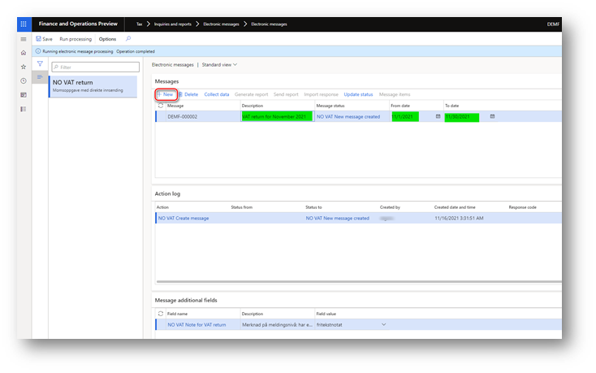
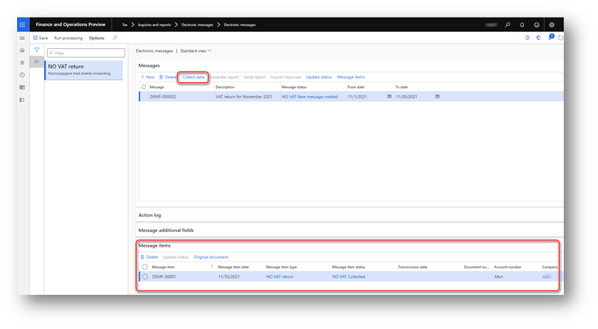
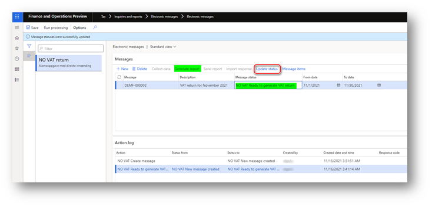
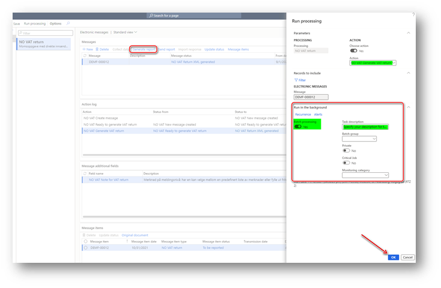

---
# required metadata

title: Submit a VAT return to the Altinn web service
description: This topic explains how to submit a VAT return to the Altinn web service of Norway.
author: liza-golub
ms.date: 12/13/2021
ms.topic: article
ms.prod: 
ms.technology: 

# optional metadata

# ms.search.form: 
# ROBOTS: 
audience: Application User
# ms.devlang: 
ms.reviewer: kfend
# ms.tgt_pltfrm: 
# ms.custom: 
ms.search.region: Norway
# ms.search.industry: 
ms.author: elgolu
ms.search.validFrom: 2021-11-18
ms.dyn365.ops.version: AX 10.0.22

---

# Submit a VAT return to the Altinn web service

[!include [banner](../includes/banner.md)]

When you successfully obtained an access token for Altinn, your Microsoft Dynamics 365 Finance environment is ready to interoperate with the Altinn web service to submit VAT returns.

The processing for a VAT return that is submitted to Altinn consists of many steps. For a full description of the submission process, see the [API](https://skatteetaten.github.io/mva-meldingen/english/api/) page.

[Electronic messaging](../general-ledger/electronic-messaging.md) (EM) functionality is used to support the process of generating a VAT return and submitting it directly to Altinn from Finance. When you [import a package of data entities that includes a predefined EM setup](emea-nor-vat-return-setup.md#em-setup) into your legal entity, all the actions that are required to submit VAT returns to Altinn are imported. The following illustration shows a simplified schema of the EM processing that is delivered with the **NO VAT return – Altinn** setup file.

Not all the relationships between the actions defined in **NO VAT return** processing are included into the diagram.

To simplify the process of submitting VAT returns, most of actions are aggregated into inseparable sequences. When the first action in a sequence is initiated, the system automatically runs all the actions in that sequence. Therefore, the process is significantly simplified, and the required steps are reduced to the following list:

1. [Create a message](#create-message).
2. [Collect sales tax payments](#collect-sales-tax-payments).
3. [Mark the message as ready to generate the VAT return](#ready-to-generate).
4. [Preview the VAT return in Microsoft Excel](#preview-vat-return).
5. [Generate the VAT return](#generate-vat-return).
6. [Validate the VAT return in the Tax Administration web service](#validate-vat-return).
7. [Submit the VAT return](#submit-vat-return).
8. [Download attachments](#download-attachments).

## Create a message

Follow these steps to perform the **NO VAT Create message** action.

1. Go to **Tax** \> **Inquiries and reports** \> **Electronic messages** \> **Electronic messages**, and select the **NO VAT return** EM processing in the list on the left.
2. On the **Messages** FastTab, select **New**.

    The **NO VAT Create message** action is predefined in the **Run processing** dialog box.

3. Select **OK**. The new electronic message is created.
4. In the **From date** and **To date** fields for the message, define the period that you want to submit the VAT return for.
5. Optional: In the **Description** field, enter a description. This text won't be included on the report.

## Collect sales tax payments

Follow these steps to perform the **NO VAT Collect sales tax payments** action.

1. Go to **Tax** \> **Inquiries and reports** \> **Electronic messages** \> **Electronic messages** page, and select the message that was created in the **NO VAT return** EM processing.
2. On the **Messages** FastTab, select **Collect data**.

    The **NO VAT Collect sales tax payments** action is predefined in the **Run processing** dialog box.

3. Select **OK**.
4. The sales tax payment lines are posted during the period that was specified for the message that is listed on the **Message items** FastTab in relation to the selected message.

According to the XML Schema Definition (XSD) schema for VAT returns, a VAT return can include either a note that uses a value from an enumerated list of values or a free-text note that is limited to 4,000 characters. 

Follow these steps to add a note that uses a value from an enumerated list.

1. On the **Messages** FastTab, select the electronic message to specify a note for.
2. On the **Message additional fields** FastTab, select the **NO VAT Note for VAT return** additional field.
3. In the **Field value** column, select a value in the lookup field.

Follow these steps to add a free-text note that is limited to 4,000 characters.

1. On the **Messages** FastTab, select the electronic message to specify a note for.
2. On the **Message additional fields** FastTab, select the **NO VAT Note for VAT return** additional field.
3. In the **Field value** column, select **fritekstnotat** in the lookup field.
4. Select **Attachments**, and then, on the Action Pane, select **New** \> **Note**.
5. In the **Note** field, enter your note. This note will be included on the VAT return in XML format when it's generated.

Follow these steps to include a payment ID, or KID number, in your digital VAT return. This KID number can be used only when the `<fastsattMerverdiavgift>` value (the total value-added tax \[VAT\] for the reporting period) is negative.

1. On the **Messages** FastTab, select the electronic message to specify the KID number for.
2. On the **Message additional fields** FastTab, select the **NO VAT Payment ID** additional field.
3. In the **Field value** column, specify the KID number.

## Mark the message as ready to generate the VAT return

Follow these steps to perform the **NO VAT Ready to generate VAT return** action.

1. Go to **Tax** \> **Inquiries and reports** \> **Electronic messages** \> **Electronic messages**, and select the message that was created in the **NO VAT return** EM processing.
2. On the **Messages** FastTab, select **Update status**.

    The **NO VAT Ready to generate VAT return** action and the **NO VAT Ready to generate VAT return** status are predefined in the **Run processing** dialog box.

3. Select **OK**. The status of the message is updated to **NO VAT Ready to generate VAT return**, and the **Generate report** button becomes available.

To continue to collect data for the report, select **Update status**, and change the status of the message back to **NO VAT New message created**.

## Preview the VAT return in Microsoft Excel

Follow these steps to perform the **NO VAT Preview VAT return in Excel** action.

1. Go to **Tax** \> **Inquiries and reports** \> **Electronic messages** \> **Electronic messages**, and select the message that was created in the **NO VAT return** EM processing.
2. On the **Message** tab, select **Generate report**.
3. In the **Run processing** dialog box, select **NO VAT Preview VAT return in Excel**.
4. For reporting periods that contain a large volume of tax transactions, we recommend that you run the report in batch mode. On the **Run in the background** FastTab, select the **Batch processing** checkbox. Then set the **Task description** field and other parameters for the batch.
5. Select **OK**. A new file is attached to the message, but the status of the message isn't changed.
6. Select **Attachments**, and then select **VAT return preview.xls**.
7. On the Action Pane, select **Open** to preview the VAT return in Excel format.

## Generate the VAT return

Follow these steps to perform the **NO VAT Generate VAT return** action.

1. Go to **Tax** \> **Inquiries and reports** \> **Electronic messages** \> **Electronic messages**, and select the message that was created in the **NO VAT return** EM processing.
2. On the **Messages** FastTab, select **Generate report**.
3. In the **Run processing** dialog box, select **NO VAT Generate VAT return**.
4. For reporting periods that contain a large volume of tax transactions, we recommend that you run the report in batch mode. On the **Run in the background** FastTab, select the **Batch processing** checkbox. Then set the **Task description** field and other parameters for the batch.
5. Select **OK**.

    

    The status of the message is updated to **NO VAT Return XML generated**, and a new `mvamelding.xml` file is attached to the message.

7. Select **Attachments**, and then select **mvamelding.xml**.
8. On the Action Pane, select **Open** to preview the VAT return in XML format.

## Validate the VAT return in the Tax Administration web service

This step consists of the **NO VAT Validation** sequence, which includes the following actions:

- **NO VAT Send validation request** – This action transfers the `mvamelding.xml` file to the Tax Administration API, receives the `valideringsresultat.xml` file that contains the results of the business validation that is performed on the `mvamelding.xml` file, and attaches the `valideringsresultat.xml` file to the electronic message.
- **NO VAT Import validation response** – This action parses information from the `valideringsresultat.xml` file and updates the status of the electronic message. If the business validation that the Tax Administration performs is passed, this action updates the status to **NO VAT Return validation passed successfully**. If errors are identified during the business validation, this action updates the status to **NO VAT Error VAT return validation**, applies an Extensible Stylesheet Language Transformations (XSLT) transformation to the `valideringsresultat.xml` file, and attaches the transformed file to the action log for the record. You can then review it further as the `valideringsresultat_transformed.html` file attached to the action log for the **NO VAT Import validation response** action.
- **NO VAT Generate request for instance** – This action prepares a request for the next step in the process, [Submit the VAT return](#submit-vat-return).

Follow these steps to validate the VAT return in the Tax Administration web service.

1. Go to **Tax** \> **Inquiries and reports** \> **Electronic messages** \> **Electronic messages**, and select the message that was created in the **NO VAT return** EM processing.
2. On the **Messages** FastTab, select **Send report**.

    The **NO VAT Send validation request** action is predefined in the **Run processing** dialog box.

4. Select **OK**.

    The system automatically runs the **NO VAT Send validation request**, **NO VAT Import validation response**, and **NO VAT Generate request for instance** actions one at a time. If the business validation that the Tax Administration performs is passed, the status of the electronic message is updated to **NO VAT Return validation passed successfully**. If errors are identified during the business validation, the status is updated to **NO VAT Error VAT return validation**.

5. To review the information about any errors that were identified during the business validation that the Tax Administration performs, on the **Action log** FastTab, select the line for **NO VAT Import validation response**.
6. Select **Attachments**, and then select the attached HTML file.
7. On the Action Pane, select **Open**. The file is opened in a browser window, and you can review the content in a table. After you apply corrections, you can go back to the [Generate the VAT return](#generate-vat-return) step to regenerate the XML file.

## Submit the VAT return

When your `mvamelding.xml` file has been successfully validated by the Tax Administration, the electronic message has a status of **NO VAT Return validation passed successfully**, and you can submit the `mvamelding.xml` file to Altinn.

The process of submitting a VAT return includes the following actions:

- **NO VAT Send request to create instance** – This action sends a request to the Altinn3-App API to create an instance for further VAT return submission. It then receives the response and attaches it to the electronic message.
- **NO VAT Import instance creation response** – This action imports the required information from the response to the system for further submission.
- **NO VAT Generate VAT return submission** – This action creates a special `konvolutt.xml` technical file that must be sent to the Altinn3-App API before the `mvamelding.xml` file.
- **NO VAT Upload VAT return submission** – This action sends the `konvolutt.xml` technical file to the Altinn3-App API.
- **NO VAT Upload VAT return** – This action sends the `mvamelding.xml` file to the Altinn3-App API.
- **NO VAT Complete data filling** – This action sends a request to complete the transfer of the VAT return to the Altinn3-App API.
- **NO VAT Complete VAT return submission** – This action sends a request to complete the submission process to the Altinn3-App API.
- **NO VAT Send feedback status request** – This action requests the status of the validation process for the submitted VAT return.
- **NO VAT Import feedback status response** – This action imports the validation status for the VAT return into the system.
- **NO VAT Send feedback request** – This action requests the validation results for the submitted VAT return.
- **NO VAT Import feedback response** – This action imports the required information from the response that contains the validation results for the VAT return.
- **NO VAT Download validation result** – This action downloads the validation details for the VAT return.
- **NO VAT Import final validation result** – This action imports information about the validation details for the VAT return into the system and updates the status of the electronic message. If no errors were identified in the submitted VAT return, the status is updated to **NO VAT SUCCESSFUL VAT return submission to the Tax Administr**. If errors were identified in the submitted VAT return, the status is updated to **NO VAT Error validation of uploaded VAT return**.

Follow these steps to submit the VAT return.

1. Go to **Tax** \> **Inquiries and reports** \> **Electronic messages** \> **Electronic messages**, and select the message that was created in the **NO VAT return** EM processing.
2. On the **Messages** FastTab, select **Send report**.

    The **NO VAT Send request to create instance** action is predefined in the **Run processing** dialog box.

3. Select **OK**.

    The system runs all the actions in the previous list one at a time. It might take several minutes for feedback about the VAT return to be ready on the Tax Administration side. In this case, **Submit VAT return** is stopped, and the status is updated to **NO VAT Feedback not provided** status. Wait five to ten minutes, and then, on the **Message** FastTab, select **Send report** again.

    The **NO VAT Send feedback status request** action is predefined in the **Run processing** dialog box.

4. Select **OK**. The VAT return submission is complete when the electronic message has a status of **NO VAT SUCCESSFUL VAT return submission to the Tax Administr**.

## Download attachments

After a VAT return is successfully submitted, you can download the payment information in XML format and the receipt in PDF format.

1. Go to **Tax** \> **Inquiries and reports** \> **Electronic messages** \> **Electronic messages**, and select the message that was created in the **NO VAT return** EM processing.
2. On the **Messages** FastTab, select **Send report**.
3. In the **Run processing** dialog box, select **NO VAT Download receipt** or **NO VAT Download payment information**.
4. Select **OK**. The `betalingsinformasjon.xml` ("NO VAT Download payment information") or `kvittering.pdf` ("NO VAT Download receipt") file is attached to the electronic message.
5. Select **Attachments**, and then select **betalingsinformasjon.xml** or **kvittering.pdf**.
6. On the Action Pane, select **Open**.

[!INCLUDE[footer-include](../../includes/footer-banner.md)]
