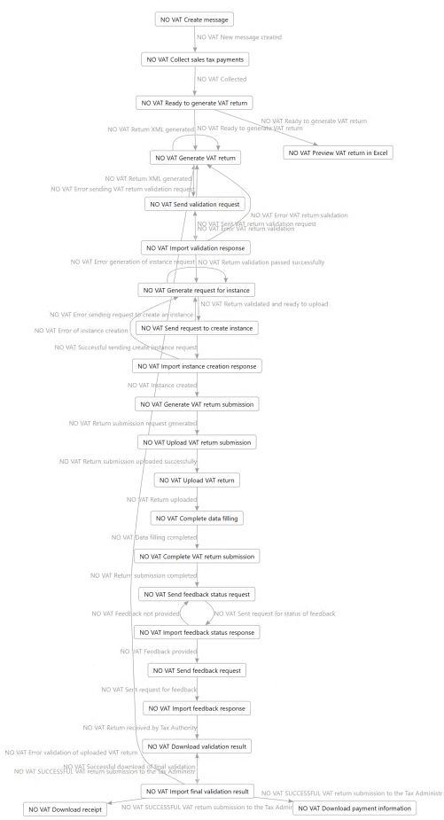

---
# required metadata

title: Submit a VAT return to Altinn web service
description: This topic explains how to submit a VAT return to Altinn web service of Norway.
author: liza-golub
ms.date: 11/23/2021
ms.topic: article
ms.prod: 
ms.technology: 

# optional metadata

# ms.search.form: 
# ROBOTS: 
audience: Application User
# ms.devlang: 
ms.reviewer: kfend
# ms.tgt_pltfrm: 
# ms.custom: 
ms.search.region: Norway
# ms.search.industry: 
ms.author: elgolu
ms.search.validFrom: 2021-11-18
ms.dyn365.ops.version: AX 10.0.22

---

# Submit a VAT return to Altinn web service

[!include [banner](../includes/banner.md)]

When you successfully obtained an access token for Altinn, your Dynamics 365 Finance environment is ready to interoperate with the Altinn web service to submit VAT returns.
Processing a VAT return submission to Altinn is composed of lots of steps. For full description of the submission process, see [API](https://skatteetaten.github.io/mva-meldingen/english/api/) page.

The process to generate a VAT return and directly submit the return to Altinn from Finance is supported by using [Electronic Messaging](../general-ledger/electronic-messaging.md) (EM) functionality. When you [Import a package of data entities that includes a predefined Electronic messaging (EM) setup](emea-nor-vat-return-setup.md#em-setup) to your legal entity, all the necessary actions are imported to you system to submit VAT return to Altinn. The following diagram represents simplified schema of the EM processing delivered with **NO VAT return – Altinn** setup file.

  

To simplify the process of VAT return submission, most of actions are aggregated into inseparable sequences and are run automatically by the system after the first action from the sequence is initiated.

This allows the process to be significantly simplified and reduce the necessary steps to the following list.

1. [Create a message](#create-message).
2. [Collect sales tax payments](#collect-sales-tax-payments).
3. [Mark the message as ready to generate the VAT return](#ready-to-generate).
4. [Preview the VAT return in Microsoft Excel](#preview-vat-return).
5. [Generate the VAT return](#generate-vat-return).
6. [Validate the VAT return in the Tax Administration web service](#validate-vat-return).
7. [Submit the VAT return](#submit-vat-return).
8. [Download attachments](#download-attachments).

## Create a message

Complete the steps in this procedure to perform the action, **NO VAT Create message**.

1. Go to **Tax** > **Inquires and reports** > **Electronic messages** > **Electronic messages**.
2. On the left side of the page, select **NO VAT return** EM processing.
3. On the **Messages** FastTab, select **New**.

   The action, **NO VAT Create message** is predefined in the **Run processing** dialog box. 

4. Select **OK**. The new electronic message is created.
5. Enter values in the **From date** and **To date** fields for the message with dates of the period for which you want to submit VAT return.
6. In the **Description** field, provide a description. This text will not be included into report and is an optional field.

   

## Collect sales tax payments

Complete the steps in this procedure to perform the action, **NO VAT Collect sales tax payments**.

1. Go to **Tax** > **Inquires and reports** > **Electronic messages** > **Electronic messages** page, select the message created within the **NO VAT return** EM processing.
2. On the **Messages** GastTab, select **Collect data**.

    
    The **NO VAT Collect sales tax payments** action is predefined in the **Run processing** dialog box. 
    
3. Select **OK**.
4. The sales tax payment lines are posted during the period specified for the message listed on the **Message items** FastTab in relation with the message selected.

  

According to the XSD schema of VAT returns, the VAT return can include a note wtih a value from the enumerated list of values or a free text note limited to 4000 symbols. 

To add a note with a value from the enumerated list, complete the following steps.

1. On the **Messages** FastTab, select the electronic message for which you want to specify the note.
2. Expand the **Message additional fields** FastTab and select the **NO VAT Note for VAT return** additional field. 
3. In the **Field value** column, select a value from the lookup field.

To add a free text note that's limited to 4000 symbols, complete the following steps.

1. On the **Messages** FastTab, select the electronic message for which you want to specify the note.
2. Expand the **Message additional fields** FastTab and select the **NO VAT Note for VAT return** additional field. 
3. In the **Field value**column, in the lookup field, select **fritekstnotat**.
4. Select **Attachments** and on the Action Pane, select **New** > **Note**.
5. In the **Note** field, enter your note. This note will be included into the VAT return in XML format when generated.

## Mark the message as ready to generate the VAT return

Complete the steps in this procedure to perform the action, **NO VAT Ready to generate VAT return**.

1. Go to **Tax** > **Inquires and reports** > **Electronic messages** > **Electronic messages** and select the message created within **NO VAT return** EM processing.
2. On the **Messages** FastTab, select **Update status**.

   The **NO VAT Ready to generate VAT return** action and **NO VAT Ready to generate VAT return** new status are predefined in the **Run processing** dialog box. 

3. Select **OK**. The message status is changed to **NO VAT Ready to generate VAT return** and the **Generate report** button is enabled.

   

To continue collecting data for the report, select **Update status** and change the status of the message back to **NO VAT New message created**.

## Preview the VAT return in Microsoft Excel

Complete the steps in this procedure to perform the action, **NO VAT Preview VAT return in Excel**.

1. Go to **Tax** > **Inquires and reports** > **Electronic messages** > **Electronic messages** and select the message created within **NO VAT return** EM processing.
2. On the **Message** tab, select **Generate report**.
3. In the **Run processing** dialog box, select **NO VAT Preview VAT return in Excel**. 
4. For reporting periods that contain a large volume of tax transactions, we recommend running the report in batch. Expand the **Run in the background** FastTab of the **Run processing** dialog box, and select the **Batch processing** check box. 
5. Specify the **Task description** and other parameters of the batch, and then select **OK**. As a result, the message status doesn't change, and new file is attached to the message.
6. Select **Attachments** and then select **VAT return preview.xls**.
7. On the Action Pane, select **Open** to preview VAT return in Excel format.

## Generate the VAT return

Complete the steps in this procedure to perform the action, **NO VAT Generate VAT return**.

1. Go to **Tax** > **Inquires and reports** > **Electronic messages** > **Electronic messages** and select the message created within **NO VAT return** EM processing.
2. On the **Messages** FastTab, select **Generate report**.
3. In the **Run processing** dialog box, select **NO VAT Generate VAT return**. 
4. For reporting periods that contain a large volume of tax transactions, we recommend running the report in batch. Expand the **Run in the background** FastTab of the **Run processing** dialog box and select the **Batch processing** check box. 
5. Specify the **Task description** and other parameters of the batch, and then select **OK**.

  

   As a result, message status changes to **NO VAT Return XML generated**, and a new **mvamelding.xml** file is attached to the message.
   
7. Select **Attachments** and then select **mvamelding.xml**.
8. On the Action Pane, select **Open** to preview VAT return in XML format.

## Validate the VAT return in the Tax Administration web service

This step is composed of **NO VAT Validation** sequence, including the following actions:

-	**NO VAT Send validation request**: Transfers **mvamelding.xml** to the Tax Administration API, receives the **valideringsresultat.xml** file containing results of business validation of the **mvamelding.xml**, and attaches the **valideringsresultat.xml** file to the electronic message.
-	**NO VAT Import validation response**: Parses information from the **valideringsresultat.xml** file and updates the status of the electronic message. When a business validation by the Tax Administration passes successfully, the status is updated to **NO VAT Return validation passed successfully**. When there are some errors identified during the business validation, the status is updated to **NO VAT Error VAT return validation**. When there are some errors identified during business validation by Tax Administration, this action applies an XSLT transformation to the **valideringsresultat.xml** file and attaches transformed file to the record in the action log for further review by the user.
-	**NO VAT Generate request for instance**: Prepares a request for the next procedure, **Submit VAT return**.

To run the **Validate VAT return in Tax Administration web service**, complete the following tasks.

1. Go to **Tax** > **Inquires and reports** > **Electronic messages** > **Electronic messages** and select the message created within **NO VAT return** EM processing.
2. On the **Messages** FastTab, select **Send report**.

   The **NO VAT Send validation request** action is predefined in the **Run processing** dialog box. 
4. Select **OK**.

   The actions, **NO VAT Send validation request**, **NO VAT Import validation response**, and **NO VAT Generate request for instance** are run automatically by the system one-by-one. As a result, electronic message status will be **NO VAT Return validation passed successfully** in case when business validation by Tax Administration passes successfully. If there are errors identified during the business validation by the Tax Administration, the electronic message status will be **NO VAT Error VAT return validation**. 
5. To review the information about the errors identified during business validation by Tax Administration, on the **Action log** FastTab, select the line for **NO VAT Import validation response**. 
6. Select **Attachments** and then select the attached **html** file. 
7. On the Action Pane, select **Open**. The will be open in a browser and you can review thecontent in a table. When corrections are applied, you can regenerate the XML file again going back to the [Generate VAT return](#generate-vat-return) step.

## Submit the VAT return

When your **mvamelding.xml** file is successfully validated by the Tax Administration, the electronic message has a status of **NO VAT Return validation passed successfully**  and you can submit the **mvamelding.xml** file to Altinn.

Submitting a VAT return includes the following actions:

-	**NO VAT Send request to create instance**: Sends a request to Altinn3-App API to create an instance for further VAT return submission, receives the response, and attaches this response to the electronic message.
-	**NO VAT Import instance creation response**: Imports necessary information from the response to the system for further submission.
-	**NO VAT Generate VAT return submission**: Creates a special **konvolutt.xml** technical file that must be sent to Altinn3-App API preliminary to **mvamelding.xml** file.
-	**NO VAT Upload VAT return submission**: Sends the **konvolutt.xml** technical file to Altinn3-App API.
-	**NO VAT Upload VAT return**: Sends the **mvamelding.xml** file to Altinn3-App API.
-	**NO VAT Complete data filling**: Sends a request to complete the transfer of VAT return to Altinn3-App API.
-	**NO VAT Complete VAT return submission**: Requests to complete the submission process to Altinn3-App API.
-	**NO VAT Send feedback status request**: Requests the status of the validation process of the submitted VAT return. 
-	**NO VAT Import feedback status response**: Imports the validation status of the VAT return to the system.
-	**NO VAT Send feedback request**: Requests the validation results of the submitted VAT return. 
-	**NO VAT Import feedback response**: Imports necessary information from the response that contains the results of the validation of the VAT return.
-	**NO VAT Download validation result**: Downloads the validation details of the VAT return.
-	**NO VAT Import final validation result**: Imports information about the validation details of the VAT return to the system and updates the status of the electronic message. If no error was identified in the submitted VAT return, the status is updated to **NO VAT SUCCESSFUL VAT return submission to the Tax Administr**. If there were some errors identified in the submitted VAT return, the status is updated to **NO VAT Error validation of uploaded VAT return**.

To **Submit the VAT return**, complete the following steps.

1. Go to **Tax** > **Inquires and reports** > **Electronic messages** > **Electronic messages** and select the message created in the **NO VAT return** EM processing.
2. On the **Messages** FastTab, select **Send report**.

   The action, **NO VAT Send request to create instance** is predefined in the **Run processing** dialog box. 

3. Select **OK**. 

   All the actions listed above are run automatically one-by-one. It may take several minutes before feedback on the VAT return is ready on the Tax Administration side. In this case **Submit VAT return** will stop in the **NO VAT Feedback not provided** status. If this happens, wait 5-10 minutes, and then on the **Message** FastTab, select **Send report** again.

   The **NO VAT Send feedback status request** action is predefined in the **Run processing** dialog box. 
4. SelectClick **OK**. **Submit VAT return** is complete when the electronic message has a status of **NO VAT SUCCESSFUL VAT return submission to the Tax Administr**.

## Download attachments

After a VAT return submission is successfully completed, you can download the payment information in XML format and the receipt in a PDF.

1. Go to **Tax** > **Inquires and reports** > **Electronic messages** > **Electronic messages**, and select the message in **NO VAT return** EM processing.
2. On the **MEssages** FastTab, select **Send report**.
3. In the **Run processing** dialog box, select **NO VAT Download receipt** or **NO VAT Download payment information**. 
4. Select **OK**. The **betalingsinformasjon.xml** (**NO VAT Download payment information**) or **kvittering.pdf** (**NO VAT Download receipt**) file will be attached to the electronic message.
5. Select **Attachements** and then select **betalingsinformasjon.xml** or **kvittering.pdf**.
6. On the Action Pane, select **Open**.

[!INCLUDE[footer-include](../../includes/footer-banner.md)]
