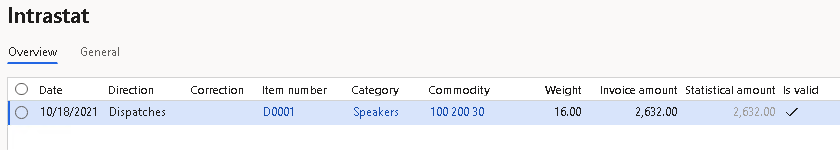
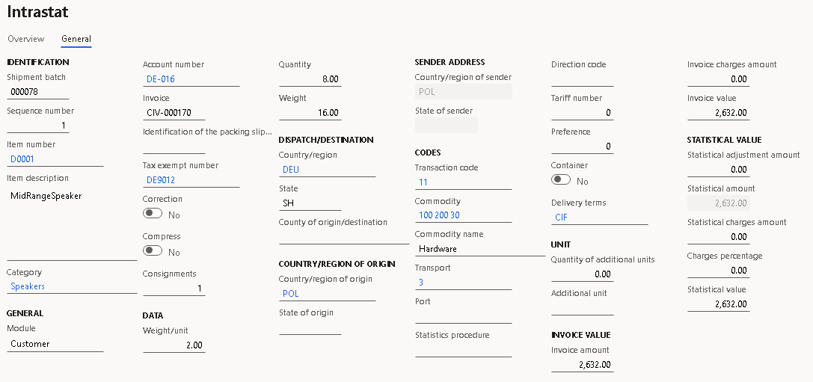
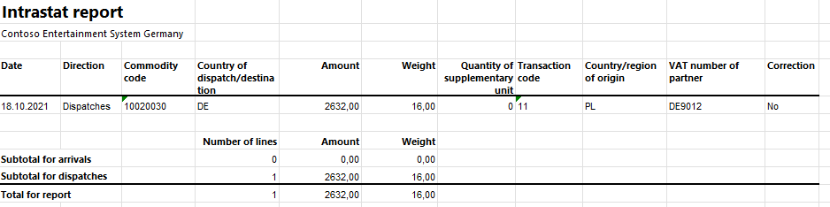
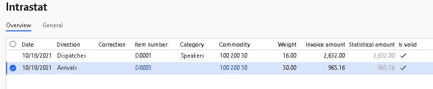
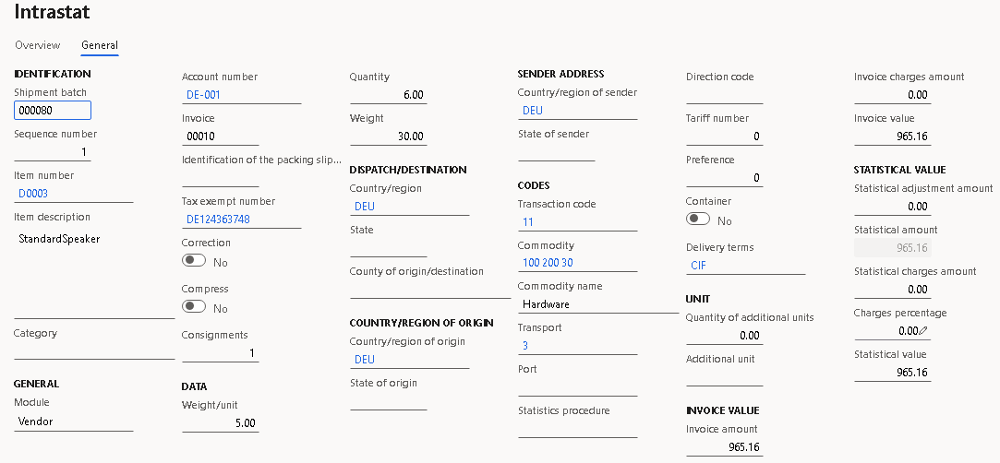
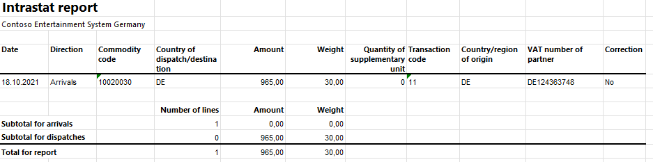

# Polish Intrastat

[!include[banner](../includes/banner.md)]

The **Intrastat** page is used to generate and report information about trade among European Union (EU) countries/regions. The Polish Intrastat declaration contains information about the trade of goods for reporting.

The following fields are included in the Polish Intrastat declaration. All of the fields are included on arrivals and dispatches except for **RodzajTransportu** (the transport mode) and **KrajPochodzenia** (the country or region of origin) which aren't included on dispatches, and **IdKontrahenta** (the customer's foreign VAT number) which isn't included on arrivals.

| Field name | Description |
|-------------------------|-------------------------|
| Deklaracja Data | The date when the document is created. |
| Miesiac | The reference month of the declaration. |
| Rok | The reference year of the declaration. |
| Numer | The declaration number in the reference period. |
| Wersja | The version number of the declaration. |
| NrWlasny | The declaration identifier. The value is automatically generated. |
| Typ | The report direction. <li>For arrivals, "P" is printed.</li><li>For dispatches, "W" is printed.</li> |
| Rodzaj | The type of declaration. The value indicates whether the report is the original declaration or a correction declaration. |
| UC | The unit code that the Intrastat declaration is addressed to. The value is specified in the **Tax exempt number** field in the **Sales tax** section on the **Agent** tab of the **Foreign trade parameters** page. |
| Nazwa | The name of the company. |
| Miejscowosc, UlicaNumer, KodPocztowy | The full address of the legal entity. |
| Nip | The Polish tax identification number (value-added tax [VAT] ID). |
| Regon | The Polish statistical identification number (enterprise number). |
| LacznaWartoscFaktur | The sum of invoice values. |
| LacznaWartoscStatystyczna | The sum of statistical values. |
| LacznaLiczbaPozycji | The total number of goods items. |
| PozId | The consecutive number of a given goods item. |
| OpisTowaru | The trade name of the commodity. |
| KrajPochodzeniaWysylki | The International Organization for Standardization (ISO) code for the country or region of the counterparty. |
| WarunkiDostawy | The Intrastat code for the delivery terms. |
| RodzajTransakcji | The code that indicates the nature of the transaction. Polish companies use two-digit transaction codes. |
| KodTowarowy | The eight-digit commodity code according to the Combined Nomenclature. |
| RodzajTransportu | The Intrastat code for the transport mode. |
| KrajPochodzenia | The ISO code for the country or region where the commodities were produced or manufactured. |
| MasaNetto | The net mass in full kilograms. |
| IloscUzupelniajacaJm | The quantity in the supplementary unit of measure, in whole numbers. |
| WartoscFaktury | The invoice value of all transactions that are covered by one item. |
| WartoscStatystyczna | The statistical value. |
| Wypelniajacy: NazwiskoImie, Telefon, Faks, Email | The first and last names, telephone number, fax number, and email address of the person who submits the declaration. |
| IdKontrahenta | The customer's foreign VAT number in an EU member state. |

## Set up Intrastat

From the Global repository, import the latest version of the following Electronic reporting (ER) configurations:

   - Intrastat model
   - Intrastat report
   - Intrastat (PL)

For more information, see [Download ER configurations from the Global repository of Configuration service](../../fin-ops-core/dev-itpro/analytics/er-download-configurations-global-repo.md).

## Set up a VAT ID and an enterprise number for your company

### Create registration types for company codes

You must create two registration types for company codes: one for the VAT ID (NIP code) and one for the enterprise number (Regon code).

1. Go to **Organization administration** > **Global address book** > **Registration types** > **Registration types**.
2. On the Action Pane, select **New** to create a registration type for the VAT ID.
3. In the **Enter registration type details** dialog box, in the **Name** field, enter a name for the new registration type. For example, enter **NIP**.
4. In the **Country/region** field, select **POL**.
5. Select **Create**.
6. On the Action Pane, select **New** to create a registration type for the enterprise number.
7. In the **Enter registration type details** dialog box, in the **Name** field, enter a name for the new registration type. For example, enter **Regon**.
8. In the **Country/region** field, select **POL**.
9. Select **Create**.

### Match the registration types with registration categories

1. Go to **Organization administration** > **Global address book** > **Registration types** > **Registration categories**.
2. On the Action Pane, select **New** to create a link between each registration type that you created and a registration category.

    - For the registration type for the VAT ID (NIP code), select the **VAT ID** registration category.
    - For the registration type for the enterprise number (Regon code), select the **Enterprise ID (COID)** registration category.

### Set up a VAT ID and an enterprise number for your company

1. Go to **Organization administration** > **Organizations** > **Legal entities**.
2. In the grid, select your company.
3. On the Action Pane, select **Registration IDs**.
4. On the **Registration ID** FastTab, select **Add**.
5. In the **Registration type** field, select one of the registration types that you created earlier.
6. Enter your company's VAT ID (NIP code) or enterprise number (Regon code), depending on the registration type that you selected in the previous step.
7. Repeat steps 4 through 6 for the other registration type that you created earlier.

## Set up a company address

1. Go to **Organization administration** > **Organizations** > **Legal entities**.
2. In the grid, select your company.
3. On the **Addresses** tab, select **Edit**.
4. In the **Edit address** dialog box, in the **ZIP/postal code** field, select your company's ZIP/postal code.
5. In the **Street** field, enter your address.
6. In the **City** field, select your city.

## Set up foreign trade parameters

1. Go to **Tax** > **Setup** > **Foreign trade parameters**.
2. On the **Intrastat** tab, on the **Electronic reporting** FastTab, in the **File format mapping** field, select **Intrastat (PL)**.
3. In the **Report format mapping** field, select **Intrastat report**.
4. On the **Commodity code hierarchy** FastTab, in the **Category hierarchy** field, select **Intrastat**.
5. In the **Transaction code** field, select the transaction code for property transfers. You use this code for transactions that produce actual or planned transfers of property against compensation (financial or otherwise). You also use it for corrections. Companies in Poland use two-digit transaction codes.
6. In the **Credit note** field, select the transaction code for the return of goods.
7. On the **Country/region properties** tab, in the **Country/region** field, list all the countries or regions that your company does business with. For each country that is part of the EU, select **EU** in the **Country/region type** field, so that the country appears on your Intrastat report. For Poland, select **Domestic** in the **Country/region type** field.
8. On the **Agent** tab, on the **Agent** FastTab, in the **Sales tax** section, in the **Tax exempt number** field, enter **420000** to indicate the unit code that the Intrastat declaration is addressed to.
9. On the **Contact** tab, enter the name, telephone number, fax number, and email address of the person who is submitting the declaration.
10. On the **Number sequences** tab, in the **Number sequence code** field for the **XML file number** reference, specify a non-continuous number sequence that has a maximum of nine characters. This field is used to automatically generate a value for the **Declaration identifier** field on the Intrastat report.

## Set up product parameters for the Intrastat declaration

1. Go to **Product information management** > **Products** > **Released products**.
2. In the grid, select a product.
3. On the **Foreign trade** FastTab, in the **Intrastat** section, in the **Commodity** field, select the commodity code. The name of the commodity will be printed in the **Description of commodities** field on the Intrastat report.
4. In the **Origin** section, in the **Country/region** field, select the product's country or region of origin.
5. On the **Manage inventory** FastTab, in the **Net weight** field, enter the product's weight in kilograms.

## Set up compression of Intrastat

-   Go to **Tax** > **Setup** > **Foreign trade** > **Compression of Intrastat**, and select the fields that should be compared when Intrastat information is summarized. For Polish Intrastat, select the following fields:

    - Commodity
    - Transaction code
    - Country/region of origin
    - Transport
    - Delivery terms
    - Country/region of sender
    - Country/region
    - Correction
    - Tax exempt number
    - Direction
    - Invoice

## Set up the transport method and delivery terms

1.  Set up transport codes.

    1. Go to **Tax** > **Setup** > **Foreign trade** > **Transport method**.
    2. On the Action Pane, select **New**.
    3. In the **Transport** field, enter a unique code. Polish companies use one-digit transport codes.

2.  Set up mode of delivery Intrastat codes.

    1. Go to **Procurement and sourcing** > **Setup** > **Distribution** > **Terms of delivery**.
    2. In the grid, select a set of delivery terms.
    3. On the **General** FastTab, in the **Intrastat code** field, enter the unique code.

## Intrastat transfer

On the **Intrastat** page, on the Action Pane, you can select **Transfer** to automatically transfer the information about intracommunity trade from your sales orders, free text invoices, purchase orders, vendor invoices, vendor product receipts, project invoices, and transfer orders. Only documents that have an EU country as the country or region of destination or consignment will be transferred.

You can also manually enter transactions by selecting **New** on the Action Pane.

### Generate an Intrastat report

1. Go to **Tax** > **Declarations** > **Foreign trade** > **Intrastat**.
2. On the Action Pane, select **Output** &gt; **Report**.
3. In the **Intrastat Report** dialog box, set the following fields.

    | Field | Description |
    |-------------------------|-------------------------|
    | From date | Select the start date for the report. |
    | Generate file | Set this option to **Yes** to generate a .xml file for your Intrastat report. |
    | File name | Enter the name of the .xml file. |
    | Generate report | Set this option to **Yes** to generate an .xlsx file for your Intrastat report. |
    | Report file name | Enter the name of the .xlsx file. |
    | Direction | Select **Arrivals** for a report about intracommunity arrivals. Select **Dispatches** for a report about intracommunity dispatches. |
    | Declaration identifier | The document ID is automatically generated and can be updated. |
    | Declaration type | Select **Declaration** for an original declaration. Select **Declaration correction – replacement** for a correction declaration that is intended to fully replace an existing, previously submitted original or correction declaration. |
    | City of document creation | Enter the value that should be printed in the **Miejscowosc** field in the Intrastat declaration. |
    | Date of document creation | Enter the value that should be printed in the **Deklaracja Data** field in the Intrastat declaration. |
    | Document No | Enter the value that should be printed in the **Numer** field in the Intrastat declaration. |
    | Document version | Enter the value that should be printed in the **Wersja** field in the Intrastat declaration. |

4. Select **OK**, and review the generated reports.

## Example

This example shows how to post arrivals and dispatches for Intrastat by using the **DEMF** legal entity.

### Preliminary setup

Import the latest version of the following ER configurations:

   - Intrastat model
   - Intrastat report
   - Intrastat (PL)

### Set up a company address

1. Go to **Organization administration** > **Global address book** > **Addresses** > **Address setup**.
2. On the **City** tab, select **New**.
3. In the **Country/region** field, select **POL**.
4. In the **City** field, enter **Warsaw**.
5. On the **ZIP/postal code** tab, select **New**.
6. In the **Country/region** field, select **POL**.
7. In the **City** field, select **Warsaw**.
8. In the **ZIP/postal code** field, enter **00-844**.
9. Go to **Organization administration** > **Organization** > **Legal entities**, and select the **DEMF** legal entity.
10. On the **Addresses** FastTab, select **Edit**.
11. In the **Country/region** field, select **POL**.
12. In the **ZIP/postal code** field, select **31-111**.
13. In the **Street** field, enter **Statystyczna 22/1**.
14. In the **City** field, select **Warsaw**.
15. Select **OK**.

## Set up a VAT ID and an enterprise number code for your company

### Create registration types for company codes

1. Go to **Organization administration** > **Global address book** > **Registration types** > **Registration types**.
2. On the Action Pane, select **New** to create a registration type for the VAT ID (NIP code).
3. In the **Enter registration type details** dialog box, in the **Name** field, enter **NIP**.
4. In the **Country/region** field, select **POL**.
5. Select **Create**.
6. On the Action Pane, select **New** to create a registration type for the enterprise number (Regon code).
7. In the **Enter registration type details** dialog box, in the **Name** field, enter **Regon**.
8. In the **Country/region** field, select **POL**.
9. Select **Create**.

### Match the registration types with registration categories

1. Go to **Organization administration** > **Global address book** > **Registration types** > **Registration categories**.
2. On the Action Pane, select **New** to create a link between each registration type that you created and a registration category.

    - For the **NIP** registration type, select the **VAT ID** registration category.
    - For the **Regon** registration type, select the **Enterprise ID (COID)** registration category.

### Set up a VAT ID and an enterprise number for your company

1. Go to **Organization administration** > **Organizations** > **Legal entities**.
2. In the grid, select **DEMF**.
3. On the Action Pane, select **Registration IDs**.
4. On the **Registration ID** FastTab, select **Add**.
5. In the **Registration type** field, select **NIP**.
6. In the **Registration number** field, enter **1234567890**.
7. Select **Add**.
8. In the **Registration type** field, select **Regon**.
9. In the **Registration number** field, enter **12345678901234**.

### Set up a number sequence code

1. Go to **Organization administration** > **Number sequences** > **Number sequences**.
2. On the Action Pane, on the **Number sequence** tab, in the **New** group, select **Number sequence**.
3. On the **Identification** FastTab, in the **Number sequence code** field, enter **XML\_file**.
4. On the **Scope parameters** FastTab, in the **Scope** field, select **Company**.
5. In the **Company** field, select **DEMF**.
6. On the **Segments** FastTab, in the **Length** field for the **Alphanumeric** segment, enter **4**.
7. On the **General** FastTab, in the **Setup** section, set the **Continuous** option to **No**.
8. In the **Number allocation** section, in the **Largest** field, enter **9999**.

### Set up foreign trade parameters

1. Go to **Tax** > **Setup** > **Foreign trade** > **Foreign trade parameters**.
2. On the **Intrastat** tab, on the **General** FastTab, in the **Transaction** **code** field, select **11**.
3. On the **Electronic reporting** FastTab, in the **File format mapping** field, select **Intrastat (PL)**.
4. In the **Report format mapping** field, select **Intrastat Report**.
5. On the **Commodity code hierarchy** FastTab, verify that the **Category hierarchy** field is set to **Intrastat**.
6. On the **Country/region properties** tab, select **New**.
7. In the **Party country/region** field, select **POL**. Then, in the **Country/region type** field, select **Domestic**.
8. In the **Party country/region** field, select **DEU**. Then, in the **Country/region type** field, select **EU**.
9. On the **Agent** tab, on the **Agent** FastTab, in the **Sales tax** section, in the **Tax exempt number** field, enter **420000**.
10. On the **Contact** tab, in the **Name** field, enter **Manish Chopra**.
11. In the **Telephone** field, enter **425-555-5068**.
12. In the **Fax number** field, enter **425-555-5049**.
13. In the **Email** field, enter **manishc@contoso.com**.
14. On the **Number sequences** tab, in the **Number sequence code** field for the **XML file number** reference, select **XML\_file**.

### Set up product information

1. Go to **Product information management** > **Products** > **Released** **products**.
2. In the grid, select **D0001**.
3. On the **Foreign trade** FastTab, in the **Intrastat** section, in the **Commodity** field, select **100 200 30**.
4. On the **Manage inventory** FastTab, in the **Weight measurements** section, in the **Net weight** field, enter **2**.
5. On the Action Pane, select **Save**.
6. In the grid, select **D0003**.
7. On the **Foreign trade** FastTab, in the **Intrastat** section, in the **Commodity** field, select **100 200 30**.
8. In the **Origin** section, in the **Country/region** field, select **DEU**.
9. On the **Manage inventory** FastTab, in the **Weight measurements** section, in the **Net weight** field, enter **5**.
10. On the Action Pane, select **Save**.

### Change the site address

1. Go to **Warehouse management** > **Setup** > **Warehouse** > **Sites**.
2. In the grid, select **1**.
3. On the **Addresses** FastTab, select **Edit**.
4. In the **Edit address** dialog box, in the **Country/region** field, select **POL**.
5. Select **OK**.

### Set up a transport method

1. Create a transport method.

    1. Go to **Tax** > **Setup** > **Foreign trade** > **Transport method**.
    2. On the Action Pane, select **New**.
    3. In the **Transport** field, enter **3**.
    4. In the **Description** field, enter **Road transport**.

2. Assign the new transport method to a mode of delivery. In this way, you set up the default values that are used for the transport method when the corresponding mode of delivery is selected.

    1. Go to **Procurement and sourcing** > **Setup** > **Distribution** > **Modes of delivery**.
    2. In the grid, select **10**.
    3. On the **Foreign trade** FastTab, in the **Transport** field, select **3**.

3. Select the default mode of delivery for a customer.

    1. Go to **Accounts receivable** > **Customers** > **All customers**.
    2. In the grid, select **DE-016**.
    3. On the **Invoice and delivery** FastTab, in the **Mode of delivery** field, select **10**.

4. Select the default mode of delivery for a vendor.

    1. Go to **Accounts payable** > **Vendors** > **All vendors**.
    2. In the grid, select **DE-001**.
    3. On the **Invoice and delivery** FastTab, in the **Mode of delivery** field, select **10**.

### Set up codes for terms of delivery

1. Set up an Intrastat code for the terms of delivery.

    1. Go to **Procurement and sourcing** > **Setup** > **Distribution** > **Terms of delivery**.
    2. In the grid, select **CIF**.
    3. On the **General** FastTab, in the **Intrastat code** field, enter **CIF**.

2. Select the default delivery terms for a customer.

    1. Go to **Accounts receivable** > **Customers** > **All customers**.
    2. In the grid, select **DE-016**.
    3. On the **Invoice and delivery** FastTab, in the **Delivery terms** field, select **CIF**.

3. Select the default delivery terms for a vendor.

    1. Go to **Accounts payable** > **Vendors** > **All vendors**.
    2. In the grid, select **DE-001**.
    3. On the **Invoice and delivery** FastTab, in the **Delivery terms** field, select **CIF**.

### Verify an EU customer's tax-exempt number code

1. Go to **Accounts receivable** > **Customers** > **All customers**.
2. In the grid, select **DE-016**.
3. On the **Invoice and delivery** FastTab, in the **Sales tax** section, verify that the **Tax exempt number** field is set to **DE9012**.

### Create a sales order with an EU customer

1. Go to **Accounts receivable** > **Orders** > **All sales orders**.
2. On the Action Pane, select **New**.
3. In the **Create sales order** dialog box, on the **Customer** FastTab, in the **Customer** section, in the **Customer account** field, select **DE-016**.
4. On the **General** FastTab, in the **Storage dimensions** section, in the **Site** field, select **1**.
5. In the **Warehouse** field, select **11**.
6. On the **Address** tab, verify that the **Address** field is set to **Teichgasse 12, Kiel, 24103, DEU**, because the customer is from Germany.
7. Select **OK**.
8. On the **Header** tab, on the **Delivery** FastTab, verify that the **Delivery terms** field is set to **CIF**, and the **Mode of delivery** field is set to **10**.
9. On the **Lines** tab, on the **Sales order lines** FastTab, in the **Item number** field, select **D0001**. Then, in the **Quantity** field, enter **8**.
10. On the **Line details** FastTab, on the **Foreign trade** tab, verify that the **Transaction code** field is set to **11**, the **Commodity** field is set to **100 200 30**, and the **Country/region of origin** field is set to **POL**.
11. On the Action Pane, select **Save**.
12. On the Action Pane, on the **Invoice** tab, in the **Generate** group, select **Invoice**.
13. In the **Posting invoice** dialog box, on the **Parameters** FastTab, in the **Parameter** section, in the **Quantity** field, select **All**.
14. On the **Setup** FastTab, in the **Sales date** field, select **10/18/2021** (October 18, 2021).
15. Select **OK** to post the invoice.

### Transfer the transaction to the Intrastat journal and review the result

1. Go to **Tax** > **Declarations** > **Foreign trade** > **Intrastat**.
2. On the Action Pane, select **Transfer**.
3. In the **Intrastat (Transfer)** dialog box, in the **Parameters** section, set the **Customer invoice** option to **Yes**.
4. Select **Filter**.
5. In the **Intrastat Filter** dialog box, on the **Range** tab, select the first line, and verify that the **Field** field is set to **Date**.
6. In the **Criteria** field, select the current date.
7. Select **OK** to close the **Intrastat Filter** dialog box.
8. Select **OK** to close the **Intrastat (Transfer)** dialog box, and review the result. The line represents the sales order that you created earlier.

    

9. Select the transaction line, and then select the **General** tab to view more details.

    

10. On the Action Pane, select **Output** > **Report**.
11. In the **Intrastat Report** dialog box, on the **Parameters** FastTab, in the **Date** section, in the **From date** field, select the first day of the current month.
12. In the **Export** **options** section, set the **Generate file** option to **Yes**. Then, in the **File name** field, enter the required name.
13. Set the **Generate report** option to **Yes**. Then, in the **Report file name** field, enter the required name.
14. In the **Direction** field, select **Dispatches**.
15. In the **File format mapping** section, verify that the **Declaration type** field is set to **Declaration**.
16. In the **City of document creation** field, enter **Krakow**.
17. In the **Date of document creation** field, select **10/19/2021** (October 19, 2021).
18. In the **Document No** field, enter **11**.
19. In the **Document version** field, enter **22**.
20. Select **OK**, and review the report in XML format that is generated. The following table shows the values in the example report.

    <table>
    <tbody>
    <tr>
    <td>
    
<strong>Field name</strong>

    </td>
    <td>
    
<strong>Field description</strong>

    </td>
    <td>
    
<strong>Value</strong>

    </td>
    </tr>
    <tr>
    <td colspan="3">
    
<strong>Information about the document</strong>

    </td>
    </tr>
    <tr>
    <td>
    
Deklaracja Data

    </td>
    <td>
    
The date when the document was created.

    </td>
    <td>
    
2021-10-19

    </td>
    </tr>
    <tr>
    <td>
    
Miejscowosc

    </td>
    <td>
    
The city where the document was created.

    </td>
    <td>
    
Krakow

    </td>
    </tr>
    <tr>
    <td>
    
LacznaLiczbaPozycji

    </td>
    <td>
    
The total number of items.

    </td>
    <td>
    
1

    </td>
    </tr>
    <tr>
    <td>
    
LacznaWartoscStatystyczna

    </td>
    <td>
    
The total statistical value.

    </td>
    <td>
    
2632

    </td>
    </tr>
    <tr>
    <td>
    
LacznaWartoscFaktur

    </td>
    <td>
    
The total invoice value.

    </td>
    <td>
    
2632

    </td>
    </tr>
    <tr>
    <td>
    
UC

    </td>
    <td>
    
The unit code.

    </td>
    <td>
    
420000

    </td>
    </tr>
    <tr>
    <td>
    
Rodzaj

    </td>
    <td>
    
The type of declaration.

    </td>
    <td>
    
D

    </td>
    </tr>
    <tr>
    <td>
    
Wersja

    </td>
    <td>
    
The document version.

    </td>
    <td>
    
22

    </td>
    </tr>
    <tr>
    <td>
    
Numer

    </td>
    <td>
    
The document number.

    </td>
    <td>
    
11

    </td>
    </tr>
    <tr>
    <td width="191">
    
Miesiac

    </td>
    <td width="330">
    
The reference month.

    </td>
    <td>
    
10

    </td>
    </tr>
    <tr>
    <td width="191">
    
Rok

    </td>
    <td width="330">
    
The reference year.

    </td>
    <td>
    
2021

    </td>
    </tr>
    <tr>
    <td width="191">
    
Typ

    </td>
    <td width="330">
    
The report direction.

    </td>
    <td>
    
W

    </td>
    </tr>
    <tr>
    <td width="191">
    
NrWlasny

    </td>
    <td width="330">
    
The declaration identifier.

    </td>
    <td>
    
21ISTDEMF-0001

    </td>
    </tr>
    <tr>
    <td colspan="3">
    
<strong>Information about the company</strong>

    </td>
    </tr>
    <tr>
    <td width="191">
    
Miejscowosc

    </td>
    <td width="330">
    
The city where the company is located.

    </td>
    <td>
    
Warsaw

    </td>
    </tr>
    <tr>
    <td width="191">
    
Regon

    </td>
    <td width="330">
    
The company's Regon code.

    </td>
    <td>
    
12345678901234

    </td>
    </tr>
    <tr>
    <td>
    
Nip

    </td>
    <td>
    
The company's NIP code.

    </td>
    <td>
    
1234567890

    </td>
    </tr>
    <tr>
    <td>
    
KodPocztowy

    </td>
    <td>
    
The company's ZIP/postal code.

    </td>
    <td>
    
31-111

    </td>
    </tr>
    <tr>
    <td>
    
UlicaNumer

    </td>
    <td>
    
The street where the company is located.

    </td>
    <td>
    
Statystyczna 22/1

    </td>
    </tr>
    <tr>
    <td>
    
Nazwa

    </td>
    <td>
    
The name of the company.

    </td>
    <td>
    
Contoso Entertainment System Germany

    </td>
    </tr>
    <tr>
    <td colspan="3">
    
<strong>Information about the good</strong>

    </td>
    </tr>
    <tr>
    <td>
    
WartoscStatystyczna

    </td>
    <td>
    
The statistical value.

    </td>
    <td>
    
2632

    </td>
    </tr>
    <tr>
    <td>
    
WartoscFaktury

    </td>
    <td>
    
The invoice value.

    </td>
    <td>
    
2632

    </td>
    </tr>
    <tr>
    <td>
    
MasaNetto

    </td>
    <td>
    
The net mass.

    </td>
    <td>
    
16

    </td>
    </tr>
    <tr>
    <td>
    
IdKontrahenta

    </td>
    <td>
    
The customer's VAT number.

    </td>
    <td>
    
DE9012

    </td>
    </tr>
    <tr>
    <td>
    
KodTowarowy

    </td>
    <td>
    
The commodity code.

    </td>
    <td>
    
10020030

    </td>
    </tr>
    <tr>
    <td>
    
RodzajTransakcji

    </td>
    <td>
    
The transaction code.

    </td>
    <td>
    
11

    </td>
    </tr>
    <tr>
    <td>
    
WarunkiDostawy

    </td>
    <td>
    
The terms of delivery mode.

    </td>
    <td>
    
CIF

    </td>
    </tr>
    <tr>
    <td>
    
KrajPochodzeniaWysylki

    </td>
    <td>
    
The code for the country or region of dispatch/destination.

    </td>
    <td>
    
DE

    </td>
    </tr>
    <tr>
    <td>
    
OpisTowaru

    </td>
    <td>
    
A description of the commodities.

    </td>
    <td>
    
Hardware

    </td>
    </tr>
    <tr>
    <td>
    
PozId

    </td>
    <td>
    
The item number.

    </td>
    <td>
    
1

    </td>
    </tr>
    <tr>
    <td colspan="3">
    
<strong>Contact information</strong>

    </td>
    </tr>
    <tr>
    <td>
    
Email

    </td>
    <td>
    
The submitter's email address.

    </td>
    <td>
    
manishc@contoso.com

    </td>
    </tr>
    <tr>
    <td>
    
Faks

    </td>
    <td>
    
The submitter's fax number.

    </td>
    <td>
    
425-555-5049

    </td>
    </tr>
    <tr>
    <td>
    
Telefon

    </td>
    <td>
    
The submitter's telephone number.

    </td>
    <td>
    
425-555-5068

    </td>
    </tr>
    <tr>
    <td>
    
NazwiskoImie

    </td>
    <td>
    
The submitter's name.

    </td>
    <td>
    
Manish Chopra

    </td>
    </tr>
    </tbody>
    </table>

21. Review the report in Excel format that is generated.

    

### Create a purchase order

1. Go to **Accounts payable** > **Purchase orders** > **All purchase orders**.
2. On the Action Pane, select **New**.
3. In the **Create purchase order** dialog box, in the **Vendor account** field, select **DE-001**.
4. In the **Site** field select **1**.
5. In the **Warehouse** field select **11**.
6. Select **OK**.
7. On the **Header** tab, on the **Delivery** FastTab, verify that the **Mode of delivery** field is set to **10**, and the **Delivery terms** field is set to **CIF**.
8. On the **Lines** tab, on the **Purchase order lines** FastTab, in the **Item number** field, select **D0003**. Then, in the **Quantity** field, enter **6**.
9. On the **Line details** FastTab, on the **Foreign trade** tab, verify that the **Transaction code** is set to **11**, the **Transport** field is set to **3**, the **Commodity** field is set to **100 200 30**, and the **Country/region of origin** field is set to **DEU**.
10. On the Action Pane, on the **Purchase** tab, in the **Actions** group, select **Confirm**.
11. On the Action Pane, on the **Invoice** tab, in the **Generate** group, select **Invoice**.
12. On the Action Pane, select **Default from**, and then, in the **Default quantity for lines** field, select **Ordered quantity**. Then select **OK**.
13. On the **Vendor Invoice header** FastTab, in the **Invoice identification** section, in the **Number** field, enter **00010**.
14. In the **Invoice dates** section, in the **Invoice date** field, select the current date. This date will be used for Intrastat transfer.
15. In the **Receive document date** field, select **10/18/2021** (October 18, 2021).
16. On the Action Pane, select **Post** to post the invoice.

### Create an Intrastat declaration for arrivals

1. Go to **Tax** > **Declarations** > **Foreign trade** > **Intrastat**.
2. On the Action Pane, select **Transfer**.
3. In the **Intrastat (Transfer)** dialog box, set the **Vendor invoice** option to **Yes**.
4. Select **OK** to transfer the transactions, and then review the Intrastat journal.

    

5. Review the information on the **General** tab for the purchase order.

    

6. On the Action Pane, select **Output** > **Report**.
7. In the **Intrastat Report** dialog box, on the **Parameters** FastTab, in the **Date** section, in the **From date** field, select the first day of the current month.
8. In the **Export** **options** section, set the **Generate file** option to **Yes**. Then, in the **File name** field, enter the required name.
9. Set the **Generate report** option to **Yes**. Then, in the **Report file name** field, enter the required name.
10. In the **Direction** field, select **Arrivals**.
11. In the **File format mapping** section, verify that the **Declaration type** field is set to **Declaration**.
12. In the **City of document creation** field, enter **Krakow**.
13. In the **Date of document creation** field, select **10/19/2021** (October 19, 2021).
14. In the **Document No** field, enter **11**.
15. In the **Document version** field, enter **22**.
16. Select **OK**, and review the report in XML format that is generated. The following table shows the values in the example report.

    <table>
    <tbody>
    <tr>
    <td>
    
<strong>Field name</strong>

    </td>
    <td>
    
<strong>Field description</strong>

    </td>
    <td>
    
<strong>Value</strong>

    </td>
    </tr>
    <tr>
    <td colspan="3">
    
<strong>Information about the document</strong>

    </td>
    </tr>
    <tr>
    <td>
    
Deklaracja Data

    </td>
    <td>
    
The date when the document was created.

    </td>
    <td>
    
2021-10-19

    </td>
    </tr>
    <tr>
    <td>
    
Miejscowosc

    </td>
    <td>
    
The city where the document was created.

    </td>
    <td>
    
Krakow

    </td>
    </tr>
    <tr>
    <td>
    
LacznaLiczbaPozycji

    </td>
    <td>
    
The total number of items.

    </td>
    <td>
    
1

    </td>
    </tr>
    <tr>
    <td>
    
LacznaWartoscStatystyczna

    </td>
    <td>
    
The total statistical value.

    </td>
    <td>
    
965

    </td>
    </tr>
    <tr>
    <td>
    
LacznaWartoscFaktur

    </td>
    <td>
    
The total invoice value.

    </td>
    <td>
    
965

    </td>
    </tr>
    <tr>
    <td>
    
UC

    </td>
    <td>
    
The unit code.

    </td>
    <td>
    
420000

    </td>
    </tr>
    <tr>
    <td>
    
Rodzaj

    </td>
    <td>
    
The type of declaration.

    </td>
    <td>
    
D

    </td>
    </tr>
    <tr>
    <td>
    
Wersja

    </td>
    <td>
    
The document version.

    </td>
    <td>
    
22

    </td>
    </tr>
    <tr>
    <td>
    
Numer

    </td>
    <td>
    
The document number.

    </td>
    <td>
    
11

    </td>
    </tr>
    <tr>
    <td width="191">
    
Miesiac

    </td>
    <td width="332">
    
The reference month.

    </td>
    <td>
    
10

    </td>
    </tr>
    <tr>
    <td width="191">
    
Rok

    </td>
    <td width="332">
    
The reference year.

    </td>
    <td>
    
2021

    </td>
    </tr>
    <tr>
    <td width="191">
    
Typ

    </td>
    <td width="332">
    
The report direction.

    </td>
    <td>
    
P

    </td>
    </tr>
    <tr>
    <td width="191">
    
NrWlasny

    </td>
    <td width="332">
    
The declaration identifier.

    </td>
    <td>
    
21ISTDEMF-0002

    </td>
    </tr>
    <tr>
    <td colspan="3">
    
<strong>Information about the company</strong>

    </td>
    </tr>
    <tr>
    <td width="191">
    
Miejscowosc

    </td>
    <td width="332">
    
The city where the company is located.

    </td>
    <td>
    
Warsaw

    </td>
    </tr>
    <tr>
    <td width="191">
    
Regon

    </td>
    <td width="332">
    
The company's Regon code.

    </td>
    <td>
    
12345678901234

    </td>
    </tr>
    <tr>
    <td>
    
Nip

    </td>
    <td>
    
The company's NIP code.

    </td>
    <td>
    
1234567890

    </td>
    </tr>
    <tr>
    <td>
    
KodPocztowy

    </td>
    <td>
    
The company's ZIP/postal code.

    </td>
    <td>
    
31-111

    </td>
    </tr>
    <tr>
    <td>
    
UlicaNumer

    </td>
    <td>
    
The street where the company is located.

    </td>
    <td>
    
Statystyczna 22/1

    </td>
    </tr>
    <tr>
    <td>
    
Nazwa

    </td>
    <td>
    
The name of the company.

    </td>
    <td>
    
Contoso Entertainment System Germany

    </td>
    </tr>
    <tr>
    <td colspan="3">
    
<strong>Information about the good</strong>

    </td>
    </tr>
    <tr>
    <td>
    
WartoscStatystyczna

    </td>
    <td>
    
The statistical value.

    </td>
    <td>
    
965

    </td>
    </tr>
    <tr>
    <td>
    
WartoscFaktury

    </td>
    <td>
    
The invoice value.

    </td>
    <td>
    
965

    </td>
    </tr>
    <tr>
    <td>
    
MasaNetto

    </td>
    <td>
    
The net mass.

    </td>
    <td>
    
30

    </td>
    </tr>
    <tr>
    <td>
    
KrajPochodzenia

    </td>
    <td>
    
The code for the country or region of origin.

    </td>
    <td>
    
DE

    </td>
    </tr>
    <tr>
    <td>
    
RodzajTransportu

    </td>
    <td>
    
The mode of transport code.

    </td>
    <td>
    
3

    </td>
    </tr>
    <tr>
    <td>
    
KodTowarowy

    </td>
    <td>
    
The commodity code.

    </td>
    <td>
    
10020030

    </td>
    </tr>
    <tr>
    <td>
    
RodzajTransakcji

    </td>
    <td>
    
The transaction code.

    </td>
    <td>
    
11

    </td>
    </tr>
    <tr>
    <td>
    
WarunkiDostawy

    </td>
    <td>
    
The terms of delivery mode.

    </td>
    <td>
    
CIF

    </td>
    </tr>
    <tr>
    <td>
    
KrajPochodzeniaWysylki

    </td>
    <td>
    
The code for the country or region of dispatch/destination.

    </td>
    <td>
    
DE

    </td>
    </tr>
    <tr>
    <td>
    
OpisTowaru

    </td>
    <td>
    
A description of the commodities.

    </td>
    <td>
    
Hardware

    </td>
    </tr>
    <tr>
    <td>
    
PozId

    </td>
    <td>
    
The item number.

    </td>
    <td>
    
1

    </td>
    </tr>
    <tr>
    <td colspan="3">
    
<strong>Contact information</strong>

    </td>
    </tr>
    <tr>
    <td>
    
Email

    </td>
    <td>
    
The submitter's email address.

    </td>
    <td>
    
manishc@contoso.com

    </td>
    </tr>
    <tr>
    <td>
    
Faks

    </td>
    <td>
    
The submitter's fax number.

    </td>
    <td>
    
425-555-5049

    </td>
    </tr>
    <tr>
    <td>
    
Telefon

    </td>
    <td>
    
The submitter's telephone number.

    </td>
    <td>
    
425-555-5068

    </td>
    </tr>
    <tr>
    <td>
    
NazwiskoImie

    </td>
    <td>
    
The submitter's name.

    </td>
    <td>
    
Manish Chopra

    </td>
    </tr>
    </tbody>
    </table>

17. Review the report in Excel format that is generated.

    
