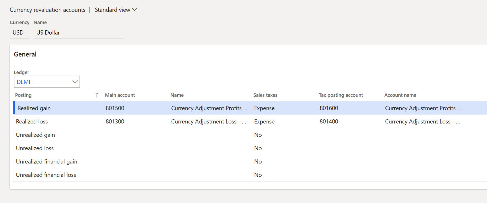

---
# required metadata

title: Split the realized exchange difference amount into the difference of the invoice net value and the VAT amount
description: This topic explains how to split the realized exchange difference amount into the difference of the invoice net value and the value-added tax (VAT) amount.
author: anasyash
ms.date: 04/21/2022
ms.topic: article
ms.prod: 
ms.technology: 

# optional metadata

# ms.search.form: 
audience: Application User
# ms.devlang: 
ms.reviewer: kfend
# ms.tgt_pltfrm: 
ms.custom: 414136
ms.search.region: Poland
# ms.search.industry: 
ms.author: anasyash
ms.dyn365.ops.version: 
ms.search.validFrom: 2020-04-01

---

# Split the realized exchange difference amount into the difference of the invoice net value and the VAT amount

[!include [banner](../includes/banner.md)]

The **Split the AP/AR realized exchange difference amount into the difference of the invoice net value and the VAT amount** feature lets you split the amount of an Accounts payable (AP) and Accounts receivable (AR) foreign currency revaluation into two parts:

- The exchange difference that is related to the net value of the invoice (customer debts and vendor liabilities)
- The exchange difference that is related to the value-added tax (VAT) amount of the invoice

You can also post the exchange differences that are related to the VAT invoice amount to a separate ledger account of realized gains and losses.

This feature is available only in legal entities that have a Polish country/region context.

## Setup

### Activate the feature

In the **Feature management** workspace, turn on the following feature: **(Poland) Split the AP/AR realized exchange difference amount into the difference of the invoice net value and the VAT amount**.

### Set up ledger accounts

Follow these steps to set up a ledger account that can be used to post the exchange difference amount that is related to the tax amount of the invoice.

1. Go to **General ledger** \> **Currencies** \> **Currency revaluation accounts**. 
2. On the **Currency revaluation accounts** page, select the currency code, and then, in the **Ledger** field, select the code of the legal entity.

    

2. Select a line where the **Posting** field is set to **Realized gain** or **Realized loss**.
3. Set up the main account, and select the ledger account to post the realized exchange difference to.
4. In the **Sales taxes** field, select **Expense** to post part of the realized exchange difference amount that is related to the tax amount of the invoice to a separate expense ledger account. 
5. In the **Tax posting account** field, select the same expense ledger account.

## Post and settle customer and vendor transactions

Post and settle documents in the usual way. The exchange difference transaction that is created during settlement will generate a voucher, where the exchange difference amount that is related to the tax amount is posted separately to the ledger account that you selected in the **Tax posting account** field on the **Currency revaluation accounts** page.

## Known limitations

You shouldn't use this feature if you post vendor invoices by using the **Invoice register** and **Invoice approval** journals.

## Examples

The following two examples show the resulting ledger transactions.

### Example 1

Complete the following setup in the **DEMF** legal entity.

1. Change the country/region to **POL**.
2. On the **Ledger** page, verify that the **Accounting currency** field is set to **EUR**.
3. Set up currency exchange rates for the **Default** exchange rate type, as shown in the following table.

    | Date             | US dollars (USD) | Euros (EUR) | Description        |
    |------------------|------------------|-------------|--------------------|
    | January 1, 2020  | 100              | 80          | 100 USD for 80 EUR |
    | January 10, 2020 | 100              | 90          | 100 USD for 90 EUR |

4. Set up ledger accounts for the realized exchange difference in the main account and the tax posting account.

Post the following transactions.

<table>
<thead>
<tr>
<th>Document</th>
<th>Date</th>
<th>Amount in USD</th>
<th>Amount in EUR</th>
<th>Voucher</th>
<th>Voucher amount</th>
</tr>
</thead>
<tbody>
<tr>
<td rowspan='3'>Customer invoice</td>
<td rowspan='3'>January 1, 2020</td>
<td rowspan='3'>119 USD, which includes a VAT amount of 19 USD</td>
<td rowspan='3'>95.20 EUR, which includes a VAT amount of 15.20 EUR</td>
<td>Debit <em>AR</em></td>
<td>95.20</td>
</tr>
<tr>
<td>Credit <em>Expense</em></td>
<td>80.00</td>
</tr>
<tr>
<td>Credit <em>VAT</em></td>
<td>15.20</td>
</tr>
<tr>
<td rowspan='2'>Customer payment</td>
<td rowspan='2'>January 10, 2020</td>
<td rowspan='2'>119 USD</td>
<td rowspan='2'>107.10 EUR</td>
<td>Debit <em>Bank</em></td>
<td>107.10</td>
</tr>
<tr>
<td>Credit <em>AR</em></td>
<td>107.10</td>
</tr>
<tr>
<td rowspan='3'>Invoice and payment settlement</td>
<td rowspan='3'>January 10, 2020</td>
<td rowspan='3'>0 USD</td>
<td rowspan='3'>11.90 EUR</td>
<td>Debit <em>AR</em></td>
<td>11.90</td>
</tr>
<tr>
<td>Credit <em>Exchange difference – main account</em></td>
<td>10.00</td>
</tr>
<tr>
<td>Credit <em>Exchange difference – tax posting account</em></td>
<td>1.90</td>
</tr>
</tbody>
</table>

In this example:

- 10.00 (= 11.90 × 80.00 ÷ 95.20) is the exchange difference that is related to the net value of the invoice.
- 1.90 (= 11.90 – 10.00) is the exchange difference that is related to the tax amount of the invoice.

### Example 2

Complete the following setup in addition to the setup that you completed for example 1.

1. On the **Ledger** page, in the **Bank exchange rate** field, select **Average**. This rate will be used to calculate VAT amounts.
2. Set up the currency exchange rate for the **Average** exchange rate type, as shown in the following table.

    | Date             | USD | EUR | Description         |
    |------------------|-----|-----|---------------------|
    | January 1, 2020  | 100 | 100 | 100 USD for 100 EUR |
    | January 10, 2020 | 100 | 110 | 100 USD for 110 EUR |

Post the following transactions.

<table>
<thead>
<tr>
<th>Document</th>
<th>Date</th>
<th>Amount in USD</th>
<th>Amount in EUR</th>
<th>Voucher</th>
<th>Voucher amount</th>
</tr>
</thead>
<tbody>
<tr>
<td rowspan='5'>Customer invoice</td>
<td rowspan='5'>January 1, 2020</td>
<td rowspan='5'>119 USD, which includes a VAT amount of 19 USD</td>
<td rowspan='5'>95.20 EUR, which includes a VAT amount of 19.00 EUR</td>
<td>Debit <em>AR</em></td>
<td>95.20</td>
</tr>
<tr>
<td>Credit <em>Expense</em></td>
<td>80.00</td>
</tr>
<tr>
<td>Credit <em>VAT</em></td>
<td>15.20</td>
</tr>
<tr>
<td>Debit <em>AR tax difference</em></td>
<td>3.80</td>
</tr>
<tr>
<td>Credit <em>VAT tax difference</em></td>
<td>3.80</td>
</tr>
<tr>
<td rowspan='2'>Customer payment</td>
<td rowspan='2'>January 10, 2020</td>
<td rowspan='2'>119 USD</td>
<td rowspan='2'>107.10 EUR</td>
<td>Debit <em>Bank</em></td>
<td>107.10</td>
</tr>
<tr>
<td>Credit <em>AR</em></td>
<td>107.10</td>
</tr>
<tr>
<td rowspan='3'>Invoice and payment settlement</td>
<td rowspan='3'>January 10, 2020</td>
<td rowspan='3'>0 USD</td>
<td rowspan='3'>11.90 EUR</td>
<td>Debit <em>AR</em></td>
<td>11.90</td>
</tr>
<tr>
<td>Credit <em>Exchange difference – main account</em></td>
<td>10.00</td>
</tr>
<tr>
<td>Credit <em>Exchange difference – tax posting account</em></td>
<td>1.90</td>
</tr>
</tbody>
</table>

In this example:

- 10.00 (= 11.90 × 80.00 ÷ 95.20) is the exchange difference that is related to the net value of the invoice.
- 1.90 (= 11.90 – 10.00) is the exchange difference that is related to the tax amount of the invoice.

[!INCLUDE[footer-include](../../includes/footer-banner.md)]
