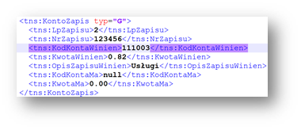
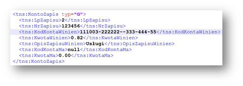
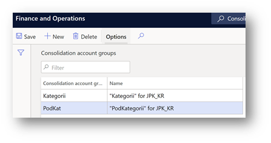
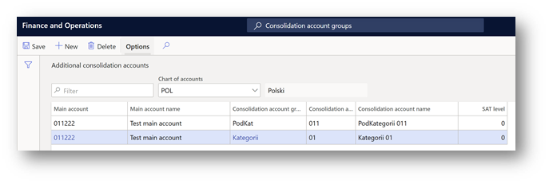
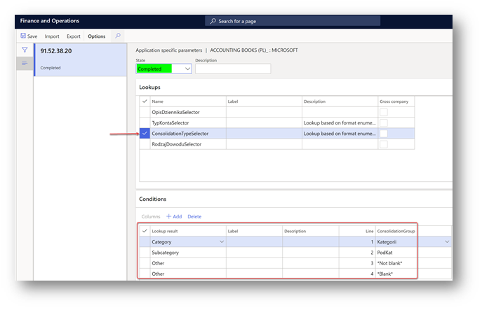
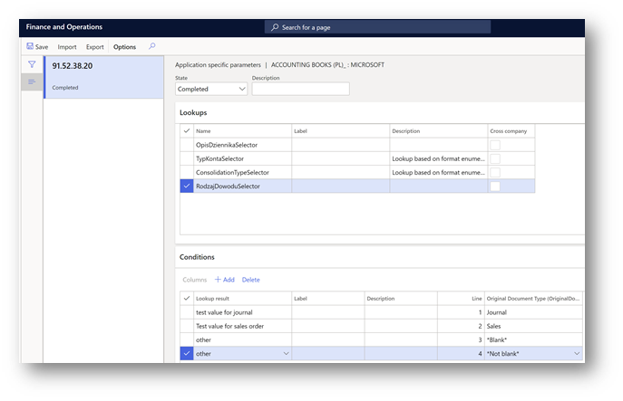

# Standard audit file (SAF) for Poland

[!include [banner](../includes/banner.md)]

Users in legal entities in Poland can generate a Standard Audit File for Tax (SAF-T) in XML format. This article provides information about the formats for Poland. 

-  [SAF Accounting books - JPK_KR](#jpk-kr)
-  [SAF Bank statements - JPK_WB](#jpk-wb)
-  [SAF Inventory - JPK_MAG](#jpk-mag)
-  [SAF VAT sale and purchase registers - JPK_VAT](#jpk-vat)
-  [SAF VAT invoices - JPK_FA](#jpk-fa)

## Set up the Standard Audit File for Tax for Poland

To specify an Electronic reporting (ER) format for each SAF-T scheme, go to **General ledger \> Ledger setup \> General ledger parameters**. On the **Standard Audit File for Taxes (SAF-T)** tab, set up a specific format for each of the following schemes.

| Parameter                           |  ER format              |
|-------------------------------------|-------------------------|
| SAF Accounting books                | Accounting Books (PL)   |
| SAF Bank statements                 | Bank Statement (PL)     |
| SAF Inventory                       | Inventory (PL)          |
| SAF VAT sale and purchase registers | VAT Register (PL)       |
| SAF VAT invoices                    | VAT Invoices (PL)       |

Each ER format should be predefined and can be updated in ER.

Import the latest versions of these configurations. The version description usually includes the number of the Microsoft Knowledge Base (KB) article. That article explains the changes that were introduced in the configuration version. To find the KB article by number, use the Issue search tool in [Microsoft Dynamics Lifecycle Services (LCS)](https://lcs.dynamics.com/v2).

> [!NOTE]
> After all the ER configurations from the table are imported, set the **Default for model mapping** option to **Yes** for the **Standard Audit File model mapping** configuration.

For more information about how to download ER configurations from the Microsoft global repository, see [Download ER configurations from the Global repository](../../fin-ops-core/dev-itpro/analytics/er-download-configurations-global-repo.md).

## Generate a SAF Accounting books file (JPK_KR)

A SAF Accounting books file must be provided upon request. The file must include accounting data for the reporting period. It must also include the selected posting layers for all the main accounts that have non-zero aggregated turnover or transactions during the reporting period.

To generate a SAF Accounting books file, click **General ledger > Inquiries and reports > Standard Audit File for Tax (SAF-T) > SAF Accounting books**, and set the following parameters.

| Parameter                                   | Description |
|---------------------------------------------|-------------|
| From date                                   | Specify the first date to export reporting data for. |
| To date                                     | Specify the last date to export reporting data for. |
| Authority identification                    | Specify the identifier of the tax authority to use in the export file. |
| Posting layer                               | Select one or more posting layers from which to consider transactions. This parameter affects all parts of the report. |
| Should opening balance be shown by turnover | If this parameter is selected, the opening balance is affected by the accumulated turnover. This parameter affects only the ZOiS export file part. |
| Separate balance                            | This parameter can be considered for main accounts where the corresponding parameter is marked. This parameter affects only the ZOiS export file part. |
| Closing transactions                        | If this parameter is selected, closing transactions will be included in the data that is exported. This parameter affects only the ZOiS export file part. |
| Include Total main accounts                 | This check box is included in the report dialog box as of **version 98.59.49** of the **Accounting Books (PL)** ER format. You can use that ER format to generate a report that includes an account that is defined as **Total** in the chart of accounts of the legal entity. By default, this check box is cleared. Select it if you want your **JPK_KR** report, including **Total** accounts, in the **ZOiS** part. |
| Skip ZOiS part                              | This check box is included in the **Report parts** section of the report dialog box as of **version 78.45.25** of the **Accounting Books (PL)** ER format. The ER format lets you generate a report that doesn't include the **ZOiS** part. |
| Skip Dziennik part                          | This check box is included in the **Report parts** section of the report dialog box as of **version 78.45.25** of the **Accounting Books (PL)** ER format. The ER format lets you generate a report that doesn't include the **Dziennik** part. |
| Skip KontoZapis part                        | This check box is included in the **Report parts** section of the report dialog box as of **version 78.45.25** of the **Accounting Books (PL)** ER format. The ER format lets you generate the report that doesn't include the **KontoZapis** part. |
| Show all dimensions                         | This check box is included in the **Ledger transactions** section of the report dialog box as of **version 98.59.49** of the **Accounting Books (PL)** ER format. The ER format lets you generate a report that includes information about financial dimensions that are applied to the voucher line in the **KodKontaMa** and **KodKontaWinien** fields of the **KontoZapis** node. |

By default, the **Show all dimensions** check box is cleared. Select it if you want to include the **KodKontaMa** and **KodKontaWinien** fields in the **KontoZapis** node as financial dimensions. 

If the **Show all dimensions** check box is selected, the **KontoZapis** node shows all the dimensions.

As of **version 98.59.49**, the **Accounting Books (PL)** ER format can generate a SAF Accounting books file. However, before the file can be generated, you must complete the following setup:

- Set up the **TypKonta** field under the **ZOiS** node.
- Set up the **KodKategorii**, **OpisKategorii**, **KodPodkategorii**, and **OpisPodKategorii** fields under the **ZOiS** node.

### The TypKonta field 

The **TypKonta** field must be reported with one of the following values:

- Bilansowe
- Pozabilansowe
- Rozliczeniowe
- Wynikowe

**Version 98.59.49 and later** of the **Accounting Books (PL)** ER format for the report lets you define the **TypKonta** field based on the main account and main account type.

1. Open the **Electronic reporting** workspace, and then, in the configuration tree, select **Standard Audit File (SAF-T) \> SAF Poland \> Accounting Books (PL)**.
2. On the Action Pane, select **Configurations \> Applications specific parameters \> Setup**.
3. Select the latest version of the format.
4. On the **Lookups** FastTab, select **TypKontaSelector**.
5. On the **Conditions** FastTab, define the required conditions.
6. As the last line, add a line that has the condition **Not blank** in the **Account ID** and **Account type** columns.
7. In the **State** field, select **Completed**, and save the application-specific configuration.

### KodKategorii, OpisKategorii, KodPodkategorii, and OpisPodKategorii fields

The **KodKategorii**, **OpisKategorii**, **KodPodkategorii**, and **OpisPodKategorii** fields under the **ZOiS** node of the report must represent the category and subcategory according to "Zespołu Kont Syntetycznych." To support this requirement, [consolidation account groups and additional consolidation accounts](../budgeting/consolidation-account-groups-consolidation-accounts.md) were used. You can use other consolidation account features to define category and subcategories, together with their descriptions, for all main accounts that will be used on the **JPK_KR** report.

1. Go to **General ledger \> Chart of accounts \> Accounts \> Consolidation account groups**.
2. Create two new groups: one for categories and one for subcategories.

    

3. Go to **General ledger \> Chart of accounts \> Accounts \> Additional consolidation accounts**.
4. Create categories and subcategories for all main accounts, based on the consolidation account groups that you created in step 2. 

    - For categories, specify the value that must be reported in the **KodKategorii** field of the report in the **Consolidation account** column, and in the **OpisKategorii** field of the report in the **Consolidation account name** column. Also specify a description.
    - For subcategories, specify the value that must be reported in the **KodPodKategorii** field of the report in the **Consolidation account** column, and in the **OpisPodKategorii** field of the report in the **Consolidation account name** column. Also specify a description.

    

5. When you've finished setting up categories and subcategories, define the consolidation accounts groups that the ER format must consider. Open the **Electronic reporting** workspace, and then, in the configuration tree, select **Standard Audit File (SAF-T) \> SAF Poland \> Accounting Books (PL)**.
6. On the Action Pane, select **Configurations \> Applications specific parameters \> Setup**.
7. Select the latest version of the format.
8. On the **Lookups** FastTab, select **ConsolidationTypeSelector**.
9. On the **Conditions** FastTab, define the required conditions.
10. As the last two lines, add lines that have the conditions **Not blank** and **Blank** for the **Other** lookup result.
11. In the **State** field, select **Completed**, and save the configuration.

    

### RodzajDowodu and OpisDziennika fields under the Dziennik node
The **RodzajDowodu** field under the **Dziennik** node of the report must represent the type of accounting voucher according to article 23, paragraph 2, item 2 of the Act (UoR). The **OpisDziennika** field must represent the journal description according to article 14, paragraphs 3 and 4 of the Act. To support this requirement, new free-text application-specific parameters are introduced in the format of the report.

1. Open the **Electronic reporting (ER) workspace**, and then, in the configuration tree, select **Standard Audit File (SAF-T) \> SAF Poland \> Accounting Books (PL)**.
2. On the Action Pane, select **Configurations \> Applications specific parameters \> Setup**.
3. Select the latest version of the format.
4. On the **Lookups** FastTab, select **RodzajDowoduSelector**.
5. On the **Conditions** FastTab, define the required conditions. Manually specify the values in the **Lookup result** column according to article 23, paragraph 2, item 2 of the Act.
6. As the last two lines, add lines that have the conditions **Not blank** and **Blank**.

    

7. On the **Lookups** FastTab, select **OpisDziennikaSelector**.
8. On the **Conditions** FastTab, define the required conditions. Manually specify the values in the **Lookup result** column according to article 14, paragraphs 3 and 4 of the Act.
9. As the last two lines, add lines that have the conditions **Not blank** and **Blank**.
10. In the **State** field, select **Completed**, and save the configuration.

## Generate a SAF Bank statement file (JPK_WB)

To generate a SAF Bank statement file, click **General ledger > Inquiries and reports > Standard Audit File for Tax (SAF-T) > SAF Bank statement**, and set the following parameters.

| Parameter                | Description                                                                        |
|--------------------------|------------------------------------------------------------------------------------|
| From date                | Specify the first date to export reporting data for.                               |
| To date                  | Specify the last date to export reporting data for.                                |
| Authority identification | In the list, select the identifier of the tax authority to use in the export file. |
| Bank account             | Specify the bank account to export transactions for.                               |

The **SAF Bank statement** file includes information about transactions posted during the specified period of time for the bank account selected on the report's dialog. The name of the counterparty reported in the **NazwaPodmiotu** element is collected from the **Customers** (**Accounts receivable** > **Customers** > **All customers**) and **Vendors** (**Accounts payable** > **Vendors** > **All vendors**) master data of the system registered in the legal entity as it relates to the posted bank transaction. The operation description reported in the **OpisOperacji** element is collected from the **Description** field of the bank transaction.

## Generate a SAF Inventory file (JPK_MAG)

To generate a SAF Inventory file, click **General ledger > Inquiries and reports > Standard Audit File for Tax (SAF-T) > SAF Inventory**, and set the following parameters.

| Parameter                | Description                                                                        |
|--------------------------|------------------------------------------------------------------------------------|
| From date                | Specify the first date to export reporting data for.                               |
| To date                  | Specify the last date to export reporting data for.                                |
| Authority identification | In the list, select the identifier of the tax authority to use in the export file. |
| Warehouse                | Specify the warehouse to export transactions for.                                  |

## Generate a SAF VAT sales and purchase register (JPK_VAT)

Before you can generate a SAF value-added tax (VAT) sales and purchase register, you must complete the following setup.

1. Set up sales tax authorities.
2. Set up sales tax codes for VAT reporting.
3. Set up sales tax codes.
4. Configure the ER model, and format for the report.

For more information about the setup of VAT statements, see [VAT reporting for Europe](emea-vat-reporting.md).

### Set up sales tax authorities

For general information about how to set up a sales tax authority, see [Set up sales tax authorities](../general-ledger/tasks/set-up-sales-tax-authorities.md). To generate a SAF VAT sales and purchase register in the required format for the appropriate tax authority, you must set up the report layout for sales tax authorities. On the **Sales tax authorities** page (**Tax > Indirect taxes > Sales tax > Sales tax authorities**), set the **Report layout** field to **Default**. Select the same sales tax authority for the sales tax settlement period that will be used for the sales tax codes.

### Set up sales tax codes and sales tax reporting codes

A reporting code is an integer value. Reporting codes should be numbered according to the company's rules. However, we recommend that you vary the codes by tax direction. For example, use a five-digit code, and set the codes for all outgoing transactions, which should be reflected in the first part of the VAT scheme, so that they are less than or equal to 19999. Set the codes for all incoming transactions, which should be reflected in the second part of the VAT scheme, so that they are more than or equal to 20000. In this way, you simplify the setup for reports and for data export that is based on tax transactions that are aggregated by reporting codes. Here is an example that shows how you can use sales tax reporting codes to generate a SAF VAT sales and purchase register. For this example, reporting codes are in the format *ABBCC*. This format consists of the following parts:

- **A** – The transaction direction. The value is **1** for outgoing, **2** for incoming, **3** for corrections.
- **BB** – The tax code. The numbering is sequential among all tax codes.
- **CC** – The transaction type number within a tax code. See the following table.

| Transaction type                  | Transaction type number     |
|-----------------------------------|-----------------------------|
| Taxable Sales                     | 01                          |
| Tax-free sales                    | 02                          |
| Sales tax payable                 | 03                          |
| Taxable sales credit note         | 04                          |
| Tax exempt sales credit note      | 05                          |
| Sales tax on sales credit note    | 06                          |
| Taxable purchases                 | 07                          |
| Tax-free purchase                 | 08                          |
| Sales tax receivable              | 09                          |
| Taxable import                    | 10                          |
| Offset taxable import             | 11                          |
| Use tax                           | 12                          |
| Offset use tax                    | 13                          |
| Taxable purchase credit note      | 14                          |
| Tax exempt purchase credit note   | 15                          |
| Sales tax on purchase credit note | 16                          |
| Taxable import credit note        | 17                          |
| Offset taxable import credit note | 18                          |

The following table shows the sales tax codes and sales tax reporting codes for this example.

<table>
<thead>
<tr>
<th>Sales tax code</th>
<th>Sales tax reporting code</th>
<th>Description</th>
<th>Tag name in SAF-T VAT</th>
<th>Sign in SAF-T VAT</th>
</tr>
</thead>
<tbody>
<tr>
<td rowspan="4">ExportCust</td>
<td>10101</td>
<td>Taxable sales</td>
<td>K_11</td>
<td>-</td>
</tr>
<tr>
<td>10102</td>
<td>Tax-free sale</td>
<td>K_11</td>
<td>-</td>
</tr>
<tr>
<td>10104</td>
<td>Taxable sales credit note</td>
<td>K_11</td>
<td>-</td>
</tr>
<tr>
<td>10105</td>
<td>Tax exempt sales credit note</td>
<td>K_11</td>
<td>-</td>
</tr>
<tr>
<td rowspan="2">Art100</td>
<td>10201</td>
<td>Taxable sales</td>
<td>K_12</td>
<td>-</td>
</tr>
<tr>
<td>10204</td>
<td>Taxable sales credit note</td>
<td>K_12</td>
<td>-</td>
</tr>
<tr>
<td rowspan="5">VAT22_23</td>
<td>10301</td>
<td>Taxable sales</td>
<td>K_19</td>
<td>-</td>
</tr>
<tr>
<td>10302</td>
<td>Tax-free sale</td>
<td>K_10</td>
<td>-</td>
</tr>
<tr>
<td>10303</td>
<td>Sales tax payable</td>
<td>K_20</td>
<td>-</td>
</tr>
<tr>
<td>10304</td>
<td>Taxable sales credit note</td>
<td>K_19</td>
<td>-</td>
</tr>
<tr>
<td>10306</td>
<td>Sales tax on sales credit note</td>
<td>K_20</td>
<td>-</td>
</tr>
<tr>
<td rowspan="5">VAT7_8</td>
<td>10401</td>
<td>Taxable sales</td>
<td>K_17</td>
<td>-</td>
</tr>
<tr>
<td>10402</td>
<td>Tax-free sale</td>
<td>K_10</td>
<td>-</td>
</tr>
<tr>
<td>10403</td>
<td>Sales tax payable</td>
<td>K_18</td>
<td>-</td>
</tr>
<tr>
<td>10404</td>
<td>Taxable sales credit note</td>
<td>K_17</td>
<td>-</td>
</tr>
<tr>
<td>10406</td>
<td>Sales tax on sales credit note</td>
<td>K_18</td>
<td>-</td>
</tr>
<tr>
<td rowspan="5">VAT5</td>
<td>10501</td>
<td>Taxable sales</td>
<td>K_15</td>
<td>-</td>
</tr>
<tr>
<td>10502</td>
<td>Tax-free sale</td>
<td>K_10</td>
<td>-</td>
</tr>
<tr>
<td>10503</td>
<td>Sales tax payable</td>
<td>K_16</td>
<td>-</td>
</tr>
<tr>
<td>10504</td>
<td>Taxable sales credit note</td>
<td>K_15</td>
<td>-</td>
</tr>
<tr>
<td>10506</td>
<td>Sales tax on sales credit note</td>
<td>K_16</td>
<td>-</td>
</tr>
<tr>
<td rowspan="3">VAT0</td>
<td>10601</td>
<td>Taxable sales</td>
<td>K_13</td>
<td>-</td>
</tr>
<tr>
<td>10602</td>
<td>Tax-free sale</td>
<td>K_10</td>
<td>-</td>
</tr>
<tr>
<td>10604</td>
<td>Taxable sales credit note</td>
<td>K_13</td>
<td>-</td>
</tr>
<tr>
<td rowspan="4">ART129</td>
<td>10701</td>
<td>Taxable sales</td>
<td>K_14</td>
<td>-</td>
</tr>
<tr>
<td>10702</td>
<td>Tax-free sale</td>
<td>K_14</td>
<td>-</td>
</tr>
<tr>
<td>10704</td>
<td>Taxable sales credit note</td>
<td>K_14</td>
<td>-</td>
</tr>
<tr>
<td>10705</td>
<td>Tax exempt sales credit note</td>
<td>K_14</td>
<td>-</td>
</tr>
<tr>
<td rowspan="4">IntraEUGoods</td>
<td>10801</td>
<td>Tax-free sale</td>
<td>K_21</td>
<td>-</td>
</tr>
<tr>
<td>10810</td>
<td>Taxable import</td>
<td>K_23</td>
<td>+</td>
</tr>
<tr>
<td>10811</td>
<td>Taxable sales (Reverse charge)</td>
<td>K_23</td>
<td>-</td>
</tr>
<tr>
<td>10812</td>
<td>Use tax</td>
<td>K_24</td>
<td>+</td>
</tr>
<tr>
<td rowspan="2">ExportOfGoods</td>
<td>10901</td>
<td>Tax-free sale</td>
<td>K_22</td>
<td>-</td>
</tr>
<tr>
<td>10905</td>
<td>Tax exempt sales credit note</td>
<td>K_22</td>
<td>-</td>
</tr>
<tr>
<td rowspan="2">SpecialProc-XII</td>
<td>11303</td>
<td>Sales tax payable</td>
<td>Not applicable, JPK_FA only</td>
<td>-</td>
</tr>
<tr>
<td>11306</td>
<td>Sales tax on sales credit note</td>
<td>Not applicable, JPK_FA only</td>
<td>-</td>
</tr><tr>
<td rowspan="4">ImportOfGoodsART33</td>
<td>20207</td>
<td>Taxable import</td>
<td>K_45</td>
<td>+</td>
</tr>
<tr>
<td>11010</td>
<td>Offset Taxable import</td>
<td>K_25</td>
<td>-</td>
</tr>
<tr>
<td>20209</td>
<td>Use tax</td>
<td>K_46</td>
<td>+</td>
</tr>
<tr>
<td>11012</td>
<td>Offset use tax</td>
<td>K_26</td>
<td>-</td>
</tr>
<tr>
<td rowspan="5">ImportOfServices</td>
<td>20207</td>
<td>Taxable import</td>
<td>K_45</td>
<td>+</td>
</tr>
<tr>
<td>11110</td>
<td>Offset Taxable import</td>
<td>K_27</td>
<td>-</td>
</tr>
<tr>
<td>11117</td>
<td>Taxable sales (Reverse charge)</td>
<td>K_27</td>
<td>+</td>
</tr>
<tr>
<td>20209</td>
<td>Use tax</td>
<td>K_46</td>
<td>+</td>
</tr>
<tr>
<td>11112</td>
<td>Offset use tax</td>
<td>K_28</td>
<td>-</td>
</tr>
<tr>
<td rowspan="5">ImportART28</td>
<td>20207</td>
<td>Taxable import</td>
<td>K_45</td>
<td>+</td>
</tr>
<tr>
<td>11210</td>
<td>Offset Taxable import</td>
<td>K_29</td>
<td>-</td>
</tr>
<tr>
<td>11119</td>
<td>Taxable sales (Reverse charge)</td>
<td>K_29</td>
<td>+</td>
</tr>
<tr>
<td>20209</td>
<td>Use tax</td>
<td>K_46</td>
<td>+</td>
</tr>
<tr>
<td>11212</td>
<td>Offset use tax</td>
<td>K_30</td>
<td>-</td>
</tr>
<tr>
<td rowspan="4">ReverseCharge</td>
<td>11301</td>
<td>Taxable sales</td>
<td>K_34</td>
<td>-</td>
</tr>
<tr>
<td>11302</td>
<td>Sales tax payable</td>
<td>K_35</td>
<td>-</td>
</tr>
<tr>
<td>11304</td>
<td>Taxable sales credit note</td>
<td>K_34</td>
<td>-</td>
</tr>
<tr>
<td>11306</td>
<td>Sales tax on sales credit note</td>
<td>K_35</td>
<td>-</td>
</tr>
<tr>
<td rowspan="4">FixedAssetPurch</td>
<td>20107</td>
<td>Taxable purchases</td>
<td>K_43</td>
<td>+</td>
</tr>
<tr>
<td>20109</td>
<td>Sales tax receivable</td>
<td>K_44</td>
<td>+</td>
</tr>
<tr>
<td>20115</td>
<td>Taxable purchase credit note</td>
<td>K_43</td>
<td>+</td>
</tr>
<tr>
<td>20116</td>
<td>Sales tax on purchase credit note</td>
<td>K_47</td>
<td>+</td>
</tr>
<tr>
<td rowspan="4">GoodServPurch</td>
<td>20207</td>
<td>Taxable purchases</td>
<td>K_45</td>
<td>+</td>
</tr>
<tr>
<td>20209</td>
<td>Sales tax receivable</td>
<td>K_46</td>
<td>+</td>
</tr>
<tr>
<td>20215</td>
<td>Taxable purchase credit note</td>
<td>K_45</td>
<td>+</td>
</tr>
<tr>
<td>20216</td>
<td>Sales tax on purchase credit note</td>
<td>K_48</td>
<td>+</td>
</tr>
<tr>
<td rowspan="2">CorrATR89b1</td>
<td>30101</td>
<td>Sales tax payable</td>
<td>K_49</td>
<td>+</td>
</tr>
<tr>
<td>30109</td>
<td>Sales tax receivable</td>
<td>K_49</td>
<td>+</td>
</tr>
<tr>
<td rowspan="2">CorrATR89b4</td>
<td>30201</td>
<td>Sales tax payable</td>
<td>K_50</td>
<td>+</td>
</tr>
<tr>
<td>30209</td>
<td>Sales tax receivable</td>
<td>K_50</td>
<td>+</td>
</tr>
</tbody>
</table>

For invoices that aren't paid within 150 days, an **Overdue debt VAT** periodic task can be applied. In this case, the same reporting codes that are used for **K_44** and/or **K_46** can be used. The system will automatically interpret transactions for reporting in **K_49** (Overdue invoice) and **K_50** (Paid overdue invoice). 

### Configure the ER model, and format for the report

To review or change the configuration for the SAF VAT sales and purchase register, on the **Reporting configurations** page, in the list of models, select the **Standard Audit File (SAF-T)** model. Then click **Designer** to review or change the model. To review or change the format for the SAF VAT sales and purchase register, on the **Reporting configurations** page, under **Standard Audit File (SAF-T)**, select **VAT Register (PL)**, and then click **Designer**. For more information about ER, see the following topics:

- [Electronic reporting overview](../../fin-ops-core/dev-itpro/analytics/general-electronic-reporting.md)
- [Download Electronic reporting configurations from Lifecycle Services](../../fin-ops-core/dev-itpro/analytics/download-electronic-reporting-configuration-lcs.md)
- [Localization requirements - Create an ER configuration](../../fin-ops-core/dev-itpro/analytics/electronic-reporting-configuration.md)

Initially, the configuration is an example of VAT Register based on Reporting codes described in table above. If you need to adopt the configuration to another set of reporting codes, you should derive the format of the configuration. To do so, select the format in the configuration's tree and click **Create configuration** in **Main menu**. **Mark Derive from name:...,** fill in **Name** and **Description** fields of a new format and select **Create configuration**. Created format is a copy of the parent format. Select the created format and click **Designer** on the **Main menu** to open format designer and update format with your reporting codes. Format designer window is divided into two parts: the left side is a format structure (in VAT register case it is an XML scheme); the right side is a Data Model (data). Select **Mapping** on the right side to see the **Data model**. The Data Model includes all the field for all the SAF-T reports. VAT register format is mapped mostly to the **TaxTransaction** node. Scroll down the tree to find and select it. All tax transactions are grouped into two groups: for tag **SprzedazWiersz** and for tag **ZakupWiersz**. And called **$SalesList** and **$PurchaseList**, respectively. These are record lists calculated (filtered) by formulas. You can review and modify formula in formula redactor. To do so, select calculated field or record list (in this particular case) and click **Edit** in tree menu. Edit formulas for **$SalesList** and **$PurchaseList** according to your company's Reporting codes and save them. Formula designer window in the left side shows the Data model where you can select fields or record lists and in the right side all the functions that you may implement. (More information about Format designer - [Formula designer in Electronic reporting](../../fin-ops-core/dev-itpro/analytics/general-electronic-reporting-formula-designer.md)). After Tax transactions were divided into two groups, inside each of both groups Tax transactions should be grouped for each tag according to your company's Reporting codes. Find calculated fields "list\_K" under **$SalesList** and **$PurchaseList** and update their formulas with your Reporting codes using Formula Designer. After all "list\_K"? nodes formulas are updated, find and modify **SalasCtrl** and **PurchCtrl** under **$SalesList** and **$PurchaseList**, respectively. These nodes are used for **SprzedazCtrl** and **ZakupCtrl** tags, respectively. Basically, no other modifications in the format are needed. Save the format. Close it and complete the format using **Change status** > **Complete** on the versions menu on **Versions** FastTab on **Configurations**.

### Generate a SAF VAT sales and purchase register

To generate a SAF VAT sales and purchase register, click **General ledger > Inquiries and reports > Standard Audit File for Tax (SAF-T) > SAF VAT sales and purchase register**, and set the following parameters.

| Parameter                |   Description                                                                      |
|--------------------------|------------------------------------------------------------------------------------|
| From date                | Specify the first date to export reporting data for.                               |
| To date                  | Specify that last date to export reporting data for.                               |
| Authority identification | In the list, select the identifier of the tax authority to use in the export file. |

You can specify additional selection parameters by using the **Filter** functionality on the **Records to include** tab.

## Generate a SAF VAT invoices file (JPK_FA)

Before you can generate a SAF VAT invoices file, you must complete the following setup.

1. Set up sales tax authorities.
2. Sales tax codes for VAT reporting.
3. Set up sales tax codes.
4. Configure the ER model, and format for the report.
5. Configure Application-specific parameters for the format of the report.

Steps one to four of the setup resembles the additional setup that you completed for the **SAF VAT sales and purchase register** excepting **Configure the ER model, and format for the report.**

### Enable the (Poland) SAF VAT invoices (JPK_FA) report improvement feature
Starting with version **128.60.76** of the **VAT Invoices (PL)** ER, the improved ER configurations for the JPK_FA report must be enabled. Complete the following steps to enable the configurations.

1. Go to **Workspaces** > **Feature management** and enable the feature, **(Poland) SAF VAT invoices (JPK_FA) report improvement**. 
	> [!NOTE]
	> When you turn on or turn off the **(Poland) SAF VAT invoices (JPK_FA) report improvement** feature, the ER format setup in the **SAF VAT invoices** field on the **General Ledger parameters** page will be cleaned up. Make sure you fill in the **SAF VAT invoices** field in **General Ledger parameters** before you run the **SAF VAT invoices** report. When you enable the **(Poland) SAF VAT invoices (JPK_FA) report improvement** feature, import and use version 128.60.76 of the **VAT Invoices (PL)** ER format.
	
2. Import the latest versions of the following ER configurations into your Electronic reporting workspace:

	- **VAT Invoices (PL)** ER format 
	- **Standard Audit File model mapping**
	
3. Go to **General ledger** > **Ledger setup** > **General ledger parameters**.
4. On the **Standard Audit File for Tax (SAT-T)** tab, in the **SAF VAT invoices** field, select the ER format, **VAT Invoices (PL)**. 
	
When the **(Poland) SAF VAT invoices (JPK_FA) report improvement** feature is enabled, you will see the **VAT Invoices (PL)** ER format in the list only if you previously imported version 128.60.76 or higher from the Global repository.

### Configure the ER model and format for the report

To review or change the configuration for the SAF VAT sales and purchase register, on the **Reporting configurations** page, in the list of models, select the model, **Standard Audit File (SAF-T)**, and then select **Designer** to review or change the model. To review or change the format for the SAF VAT invoices, on the **Reporting configurations** page, under **Standard Audit File (SAF-T)**, select **VAT invoices (PL)**, and then select **Designer**. For more information about Electronic reporting, see the following topics:

- [Electronic reporting overview](../../fin-ops-core/dev-itpro/analytics/general-electronic-reporting.md)
- [Download Electronic reporting configurations from Lifecycle Services](../../fin-ops-core/dev-itpro/analytics/download-electronic-reporting-configuration-lcs.md)
- [Localization requirements - Create an ER configuration](../../fin-ops-core/dev-itpro/analytics/electronic-reporting-configuration.md)

Initially, the configuration is an example of the VAT Invoices report (JPK_FA) based on the reporting codes that are described in table earlier in this article. If you have to adapt the configuration to another set of reporting codes, use the configuration to derive the format. 

1. Select the format in the configuration's tree and then, in the **Main menu**, select **Create configuration**. 
2. Mark **Derive from name:...**, enter the name and description of the new format and then select **Create configuration**. The created format is a copy of the parent format. 
3. Select the created format, and on the **Main menu**, select **Designer** to open format designer.
4. Update format with your reporting codes. The **Format designer** window is divided into two parts. The left side is a format structure (in the case of the VAT register case, it is an XML scheme). The right side is a Data model (data). 
5. On the right side, select **Mapping** to see the Data model. The Data model includes all the fields for all of the SAF-T reports. The **VAT invoices** format includes several parts with different data sources. 
6. Data under the **Faktura** tag is mapped mostly to the **Model &gt; SourceDocuments &gt; $Invoices** node. Scroll down the tree to find and select the node. 
7. Under the **Invoices** node, find the calculated fields **list\_P\_** and update their formulas with your reporting codes using Formula Designer. The Formula designer window shows the data model where you can select fields or record lists and in the right side all the functions that you may implement. For more information about Format designer, see [Formula designer in Electronic reporting](../../fin-ops-core/dev-itpro/analytics/general-electronic-reporting-formula-designer.md). The values for tags under the **StawkiPodatku** tag are constants. 
8. Select the value node (string) for each tag under the **StawkiPodatku** tag and set up its value in the **Value** field on the **Format** tab on the right side of the **Designer** page. No other modifications in the format are needed. 
9. Save the format, close, and complete the format by selecting **Change status** > **Complete** on the versions menu on **Versions** FastTab on **Configurations**.

### Configure Application-specific parameters for the format of the report

To correctly report some of the important tags in the report, define the application-specific parameters. 

1. Open **Configurations** \> **Application specific parameters**, and then, on the Action Pane, select **Setup**.
2. Select the version of the format that you're going to use, and then set up the values for each lookup in the list on the right.

    | Name            | Short description (English) | Short description (Polish) | Description (English) | Description (Polish) |
    |-----------------|-----------------------|-----------------------|-----------------|-----------------|
    | [TaxFree_LOOKUP](#tax-free-lookup) | Tax-free | Tax free | Non-taxable transactions for the supply of goods and services outside the country/region. These transactions are exempt from taxation. | Niepodlegające opodatkowaniu-transakcje dostawy towarów oraz świadczenia usług poza terytorium kraju; zwolnione z opodatkowania. |
    | [TaxExemptReason_LOOKUP](#tax-exempt-lookup) | Tax-exempt reason | Przyczyna lub podstawa zwolnienia z podatku lub jego zmniejszenia | When the delivery of goods or the provision of services is exempt from tax in accordance with article 43, paragraph 1; article 113, sections 1 and 9; or provisions that are issued on the basis of article 82, paragraph 3. | W przypadku dostawy towarów lub świadczenia usług zwolnionych od podatku na podstawie art. 43 ust. 1, art. 113 ust. 1 i 9 albo przepisów wydanych na podstawie art. 82 ust. 3. |
    | [ItemType_LOOKUP](#item-type-lookup) | Type of item | Rodzaj przedmiotu | Delivery of second-hand goods, works of art, collector's items, and antiques for which the tax base is constituted in accordance with article 120, paragraph 4, margin 5. New means of transport are the subject of intra-community supply. | Dostawy towarów używanych, dzieł sztuki, przedmiotów kolekcjonerskich i antyków, dla których podstawę opodatkowania stanowi zgodnie z art. 120 ust. 4 i 5 marża; W przypadku gdy przedmiotem wewnątrzwspólnotowej dostawy są nowe środki transportu. |
    | [SpecialProcedures_LOOKUP](#special-procedures-lookup) | Special procedures referred to in section XII | Procedury specjalne, o których mowa w sekcji XII | A case of special procedures that are referred to in section XII in chapters 6a, 7, and 9 of the VAT Act. | Stawka podatku od wartości dodanej w przypadku procedur szczególnych, o których mowa w dziale XII w rozdziałach 6a, 7 i 9 ustawy VAT |
    
#### TaxFree_LOOKUP

Starting in JPK_FA v.2, the value of the **P_12** field can report the following values in addition to the tax rate and **zw** (reverse charge): 

- **oo** – Reverse charge as part of domestic transactions
- **np** – For transactions of delivery of goods and provision of services outside the country/region

Set up and use specific exempt codes (**Tax \> Setup \> Sales tax \> Sales tax exempt codes**) for sales tax codes that are set up as exempt in sales tax groups (**Tax \> Indirect tax \> Sales tax \> Sales tax groups**) to distinguish tax transactions by these exempt codes in the report. For the purposes of the report, you have to define which exempt codes must be reported with the given values of the **P_12** tag. Select the **VAT Invoices (PL)** format, open **Configurations** \> **Application specific parameters**, and then, on the Action Pane, select **Setup**. For the latest version of the configuration, on the **Lookups** FastTab, select **TaxFree_LOOKUP**. Then, on the **Conditions** FastTab, define conditions for the following lookup results.

| Lookup result           | Exempt codes |
|-------------------------|--------------|
| np                      | Select the exempt codes that are used for sales tax transactions of delivery of goods and provision of services outside the country/region. If there is more than one exempt code of this type, you must add a line for each additional exempt code that is used for transactions of delivery of goods and provision of services outside the country/region. |
| zw                      | Select **Not blank**. All other transactions that are exempt, but where the reason isn't considered, will be reported as reverse charges as part of domestic transactions. This line must be the last line in the list. You can verify that it's the last line, by looking at the value in the **Line** column. |

> [!NOTE]
> Tax transactions that are marked as **Reverse charge** will be reported as **oo**. No additional setup is required.

When you've completed the setup for the **TaxFree_LOOKUP** lookup field and are ready to set up the next lookup field, select **Save**.

#### TaxExemptReason_LOOKUP

Conditions for **TaxExemptReason_LOOKUP** are sales tax exempt codes that are defined in Finance (**Tax** \> **Setup** \> **Sales tax** \> **Sales tax exempt codes**) and used in sales tax groups when tax transactions are posted. If no lines on an invoice have sales tax exemptions, the **P_19** field will be reported with a value of **False**, and the **P_19A**, **P_19B**, and **P_19C** tags will be omitted.

- **P_19A** indicates the provision of the act was issued on the basis of which the taxpayer applies tax exemption.
- **P_19B** indicates the provision of Directive 2006/112/EC, which exempts the supply of goods or such services from such tax.
- **P_19C** indicates that the supply of goods or services benefits from the exemption on another legal basis.

Specify as the last condition in the list, an **Inne** or **Other** result with the value **Not blank** in the **Tax exempt code** column.

When you've completed the setup for the **TaxExemptReason_LOOKUP** lookup field and are ready to set up the next lookup field, select **Save**.

#### ItemType_LOOKUP

Conditions for **ItemType_LOOKUP** are sales tax codes that are defined in Finance (**Tax** \> **Setup** \> **Sales tax** \> **Sales tax codes**) and then used when tax transactions are posted. This lookup setup affects the reporting of **P_106E_3A** and **P_22** elements.

The following values are available for setup of **ItemType_LOOKUP**.

| Name | Description (English) | Description (Polish) | Setup |
|------|------------------|------------------|-------|
| SecondHandGoods | Deliveries of second-hand goods for which the tax base is constituted in accordance with article 120, paragraph four, margin five | Dostawy towarów używanych dla których podstawę opodatkowania stanowi zgodnie z art. 120 ust. 4 i 5 marża | Specify sales tax codes that are used for transactions that are related to second-hand goods. After this setup is completed, an invoice that has tax transactions that use the specified **procedura marży - towary używane** tax code will be reported in **P_106E_3A**. |
| ArtWorks | Deliveries of works of art for which the tax base is constituted in accordance with article 120, paragraph four, margin five | Dostawy dzieł sztuk dla których podstawę opodatkowania stanowi zgodnie z art. 120 ust. 4 i 5 marża | Specify the sales tax codes that are used for transactions that are related to works of art. After this setup is completed, an invoice that has tax transactions that use the specified **procedura marży - dzieła sztuki** tax code will be reported in **P_106E_3A**. |
| CollectorAntiques | Deliveries of collector's items and antiques, for which the tax base is constituted in accordance with article 120, paragraph four, margin five | Dostawy przedmiotów kolekcjonerskich i antyków, dla których podstawę opodatkowania stanowi zgodnie z art. 120 ust. 4 i 5 marża | Specify the sales tax codes that are used for transactions that are related to collector's items, and antiques. After this setup is completed, an invoice that has tax transactions that use the specified **procedura marży - przedmioty kolekcjonerskie i antyki** tax code will be reported in **P_106E_3A**. |
| Transport | Intra-community delivery of new means of transport | Wewnątrzwspólnotowa dostawa nowych środków transportu | Specify the sales tax codes that are used for transactions that are related to intra-community delivery of new means of transport. After this setup is completed, an invoice that has tax transactions that use the specified **P_22** tax code will be reported with a value of **True**. |
| Other | Other | Inne | Specify **Not blank** in the **Tax code** field. This value must be the last in the list of values. This value must be mandatory for this lookup. |

When you finish configuring the values of the lookup fields, set the **State** field to **Completed**, save your changes, and then close the page. 

If any lookup field doesn't have at least one **Not blank** value, an error will occur when the report is run. The error message will state that the application-specific parameters are missing.

#### SpecialProcedures_LOOKUP

Conditions for **SpecialProcedures_LOOKUP** are sales tax codes that are defined in Finance (**Tax** \> **Setup** \> **Sales tax** \> **Sales tax codes**). The codes are then used when tax transactions are posted. This lookup setup affects the reporting of **FakturaWiersz \> P_12_XII** and **Zamowienie \> P_12Z_XII** elements.

The following values are available for setup of **SpecialProcedures_LOOKUP**.

| Name | Description (English) | Description (Polish) | Setup |
|------|------------------|------------------|-------|
| SpecialProc (XII) | Special procedures referred to in section XII | Procedury specjalne, o których mowa w sekcji XII | Specify the sales tax codes that are used for transactions that are related to the special procedures that are referred to in section XII in chapters 6a, 7, and 9 of the VAT Act. After this setup is completed, an invoice that has tax transactions that use the specified tax code is reported with a tax rate in the **\<P_12_XII\>** and **\<P_12Z_XII\>** fields of the report. |
| Other | Other | Inne | Specify **Not blank** in the **Tax code** field. This value must be the last in the list of values. This value must be mandatory for this lookup. |

When you finish configuring the values of the lookup fields, set the **State** field to **Completed**, save your changes, and then close the page. 

If any lookup field doesn't have at least one **Not blank** value, an error will occur when the report is run. The error message will state that the application-specific parameters are missing.

### Generate a SAF VAT invoice

To generate a SAF VAT invoice file, go to **General ledger \> Inquiries and reports \> Standard Audit File for Tax (SAF-T) \> SAF VAT invoices**, and set the following parameters.

| Parameter                | Description                                                                            |
|--------------------------|----------------------------------------------------------------------------------------|
| From date                | Specify the first date to export reporting data for.                                   |
| To date                  | Specify the last date to export reporting data for.                                    |
| Authority identification | In the list, select the identifier of the tax authority to use in the export file.     |
| Invoice ID From/To       | Specify a range of invoice IDs to limit the invoices that are selected for data export. |
| Currency code            | Specify the code of a currency that you want to generate the report for. Only invoices in the specified currency will be included on the report. To generate a report for all currencies in one file, leave the field blank. |

You can specify additional selection parameters by using the **Filter** functionality on the **Records to include** tab.

### Implementation details

In version 3 of the **JPK_FA** report, invoices that have different document currencies can be reported in the same file. For this purpose, the **Currency** parameter in the dialog box for the **SAF VAT invoices (Poland)** report is optional. If you specify a currency, the report will include only invoices that have that currency. If you don't specify a currency, the report will be generated for all invoices.

#### <P_14x> tags

According to the requirements of version 3 of the **JPK_FA** report, when an invoice is posted in a currency that differs from **PLN**, the **<P_13x>**, **<P_14x>**, and **<P_15>** tags must represent the amounts in the invoice currency, and the new **<P_14xW>** tags must represent related amounts in the **PLN** currency. It's assumed that **PLN** is defined as the currency for the sales tax codes that are used for transactions that will be included on the **JPK_FA** report. Based on this assumption, when the document currency on an invoice differs from the currency that is set up in the sales tax codes that are used in the tax transactions of that document, the system reports additional **<P_14xW>** tags. The amount is in the sales tax code currency (because the currency is assumed to be **PLN**).

#### <P_18A> tag

According to the requirements of the **JPK_FA** report, the **<P_18A>** tag for an invoice must be reported as **True** when the split payment mechanism is applied for that invoice on a mandatory basis. To determine whether the split payment mechanism was applied to the invoice, the system checks the **Split payment** and **Voluntary split payment** properties of the customer's posted transactions (**CustTrans** table). Transactions where the **Split payment** is applied but the **Voluntary split payment** property is false will be reported with a **True** value in the **<P_18A>** tag of the report. For more information about the **Split payment** and **Voluntary split payment** properties, see [KB4584165](https://support.microsoft.com/topic/a-country-specific-update-for-poland-to-support-split-payments-automation-0441375f-8b0e-24f7-370e-f8dc5d0760ec).

#### <P_22> tag

The **<P_22>** tag will be reported with a value of **True** according to the setup of the sales tax codes in **ItemType_LOOKUP** where **Result** = **Transport** in the application-specific parameters of the **VAT Invoices (PL)** format.

#### <P_106E_3> and <P_106E_3A> tags

According to the requirements of the **JPK_FA** report, the **<P_106E_3>** tag must report **True** when the delivery of second-hand goods, works of art, collector's items, and antiques, for which the taxable base is in accordance with article 120, paragraph four, margin five. When the **<P_106E_3>** tag is reported with a value of **True**, the **<P_106E_3A>** tag must represent related values.

| Value of the <P_106E_3A> tag | Description (Polish) | Description (English) | How Finance distinguishes the tag |
|--------|--------------------|------------------|-------|
| procedura marży - towary używane | Dostawy towarów używanych dla których podstawę opodatkowania stanowi zgodnie z art. 120 ust. 4 i 5 marża | Deliveries of second-hand goods for which the tax base is constituted in accordance with article 120, paragraph four, margin five | According to the setup of sales tax codes in **ItemType_LOOKUP** where **Result** = **SecondHandGoods** in the application-specific parameters of the **VAT Invoices (PL)** format | 
| procedura marży - dzieła sztuki | Dostawy dzieł sztuki, przedmiotów kolekcjonerskich i antyków, dla których podstawę opodatkowania stanowi zgodnie z art. 120 ust. 4 i 5 marża | Deliveries of works of art for which the tax base is constituted in accordance with article 120, paragraph four, margin five | According to the setup of sales tax codes in **ItemType_LOOKUP** where **Result** = **ArtWorks** in the application-specific parameters of the **VAT Invoices (PL)** format |
| procedura marży - przedmioty kolekcjonerskie i antyki | Dostawy przedmiotów kolekcjonerskich i antyków, dla których podstawę opodatkowania stanowi zgodnie z art. 120 ust. 4 i 5 marża | Deliveries of collector's items and antiques for which the tax base is constituted in accordance with article 120, paragraph four, margin five | According to the setup of sales tax codes in **ItemType_LOOKUP** where **Result** = **CollectorAntiques** in the application-specific parameters of the **VAT Invoices (PL)** format |

#### Zamowienie and ZamowienieCtrl nodes

According to the requirements of version 3 of the **JPK_FA** report, the **Zamowienie** node must represent the orders or contracts that are referred to in article 106f, paragraph 1, item 4 of the Act (for advance invoices) in the currency in which the advance invoice was issued (Zamówienia lub umowy, o których mowa w art. 106f ust. 1 pkt 4 ustawy (dla faktur zaliczkowych) w walucie, w której wystawiono fakturę zaliczkową).

To complete this requirement, the system collects information from the database for the lines of sales orders and free text invoices that are linked to the advance invoices that are included on the report and provides the following information from them.

| Tag name | Description (Polish) | Description (English) | How Finance collects information |
|--------|--------------------|------------------|-------|
| P_7Z | Nazwa (rodzaj) towaru lub usługi | Name (type) of the good or service | The value that is stored on the line of the sales order or free text invoice in the Finance database |
| P_8AZ | Miara zamówionego towaru lub zakres usługi | Unit of measure of the ordered goods or scope of service | The value of the unit of measure that is stored on the line of the sales order or free text invoice in the Finance database (If the field is empty, "usługa" is used.) |
| P_8BZ | Ilość zamówionego towaru lub zakres usługi | Quantity of ordered goods or scope of service | The value of the quantity that is stored on the line of the sales order or free text invoice in the Finance database |
| P_9AZ | Cena jednostkowa netto | Net unit price | The value of the price that is stored on the line of the sales order or free text invoice in the Finance database |
| P_11NettoZ | Wartość zamówionego towaru lub usługi bez kwoty podatku | Value of the ordered goods or services without the amount of tax | The value of the tax base amount that is calculated for the line of the sales order or free text invoice, based on the quantity that is stored on the line (**P_8BZ**). |
| P_11VatZ | Kwota podatku od zamówionego towaru lub usługi | Tax amount on ordered goods or services | The value of the tax amount that is calculated for the line of the sales order or free text invoice, based on the quantity that is stored on the line (**P_8BZ**). |
| P_12Z | Stawka podatku | Tax rate | The calculated value of the tax rate, based on the tax setup on the line of the sales order or free text invoice (sales tax group and item sales tax group). |

With respect to the values that are reported for the lines of sales orders or free text invoices, the value of the **WartoscZamowienia** tag of the **Zamowienie** node is calculated as the sum of calculated values for the tax base amount and the tax amount (**P_11NettoZ** + **P_11VatZ**) for all document lines.

The value of the **WartoscZamowien** tag of the **ZamowienieCtrl** node is calculated as the sum of **WartoscZamowienia** tag value for all the documents that are reported in the **Zamowienie** node.

## Using batch jobs for SAFT

Generating SAF-T reports for a long period such as month or a quarter can include a huge data and take a long time. For such cases, it is recommended to use batch jobs. Dialog page for every SAF-T report has a **Run in the background** tab. Open this tab to set up report's generation in batch mode. Select **Batch processing** check box. To learn more about batch processing, see [Batch processing overview](../../fin-ops-core/dev-itpro/sysadmin/batch-processing-overview.md). To review batch jobs or find a generated file, go to **Organization administration** > **Electronic reporting** > **Electronic reporting jobs**, and find a line related to your job. Select **Show log** on the **Main menu**. If nothing is shown, no messages were produced when the file was generated. To see the file, select **Show files** on the **Main menu**, find a file that you need, and select **Open** on the **Main menu**.  

[!INCLUDE[footer-include](../../includes/footer-banner.md)]
