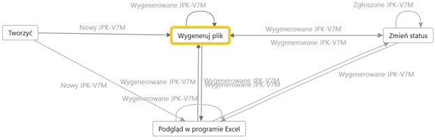
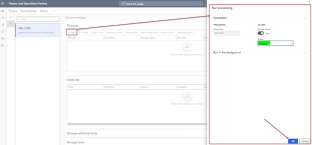
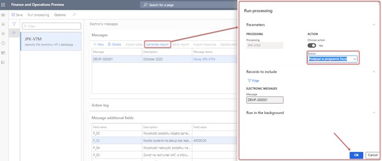
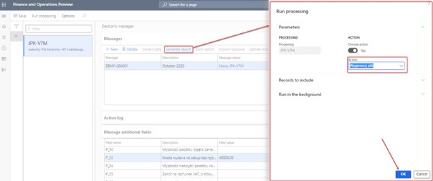

# JPK-V7M reporting

[!include [banner](../includes/banner.md)]

The JPK-V7M reporting process is predefined by the data entities that are delivered in the PL JPK_V7M EM setup.zip package. The following illustration shows an overview of the process.

The PL JPK_V7M EM setup.zip package provides a setup for the JPK-V7M processing that supports the process of JPK-V7M reporting. This setup consists of the following steps:

- **Tworzyć (Create):** Create an electronic message for JPK-V7M reporting.
- **Wygeneruj plik (Generate file):** Generate an XML file in JPK-V7M format.
- **Podgląd w programie Excel (Preview in Excel format):** Generate the JPK-V7M report in Microsoft Excel format for preview.
- **Zmień status (Change status):** Change the status of the electronic message.

## Initial assumptions for the JPK-V7M report

The implementation of the JPK-V7M report is based on the same example in the article, [Prepare for JPK-V7M reporting](emea-pol-vdek-setup.md) for the JPK_VAT report. 
For more information, see [Generate a SAF VAT sales and purchase register](emea-pol-standard-audit-file-saf.md#generate-a-saf-vat-sales-and-purchase-register).

The following table shows an example of sales tax reporting codes and their mapping with **K_\*** elements of the JPK-V7M report.

| Element name     | Element description | Sales tax reporting codes |
|------------------|---------------------|---------------------------|
| K_10             | The taxable amount of the supply of goods and services in Poland that are exempted from tax. | 10302, 10402, 10502, 10602 |
| K_11             | The taxable amount of the supply of goods and services outside Poland. | 10101, 10102, 10104, 10105, 10201, 10204 |
| K_12             | The taxable amount of the supply of services that are stated in article 100, section 1, point 4 of the VAT Act. | 10201, 10204 |
| K_13             | The taxable amount of the supply of goods or services in Poland at a 0-percent VAT rate. | 10601, 10604, 10701, 10702, 10704, 10705 |
| K_14             | The taxable amount of the supply of goods that are stated in article 129 of the VAT Act. | 10701, 10702, 10704, 10705 |
| K_15             | The taxable amount of the supply of goods or services in Poland at a 5-percent VAT rate, including correction that is based on article 89a, sections 1 and 4 of the VAT Act. | 10501, 10504 |
| K_16             | The value of output VAT for the supply of goods or services in Poland at a 5-percent VAT rate, including correction that is based on article 89a, sections 1 and 4 of the VAT Act. | 10503, 10506 |
| K_17             | The taxable amount of the supply of goods or services in Poland at a 7-percent or 8-percent VAT rate, including correction that is based on article 89a, sections 1 and 4 of the VAT Act. | 10401, 10404 |
| K_18             | The value of output VAT for the supply of goods or services in Poland at a 7-percent or 8-percent VAT rate, including correction that is based on article 89a, sections 1 and 4 of the VAT Act. | 10403, 10406 |
| K_19             | The taxable amount of the supply of goods or services in Poland at a 22-percent or 23-percent VAT rate, including correction that is based on article 89a, sections 1 and 4 of the VAT Act. | 10301, 10304 |
| K_20             | The value of output VAT for the supply of goods or services in Poland at a 22-percent or 23-percent VAT rate, including correction that is based on article 89a, sections 1 and 4 of the VAT Act. | 10303, 10306 |
| K_21             | The taxable amount of the intra-community supply of goods that is mentioned in article 13, sections 1 and 3 of the VAT Act. | 10801 |
| K_22             | The taxable amount of the export of goods. | 10901, 10905 |
| K_23             | The taxable amount of the intra-community acquisition of goods. | 10810, 10811 (Reverse change) |
| K_24             | The value of output VAT for the intra-community acquisition of goods. | 10812 |
| K_25             | The taxable amount of the import of goods that must be settled under article 33a of the VAT Act, as confirmed by the customs declaration or import declaration that is referred to in article 33b of the VAT Act. | 11010 |
| K_26             | The value of output VAT for the import of goods that must be settled under article 33a of the VAT Act, as confirmed by the customs declaration or import declaration that is referred to in article 33b of the VAT Act. | 11012 |
| K_27             | The taxable amount that arises from the import of services that are subject to article 28b of the VAT Act. Services that are purchased from the VAT taxpayers are excluded. | 11110, 11117 (Reverse change) |
| K_28             | The value of output VAT that arises from the import of services that are subject to article 28b of the VAT Act. Services that are purchased from the VAT taxpayers are excluded. | 11112 |
| K_29             | The taxable amount of the import of services that are subject to article 28b of the VAT Act. | 11210, 11119 (Reverse change) |
| K_30             | The value of output VAT that arises from the import of services from the VAT taxpayers that are subject to article 28b of the VAT Act. | 11212 |
| K_31             | The taxable amount that arises from the supply of goods in cases where the purchaser is a taxpayer, as mentioned in article 17, section 1, point 5 of the VAT Act. | 11901, 11904 |
| K_32             | The value of output VAT that arises from the supply of goods in cases where the purchaser is a taxpayer, as mentioned in article 17, section 1, point 5 of the VAT Act. | 11903, 11906 |
| K_33             | The value of output VAT for goods that are covered by physical stock counting under article 14, section 5 of the VAT Act. | No default value |
| K_34             | The refund of a previously deducted or refunded amount that was spent on the purchase of cash registers that are mentioned in article 111, section 6 of the VAT Act. | No default value |
| K_35             | The value of output VAT that is determined based on the intra-community acquisition of vehicles that are mentioned in pos. 24, and that must be paid within the period that is referred to in article 103, section 3 in connection with section 4 of the VAT Act. | No default value |
| K_36             | The value of output VAT that arises from the intra-community acquisition of goods that are mentioned in article 103, section 5aa of the VAT Act, and that must be paid within the period that is referred to in article 103, sections 5a and 5b of the VAT Act. | No default value |
| K_40             | The net value of the purchase of goods and services that are classified as fixed assets by the taxpayer. | 20107, 20115 |
| K_41             | The value of input tax that is eligible for deduction based on article 86, section 2 of the VAT Act, under the conditions that are specified in the VAT Act, and that arises from the acquisition of goods and services that are classified as fixed assets by the taxpayer. | 20109 |
| K_42             | The net value that arises from the acquisition of other goods and services. | 20207, 20215 |
| K_43             | The amount of input tax that is eligible for deduction based on article 86, section 2 of the VAT Act, under the conditions that are specified in the VAT Act, and that arises from the purchase of other goods and services. | 20209 |
| K_44             | The amount of input tax that arises from input tax adjustments that are referred to in articles 90a through 90c and 91 of the VAT Act, because of the acquisition of goods and services that are classified as fixed assets by the taxpayer. | 20116 |
| K_45             | The amount of the input tax base that arises from input tax adjustments that are referred to in articles 90a through 90c and 91 of the VAT Act, because of the purchase of other goods and services. | 20216 |
| K_46             | The amount of input tax that arises from the correction of input tax that is referred to in article 89b, section 1 of the VAT Act. | 
30101, 30102

**Note:** For the "Overdue" scenario, the amount can be collected for **K_43** or **K_41**.
 |
| K_47             | The amount of input tax that arises from the correction of input tax that is referred to in article 89b, section 4 of the VAT Act. | 
30201, 30202

**Note:** For the "Overdue" scenario, the amount can be collected for **K_43** or **K_41**.
 |

## Create an electronic message for JPK-V7M reporting

1. Go to **Tax** > **Inquiries and reports** > **Electronic messages** > **Electronic messages**.
2. Select **JPK-V7M**, and then, on the **Messages** FastTab, select **New**.
3. In the **Run processing** dialog box, select **OK**.

    

4. A new electronic message is created. Enter a description, and specify the start and end dates of the period that you want to generate the JPK-V7M report for.
5. On the **Message additional fields** FastTab, specify any additional values that are required for the declaration part of the JPK-V7M report.

    

6. In the **CelZlozenia** additional field, specify whether this submission is an original report or a correction. Two values are allowed:

    - **1** – This submission is the initial submission of the file for the specified period. This value is the default value.
    - **2** – This submission is a corrected submission of the file for the specified period.

7. In the **Wersja schematu** additional field, specify which version of the XML Schema Definition (XSD) schema must be used to generate the report. Two values are allowed:

    - **1** for JPK-V7M(1)
    - **2** for JPK-V7M(2)

   The **Wersja schematu** additional field was introduced in the **PL JPK-V7M EM setup v.6 KB5007691**.zip package (version 6 or later of the package of data entities that includes a predefined electronic message setup). In the **PL JPK-V7M EM setup v.6 KB5007691** package, the **Wersja schematu** additional field will get a value of **1** by default. Therefore, when you create a new electronic message, the **Wersja schematu** additional field will be set to **1**. If you want to change the default value of this field, go to **Tax** \> **Setup** \> **Electronic messages** \> **Electronic message processing**, select **JPK-V7M** on the left side of the page, and then, on the **Message additional fields** FastTab, find the **Wersja schematu** additional field, and select a value in the list.

8. In the **Sklad pliku** additional field, specify which content of JPK-V7M must be included in the report. Two values are allowed:

    - **Pelny plik XML** for the full XML file
    - **Tylko Ewidencja** for the **Ewidencja** node only

    The **Sklad pliku** additional field was introduced in the **PL JPK-V7M EM setup v.6 KB5007691**.zip package (version 6 or later of the package of data entities that includes a predefined electronic message setup). In the **PL JPK-V7M EM setup v.6 KB5007691** package, the **Sklad pliku** additional field will get a value of **Pelny plik XML** by default. Therefore, when you create a new electronic message, the **Sklad pliku** additional field will be set to **Pelny plik XML**. If you want to change the default value of this field, go to **Tax** \> **Setup** \> **Electronic messages** \> **Electronic message processing**, select **JPK-V7M** on the left side of the page, and then, on the **Message additional fields** FastTab, find the **Sklad pliku** additional field, and select a value in the list.

9. You can also specify manual values for the following additional fields that are related to elements of the declaration.

    | Name     | Tag of the declaration | Description (En) | Description (Pl) |
    |----------|------------------------|------------------|------------------|
    | P_39     | P_39 | A non-negative integer that has a maximum of 14 digits. The value of the surplus of input VAT over output VAT that was moved from the previous period. | Wysokość nadwyżki podatku naliczonego nad należnym z poprzedniej deklaracji |
    | P_49     | P_49 | A non-negative integer that has a maximum of 14 digits. The amount that was spent on the purchase of cash registers, and that must be deducted in the specified period and therefore reduce the value of output VAT. The amount that is specified in **P_49** can't be more than **P_38** – **P_48**. If **P_38** – **P_48** is less than or equal to 0 (zero), you should show **0**. | Kwota wydana na zakup kas rejestrujących, do odliczenia w danym okresie rozliczeniowym pomniejszająca wysokość podatku należnego |
    | P_50     | P_50 | A non-negative integer that has a maximum of 14 digits. The amount of tax that is covered by the abandonment of collection. **P_50** can't be more than **P_38** – **P_48** – **P_49**. If **P_38** – **P_48** – **P_49** is less than zero (0), or more than or equal to **P_50**, you should show **0**. | Wysokość podatku objęta zaniechaniem poboru |
    | P_52     | P_52 | A non-negative integer that has a maximum of 14 digits. The amount that was spent on the purchase of cash registers, and that must be deducted in the specified period and returned in the given settlement period. Alternatively, the amount that was spent on the purchase of cash registers, and that increases the amount of input tax that must be transferred to the next settlement period. | Kwota wydana na zakup kas rejestrujących, do odliczenia w danym okresie rozliczeniowym przysługująca do zwrotu w danym okresie rozliczeniowym lub powiększająca wysokość podatku naliczonego do przeniesienia na następny okres rozliczeniowy |
    | P_54     | P_54 | The amount of input tax surplus that must be returned to the account that is designated by the taxpayer. | Wysokość nadwyżki podatku naliczonego nad należnym do zwrotu na rachunek wskazany przez podatnika |
    | P_54_Powód - in JPK-V7M(1) | P_55, P_56, P_57, or P_58, depending on the user selection. | The refund to the bank account that is referred to in article 87, section 6a (**P_55**), 6 (**P_56**), 2 (**P_57**), or 5a (**P_58**) of the VAT Act. | Zwrot na rachunek VAT, o którym mowa w art. 87 ust. 6a (P_55) lub 6 (P_56) lub 2 (P_57) lub 5a (P_58) ustawy |
    | P_54_Powód - in JPK-V7M(2) | P_540, P_55, P_56, P_560, P_57, or P_58, depending on the user selection. | Return to the taxpayer's VAT account within 15 days (**P_540**), 25 days (**P_55**), 25 days (article 87, section 6 of the VAT Act) (**P_56**), 40 days (**P_560**), 60 days (**P_57**), or 180 days (**P_58**). | Zwrot na rachunek rozliczeniowy podatnika w terminie 15 dni (P_540), 25 dni (P_55),  25 dni (art. 87 ust. 6 ustawy) (P_56), 40 dni (P_560), 60 dni (P_57) lub 180 dni (P_58) |
    | P_60     | P_60 | A non-negative integer that has a maximum of 14 digits. The amount of refund that must be credited against future tax liabilities. | Wysokość zwrotu do zaliczenia na poczet przyszłych zobowiązań podatkowych |
    | P_61     | P_61 | A string (1..240) that must be used if **P_60** is used. The type of future tax liability. | Rodzaj przyszłego zobowiązania podatkowego |
    | P_ORDZU  | P_ORDZU | A string (1..240). An explanation of the reasons for submitting a corrected VAT return. | Uzasadnienie przyczyn złożenia korekty |

The **P_54_Powód** additional field for JPK-V7M(**1**) is available as of version 98.194 of the **JPK-V7M XML format (PL)** Electronic reporting (ER) configuration and version 98.194.50 of the **JPK-V7M Excel format (PL)** ER configuration. It can be imported by using the **PL JPK_V7M EM setup v.5 KB4614816.zip** file (version 5 or later of the package of data entities that includes a predefined electronic message setup).

The **P_54_Powód** additional field for JPK-V7M(**2**) is available as of versions of the **JPK-V7M XML format (PL)** and **JPK-V7M Excel format (PL)** ER configurations that are delivered in the scope of KB5007691. It can be imported by using the **PL JPK-V7M EM setup v.6 KB5007691.zip** file (version 6 or later of the package of data entities that includes a predefined electronic message setup).

## Generate the JPK-V7M report in Excel format for preview

When all the data is ready in the system, follow these steps to generate the JPK-V7M report in Excel format.

1. On the **Electronic messages** page, on the **Messages** FastTab, select **Generate report**.
2. In the **Run processing** dialog box, in the **Action** field, select **Podgląd w programie Excel**.
3. To run report generation in a batch, specify parameters on the **Run in the background** FastTab. When the report is generated, it's attached to the electronic message as a file.
4. Select **OK**.

    

5. To view the file, select the electronic message, and then select the **Attachments** button (paper clip symbol) in the upper-right corner of the page.
6. On the **Attachments for Message** page, select the attachment, and then, on the Action Pane, select **Open**.

## Generate an XML file in JPK-V7M format

When all the data is ready in the system, follow these steps to generate an XML file in JPK-V7M format.

1. On the **Electronic messages** page, on the **Messages** FastTab, select **Generate report**.
2. To run report generation in a batch, in the **Run processing** dialog box, specify parameters on the **Run in the background** FastTab.
3. Select **OK**.

    

After you select **OK** in the dialog box, you should see the following declaration text:

- **English:** "When you generate the VAT declaration you confirm information in the report is true and complete. Your consent will be recorded in the report. Incomplete payment or non-payment of VAT due to the Tax Authority, this declaration is the basis for the issuance of a writ of execution in accordance with the provisions of the enforcement proceedings in the administration. A false or incomplete declaration may result in prosecution in accordance with regulations of fiscal penal code."
- **Polish:** "Wygenerowanie deklaracji VAT oznacza potwierdzenie, że informacje w raporcie są prawdziwe i kompletne. Twoja zgoda zostanie odnotowana w raporcie. W przypadku niewpłacenia w obowiązującym terminie podatku podlegającego wpłacie do urzędu skarbowego lub wpłacenia go w niepełnej wysokości niniejsza deklaracja stanowi podstawę do wystawienia tytułu wykonawczego zgodnie z przepisami o postępowaniu egzekucyjnym w administracji. Za podanie nieprawdy lub zatajenie prawdy i przez to narażenie podatku na uszczuplenie grozi odpowiedzialność przewidziana w przepisach Kodeksu karnego skarbowego."

By selecting **OK** on the declaration page, you give your consent to the declaration. The JPK_VDEK will be generated only if you consent to the declaration.

The action log is related to the electronic message log information about the user who generated the JPK_VDEK and performed other actions with the electronic message.

When an XML file for the JPK-V7M report is generated, it's attached to the electronic message. To view the file, select the electronic message, and select the **Attachments** button (paper clip symbol) in the upper-right corner of the page. On the **Attachments for Message** page, select the attachment, and then, on the Action Pane, select **Open**.

## Change the status of the electronic message

When you've finished working with a report, you can change the status to **Zgłoszone JPK_VDEK** (**Reported JPK-V7M**). Electronic message that are in this status can't be deleted. You can change the status back to **Wygenerowane JPK_VDEK** as required.

To change status of the electronic message, on the **Messages** FastTab, select **Update status** \> **New status**.

## Generate the JPK-V7M report for part of a month

You can prepare the JPK-V7M report for periods that are shorter than a full month. On the **Electronic messages** page (**Tax** > **Inquiries and reports** > **Electronic messages** > **Electronic messages**), use the **From date** and **To date** fields to define the date interval that you want to generate JPK-V7M report for. These dates must be in the same calendar month.

When you generate the JPK-V7M report in XML format for a period that is shorter than a full month, you receive a warning that the report is being generated for less than a full month, and that it can't be used for submission to the authority. The report will also contain the following information that indicates that it isn't for a full month:

- The **\<Miesiac\>** tag will contain information about the date interval that report is generated for.
- The **\<P_\*\>** tag of the **Deklaracja** part of the report contains calculated values that represent the aggregation of amounts from the **SprzedazWiersz** and **ZakupWiersz** parts of the report. The values in this tag will be rounded to a two-digit decimal value, not an integer value.
