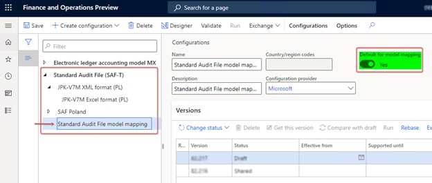

---
# required metadata

title: Prepare for JPK-V7M reporting
description: This topic provides information about how to set up a VAT declaration with registers (also known as a JPK-V7M, VDEK) in Poland. 
author: liza-golub
ms.date: 07/20/2021
ms.topic: article
ms.prod: 
ms.technology: 

# optional metadata

ms.search.form: LedgerParameters, TaxAuthority, TaxReportCollection, TaxTable
# ROBOTS: 
audience: Application User
# ms.devlang: 
ms.reviewer: kfend
ms.search.region: Poland
# ms.search.industry: 
ms.author: elgolu

---

# Prepare for JPK-V7M reporting

[!include [banner](../includes/banner.md)]

The solution that supports JPK-V7M reporting is based on the [Electronic messaging](../general-ledger/electronic-messaging.md) functionality. This functionality provides a flexible approach to setting up and supporting reporting processes.

The following tasks prepare Microsoft Dynamics 365 Finance to report a JPK-V7M:

- Import and set up Electronic reporting (ER) configurations.
- Set up application-specific parameters.
- Import a package of data entities that includes a predefined electronic message setup.
- Set up General ledger parameters.
- Save the executable class parameters for Electronic messaging.
- Set up security roles for electronic message processing.
- Set up an office code for electronic message processing.

## Import and set up ER configurations

To prepare Finance for JPK-V7M reporting, you must import the following ER configurations.

| ER configuration name             | Type | Description |
|-----------------------------------|------|-------------|
| Standard Audit File (SAF-T)       | Model | The common ER model for Standard Audit Files. |
| Standard Audit File model mapping | Model mapping | The model mapping that defines data sources for Polish Standard Audit File (JPK) reports. |
| JPK-V7M XML format (PL)           | Format (exporting) | The XML format that provides the file that the Polish Ministry of Finance requires to be periodically reported. |
| JPK-V7M Excel format (PL)         | Format (exporting) | The Excel format for preview information that will be reported in XML format. |

Import the latest versions of these configurations. The version description usually includes the number of the Microsoft Knowledge Base (KB) article that explains the changes that were introduced in the configuration version. Use the Issue search tool in [Microsoft Dynamics Lifecycle Services (LCS)](https://lcs.dynamics.com/v2) to find the KB article by number.

For more information about how to download ER configurations from the Microsoft global repository, see [Download ER configurations from the Global repository](../../fin-ops-core/dev-itpro/analytics/er-download-configurations-global-repo.md).

> [!NOTE]
> After all the ER configurations from the preceding table are imported, set the **Default for model mapping** option to **Yes** for the **Standard Audit File model mapping** configuration on the **Configurations** page.
>
> 

## Set up application-specific parameters

Depending on the tax transaction data, the values of some elements (markers) in the JPK-V7M report can be defined for reporting purposes. There must be enough transactional data to define values for these elements. Therefore, set up enough sales tax codes, sales tax groups, and item sales tax groups to differentiate tax transactions for all the parameters (elements) that are introduced in the JPK-V7M report. The JPK-V7M format includes application-specific parameters (fields) that can be used to define values for these elements in the report.

The format includes the following lookup fields for setup.

| Name                          | Description | Impact |
|-------------------------------|-------------|--------|
| ImportSelector                | A designation that is related to input tax on imports of goods, including goods that are taxed in accordance with article 33a of the VAT Act | This lookup field is used to define the value of the **IMP** marker for purchase documents. |
| ProceduralMarkingsSelector    | Designations that are related to the procedures | This lookup field is used to define the values of the following markers for sales documents: **SW**, **EE**, **TP**, **TT-WNT**, **TT_D**, **I_42**, **I_63**, **B_SPV**, and **B_SPV_DOSTAWA**. |
| ServiceDeliverySelector       | An indicator that is related to the delivery and provision of services | This lookup field is used to define the values of all **GTU_\*** markers (from **GTU_1** through **GTU_13**) for sales documents. |
| DeclarationMarkersSelector    | Markers from the declaration part for tax transactions | This lookup field is used to define the **P_65** and **P_67** markers for the declaration part, based on the information in documents. |
| ZakupVAT_MarzaSelector        | The amount of purchases of goods and services from other taxpayers for the direct benefit of tourists, and the amount of second-hand goods, works of art, collectors' items, and antiques that are connected with sales that are taxed based on a margin, in accordance with article 120 of the VAT Act | This lookup field is used to define the **ZakupVAT_Marza** marker for purchase documents. |
| SalesDocumentTypesSelector    | A designation of the type of the sales document | This lookup field is used to define the **FP**, **RO**, and **WEW** sales document types. |
| SprzedazVAT_MarzaSelector     | The value of gross sales of supplies of goods and services that are taxed based on a margin, in accordance with articles 119 and 120 of the VAT Act | This lookup field is used to define the **SprzedazVAT_Marza** marker for sales documents. |
| PurchaseDocumentTypesSelector | A designation of the type of the purchase document | This lookup field is used to define the **MK**, **VAT_RR**, and **WEW** purchase document types. |

1. In the **Electronic reporting** workspace, select the **Reporting configurations** tile.
2. On the **Configurations** page, expand **Standard Audit File (SAF-T)**, and select **JPK-V7M XML format (PL)**.
3. On the Action Pane, on the **Configurations** tab, in the **Application specific parameters** group, select **Setup**.

    

4. On the **Application specific parameters** page, select the latest version of the format that you want to define conditions for.
5. On the **Lookups** FastTab, select each lookup, and define appropriate conditions for it.
6. On the **Conditions** FastTab, define which tax codes or other available criteria must correspond to a specific lookup result. 

    If conditions are defined on one line, the system applies them to a source tax transaction by using the **AND** operator. If conditions must be applied by using the **OR** operator, define them on separate lines. 

    As soon as a tax transaction from the reporting period meets a condition in the list, the related marker from the lookup result will be reported for the related document. 

    For more information about the setup of each lookup field, see the subsections that follow.

7. When you've finished setting up conditions, in the **State** field, select **Completed**, and then save the configuration.

    

You can easily export the setup of application-specific parameters from one version of a report and import it into another version. You can also export the setup from one report and import it into another report, provided that both reports have the same structure of lookup fields.

### Import transactions (ImportSelector)

| Name           | Label (En) | Label (Pl) | Description (En) | Description (Pl) |
|----------------|------------|------------|------------------|------------------|
| ImportSelector | Import | Import | A designation that is related to input tax on imports of goods, including goods that are taxed in accordance with article 33a of the VAT Act | Oznaczenie dotyczące podatku naliczonego z tytułu importu towarów, w tym importu towarów rozliczanego zgodnie z art. 33a ustawy |

For this lookup field, the following master data sources are available for setup:

- Sales tax codes
- Sales tax group
- Supplier account ID
- Supplier group

Define conditions from the current company's master data sources to determine which purchase document must be reported with a value of **1** in the **\<IMP\>** element under the **\<ZakupWiersz\>** tag.

The following table shows the lookup results for **ImportTransaction**.

| Name     | Label (En) | Label (Pl) | Description (En) | Description (Pl) |
|----------|------------|------------|------------------|------------------|
| Import   | Import | Import | A designation that is related to input tax on the import of goods, including goods that are taxed in accordance with article 33a of the VAT Act | Oznaczenie dotyczące podatku naliczonego z tytułu importu towarów, w tym importu towarów rozliczanego zgodnie z art. 33a ustawy |
| Inne     | Other | | | |

> [!NOTE]
> It's important that you add **Inne** (**Other**), which must collect data from other cases as the last item in the list. The **Line** value must be the last value in your table. In the **Tax code** column in the **Inne** lookup result, select **\*Not blank\***.

### Procedural markings (ProceduralMarkingsSelector)

| Name                       | Label (En) | Label (Pl) | Description (En) | Description (Pl) |
|----------------------------|------------|------------|------------------|------------------|
| ProceduralMarkingsSelector | Procedural markings | Oznaczenia dotyczące procedur | Designations that are related to the procedures | Oznaczenia dotyczące procedur |

For this lookup field, the following master data sources are available to set up conditions:

- Sales tax codes
- Sales tax group
- Customer account ID
- Customer group
- Supplier account ID
- Supplier group

This lookup field defines conditions that are based on current company's master data sources. These conditions produce a mark of **1** for the corresponding element from the list of designations that are related to the procedures under the **\<SprzedazWiersz\>** tag. Several designations can be marked for the same output VAT record. Therefore, if a company must report different designations, separate conditions must be defined.

**Procedural markings** aren't required for documents of **RO** (Internal summary document) type (**\<TypDokumentu\>** tag under the **\<SprzedazWiersz\>** tag).

The following table shows the lookup results (designations) for **ProceduralMarkingsSelector**.

| Name           | Label (En) | Label (Pl) | Description (En) | Description (Pl) |
|----------------|------------|------------|------------------|------------------|
| SW (*only for reporting periods before July 1, 2021*) | Mail order sale | Sprzedaży wysyłkowej | Delivery as part of a mail order sale from the territory of the country, as referred to in article 23 of the VAT Act | Dostawa w ramach sprzedaży wysyłkowej z terytorium kraju, o której mowa w art. 23 ustawy |
| EE             | Telecommunications | Usług telekomunikacyjnych | The provision of telecommunications, broadcasting, and electronic services that are referred to in article 28k of the VAT Act | Świadczenie usług telekomunikacyjnych, nadawczych i elektronicznych, o których mowa w art. 28k ustawy |
| TP             | Links between the buyer and the supplier | Istniejące powiązania między nabywcą a dokonującym | Existing links between the buyer and the supplier of goods or the provider of services, as referred to in article 32, section 2, point 1 of the VAT Act. There is an exception for the case of supplies of goods and the provision of services where the relationship between the purchaser and the supplying service provider arises solely from a link with the State Treasury or local authorities or their associations. | Istniejące powiązania między nabywcą a dokonującym dostawy towarów lub usługodawcą, o których mowa w art. 32 ust. 2 pkt 1 ustawy. Z wyjątkiem sytuacji, gdy przypadku dostaw towarów oraz świadczenia usług, gdy powiązania między nabywcą a dokonującym dostawy towarów lub usługodawcą wynikają wyłącznie z powiązania ze Skarbem Państwa lub jednostkami samorządu terytorialnego lub ich związkami. |
| TT_WNT         | Intra-community acquisition as part of a three-party transaction | Wewnątrzwspólnotowe nabycie w ramach transakcji trójstronnej | The intra-community acquisition of goods by the second-most-taxable person as part of a three-party transaction, under the simplified procedure that is referred to in section XII, chapter 8 of the VAT Act | Wewnątrzwspólnotowe nabycie towarów dokonane przez drugiego w kolejności podatnika VAT w ramach transakcji trójstronnej w procedurze uproszczonej, o której mowa w dziale XII rozdziale 8 ustawy |
| TT_D           | Delivery of goods outside Poland as part of a three-party transaction | Dostawa towarów poza terytorium kraju w ramach transakcji trójstronnej | The supply of goods outside the territory of the country by the second VAT payer in a three-party transaction, under the simplified procedure that is referred to in section XII, chapter 8 of the VAT Act | Dostawa towarów poza terytorium kraju dokonana przez drugiego w kolejności podatnika VAT w ramach transakcji trójstronnej w procedurze uproszczonej, o której mowa w dziale XII rozdziale 8 ustawy |
| I_42           | Customs procedure 42 (import) | Procedury celnej 42 (import) | The intra-community supply of goods after they are imported under customs procedure 42 (import) | Wewnątrzwspólnotowa dostawa towarów następująca po imporcie tych towarów w ramach procedury celnej 42 (import) |
| I_63           | Customs procedure 63 (import) | Procedury celnej 63(import) | The intra-community supply of goods after they are imported under customs procedure 63 (import) | Wewnątrzwspólnotowa dostawa towarów następująca po imporcie tych towarów w ramach procedury celnej 63 (import) |
| B_SPV          | Transfer by article 8a, paragraph 1 of the VAT Act | Transfer z art. 8a ust. 1 ustawy | The transfer of a single-purpose voucher that is done by a taxpayer who is acting on their own behalf, and that is taxed in accordance with article 8a, paragraph 1 of the VAT Act | Transfer bonu jednego przeznaczenia dokonany przez podatnika działającego we własnym imieniu, opodatkowany zgodnie z art. 8a ust. 1 ustawy |
| B_SPV_DOSTAWA  | Goods and services that the single-purpose voucher is related to (article 8a, paragraph 4 of the VAT Act) | Dostawa towarów oraz świadczenie usług (art. 8a ust. 4 ustawy) | The supply of goods and the provision of services, where the single-purpose voucher is related to a taxable person who issued the voucher in accordance with article 8a, paragraph 4 of the VAT Act | Dostawa towarów oraz świadczenie usług, których dotyczy bon jednego przeznaczenia na rzecz podatnika, który wyemitował bon zgodnie z art. 8a ust. 4 ustawy |
| B_MPV_PROWIZJA | Brokering services for multi-purpose vouchers | Usług pośrednictwa o transferu bonu różnego przeznaczenia | The provision of brokering and other services that are related to the transfer of multi-purpose vouchers that are taxed in accordance with article 8b, paragraph 2 of the VAT Act | Świadczenie usług pośrednictwa oraz innych usług dotyczących transferu bonu różnego przeznaczenia, opodatkowane zgodnie z art. 8b ust. 2 ustawy |
| Inne           | Other | | | |

> [!NOTE]
> It's important that you add **Inne** (**Other**), which must collect data from other cases as the last item in the list. The **Line** value must be the last value in your table. In the **Tax code** column in the **Inne** lookup result, select **\*Not blank\***.

### Goods and services supplying types (ServiceDeliverySelector)

| Name                    | Label (En) | Label (Pl) | Description (En) | Description (Pl) |
|-------------------------|------------|------------|------------------|------------------|
| ServiceDeliverySelector | Delivery and provision of services | Dostawy i świadczenia usług | An indicator that is related to the delivery and provision of services | Oznaczenie dotyczące dostawy i świadczenia usług |

For this lookup field, the following master data sources are available for setup:

- Sales tax code
- Item sales tax group
- Customer account ID
- Customer group

This lookup field defines conditions that are based on current company's master data sources. These conditions will produce a mark of **1** for the corresponding element from the list of designations that are related to the supply of goods and services (**GTU_\*** markers) under the **\<SprzedazWiersz\>** tag. Several designations can be marked for the same output VAT record. Therefore, if a company must report different designations, separate conditions must be available in the company's master data.

**GTU_\*** markers aren't required for documents of **WEW** (internal document) and **RO** (Internal summary document) type (**\<TypDokumentu\>** tag under the **\<SprzedazWiersz\>** tag).

The following table shows the lookup results (designations) for **ServiceDeliverySelector**.

| Name     | Label (En) | Label (Pl) | Description (En) | Description (Pl) |
|----------|------------|------------|------------------|------------------|
| GTU_01   | Supply of alcoholic beverages | Dostawa napojów alkoholowych | The supply of alcoholic beverages with an alcohol content above 1.2%, beer and alcoholic beverages which are a mixture of beer and non-alcoholic beverages with an alcohol content exceeding 0.5% (CN codes from 2203 to 2208) | Dostawa napojów alkoholowych o zawartości alkoholu powyżej 1,2%, piwa oraz napojów alkoholowych będących mieszaniną piwa i napojów bezalkoholowych, w których zawartość alkoholu przekracza 0,5% (CN od 2203 do 2208) |
| GTU_02   | Goods that are referred to in article 103, item 5aa | Dostawa towarów, o których mowa w art. 103 ust. 5aa | The delivery of goods that are referred to in article 103, item 5aa of the VAT Act | Dostawa towarów, o których mowa w art. 103 ust. 5aa ustawy |
| GTU_03   | Supply of heating oil | Dostawa oleju opałowego | The supply of heating oils not included in GTU_02, lubricating oils and other oils (CN codes from 2710 19 71 through 2710 19 83, and from 2710 19 87 through 2710 19 99, excluding  plastic greases  included in CN 2710 19 99), lubricating oils (CN code 2710 20 90) and lubricating preparations (CN 3403, excluding plastic lubricants under this heading) | Dostawa olejów opałowych nieujętych w GTU_02, olejów smarowych i pozostałych olejów (CN od 2710 19 71 do 2710 19 83 i CN od 2710 19 87 do 2710 19 99, z wyłączeniem smarów plastycznych zaliczonych do kodu CN 2710 19 99), olejów smarowych (CN 2710 20 90) oraz preparatów smarowych (CN 3403, z wyłączeniem smarów plastycznych objętych tą pozycją) |
| GTU_04   | Supply of tobacco products | Dostawa wyrobów tytoniowych | The supply of tobacco products, dried tobacco, liquid for electronic cigarettes, and innovative products that fall within the meaning of the provisions on excise duty | Dostawa wyrobów tytoniowych, suszu tytoniowego, płynu do papierosów elektronicznych i wyrobów nowatorskich, w rozumieniu przepisów o podatku akcyzowym |
| GTU_05   | Delivery of waste | Dostawa odpadów | The delivery of waste, but only waste that is specified in items 79 through 91 of annex 15 to the VAT Act | Dostawa odpadów - wyłącznie określonych w poz. 79-91 załącznika nr 15 do ustawy |
| GTU_06   | Supply of electronic devices | Dostawa urządzeń elektronicznych | The supply of electronic devices, and parts and materials for them, as exclusively specified in items 7,8, 59 through 63, 65, 66, 69, and 94 through 96 of annex 15 to the VAT Act, as well as stretch foil specified in pos. 9 of this annex | Dostawa urządzeń elektronicznych oraz części i materiałów do nich, wyłącznie określonych w poz. 7, 8, 59-63, 65, 66, 69 i 94-96 załącznika nr 15 do ustawy, a także folii typu stretch określonej w poz. 9 tego załącznika |
| GTU_07   | Supply of vehicles | Dostawa pojazdów | The supply of vehicles and parts that have only codes CN 8701 through 8708 | Dostawa pojazdów oraz części (CN od 8701 do 8708) |
| GTU_08   | Delivery of precious and base metals | Dostawa metali szlachetnych oraz nieszlachetnych | The delivery of precious and base metals, but only those metals that are specified in items 1 of annex 12 to the VAT Act, and in items 12 through 25, 33 through 40, 45, 46, 56, and 78 of annex 15 to the VAT Act | Dostawa metali szlachetnych oraz nieszlachetnych - wyłącznie określonych w poz. 1 załącznika nr 12 do ustawy oraz w poz. 12-25, 33-40, 45, 46, 56 i 78 załącznika nr 15 do ustawy |
| GTU_09   | Supply of medicines and medical devices | Dostawa leków oraz wyrobów medycznych | The supply of medicinal products, foodstuffs for specific nutritional uses, and medical devices that are only covered by the notification obligation that is referred to in article 37av, section 1 of the Act of September 6, 2001, for the Pharmaceutical Law (Journal of Laws of 2021, item 974 and 981, as amended) | Dostawa produktów leczniczych, środków spożywczych specjalnego przeznaczenia żywieniowego oraz wyrobów medycznych, wyłącznie objętych obowiązkiem zgłoszenia, o którym mowa w art. 37av ust. 1 ustawy z dnia 6 września 2001 r. - Prawo farmaceutyczne (Dz. U. z 2021 r. poz. 974 i 981, z późn. zm.) |
| GTU_10   | Supply of buildings | Dostawa budynków | The supply of buildings, structures, and land and their parts and shares in the ownership right, including the sale of the rights referred to in art. 7 item 1 of VAT Act  | Dostawa budynków, budowli i gruntów oraz ich części i udziałów w prawie własności, w tym również zbycia praw, o których mowa w art. 7 ust. 1 ustawy |
| GTU_11   | Provision of services – Gas emission | Świadczenie usług w - gazów cieplarnianych | The provision of services in the scope of transferring greenhouse gas emission allowances that are referred to in the Act of June 12, 2015, about the trading system for greenhouse gas emission allowances (Journal of Laws of 2021, items 332 and 1047) | Świadczenie usług w zakresie przenoszenia uprawnień do emisji gazów cieplarnianych, o których mowa w ustawie z dnia 12 czerwca 2015 r. o systemie handlu uprawnieniami do emisji gazów cieplarnianych (Dz. U. z 2021 r. poz. 332 i 1047) |
| GTU_12   | Provision of intangible services | Świadczenie usług o charakterze niematerialnym | The provision of intangible services, but only consulting, including legal, tax consultancy and management consultancy (PKWiU 62.02.1, 62.02.2, 66.19.91, 69.20.3, 70.22.11, 70.22.12, 70.22.13, 70.22.14, 70.22.15, 70.22.16, 70.22.3, 71.11.24, 71.11.42, 71.12.11, 71.12.31, 74.90.13, 74.90.15, 74.90.19), accounting and financial audit (PKWiU 69.20.1, 69.20.2), legal (PKWiU 69.1), management (PKWiU 62.03, 63.11.12, 66.11.19, 66.30, 68.32, 69.20.4, 70.22.17, 70.22.2, 90.02.19.1), head offices (PKWiU 70.1), marketing  or advertising (PKWiU 73.1), market and public opinion research (PKWiU 73.2), in the field of scientific research and development work (PKWiU 72) anin the field of out-of-school forms of education (PKWiU 85.5) | Świadczenie usług o charakterze niematerialnym - wyłącznie: doradczych, w tym doradztwa prawnego i podatkowego oraz doradztwa związanego z zarządzaniem (PKWiU 62.02.1, 62.02.2, 66.19.91, 69.20.3, 70.22.11, 70.22.12, 70.22.13, 70.22.14, 70.22.15, 70.22.16, 70.22.3, 71.11.24, 71.11.42, 71.12.11, 71.12.31, 74.90.13, 74.90.15, 74.90.19), w zakresie rachunkowości i audytu finansowego (PKWiU 69.20.1, 69.20.2), prawnych (PKWiU 69.1), zarządczych (PKWiU 62.03, 63.11.12, 66.11.19, 66.30, 68.32, 69.20.4, 70.22.17, 70.22.2, 90.02.19.1), firm centralnych (PKWiU 70.1), marketingowych lub reklamowych (PKWiU 73.1), badania rynku i opinii publicznej (PKWiU 73.2), w zakresie badań naukowych i prac rozwojowych (PKWiU 72) oraz w zakresie pozaszkolnych form edukacji (PKWiU 85.5) |
| GTU_13   | Transport services and storage management | Usług transportowych i gospodarki magazynowej | TThe provision of transport services and storage management, as described in PKWiU 49.4, 52.1 | Świadczenie usług transportowych i gospodarki magazynowej - PKWiU 49.4, 52.1 |
| Inne     | Other | | | |

> [!NOTE]
> It's important that you add **Inne** (**Other**), which must collect data from other cases as the last item in the list. The **Line** value must be the last value in your table. In the **Tax code** column in the **Inne** lookup result, select **\*Not blank\***.

### Declaration markers (DeclarationMarkersSelector)

| Name                       | Label (En) | Label (Pl) | Description (En) | Description (Pl) |
|----------------------------|------------|------------|------------------|------------------|
| DeclarationMarkersSelector | Declaration markers | Markery deklaracji | Markers from the declaration part for tax transactions | Znaczniki z części deklaracji dla transakcji podatkowych |

For this lookup field, the following master data sources are available for setup:

- Sales tax code
- Item sales tax group
- Sales tax group
- Customer account ID
- Customer group
- Vendor account ID
- Vendor group

This lookup field defines conditions that are based on current company's master data sources. These conditions will produce a mark of **1** for the **P_65** and **P_67** elements of the **\<Deklaracja\>** part of the report when they are met by at least one document in the reporting period.

The following table shows the lookup results for **DeclarationMarkersSelector**.

| Name     | Label (En) | Label (Pl) | Description (En) | Description (Pl) |
|----------|------------|------------|------------------|------------------|
| P_65     | Activities that are mentioned in article 122 | Czynności o których mowa w art. 122 ustawy | Activities that the taxpayer performed and that are mentioned in article 122 of the VAT Act. There is a tax exemption for the supply, import, and purchase of investment gold. | Podatnik wykonywał w okresie rozliczeniowym czynności, o których mowa w art. 122 ustawy |
| P_67     | Tax liability reduction | Obniżenie kwoty zobowiązania podatkowego | The tax liability reduction that the taxpayer benefits from and that is mentioned in article 108d of the VAT Act | Podatnik korzysta z obniżenia zobowiązania podatkowego, o którym mowa w art. 108d ustawy |
| Inne     | Other | | | |

> [!NOTE]
> It's important that you add **Inne** (**Other**), which must collect data from other cases as the last item in the list. The **Line** value must be the last value in your table. In the **Tax code** column in the **Inne** lookup result, select **\*Not blank\***.

### Input VAT – Margin (ZakupVAT_MarzaSelector)

| Name                   | Label (En) | Label (Pl) | Description (En) | Description (Pl) |
|------------------------|------------|------------|------------------|------------------|
| ZakupVAT_MarzaSelector | Declaration markers | Podatek VAT – marża | The amount of purchases of goods and services from other taxpayers for the direct benefit of tourists, and the amount of second-hand goods, works of art, collectors' items, and antiques that are connected with sales that are taxed based on a margin, in accordance with article 120 of the VAT Act | Kwota nabycia towarów I usług nabytych od innych podatników dla bezpośredniej korzyści turysty, a także nabycia towarów używanych, dzieł sztuki, przedmiotów kolekcjonerskich i antyków związanych ze sprzedażą opodatkowaną na zasadzie marży zgodnie z art. 120 ustawy |

For this lookup field, the following master data sources are available for setup:

- Sales tax code
- Item sales tax group

This lookup field lets you define different conditions to collect amounts that must be reported in the **ZakupWiersz/ZakupVAT_Marza** element of the report. The system collects the gross amount of tax transactions that meet the specified criteria. If the conditions are defined on one line of setup, the system applies them to a source tax transaction by using the **AND** operator. If conditions must be applied by using the **OR** operator, define them on separate lines. As soon as a tax transaction from the reporting period meets a condition in the list, the related gross amount will be collected for reporting in the **ZakupWiersz/ZakupVAT_Marza** element of the report in relation to the document.

The following table shows the lookup results for **ZakupVAT_MarzaSelector**.

| Name           | Label (En) | Label (Pl) | Description (En) | Description (Pl) |
|----------------|------------|------------|------------------|------------------|
| ZakupVAT_Marza | Input VAT – Margin | Podatek VAT – marża | The amount of purchases of goods and services from other taxpayers for the direct benefit of tourists, and the amount of second-hand goods, works of art, collectors' items, and antiques that are connected with sales that are taxed based on a margin, in accordance with article 120 of the VAT Act | Kwota nabycia towarów i usług nabytych od innych podatników dla bezpośredniej korzyści turysty, a także nabycia towarów używanych, dzieł sztuki, przedmiotów kolekcjonerskich I antyków związanych ze sprzedażą opodatkowaną na zasadzie marży zgodnie z art. 120 ustawy |

> [!NOTE]
> It's important that you add **Inne** (**Other**), which must collect data from other cases as the last item in the list. The **Line** value must be the last value in your table. In the **Tax code** column in the **Inne** lookup result, select **\*Not blank\***.

### Document types for sales (SalesDocumentTypesSelector)

| Name                       | Label (En) | Label (Pl) | Description (En) | Description (Pl) |
|----------------------------|------------|------------|------------------|------------------|
| SalesDocumentTypesSelector | Document type | Typ dokumentu | A designation of the type of the sales document | Oznaczenie dowodu sprzedaży |

For this lookup field, the following master data sources are available for setup:

- Sales tax code
- Item sales tax group
- Sales tax group
- Customer account ID
- Customer group

The following table shows the lookup results for **SalesDocumentTypesSelector**.

| Name     | Label (En) | Label (Pl) | Description (En) | Description (Pl) |
|----------|------------|------------|------------------|------------------|
| FP       | Invoice that is issued to the receipt by article 109, section 3d | Faktura, o której mowa w art. 109 ust. 3d ustawy | The invoice that is issued to the receipt, as mentioned in article 109, section 3d of the VAT Act | Faktura, o której mowa w art. 109 ust. 3d ustawy |
| RO       | Internal summary document | Dokument zbiorczy wewnętrzny | An internal summary document that includes sales from cash registers | Dokument zbiorczy wewnętrzny zawierający sprzedaż z kas rejestrujących |
| WEW      | Internal document | Dokument wewnętrzny | Internal document | Dokument wewnętrzny |
| Inne     | Other | | | |

> [!NOTE]
> It's important that you add **Inne** (**Other**), which must collect data from other cases as the last item in the list. The **Line** value must be the last value in your table. In the **Tax code** column in the **Inne** lookup result, select **\*Not blank\***.

For more information about how to report **RO** and **FP** document types for retail operations, see 
[Report RO and FP document types for retail operations](emea-pol-vdek-scenarios.md#report-ro-and-fp-document-types-for-retail-operations).

### Output VAT – Margin (SprzedazVAT_MarzaSelector)

| Name                      | Label (En) | Label (Pl) | Description (En) | Description (Pl) |
|---------------------------|------------|------------|------------------|------------------|
| SprzedazVAT_MarzaSelector | Output VAT – Margin | VAT należny – marża | The value of gross sales of supplies of goods and services that are taxed based on a margin, in accordance with articles 119 and 120 of the VAT Act | Wartość sprzedaży brutto dostawy towarów i świadczenia usług opodatkowanych na zasadach marży zgodnie z art. 119 i art. 120 ustawy |

For this lookup field, the following master data sources are available for setup:

- Sales tax code
- Item sales tax group

This lookup field lets you define different conditions to report the **MR_T** or **MR_UZ** marker for sales documents in the **SprzedazWiersz** element of the report.

The following table shows the lookup results for **SprzedazVAT_MarzaSelector**.

| Name     | Label (En) | Label (Pl) | Description (En) | Description (Pl) |
|----------|------------|------------|------------------|------------------|
| MR_T     | Tourism services that are taxed based on a margin | Usług turystyki opodatkowane na zasadach marży | The provision of tourism services that are taxed based on a margin, in accordance with article 119 of the VAT Act | Świadczenie usług turystyki opodatkowane na zasadach marży zgodnie z art. 119 ustawy |
| MR_UZ    | Second-hand goods, art, and antiques | Towarów używanych, dzieł sztuki, antyków | The supply of second-hand goods, works of art, collectors' items, and antiques that are taxed based on a margin, in accordance with article 120 of the VAT Act | Dostawa towarów używanych, dzieł sztuki, przedmiotów kolekcjonerskich i antyków, opodatkowana na zasadach marży zgodnie z art. 120 ustawy |
| Inne     | Other | | | |

> [!NOTE]
> It's important that you add **Inne** (**Other**), which must collect data from other cases as the last item in the list. The **Line** value must be the last value in your table. In the **Tax code** column in the **Inne** lookup result, select **\*Not blank\***.

### Document types for purchases (PurchaseDocumentTypesSelector)

| Name                          | Label (En) | Label (Pl) | Description (En) | Description (Pl) |
|-------------------------------|------------|------------|------------------|------------------|
| PurchaseDocumentTypesSelector | Purchase invoice type | Dokument Zakupu | A designation of the type of the purchase document | Oznaczenie dowodu zakupu |

For this lookup field, the following master data sources are available for setup:

- Sales tax code
- Item sales tax group
- Sales tax group
- Supplier account ID
- Supplier group

This lookup field defines the combination of a sales tax code (**Tax code**), a vendor account ID (**Account ID**), and a vendor group (**PartyGroup**) from the current company's database that will produce a document type under the **\<ZakupWiersz\>** tag. Several combinations can be defined.

The following table shows the lookup results for **PurchaseDocumentTypesSelector**.

| Name     | Label (En) | Label (Pl) | Description (En) | Description (Pl) |
|----------|------------|------------|------------------|------------------|
| MK       | Invoice that is referred to in article 21 | Faktura art. 21 | The invoice that is issued by a taxpayer who is a supplier of goods or services, and who has chosen the cash accounting method that is specified in article 21 of the VAT Act | Faktura wystawiona przez podatnika będącego dostawcą lub usługodawcą, który wybrał metodę kasową rozliczeń określoną w art. 21 ustawy |
| VAT_RR   | Invoice that is referred to in article 116 | Faktura VAT RR, art.116 | The VAT invoice that is referred to in article 116 of the VAT Act | Faktura VAT RR, o której mowa w art. 116 ustawy |
| WEW      | Internal document | Dokument wewnętrzny | Internal document | Dokument wewnętrzny |
| Inne     | Other | | | |

> [!NOTE]
> It's important that you add **Inne** (**Other**), which must collect data from other cases as the last item in the list. The **Line** value must be the last value in your table. In the **Tax code** column in the **Inne** lookup result, select **\*Not blank\***.

## Import a package of data entities that includes a predefined electronic message setup

The process of setting up the Electronic messaging functionality for JPK-V7M reporting has many steps. Because the names of some predefined entities are used in the ER configurations, it's important that you use a set of predefined values that are delivered in a package of data entities for the related tables.

1. In [LCS](https://lcs.dynamics.com/v2), in the Shared asset library, select the **Data package** asset type. Then find **PL JPK_V7M EM setup.zip** in the list of data package files, and download it to your computer.
2. After the **PL JPK_V7M EM setup.zip** file has been downloaded, open Finance, select the company that you will generate the JPK-V7M report from, and then go to **Workspaces** \> **Data management**.

    Before you import setup data from the package of data entities, you must make sure that the data entities in your application are refreshed and synced.

3. In the **Data management** workspace, go to **Framework parameters** \> **Entity settings**, and then select **Refresh entity list**. Wait for confirmation that the refresh has been completed. For more information about how to refresh the entity list, see [Entity list refresh](../../fin-ops-core/dev-itpro/data-entities/data-entities.md#entity-list-refresh).
4. Validate that the source data and target data are correctly mapped. For more information, see [Validate that the source data and target data are mapped correctly](../../fin-ops-core/dev-itpro/data-entities/data-import-export-job.md#validate-that-the-source-data-and-target-data-are-mapped-correctly).
5. Before the data entities are used for the first time to import the data from the package, sync the mapping of source data and target data. In the list for the package, select a data entity, and then, on the Action Pane, select **Modify target mapping**. Then, above the grid for the package, select **Generate mapping** to create a mapping from scratch.
6. Save the mapping.
7. Repeat steps 3 through 6 for each data entity in the package.

For more information about Data management, see [Data management](../../fin-ops-core/dev-itpro/data-entities/data-entities-data-packages.md).

You must now import data from the **PL JPK_V7M EM setup.zip** file into the selected company.

1. In the **Data management** workspace, select **Import**, set the **Source data format** field to **Package**, and create a new importing project by selecting **New** on the Action Pane.
2. On the **Select entities** FastTab, select **Add file**.
3. Select **Upload and add**, select the **PL JPK_V7M EM setup**.**zip** file on your computer, and upload it.
4. When entities from the package are listed in the grid, select **Close**.
5. On the Action Pane, select **Import** to start to import data from the data entities.

    

You will receive a notification in **Messages**, or you can manually refresh the page to view the progress of the data import. When the import process is completed, the **Execution summary** page shows the results.

> [!IMPORTANT]
> Some records in the data entities in the package include a link to ER configurations. Therefore, be sure to import ER configurations into Finance before you start to import the data entities package.

## Set up General ledger parameters

To work with the Electronic messaging functionality, you must define related number sequences.

1. Go to **Tax** \> **Setup** \> **General ledger parameters**.
2. On the **Number sequences** tab, set up two number sequences:

    - Message
    - Message item

## Save the executable class parameters for Electronic messaging

The JPK-V7M processing uses the **EMGenerateJPKVDEKReportController_PL** executable class to initiate data collection for the report data provider and further report generation. Before you use this class for the first time, you must save its parameters.

1. Go to **Tax** \> **Setup** \> **Electronic messaging** \> **Executable class settings**.
2. Select the **Wygenerowanie JPK_V7M** executable class (which is set to call **EMGenerateJPKVDEKReportController_PL**), and then, on the Action Pane, select **Parameters**. In the **Generate Polish JPK_VDEK report** dialog box, select **OK**.

In the dialog box for the executable class, the **Retail-specific sales marking** group of parameters is used for retail-specific scenarios. For more information about how to report **RO** and **FP** document types for retail operations, see 
[Report RO and FP document types for retail operations](emea-pol-vdek-scenarios.md#report-ro-and-fp-document-types-for-retail-operations).

The dialog box for the executable class includes the **Consider VAT report date codes** parameter. Use this parameter to collect VAT transactions in the report, based on rules that you define in VAT report date codes. This parameter doesn't affect retail-specific transactions that will be reported as the **FP** document type. For more information about the VAT report date codes feature, see [Set up VAT report date codes](https://docs.microsoft.com/dynamicsax-2012/appuser-itpro/pol-set-up-vat-report-date-codes).

## Set up security roles for electronic message processing

Different groups of users might require access to the JPK-V7M processing. You can limit access to the processing, based on security groups that are defined in the system.

Follow these steps to limit access to the JPK-V7M processing.

1. Go to **Tax** \> **Setup** \> **Electronic messages** \> **Electronic message processing**.
2. Select the **JPK-V7M** processing, and then, on the **Security roles** FastTab, add the security groups that must work with it. If no security group is defined for the processing, only a system admin can see it on the **Electronic messages** page.

## Set up an office code for electronic message processing

Follow these steps to enter an office code in the **KodUrzedu** additional field.

1. Go to **Tax** \> **Setup** \> **Electronic messages** \> **Electronic message processing**.
2. Select the **JPK-V7M** processing.
3. On the **Additional field** FastTab, select the **KodUrzedu** additional field, and then, in the **Default value** field, specify the office code that should be reported in the **\<KodUrzedu\>** element of the report.
