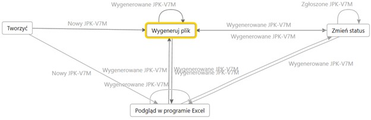
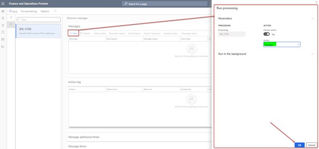
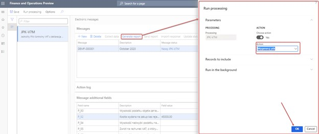

---
# required metadata

title: VAT declaration with registers (JPK_V7M, VDEK)
description: This topic walks you through the process of setting up VAT declaration with registers (also called JPK_V7M, VDEK) in Poland. 
author: liza-golub
ms.date: 11/03/2020
ms.topic: article
ms.prod: 
ms.service: dynamics-ax-applications
ms.technology: 

# optional metadata

ms.search.form: LedgerParameters, TaxAuthority, TaxReportCollection, TaxTable
# ROBOTS: 
audience: Application User
# ms.devlang: 
ms.reviewer: kfend
ms.search.scope: Core, Operations
ms.search.region: Poland
# ms.search.industry: 
ms.author: elgolu

---

# VAT declaration with registers (JPK_V7M, VDEK)

[!include [banner](../includes/banner.md)]

This topic explains how to set up a value-added tax (VAT) declaration with
registers (also known as a JPK_V7M, VDEK) in Poland.

As of October 1, 2020, businesses in Poland are responsible for reporting VAT in
an electronic document that consists of a Jednolity Plik Kontrolny VAT (JPK_VAT)
together with the declaration (Jednolity Plik Kontrolny VDEK). The requested
electronic document includes the following information:

-   Both VAT records (a set of information about purchases and sales that is
    produced from the entrepreneur's VAT records for a given period)

-   A VAT declaration (VAT-7 declaration)

## Prerequisites

Before you can prepare Microsoft Dynamics 365 Finance to report a JPK_V7M, your
business processes and the system must meet the following conditions:

-   On the **Sales tax authorities** page (**Tax** \> **Indirect tax** \>
    **Sales tax** \> **Sales tax authorities**), for the tax authority that is
    associated with tax codes that are used in tax transactions that must be
    considered by the JPK_V7M report, the **Report layout** field must be set to
    **Default**. For more information about how to set up sales tax authorities,
    see [Set up sales tax
    authorities](https://docs.microsoft.com/dynamics365/finance/general-ledger/tasks/set-up-sales-tax-authorities).

-   When tax transactions that must be considered by the JPK_V7M report are
    posted, the **Date of VAT register** field must be set.

-   On the **Sales tax codes** page (**Tax** \> **Indirect tax** \> **Sales
    tax** \> **Sales tax codes**), for the sales tax codes that are used in tax
    transactions that must be considered by the JPK_V7M report, the **Type of
    tax** field must be set to **Standard VAT** or **Reduced VAT**.

-   On the **Sales tax codes** page, for the sales tax codes that are used in
    tax transactions that must be considered by the JPK_V7M report, the sales
    tax reporting codes that are used in the Electronic reporting (ER) format of
    the report must be appropriately defined.

## Prepare for JPK_V7M reporting

The solution to support JPK_V7M reporting is based on the [Electronic
messaging](https://docs.microsoft.com/dynamics365/finance/general-ledger/electronic-messaging)
functionality. This functionality provides a flexible approach for setting up
and supporting reporting processes.

The following tasks will prepare Dynamics 365 Finance to report a JPK_V7M:

-   Import and set up ER configurations.

-   Set up application-specific parameters.

-   Import a package of data entities that includes a predefined electronic
    message setup.

-   Set up General ledger parameters.

-   Save the executable class parameters for Electronic messaging.

-   Set up security roles for electronic message processing.

-   Set up an office code for electronic message processing.

### Import and set up ER configurations

To prepare Finance for JPK_V7M reporting, you must import the following
versions, or later versions, of ER configurations.

| **ER configuration name**         | **Type**           | **Description**                                                                                                 |
|-----------------------------------|--------------------|-----------------------------------------------------------------------------------------------------------------|
| Standard Audit File (SAF-T)       | Model              | The common ER model for Standard Audit Files.                                                                   |
| Standard Audit File model mapping | Model mapping      | The model mapping that defines data sources for Polish Standard Audit File (JPK) reports.                       |
| JPK-V7M XML format (PL)           | Format (exporting) | The XML format that provides the file that the Polish Ministry of Finance requires to be periodically reported. |
| JPK-V7M Excel format (PL)         | Format (exporting) | The Excel format for preview information that will be reported in XML format.                                   |

Import the latest versions of these configurations. The version description
usually includes the number of the Microsoft Knowledge Base (KB) article that
explains the changes that were introduced in the configuration version. Use the
Issue search tool in [Microsoft Dynamics Lifecycle Services
(LCS)](https://lcs.dynamics.com/v2) to find the KB article by number.

**Note:** After all the ER configurations from the preceding table are imported,
set the **Default for model mapping** option to **Yes** for the **Standard Audit
File model mapping** configuration on the **Configurations** page.

For more information about how to download ER configurations from the Microsoft
global repository, see [Download ER configurations from the Global
repository](<https://docs.microsoft.com/dynamics365/fin-ops-core/dev-itpro/analytics/er-download-configurations-global-repo>).

### Set up application-specific parameters

Depending on the tax transaction data, the values of some elements in the
JPK_V7M report can be defined for reporting purposes. There must be enough
transactional data to define values for these elements. Therefore, set up enough
sales tax codes, sales tax groups, and item sales tax groups to differentiate
tax transactions for all the parameters (elements) that are introduced in the
JPK_V7M report. The JPK_V7M format includes application-specific parameters that
can be used to define values for these elements in the report.

The format includes the following lookup fields for setup.

| **Name**                      | **Description**                                                                                                                                                                                                                                                                                         | **Impact**                                                                                                                                                                                       |
|-------------------------------|---------------------------------------------------------------------------------------------------------------------------------------------------------------------------------------------------------------------------------------------------------------------------------------------------------|--------------------------------------------------------------------------------------------------------------------------------------------------------------------------------------------------|
| ImportSelector                | A designation that is related to input tax on imports of goods, including goods that are taxed in accordance with article 33a of the VAT Act                                                                                                                                                            | This lookup field is used to define the value of the **IMP** marker for purchase documents.                                                                                                      |
| ProceduralMarkingsSelector    | Designations that are related to the procedures                                                                                                                                                                                                                                                         | This lookup field is used to define the values of the following markers for sales documents: **SW**, **EE**, **TP**, **TT-WNT**, **TT_D**, **I_42**, **I_63**, **B_SPV**, and **B_SPV_DOSTAWA**. |
| ServiceDeliverySelector       | An indicator that is related to the delivery and provision of services                                                                                                                                                                                                                                  | This lookup field is used to define the values of all **GTU_\*** markers (from **GTU_1** through **GTU_13**) for sales documents.                                                                |
| DeclarationMarkersSelector    | Markers from the declaration part for tax transactions                                                                                                                                                                                                                                                  | This lookup field is used to define the **P_65** and **P_67** markers for the declaration part, based on the information in documents.                                                           |
| ZakupVAT_MarzaSelector        | The amount of purchases of goods and services from other taxpayers for the direct benefit of tourists, and the amount of second-hand goods, works of art, collectors' items, and antiques that are connected with sales that are taxed based on a margin, in accordance with article 120 of the VAT Act | This lookup field is used to define the **ZakupVAT_Marza** marker for purchase documents.                                                                                                        |
| SalesDocumentTypesSelector    | A designation of the type of the sale document                                                                                                                                                                                                                                                          | This lookup field is used to define the **FP**, **RO**, and **WEW** sales document types.                                                                                                        |
| SprzedazVAT_MarzaSelector     | The value of gross sales of supplies of goods and services that are taxed based on a margin, in accordance with articles 119 and 120 of the VAT Act                                                                                                                                                     | This lookup field is used to define the **SprzedazVAT_Marza** marker for sales documents.                                                                                                        |
| PurchaseDocumentTypesSelector | A designation of the type of the purchase document                                                                                                                                                                                                                                                      | This lookup field is used to define the **MK**, **VAT_RR**, and **WEW** purchase document types.                                                                                                 |

1.  In the **Electronic reporting** workspace, select the **Reporting
    configurations** tile.

2.  On the **Configurations** page, expand **StandardAudit File (SAF-T)**, and
    select **JPK-V7M XML format (PL)**.

3.  On the Action Pane, on the **Configurations** tab, in the **Application
    specific parameters** group, select **Setup**.

4.  On the **Application specific parameters** page, select the latest version
    of the format that you want to define conditions for.

5.  On the **Lookups** FastTab, select each lookup, and define appropriate
    conditions for it.

6.  On the **Conditions** FastTab, define which tax codes or other available
    criteria must correspond to a specific lookup result. If conditions are
    defined on one line, the system applies them to a source tax transaction by
    using the **AND** operator. If conditions must be applied by using the
    **OR** operator, define them on separate lines. As soon as a tax transaction
    from the reporting period meets a condition in the list, the related marker
    from the lookup result will be reported for the related document. For more
    information about the setup of each lookup field, see the subsections that
    follow.

7.  In the **State** field, select **Completed**, and then save the
    configuration.

#### Import transactions (ImportTransaction)

| **Name**          | **Label (En)** | **Label (Pl)** | **Description (En)**                                                                                                                         | **Description (Pl)**                                                                                                            |
|-------------------|----------------|----------------|----------------------------------------------------------------------------------------------------------------------------------------------|---------------------------------------------------------------------------------------------------------------------------------|
| ImportTransaction | Import         | Import         | A designation that is related to input tax on imports of goods, including goods that are taxed in accordance with article 33a of the VAT Act | Oznaczenie dotyczące podatku naliczonego z tytułu importu towarów, w tym importu towarów rozliczanego zgodnie z art. 33a ustawy |

For this lookup field, the following master data sources are available for
setup:

-   Sales tax codes

-   Sales tax group

-   Supplier account Id

-   Supplier group

Define conditions from the current company's master data sources to determine
which purchase document must be reported with a value of **1** in the
**\<IMP\>** element under the **\<ZakupWiersz\>** tag.

The following table shows the lookup results for **ImportTransaction**.

| **Name** | **Label (En)** |   | **Label (Pl)** | **Description (En)**                                                                                                                         | **Description (Pl)**                                                                                                            |
|----------|----------------|---|----------------|----------------------------------------------------------------------------------------------------------------------------------------------|---------------------------------------------------------------------------------------------------------------------------------|
| Import   | Import         |   | Import         | A designation that is related to input tax on imports of goods, including goods that are taxed in accordance with article 33a of the VAT Act | Oznaczenie dotyczące podatku naliczonego z tytułu importu towarów, w tym importu towarów rozliczanego zgodnie z art. 33a ustawy |
| Inne     | Other          |   |                |                                                                                                                                              |                                                                                                                                 |

**Note:** It's important that you add **Inne** (**Other**), which must collect
data from other cases as the last item in the list. The **Line** value must be
the last value in your table. In the **Tax code** column for the **Inne** lookup
result, select **\*Not blank\***.

#### Procedural markings (ProceduralMarkingsSelector)

| **Name**                   | **Label (En)**      | **Label (Pl)**                | **Description (En)**                            | **Description (Pl)**          |
|----------------------------|---------------------|-------------------------------|-------------------------------------------------|-------------------------------|
| ProceduralMarkingsSelector | Procedural markings | Oznaczenia dotyczące procedur | Designations that are related to the procedures | Oznaczenia dotyczące procedur |

For this lookup field, the following master data sources are available for the
setup of conditions:

-   Sales tax codes

-   Sales tax group

-   Customer account Id

-   Customer group

This lookup field defines conditions that are based on current company's master
data sources. These conditions will produce a mark of **1** for the
corresponding element from the list of designations that are related to the
procedures under the **\<SprzedazWiersz\>** tag. Several designations can be
marked for the same output VAT record. Therefore, if a company must report
different designations, separate conditions must be defined.

The following table shows the lookup results (designations) for
**ProceduralMarkingsSelector**.

| **Name**       | **Label (En)**                                                                                            | **Label (Pl)**                                                         | **Description (En)**                                                                                                                                                                                         | **Description (Pl)**                                                                                                                                                                               |
|----------------|-----------------------------------------------------------------------------------------------------------|------------------------------------------------------------------------|--------------------------------------------------------------------------------------------------------------------------------------------------------------------------------------------------------------|----------------------------------------------------------------------------------------------------------------------------------------------------------------------------------------------------|
| SW             | Mail order sale                                                                                           | Sprzedaży wysyłkowej                                                   | Delivery as part of a mail order sale from the territory of the country, as referred to in article 23 of the VAT Act                                                                                         | Dostawa w ramach sprzedaży wysyłkowej z terytorium kraju, o której mowa w art. 23 ustawy                                                                                                           |
| EE             | Telecommunications                                                                                        | Usług telekomunikacyjnych                                              | The provision of telecommunications, broadcasting, and electronic services that are referred to in article 28k of the VAT Act                                                                                | Świadczenie usług telekomunikacyjnych, nadawczych i elektronicznych, o których mowa w art. 28k ustawy                                                                                              |
| TP             | Links between the buyer and the supplier                                                                  | Istniejące powiązania między nabywcą a dokonującym                     | Existing links between the buyer and the supplier of goods or the provider of services, as referred to in article 32, section 2, point 1 of the VAT Act                                                      | Istniejące powiązania między nabywcą a dokonującym dostawy towarów lub usługodawcą, o których mowa w art. 32 ust. 2 pkt 1 ustawy                                                                   |
| TT_WNT         | Intra-community acquisition as part of a three-party transaction                                          | Wewnątrzwspólnotowe nabycie w ramach transakcji trójstronnej           | The intra-community acquisition of goods by the second-most-taxable person as part of a three-party transaction, under the simplified procedure that is referred to in section XII, chapter 8 of the VAT Act | Wewnątrzwspólnotowe nabycie towarów dokonane przez drugiego w kolejności podatnika VAT w ramach transakcji trójstronnej w procedurze uproszczonej, o której mowa w dziale XII rozdziale 8 ustawy   |
| TT_D           | Delivery of goods outside Poland as part of a three-party transaction                                     | Dostawa towarów poza terytorium kraju w ramach transakcji trójstronnej | The supply of goods outside the territory of the country by the second VAT payer in a three-party transaction, under the simplified procedure that is referred to in section XII, chapter 8 of the VAT Act   | Dostawa towarów poza terytorium kraju dokonana przez drugiego w kolejności podatnika VAT w ramach transakcji trójstronnej w procedurze uproszczonej, o której mowa w dziale XII rozdziale 8 ustawy |
| I_42           | Customs procedure 42 (import)                                                                             | Procedury celnej 42 (import)                                           | The intra-community supply of goods after they are imported under customs procedure 42 (import)                                                                                                              | Wewnątrzwspólnotowa dostawa towarów następująca po imporcie tych towarów w ramach procedury celnej 42 (import)                                                                                     |
| I_63           | Customs procedure 63 (import)                                                                             | Procedury celnej 63(import)                                            | The intra-community supply of goods after they are imported under customs procedure 63 (import)                                                                                                              | Wewnątrzwspólnotowa dostawa towarów następująca po imporcie tych towarów w ramach procedury celnej 63 (import)                                                                                     |
| B_SPV          | Transfer by article 8a, paragraph 1 of the VAT Act                                                        | Transfer z art. 8a ust. 1 ustawy                                       | The transfer of a single-purpose voucher that is done by a taxpayer who is acting on their own behalf, and that is taxed in accordance with article 8a, paragraph 1 of the VAT Act                           | Transfer bonu jednego przeznaczenia dokonany przez podatnika działającego we własnym imieniu, opodatkowany zgodnie z art. 8a ust. 1 ustawy                                                         |
| B_SPV_DOSTAWA  | Goods and services that the single-purpose voucher is related to (article 8a, paragraph 4 of the VAT Act) | Dostawa towarów oraz świadczenie usług (art. 8a ust. 4 ustawy)         | The supply of goods and the provision of services, where the single-purpose voucher is related to a taxable person who issued the voucher in accordance with article 8a, paragraph 4 of the VAT Act          | Dostawa towarów oraz świadczenie usług, których dotyczy bon jednego przeznaczenia na rzecz podatnika, który wyemitował bon zgodnie z art. 8a ust. 4 ustawy                                         |
| B_MPV_PROWIZJA | Brokering services for multi-purpose vouchers                                                             | Usług pośrednictwa o transferu bonu różnego przeznaczenia              | The provision of brokering and other services that are related to the transfer of multi-purpose vouchers that are taxed in accordance with article 8b, paragraph 2 of the VAT Act                            | Świadczenie usług pośrednictwa oraz innych usług dotyczących transferu bonu różnego przeznaczenia, opodatkowane zgodnie z art. 8b ust. 2 ustawy                                                    |
| Inne           | Other                                                                                                     |                                                                        |                                                                                                                                                                                                              |                                                                                                                                                                                                    |

**Note:** It's important that you add **Inne** (**Other**), which must collect
data from other cases as the last item in the list. The **Line** value must be
the last value in your table. In the **Tax code** column for the **Inne** lookup
result, select **\*Not blank\***.

#### Goods and services supplying types (ServiceDeliverySelector)

| **Name**                | **Label (En)**                     | **Label (Pl)**              | **Description (En)**                                                   | **Description (Pl)**                             |
|-------------------------|------------------------------------|-----------------------------|------------------------------------------------------------------------|--------------------------------------------------|
| ServiceDeliverySelector | Delivery and provision of services | Dostawy i świadczenia usług | An indicator that is related to the delivery and provision of services | Oznaczenie dotyczące dostawy i świadczenia usług |

For this lookup field, the following master data sources are available for
setup:

-   Sales tax code

-   Item sales tax group

-   Customer account Id

-   Customer group

This lookup field defines conditions that are based on current company's master
data sources. These conditions will produce a mark of **1** for the
corresponding element from the list of designations that are related to the
supply of goods and services under the **\<SprzedazWiersz\>** tag. Several
designations can be marked for the same output VAT record. Therefore, if a
company must report different designations, separate conditions must be
available in the company's master data.

The following table shows the lookup results (designations) for
**ServiceDeliverySelector**.

| **Name** | **Label (En)**                                      | **Label (Pl)**                                      | **Description (En)**                                                                                                                                                                                                                                                                                                                                                                                                                                                                         | **Description (Pl)**                                                                                                                                                                                                                                                                                                                                                                                                                        |
|----------|-----------------------------------------------------|-----------------------------------------------------|----------------------------------------------------------------------------------------------------------------------------------------------------------------------------------------------------------------------------------------------------------------------------------------------------------------------------------------------------------------------------------------------------------------------------------------------------------------------------------------------|---------------------------------------------------------------------------------------------------------------------------------------------------------------------------------------------------------------------------------------------------------------------------------------------------------------------------------------------------------------------------------------------------------------------------------------------|
| GTU_01   | Supply of alcoholic beverages                       | Dostawa napojów alkoholowych                        | The supply of alcoholic beverages, including ethyl alcohol, beer, wine, fermented beverages, and intermediate products, as defined in the provisions on excise duty                                                                                                                                                                                                                                                                                                                          | Dostawa napojów alkoholowych - alkoholu etylowego, piwa, wina, napojów fermentowanych i wyrobów pośrednich, w rozumieniu przepisów o podatku akcyzowym                                                                                                                                                                                                                                                                                      |
| GTU_02   | Goods that are referred to in article 103, item 5aa | Dostawa towarów, o których mowa w art. 103 ust. 5aa | The delivery of goods that are referred to in article 103, item 5aa of the VAT Act                                                                                                                                                                                                                                                                                                                                                                                                           | Dostawa towarów, o których mowa w art. 103 ust. 5aa ustawy                                                                                                                                                                                                                                                                                                                                                                                  |
| GTU_03   | Supply of heating oil                               | Dostawa oleju opałowego                             | The supply of heating oil that falls within the meaning of the provisions on excise duty and lubricating oils, other oils that have CN codes from 2710 19 71 through 2710 19 99, excluding products that have CN code 2710 19 85 (white oils and liquid paraffin) and plastic greases that fall under CN code 2710 19 99, lubricating oils that fall under CN code 2710 20 90, and lubricating preparations that fall under CN heading 3403, excluding plastic lubricants under this heading | Dostawa oleju opałowego w rozumieniu przepisów o podatku akcyzowym oraz olejów smarowych, pozostałych olejów o kodach CN od 2710 19 71 do 2710 19 99, z wyłączeniem wyrobów o kodzie CN 2710 19 85 (oleje białe, parafina ciekła) oraz smarów plastycznych zaliczanych do kodu CN 2710 19 99, olejów smarowych o kodzie CN 2710 20 90, preparatów smarowych objętych pozycją CN 3403, z wyłączeniem smarów plastycznych objętych tą pozycją |
| GTU_04   | Supply of tobacco products                          | Dostawa wyrobów tytoniowych                         | The supply of tobacco products, dried tobacco, liquid for electronic cigarettes, and innovative products that fall within the meaning of the provisions on excise duty                                                                                                                                                                                                                                                                                                                       | Dostawa wyrobów tytoniowych, suszu tytoniowego, płynu do papierosów elektronicznych i wyrobów nowatorskich, w rozumieniu przepisów o podatku akcyzowym                                                                                                                                                                                                                                                                                      |
| GTU_05   | Delivery of waste                                   | Dostawa odpadów                                     | The delivery of waste, but only waste that is specified in items 79 through91 of annex 15 to the VAT Act                                                                                                                                                                                                                                                                                                                                                                                     | Dostawa odpadów - wyłącznie określonych w poz. 79-91 załącznika nr 15 do ustawy                                                                                                                                                                                                                                                                                                                                                             |
| GTU_06   | Supply of electronic devices                        | Dostawa urządzeń elektronicznych                    | The supply of electronic devices, and parts and materials for them, as exclusively specified in items 7 through 9, 59 through 63, 65, 66, 69, and 94 through 96 of annex 15 to the VAT Act                                                                                                                                                                                                                                                                                                   | Dostawa urządzeń elektronicznych oraz części i materiałów do nich, wyłącznie określonych w poz. 7-9, 59-63, 65, 66, 69 i 94-96 załącznika nr 15 do ustawy                                                                                                                                                                                                                                                                                   |
| GTU_07   | Supply of vehicles                                  | Dostawa pojazdów                                    | The supply of vehicles and car parts that have only codes CN 8701 through 8708 and CN 8708 10                                                                                                                                                                                                                                                                                                                                                                                                | Dostawa pojazdów oraz części samochodowych o kodach wyłącznie CN 8701 - 8708 oraz CN 8708 10                                                                                                                                                                                                                                                                                                                                                |
| GTU_08   | Delivery of precious and base metals                | Dostawa metali szlachetnych oraz nieszlachetnych    | The delivery of precious and base metals, but only those metals that are specified in items 1 through 3 of annex 12 to the VAT Act, and in items 12 through 25, 33 through 40, 45, 46, 56, and 78 of annex 15 to the VAT Act                                                                                                                                                                                                                                                                 | Dostawa metali szlachetnych oraz nieszlachetnych - wyłącznie określonych w poz. 1-3 załącznika nr 12 do ustawy oraz w poz. 12-25, 33-40, 45, 46, 56 i 78 załącznika nr 15 do ustawy                                                                                                                                                                                                                                                         |
| GTU_09   | Supply of medicines and medical devices             | Dostawa leków oraz wyrobów medycznych               | The supply of medicines and medical devices, including medicinal products, foodstuffs for specific nutritional uses, and medical devices that are covered by the notification obligation that is referred to in article 37av, section 1 of the Act of September 6, 2001, for the Pharmaceutical Law (Journal of Laws of 2019, item 499, as amended)                                                                                                                                          | Dostawa leków oraz wyrobów medycznych - produktów leczniczych, środków spożywczych specjalnego przeznaczenia żywieniowego oraz wyrobów medycznych, objętych obowiązkiem zgłoszenia, o którym mowa w art. 37av ust. 1 ustawy z dnia 6 września 2001 r. - Prawo farmaceutyczne (Dz. U. z 2019 r. poz. 499, z późn. zm.)                                                                                                                       |
| GTU_10   | Supply of buildings                                 | Dostawa budynków                                    | The supply of buildings, structures, and land                                                                                                                                                                                                                                                                                                                                                                                                                                                | Dostawa budynków, budowli i gruntów                                                                                                                                                                                                                                                                                                                                                                                                         |
| GTU_11   | Provision of services – Gas emission                | Świadczenie usług w - gazów cieplarnianych          | The provision of services in the scope of transferring greenhouse gas emission allowances that are referred to in the Act of June 12, 2015, about the trading system for greenhouse gas emission allowances (Journal of Laws of 2018, items 1201 and 2538, and Journal of Laws of 2019, items 730, 1501, and 1532)                                                                                                                                                                           | Świadczenie usług w zakresie przenoszenia uprawnień do emisji gazów cieplarnianych, o których mowa w ustawie z dnia 12 czerwca 2015 r. o systemie handlu uprawnieniami do emisji gazów cieplarnianych (Dz. U. z 2018 r. poz. 1201 i 2538 oraz z 2019 r. poz. 730, 1501 i 1532)                                                                                                                                                              |
| GTU_12   | Provision of intangible services                    | Świadczenie usług o charakterze niematerialnym      | The provision of intangible services, but only consulting, accounting, legal, management, training, marketing, head offices, advertising, and market and public opinion research in the field of scientific research and development work                                                                                                                                                                                                                                                    | Świadczenie usług o charakterze niematerialnym - wyłącznie: doradczych, księgowych, prawnych, zarządczych, szkoleniowych, marketingowych, firm centralnych (head offices), reklamowych, badania rynku i opinii publicznej, w zakresie badań naukowych i prac rozwojowych                                                                                                                                                                    |
| GTU_13   | Transport services and storage management           | Usług transportowych i gospodarki magazynowej       | The provision of transport services and storage management, as described in section H PKWiU 2015 symbol ex 49.4, ex 52.1                                                                                                                                                                                                                                                                                                                                                                     | Świadczenie usług transportowych i gospodarki magazynowej - Sekcja H PKWiU 2015 symbol ex 49.4, ex 52.1                                                                                                                                                                                                                                                                                                                                     |
| Inne     | Other                                               |                                                     |                                                                                                                                                                                                                                                                                                                                                                                                                                                                                              |                                                                                                                                                                                                                                                                                                                                                                                                                                             |

**Note:** It's important that you add **Inne** (**Other**), which must collect
data from other cases as the last item in the list. The **Line** value must be
the last value in your table. In the **Tax code** column for the **Inne l**ookup
result, select **\*Not blank\***.

#### Declaration markers (DeclarationMarkersSelector)

| **Name**                   | **Label (En)**      | **Label (Pl)**     | **Description (En)**                                   | **Description (Pl)**                                     |
|----------------------------|---------------------|--------------------|--------------------------------------------------------|----------------------------------------------------------|
| DeclarationMarkersSelector | Declaration markers | Markery deklaracji | Markers from the declaration part for tax transactions | Znaczniki z części deklaracji dla transakcji podatkowych |

For this lookup field, the following master data sources are available for
setup:

-   Sales tax code

-   Item sales tax group

-   Sales tax group

-   Customer account Id

-   Customer group

-   Vendor account Id

-   Vendor group

This lookup field defines conditions that are based on current company's master
data sources. These conditions will produce a mark of **1** for the **P_65** and
**P_67** elements of the **\<Deklaracja\>** part of the report when they are met
by at least one document in the reporting period.

The following table shows the lookup results for **DeclarationMarkersSelector**.

| **Name** | **Label (En)**                               | **Label (Pl)**                             | **Description (En)**                                                                                                                                               | **Description (Pl)**                                                                     |
|----------|----------------------------------------------|--------------------------------------------|--------------------------------------------------------------------------------------------------------------------------------------------------------------------|------------------------------------------------------------------------------------------|
| P_65     | Activities that are mentioned in article 122 | Czynności o których mowa w art. 122 ustawy | Activities that the taxpayer performed and that are mentioned in article 122 of the VAT Act. Tax exemption for the supply, import, and purchase of investment gold | Podatnik wykonywał w okresie rozliczeniowym czynności, o których mowa w art. 122 ustawy  |
| P_65     | Tax liability reduction                      | Obniżenie kwoty zobowiązania podatkowego   | The tax liability reduction that the taxpayer benefits from and that is mentioned in article 108d of the VAT Act                                                   | Podatnik korzysta z obniżenia zobowiązania podatkowego, o którym mowa w art. 108d ustawy |
| Inne     | Other                                        |                                            |                                                                                                                                                                    |                                                                                          |

**Note:** It's important that you add **Inne** (**Other**), which must collect
data from other cases as the last item in the list. The **Line** value must be
the last value in your table. In the **Tax code** column in the **Inne** lookup
result, select **\*Not blank\***.

#### Input VAT – Margin (ZakupVAT_MarzaSelector)

| **Name**               | **Label (En)**      | **Label (Pl)**      | **Description (En)**                                                                                                                                                                                                                                                                                    | **Description (Pl)**                                                                                                                                                                                                                                                     |
|------------------------|---------------------|---------------------|---------------------------------------------------------------------------------------------------------------------------------------------------------------------------------------------------------------------------------------------------------------------------------------------------------|--------------------------------------------------------------------------------------------------------------------------------------------------------------------------------------------------------------------------------------------------------------------------|
| ZakupVAT_MarzaSelector | Declaration markers | Podatek VAT – marża | The amount of purchases of goods and services from other taxpayers for the direct benefit of tourists, and the amount of second-hand goods, works of art, collectors' items, and antiques that are connected with sales that are taxed based on a margin, in accordance with article 120 of the VAT Act | Kwota nabycia towarów I usług nabytych od innych podatników dla bezpośredniej korzyści turysty, a także nabycia towarów używanych, dzieł sztuki, przedmiotów kolekcjonerskich i antyków związanych ze sprzedażą opodatkowaną na zasadzie marży zgodnie z art. 120 ustawy |

For this lookup field, the following master data sources are available for
setup:

-   Sales tax code

-   Item sales tax group

This lookup field lets you define different conditions to collect amounts that
must be reported in the **ZakupWiersz/ZakupVAT_Marza** element of the report.
The system collects the gross amount of tax transactions that meet the specified
criteria. If the conditions are defined on one line of setup, the system applies
them to a source tax transaction by using the **AND** operator. If conditions
must be applied by using the **OR** operator, define them on separate lines. As
soon as a tax transaction from the reporting period meets a condition in the
list, the related gross amount will be collected for reporting in the
**ZakupWiersz/ZakupVAT_Marza** element of the report in relation to the
document.

The following table shows the lookup results for **ZakupVAT_MarzaSelector**.

| **Name**       | **Label (En)**     | **Label (Pl)**      | **Description (En)**                                                                                                                                                                                                                                                                                    | **Description (Pl)**                                                                                                                                                                                                                                                     |
|----------------|--------------------|---------------------|---------------------------------------------------------------------------------------------------------------------------------------------------------------------------------------------------------------------------------------------------------------------------------------------------------|--------------------------------------------------------------------------------------------------------------------------------------------------------------------------------------------------------------------------------------------------------------------------|
| ZakupVAT_Marza | Input VAT – Margin | Podatek VAT–- marża | The amount of purchases of goods and services from other taxpayers for the direct benefit of tourists, and the amount of second-hand goods, works of art, collectors' items, and antiques that are connected with sales that are taxed based on a margin, in accordance with article 120 of the VAT Act | Kwota nabycia towarów i usług nabytych od innych podatników dla bezpośredniej korzyści turysty, a także nabycia towarów używanych, dzieł sztuki, przedmiotów kolekcjonerskich I antyków związanych ze sprzedażą opodatkowaną na zasadzie marży zgodnie z art. 120 ustawy |

**Note:** It's important that you add **Inne** (**Other**), which must collect
data from other cases as the last item in the list. The **Line** value must be
the last value in your table. In the **Tax code** column in the **Inne** lookup
result, select **\*Not blank\***.

#### Document types for sales (SalesDocumentTypesSelector)

| **Name**                   | **Label (En)** | **Label (Pl)** | **Description (En)**                            | **Description (Pl)**        |
|----------------------------|----------------|----------------|-------------------------------------------------|-----------------------------|
| SalesDocumentTypesSelector | Document type  | Typ dokumentu  | A designation of the type of the sales document | Oznaczenie dowodu sprzedaży |

For this lookup field, the following master data sources are available for
setup:

-   Sales tax code

-   Item sales tax group

-   Sales tax group

-   Customer account Id

-   Customer group

The following table shows the lookup results for **SalesDocumentTypesSelector**.

| **Name** | **Label (En)**                                                   | **Label (Pl)**                                   | **Description (En)**                                                                              | **Description (Pl)**                                                   |
|----------|------------------------------------------------------------------|--------------------------------------------------|---------------------------------------------------------------------------------------------------|------------------------------------------------------------------------|
| FP       | Invoice that is issued to the receipt by article 109, section 3d | Faktura, o której mowa w art. 109 ust. 3d ustawy | The invoice that is issued to the receipt, as mentioned in article 109, section 3d of the VAT Act | Faktura, o której mowa w art. 109 ust. 3d ustawy                       |
| RO       | Internal summary document                                        | Dokument zbiorczy wewnętrzny                     | An internal summary document that includes sales from cash registers                              | Dokument zbiorczy wewnętrzny zawierający sprzedaż z kas rejestrujących |
| WEW      | Internal document                                                | Dokument wewnętrzny                              | Internal document                                                                                 | Dokument wewnętrzny                                                    |
| Inne     | Other                                                            |                                                  |                                                                                                   |                                                                        |

**Note:** It's important that you add **Inne** (**Other**), which must collect
data from other cases as the last item in the list. The **Line** value must be
the last value in your table. In the **Tax code** column in the **Inne** lookup
result, select **\*Not blank\***.

For more information about how to report **RO** and **FP** document types for
retail operations, see the "Report RO and FP document types for retail
operations" section later in this topic.

#### Output VAT – Margin (SprzedazVAT_MarzaSelector)

| **Name**                  | **Label (En)**      | **Label (Pl)**      | **Description (En)**                                                                                                                                | **Description (Pl)**                                                                                                               |
|---------------------------|---------------------|---------------------|-----------------------------------------------------------------------------------------------------------------------------------------------------|------------------------------------------------------------------------------------------------------------------------------------|
| SprzedazVAT_MarzaSelector | Output VAT – Margin | VAT należny – marża | The value of gross sales of supplies of goods and services that are taxed based on a margin, in accordance with articles 119 and 120 of the VAT Act | Wartość sprzedaży brutto dostawy towarów i świadczenia usług opodatkowanych na zasadach marży zgodnie z art. 119 i art. 120 ustawy |

For this lookup field, the following master data sources are available for
setup:

-   Sales tax code

-   Item sales tax group

This lookup field lets you can define different conditions to report the
**MR_T** or **MR_UZ** marker for sales documents in the **SprzedazWiersz**
element of the report.

The following table shows the lookup results for **SprzedazVAT_MarzaSelector**.

| **Name** | **Label (En)**                                    | **Label (Pl)**                                 | **Description (En)**                                                                                                                                           | **Description (Pl)**                                                                                                                      |
|----------|---------------------------------------------------|------------------------------------------------|----------------------------------------------------------------------------------------------------------------------------------------------------------------|-------------------------------------------------------------------------------------------------------------------------------------------|
| MR_T     | Tourism services that are taxed based on a margin | Usług turystyki opodatkowane na zasadach marży | The provision of tourism services that are taxed based on a margin, in accordance with article 119 of the VAT Act                                              | Świadczenie usług turystyki opodatkowane na zasadach marży zgodnie z art. 119 ustawy                                                      |
| MR_UZ    | Second-hand goods, art, and antiques              | Towarów używanych, dzieł sztuki, antyków       | The supply of second-hand goods, works of art, collectors' items, and antiques that are taxed based on a margin, in accordance with article 120 of the VAT Act | Dostawa towarów używanych, dzieł sztuki, przedmiotów kolekcjonerskich i antyków, opodatkowana na zasadach marży zgodnie z art. 120 ustawy |
| Inne     | Other                                             |                                                |                                                                                                                                                                |                                                                                                                                           |

**Note:** It's important that you add **Inne** (**Other**), which must collect
data from other cases as the last item in the list. The **Line** value must be
the last value in your table. In the **Tax code** column in the **Inne** lookup
result, select **\*Not blank\***.

#### Document types for purchases (PurchaseDocumentTypesSelector)

| **Name**                      | **Label (En)**        | **Label (Pl)**  | **Description (En)**                               | **Description (Pl)**     |
|-------------------------------|-----------------------|-----------------|----------------------------------------------------|--------------------------|
| PurchaseDocumentTypesSelector | Purchase invoice type | Dokument Zakupu | A designation of the type of the purchase document | Oznaczenie dowodu zakupu |

For this lookup field, the following master data sources are available for
setup:

-   Sales tax code

-   Item sales tax group

-   Sales tax group

-   Supplier account Id

-   Supplier group

This lookup field defines the combination of a sales tax code (**Tax code**), a
vendor account ID (**Account ID**), and a vendor group (**PartyGroup**) from the
current company's database that will produce a document type under the
**\<ZakupWiersz\>** tag. Several combinations can be defined.

The following table shows the lookup results for
**PurchaseDocumentTypesSelector**.

| **Name** | **Label (En)**                             | **Label (Pl)**          | **Description (En)**                                                                                                                                                          | **Description (Pl)**                                                                                                                  |
|----------|--------------------------------------------|-------------------------|-------------------------------------------------------------------------------------------------------------------------------------------------------------------------------|---------------------------------------------------------------------------------------------------------------------------------------|
| MK       | Invoice that is referred to in article 21  | Faktura art. 21         | The invoice that is issued by a taxpayer who is a supplier of goods or services, and who has chosen the cash accounting method that is specified in article 21 of the VAT Act | Faktura wystawiona przez podatnika będącego dostawcą lub usługodawcą, który wybrał metodę kasową rozliczeń określoną w art. 21 ustawy |
| VAT_RR   | Invoice that is referred to in article 116 | Faktura VAT RR, art.116 | The VAT invoice that is referred to in article 116 of the VAT Act                                                                                                             | Faktura VAT RR, o której mowa w art. 116 ustawy                                                                                       |
| WEW      | Internal document                          | Dokument wewnętrzny     | Internal document                                                                                                                                                             | Dokument wewnętrzny                                                                                                                   |
| Inne     | Other                                      |                         |                                                                                                                                                                               |                                                                                                                                       |

**Note:** It's important that you add **Inne** (**Other**), which must collect
data from other cases as the last item in the list. The **Line** value must be
the last value in your table. In the **Tax code** column in the **Inne** lookup
result, select **\*Not blank\***.

### Import a package of data entities that includes a predefined electronic message setup

The process of setting up the Electronic messaging functionality for JPK_V7M
reporting has many steps. Because the names of some predefined entities are used
in the ER configurations, it's important that you use a set of predefined values
that are delivered in a package of data entities for the related tables.

1.  In [LCS](https://lcs.dynamics.com/v2), in the **Shared asset library**,
    select the **Data package** asset type. Then find **PL JPK_V7M EM
    setup**.**zip** in the list of data package files, and download it to your
    computer.

2.  After the PL JPK_V7M EM setup.zip file has been downloaded, open Finance,
    select the company that you will generate the JPK_VDEK from, and then go to
    **Workspaces** \> **Data management**.

3.  Before you import setup data from the package of data entities, follow these
    steps to make sure that the data entities in your application are refreshed
    and synced:

4.  In the **Data management** workspace, go to **Framework parameters** \>
    **Entity settings**, and then select **Refresh entity list**. Wait for
    confirmation that the refresh has been completed. For more information about
    how to refresh the entity list, see [Entity list
    refresh](https://docs.microsoft.com/dynamics365/dev-itpro/data-entities/data-entities#entity-list-refresh).

5.  Validate that the source data and target data are correctly mapped. For more
    information, see the section about validation in [Data import and export
    jobs](https://docs.microsoft.com/dynamics365/dev-itpro/data-entities/data-import-export-job#validate-that-the-source-data-and-target-data-are-mapped-correctly).

6.  Before the data entities are used for the first time to import the data from
    the package, sync the mapping of source data and target data. In the list
    for the package, select a data entity, and then, on the Action Pane, select
    **Modify target mapping**. Then, above the grid for the package, select
    **Generate mapping** to create a mapping from scratch.

7.  Save the mapping.

8.  Repeat steps 3 through 4 for each data entity in the package.

>   For more information about Data management, see [Data
>   management](https://docs.microsoft.com/dynamics365/dev-itpro/data-entities/data-entities-data-packages).

You must now import data from the PL JPK_V7M EM setup.zip file into the selected
company.

1.  In the **Data management** workspace, select **Import**, set the **Source
    data format** field to **Package**and create new importing project by New
    button on the Action pane.

2.  Click Add file on the Select entities fast tab.

3.  Select **Upload and add**, select the **PL JPK_V7M EM setup**.**zip** file
    on your computer, and upload it.

4.  Click Close button when entities from the package are listed in the grid.

5.  Click Import on the Action pane to start importing data from the data
    entities.

You will receive a notification in **Messages**, or you can manually refresh the
page to view the progress of the data import. When the import process is
completed, the **Execution summary** page shows the results.

**Important:** Some records in the data entities in the package include a link
to ER configurations. Therefore, be sure to import ER configurations into
Finance before you start to import the data entities package.

### Set up General ledger parameters

To work with the Electronic messaging functionality, you must define related
number sequences.

1.  Go to **Tax** \> **Setup** \> **General ledger parameters**.

2.  On the **Number sequences** tab, set up two number sequences:

-   Message

-   Message item

### Save the executable class parameters for Electronic messaging

The JPK_V7M processing uses the **EMGenerateJPKVDEKReportController_PL**
executable class to initiate data collection for the report data provider and
further report generation. Before you use this class for the first time, you
must save its parameters.

1.  Go to **Tax** \> **Setup** \> **Electronic messaging** \> **Executable class
    settings**.

2.  Select the **Wygenerowanie JPK_V7M** executable class (which is set to call
    **EMGenerateJPKVDEKReportController_PL**), and then, on the Action Pane,
    select **Parameters**. In the **Generate Polish JPK_VDEK report** dialog
    box, select **OK**.

In the dialog box for the executable class, the **Retail-specific sales
marking** group of parameters is used for retail-specific scenarios. For more
information about how to report **RO** and **FP** document types for retail
operations, see the "Report RO and FP document types for retail operations"
section later in this topic.

### Set up security roles for electronic message processing

Different groups of users might require access to the JPK_V7M processing. You
can limit access to the processing, based on security groups that are defined in
the system.

Follow these steps to limit access to the JPK_V7M processing.

1.  Go to **Tax** \> **Setup** \> **Electronic messages** \> **Electronic
    message processing**.

2.  Select the **JPK_V7M** processing, and add the security groups that must
    work with it. If no security group is defined for the processing, only a
    system admin can see it on the **Electronic messages** page.

### Set up an office code for electronic message processing

Follow these steps to enter an office code in the **KodUrzedu** additional
field.

1.  Go to **Tax** \> **Setup** \> **Electronic messages** \> **Electronic
    message processing**.

2.  Select the **JPK-V7M** processing..

3.  On the **Additional field** FastTab, select the **KodUrzedu** additional
    field, and then, in the **Default value** field, specify the office code
    that should be reported in the \<**KodUrzedu**\> element of the report.

## JPK-V7M reporting

The JPK-V7M reporting process is predefined by the data entities that are
delivered in the PL JPK_V7M EM setup.zip package. The following illustration
shows an overview of the process.

The PL JPK_V7M EM setup.zip package provides a setup for the JPK-V7M processing
that supports the process of JPK-V7M reporting. This setup consists of the
following steps:

-   **Tworzyć (Create)** – Create an electronic message for JPK-V7M reporting.

-   **Wygeneruj plik (Generate file)** – Generate an XML file in JPK-V7M format.

-   **Podgląd w programie Excel (Preview in Excel format)** – Generate the
    JPK-V7M report in Excel format for preview.

-   **Zmień status (Change status)** – Change the status of the electronic
    message.

### Initial assumptions for the JPK-V7M report

The implementation of the JPK-V7M report is based on the same sales tax
reporting codes that were used in the JPK_VAT report (see [SAF VAT sales and
purchase
register](https://docs.microsoft.com/dynamics365/finance/localizations/emea-pol-standard-audit-file-saf#generate-a-saf-vat-sales-and-purchase-register)).

The following table shows the sales tax reporting codes that are used in the
JPK_VAT report and their mapping with **K_\*** elements of the JPK-V7M report.

| **Element name** | **Element description**                                                                                                                                                                                                                                                     | **Sales tax reporting codes**                                                                            |
|------------------|-----------------------------------------------------------------------------------------------------------------------------------------------------------------------------------------------------------------------------------------------------------------------------|----------------------------------------------------------------------------------------------------------|
| K_10             | The taxable amount of the supply of goods and services in Poland that are exempted from tax                                                                                                                                                                                 | 10302, 10402, 10502, 10602                                                                               |
| K_11             | The taxable amount of the supply of goods and services outside Poland                                                                                                                                                                                                       | 10101, 10102, 10104, 10105, 10201, 10204                                                                 |
| K_12             | The taxable amount of the supply of services that are stated in article 100, section 1, point 4 of the VAT Act                                                                                                                                                              | 10201, 10204                                                                                             |
| K_13             | The taxable amount of the supply of goods or services in Poland at a 0-percent VAT rate                                                                                                                                                                                     | 10601, 10604, 10701, 10702, 10704, 10705                                                                 |
| K_14             | The taxable amount of the supply of goods that are stated in article 129 of the VAT Act                                                                                                                                                                                     | 10701, 10702, 10704, 10705                                                                               |
| K_15             | The taxable amount of the supply of goods or services in Poland at a 5-percent VAT rate, including correction that is based on article 89a, sections 1 and 4 of the VAT Act                                                                                                 | 10501, 10504                                                                                             |
| K_16             | The value of output VAT for the supply of goods or services in Poland at a 5-percent VAT rate, including correction that is based on article 89a, sections 1 and 4 of the VAT Act                                                                                           | 10503, 10506                                                                                             |
| K_17             | The taxable amount of the supply of goods or services in Poland at a 7percent or 8-percent VAT rate, including correction that is based on article 89a, sections 1 and 4 of the VAT Act                                                                                     | 10401, 10404                                                                                             |
| K_18             | The value of output VAT for the supply of goods or services in Poland at a 7-percent or 8-percent VAT rate, including correction that is based on article 89a, sections 1 and 4 of the VAT Act                                                                              | 10403, 10406                                                                                             |
| K_19             | The taxable amount of the supply of goods or services in Poland at a 22-percent or 23- percent VAT rate, including correction that is based on article 89a, sections 1 and 4 of the VAT Act                                                                                 | 10301, 10304                                                                                             |
| K_20             | The value of output VAT for the supply of goods or services in Poland at a 22-percentor 23-percent VAT rate, including correction that is based on article 89a, sections 1 and 4 of the VAT Act                                                                             | 10303, 10306                                                                                             |
| K_21             | The taxable amount of the intra-community supply of goods that is mentioned in article 13, sections 1 and 3 of the VAT Act                                                                                                                                                  | 10807                                                                                                    |
| K_22             | The taxable amount of the export of goods                                                                                                                                                                                                                                   | 10901, 10905                                                                                             |
| K_23             | The taxable amount of the intra-community acquisition of goods                                                                                                                                                                                                              | 10810, 10811 (Reverse change)                                                                            |
| K_24             | The value of output VAT for the intra-community acquisition of goods                                                                                                                                                                                                        | 10812                                                                                                    |
| K_25             | The taxable amount of the import of goods that must be settled under article 33a of the VAT Act, as confirmed by the customs declaration or import declaration that is referred to in article 33b of the VAT Act                                                            | 111010                                                                                                   |
| K_26             | The value of output VAT for the import of goods that must be settled under article 33a of the VAT Act, as confirmed by the customs declaration or import declaration that is referred to in article 33b of the VAT Act                                                      | 11012                                                                                                    |
| K_27             | The taxable amount that arises from the import of services, excluding services that are purchased from the VAT taxpayers, that are subject to article 28b of the VAT Act                                                                                                    | 11110, 11117 (Reverse change)                                                                            |
| K_28             | The value of output VAT that arises from the import of services, excluding services that are purchased from the VAT taxpayers, that are subject to article 28b of the VAT Act                                                                                               | 11112                                                                                                    |
| K_29             | The taxable amount of the import of services that are subject to article 28b of the VAT Act                                                                                                                                                                                 | 11210, 11119 (Reverse change)                                                                            |
| K_30             | The value of output VAT that arises from the import of services from the VAT taxpayers that are subject to article 28b of the VAT Act                                                                                                                                       | 11212                                                                                                    |
| K_31             | The taxable amount that arises from the supply of goods in cases where the purchaser is a taxpayer, as mentioned in article 17, section 1, point 5 of the VAT Act                                                                                                           | No default value                                                                                         |
| K_32             | The value of output VAT that arises from the supply of goods in cases where the purchaser is a taxpayer, as mentioned in article 17, section 1, point 5 of the VAT Act                                                                                                      | No default value                                                                                         |
| K_33             | The value of output VAT for goods that are covered by physical stock counting under article 14, section 5 of the VAT Act                                                                                                                                                    | No default value                                                                                         |
| K_34             | The refund of a previously deducted or refunded amount that was spent on the purchase of cash registers that are mentioned in article 111, section 6 of the VAT Act                                                                                                         | No default value                                                                                         |
| K_35             | The value of output VAT that is determined based on the intra-community acquisition of vehicles that are mentioned in pos. 24, and that must be paid within the period that is referred to in article 103, section 3 in connection with section 4 of the VAT Act            | No default value                                                                                         |
| K_36             | The value of output VAT that arises from the intra-community acquisition of goods that are mentioned in article 103, section 5aa of the VAT Act, and that must be paid within the period that is referred to in article 103, sections 5a and 5b of the VAT Act              | No default value                                                                                         |
| K_40             | The net value of the purchase of goods and services that are classified as fixed assets by the taxpayer                                                                                                                                                                     | 20107, 20115                                                                                             |
| K_41             | The value of input tax that is eligible for deduction based on article 86, section 2 of the VAT Act, under the conditions that are specified in the VAT Act, and that arises from the acquisition of goods and services that are classified as fixed assets by the taxpayer | 20109                                                                                                    |
| K_42             | The net value that arises from the acquisition of other goods and services                                                                                                                                                                                                  | 20207, 20215                                                                                             |
| K_43             | The amount of input tax that is eligible for deduction based on article 86, section 2 of the VAT Act, under the conditions that are specified in the VAT Act, and that arises from the purchase of other goods and services                                                 | 20209                                                                                                    |
| K_44             | The amount of input tax that arises from input tax adjustments that are referred to in articles 90a through 90c and 91 of the VAT Act, because of the acquisition of goods and services that are classified as fixed assets by the taxpayer                                 | 20116                                                                                                    |
| K_45             | The amount of the input tax base that arises from input tax adjustments that are referred to in articles 90a through 90c and 91 of the VAT Act, because of the purchase of other goods and services                                                                         | 20216                                                                                                    |
| K_46             | The amount of input tax that arises from the correction of input tax that is referred to in article 89b, section 1 of the VAT Act                                                                                                                                           | 30101, 30102 **Note:** For the "Overdue" scenario, the amount can be collected for **K_43** or **K_41**. |
| K_47             | The amount of input tax that arises from the correction of input tax that is referred to in article 89b, section 4 of the VAT Act                                                                                                                                           | 30201, 30202 **Note:** For the "Overdue" scenario, the amount can be collected for **K_43** or **K_41**. |

### Create an electronic message for JPK-V7M reporting

1.  Go to **Tax** \> **Inquiries and reports** \> **Electronic messages** \>
    **Electronic messages**.

2.  Select **JPK-V7M**, and then, on the **Messages** FastTab, select **New**.

3.  In the **Run processing** dialog box, select **OK**.

4.  A new electronic message is created. Enter a description, and specify the
    start and end dates of the period that you want to generate the JPK-V7M
    report for.

5.  On the **Message additional fields** FastTab, specify any additional values
    that are required for the declaration part of the JPK-V7M report.

6.  In the **CelZlozenia** additional field, specify whether this submission is
    an original report or a correction. Two values are allowed:

-   **1** – This submission is the initial submission of the file for the
    specified period. This value is the default value.

-   **2** – This submission is a correction of the file for the specified
    period.

You can also specify manual values for the following elements of the
declaration.

| **Name** | **Description (En)**                                                                                                                                                                                                                                                                                                                                                                                                                                                                                                                                                                                                                                                                                 | **Description (Pl)**                                                                                                                                                                                                                          |
|----------|------------------------------------------------------------------------------------------------------------------------------------------------------------------------------------------------------------------------------------------------------------------------------------------------------------------------------------------------------------------------------------------------------------------------------------------------------------------------------------------------------------------------------------------------------------------------------------------------------------------------------------------------------------------------------------------------------|-----------------------------------------------------------------------------------------------------------------------------------------------------------------------------------------------------------------------------------------------|
| P_39     | A non-negative integer that has a maximum of 14 digits. The value of the surplus of input VAT over output VAT that was moved from the previous period.                                                                                                                                                                                                                                                                                                                                                                                                                                                                                                                                               | Wysokość nadwyżki podatku naliczonego nad należnym z poprzedniej deklaracji                                                                                                                                                                   |
| P_49     | A non-negative integer that has a maximum of 14 digits. The amount that was spent on the purchase of cash registers and that must be deducted in the specified period and therefore reduce the value of output VAT. The amount that is specified in **P_49** can't be more than **P_38** – **P_48**. If **P_38** – **P_48** is less than or equal to 0 (zero), you should show **0**.                                                                                                                                                                                                                                                                                                                | Kwota wydana na zakup kas rejestrujących, do odliczenia w danym okresie rozliczeniowym pomniejszająca wysokość podatku należnego                                                                                                              |
| P_50     | A non-negative integer that has a maximum of 14 digits. The amount of tax that is covered by the abandonment of collection. **P_50** can't be more than **P_38** – **P_48** – **P_49**. If **P_38** – **P_48** – **P_49** is less than 0 (zero) or more than or equal to **P_50**, you should show **0**.                                                                                                                                                                                                                                                                                                                                                                                            | Wysokość podatku objęta zaniechaniem poboru                                                                                                                                                                                                   |
| P_52     | A non-negative integer that has a maximum of 14 digits. The amount that was spent on the purchase of cash registers and that must be deducted in the specified period and returned in the given settlement period, or that increases the amount of input tax that must be transferred to the next settlement period. If **P_48** is more than or equal to **P_38**, or if the amount of benefits for the purchase of cereals registering above from the surplus tax on accrued then in **P_52** manifests itself the remaining amount of benefits for the purchase of cereals are recorded, privileged taxpayer for reimbursement, or deduction from the tax payable for subsequent billing periods. | Kwota wydana na zakup kas rejestrujących, do odliczenia w danym okresie rozliczeniowym przysługująca do zwrotu w danym okresie rozliczeniowym lub powiększająca wysokość podatku naliczonego do przeniesienia na następny okres rozliczeniowy |
| P_55     | The refund to the bank account that is referred to in article 87, section 6a of the VAT Act: 1-yes Return to the taxpayer's VAT account within 25 days.                                                                                                                                                                                                                                                                                                                                                                                                                                                                                                                                              | Zwrot na rachunek VAT, o którym mowa w art. 87 ust. 6a ustawy: 1 - tak                                                                                                                                                                        |
| P_60     | A non-negative integer that has a maximum of 14 digits. The amount of refund that must be credited against future tax liabilities.                                                                                                                                                                                                                                                                                                                                                                                                                                                                                                                                                                   | Wysokość zwrotu do zaliczenia na poczet przyszłych zobowiązań podatkowych                                                                                                                                                                     |
| P_61     | A string (1..240) that must be used if **P_60** is used. The type of future tax liability.                                                                                                                                                                                                                                                                                                                                                                                                                                                                                                                                                                                                           | Rodzaj przyszłego zobowiązania podatkowego                                                                                                                                                                                                    |
| P_ORDZU  | A string (1..240). An explanation of the reasons for submitting a corrected VAT return.                                                                                                                                                                                                                                                                                                                                                                                                                                                                                                                                                                                                              | Uzasadnienie przyczyn złożenia korekty                                                                                                                                                                                                        |

### Generate the JPK-V7M report in Excel format for preview

1.  When all the data is ready in the system, select **Generate report** on the
    **Messages** FastTab.

2.  In the **Run processing** dialog box, in the **Action** field, select
    **Podgląd w programie Excel**.

3.  Select **OK**.

4.  To run report generation in a batch, specify parameters on the **Run in the
    background** FastTab. When the report is generated, it's attached to the
    electronic message as a file.

5.  To view the file, select the electronic message, and then select the
    **Attachments** button (paper clip symbol) in the upper-right corner of the
    page.

6.  On the **Attachments for Message** page, select the attachment, and then, on
    the Action Pane, select **Open**.

### Generate an XML file in JPK-V7M format

1.  When all the data is ready in the system, select **Generate report** on the
    **Messages** FastTab.

2.  In the **Run processing** dialog box, select **OK**.

3.  To run report generation in a batch, specify parameters on the **Run in the
    background** FastTab.

When you select **OK** in the dialog box, you should see the following
declaration text:

-   **English:** "When you generate the VAT declaration you confirm information
    in the report is true and complete. Your consent will be recorded in the
    report. Incomplete payment or non-payment of VAT due to the Tax Authority,
    this declaration is the basis for the issuance of a writ of execution in
    accordance with the provisions of the enforcement proceedings in the
    administration. A false or incomplete declaration may result in prosecution
    in accordance with regulations of fiscal penal code."

-   **Polish:** "Wygenerowanie deklaracji VAT oznacza potwierdzenie, że
    informacje w raporcie są prawdziwe i kompletne. Twoja zgoda zostanie
    odnotowana w raporcie. W przypadku niewpłacenia w obowiązującym terminie
    podatku podlegającego wpłacie do urzędu skarbowego lub wpłacenia go w
    niepełnej wysokości niniejsza deklaracja stanowi podstawę do wystawienia
    tytułu wykonawczego zgodnie z przepisami o postępowaniu egzekucyjnym w
    administracji. Za podanie nieprawdy lub zatajenie prawdy i przez to
    narażenie podatku na uszczuplenie grozi odpowiedzialność przewidziana w
    przepisach Kodeksu karnego skarbowego."

By selecting **OK** on the declaration page you give your consent to the
declaration. The JPK_VDEK will be generated only if you consent to the
declaration.

The action log is related to the electronic message log information about the
user who generated the JPK_VDEK and performed other actions with the electronic
message.

When an XML file for the JPK-V7M report is generated, it's attached to the
electronic message. To view the file, select the electronic message, and select
the **Attachments** button (paper clip symbol) in the upper-right corner of the
page. On the **Attachments for Message** page, select the attachment, and then,
on the Action Pane, select **Open**.

### Change the status of the electronic message

When you've finished working with a report, you can change the status to
**Zgłoszone JPK_VDEK** (**Reported JPK-V7M**). Electronic message that are in
this status can't be deleted. You can change the status back to **Wygenerowane
JPK_VDEK** if you must.

To change status of the electronic message, on the **Messages** FastTab, select
**Update status** \> **New status**.

## Split payment (MPP) marker

The JPK-V7M report introduces the **MPP** marker for both sales registers and
purchase registers.

If a company does operations that a split payment procedure must be applied to,
the **"Split payment"** feature must be used.

When the Split payment feature is used, you don't have to complete any specific
setup to report the **MPP** marker in a JPK-V7M. The following algorithm is used
for identification of the **MPP** marker:

-   The system provides a check of the **Split payment** and **Voluntary split
    payment** parameters of the customer transaction that is related to a sales
    invoice. If the **Split payment** parameter is selected, and the **Voluntary
    split payment** parameter is cleared, the related invoice will be reported
    with the **MPP** marker.

-   The system provides a check of the **Split payment** and **Voluntary split
    payment** parameters of the vendor transaction that is related to a vendor
    invoice. If the **Split payment** parameter is selected, and the **Voluntary
    split payment** parameter is cleared, the related invoice will be reported
    with the **MPP** marker.

## Reporting of overdue customer invoices

Version 72.150 of the **JPK-V7M XML format (PL)** configuration, and later
versions, support reporting of overdue customer invoices when the local Polish
[Overdue debt
VAT](https://docs.microsoft.com/en-us/dynamics365/finance/localizations/emea-pol-sales-tax-reports#allowance-for-bad-debts)
feature is used.

### Business requirement

-   If the procedure is applied by the company, the **\<P_68\>** element of the
    declaration part must report the amount of the taxable base for overdue
    invoices in the reporting period (that is, transactions that are posted to
    deduct VAT for issued invoices that aren't paid with 150 days after the
    payment due date).

-   If the procedure is applied by the company, the **\<P_69\>** element of the
    declaration part must report the amount of VAT for overdue invoices in the
    reporting period (that is, transactions that are posted to deduct VAT for
    issued invoices that aren't paid within 150 days after the payment due
    date).

-   If the procedure is applied by the company, for overdue invoices in the
    period where the due date is 150 days, this transaction must be reported.
    Information about the customer from the original invoice and an amount that
    has a minus sign (–) must be included.

-   If the procedure is applied by the company, for paid overdue invoices in the
    period when an overdue invoice was paid, this transaction must be reported.
    All the information about the customer from the original invoice and an
    amount that has a plus sign (+) must be included.

-   If overdue and paid overdue transactions are in the same reporting period,
    and if the procedure is applied by the company, you can optionally report
    both transactions together in the sales register. In this case,
    the**\<P_68\>** and **\<P_69\>** elements of the declaration part aren't
    reported.

### Supported business user scenario in Finance

When there is an overdue customer invoice, the invoice that is issued to a
customer can go through three stages:

1.  The invoice is issued to the customer, tax transactions are posted, and the
    invoice is included in **JPK** \> **Ewidencja** \> **SprzedazWiersz** as
    usual according to the tax setup and marker setup.

2.  If the invoice isn't paid within 150 days after the payment due date, the
    company can apply the [Overdue debt
    VAT](https://docs.microsoft.com/dynamics365/finance/localizations/emea-pol-sales-tax-reports#allowance-for-bad-debts)
    periodic task by going to **Accounts receivable** \> **Periodic tasks** \>
    **Overdue debt VAT**. Tax transactions that are produced by this task are
    reflected in the JPK-V7M report. The following information is included:

    -   All the customer information from the original invoice that was posted
        in stage 1 is included.

    -   Amounts are reported in the same **K_\*** elements as in the original
        invoice, but they have a negative sign.

    -   The same markers that were applied in the original invoice are applied.

    -   The **\<KorektaPodstawyOpodt\>** marker is applied.

>   Moreover, the base amount and tax amount from this invoice (internal
>   document) are included and reported in the **P_68** and **P_69** elements of
>   the declaration part of the report.

3.  If the invoice is paid after both stage 1 and stage 2 have occurred, the
    company must again apply the **Overdue debt VAT** periodic task in the
    period when the invoice was paid. The resulting tax transactions are
    reflected in the JPK-V7M report. The following information is included:

    -   All customer information from the original invoice that was posted in
        stage 1 is included.

    -   Amounts are reported in the same **K_\*** elements as in the original
        invoice, but they have a positive sign.

    -   The same markers that were applied in the original invoice are applied.

    -   The **\<KorektaPodstawyOpodt\>** marker is applied.

>   The base amount and tax amount from this invoice (internal document) are
>   **not** included and reported in the **P_68** and **P_69** elements of the
>   declaration part of the report.

Important: If stages 2 and 3 occur in the same reporting period, the **P_68**
and **P_69** elements of the declaration part of the report aren't affected.

## Report RO and FP document types for retail operations

Version 83.169 of the **JPK-V7M XML format (PL)** configuration, and later
versions, support reporting of the **RO** and **FP** document types for retail
operations when the local Polish feature is used.

### Business requirements

The following rules about reporting sales invoices for retail operations are
based on the clarifications that are published in the Q&A section of the
official tax portal of the Ministry of Finance of Poland:

-   All fiscal receipts that are printed and given to the customers must be
    aggregated and reported as documents of the **RO** type (summarized
    invoice). Sales to non-domestic customers must be excluded from aggregation
    and reported as normal invoices (without a document type marker).
    Aggregation should be done for the reporting period. Sales documents that
    are reported as documents of the **RO** type (summarized invoice) aren't
    subject to **GTU** markers. Domestic sales that are aggregated for reporting
    as taxable documents of the **RO** type must also be reported as separate
    taxable documents of the **FP** type if the customer requested an invoice
    for those sales. Invoices that are marked as documents of the **FP** type
    must be excluded from totals in both **SprzedazCtrl** and all related
    **P_\*** values of the declaration part. Sales documents that are reported
    as documents of the **FP** type are subject to **GTU** markers.

### Initial assumptions for the reporting of fiscal documents in a JPK-V7M

-   All the documents that come from the point of sale (POS) are fiscalized.

-   Information about fiscal receipts that are processed at the POS is correctly
    reflected in the following system database tables:

    -   RetailTransactionTable

    -   RetailTransactionSalesTrans

    -   RetailTransactionTaxTrans

-   If a customer provided a VAT number for the fiscal receipt at the POS, it's
    stored in the RetailTransactionFiscalCustomer.SerializedData table.

-   All the fiscal receipts and pre-aggregated fiscal documents that were posted
    via a retail statement, and that must be aggregated for reporting purposes,
    are posted in the Customer invoice journal with a status of **Fiscal
    document** or **Fiscal document converted to invoice**.

-   If an invoice was created at the POS, it's correctly reflected in the
    RetailTransactionSupplementaryInvoice table.

-   If a fiscal receipt that was converted from a fiscal document to an invoice,
    it has an invoice status of **Fiscal document converted to invoice** in the
    Customer invoice journal. (This assumption applies only to fiscal documents
    that aren't pre-aggregated.)

-   Only posted retail transactions of the **Sales** type are considered retail
    invoices for the purpose of reporting as documents of the **FP** type.

-   Specific scenarios, such as the "Gift card" scenario, are currently out of
    scope.

### Supported business user scenario in Finance

To report the **RO** and **FP** document types for retail operations, use the
following parameters in the **Retail-specific sales marking** group of
parameters of the **Wygenerowanie JPK_V7M**
(**EMGenerateJPKVDEKReportController_PL**) executable class (**Tax** \>
**Setup** \> **Electronic messaging** \> **Executable class settings**):

-   The **Aggregate fiscal documents** check box activates **Criteria to collect
    customer invoices for aggregation (RO – summarized invoices)** records that
    are included to collect and aggregate fiscal receipts that must be reported
    as documents of the **RO** type.

-   The **Report retail POS invoices** check box collects retail invoices that
    have an invoice date in the reporting period and reports them as documents
    of the **FP** type.

-   The **Report fiscal document converted to invoice** check box collects
    invoices from the CustInvoiceJour table that have a status of **Fiscal
    document converted to invoice** and **FiscalDocDate_PL** in the reporting
    period, and reports them as documents of the **FP** type.

#### Aggregate fiscal documents parameter

By default, the **Aggregate fiscal documents** check box is cleared. In this
case, the system doesn't aggregate any documents. The documents are reported as
standard documents where no document type is applied. Therefore, the report
works as it worked before this change.

When the **Aggregate fiscal documents** check box is selected, domestic invoices
that have a status of **Fiscal document** or **Fiscal document converted to
invoice**, and that have a **Date of VAT register** value that falls in the
reporting period, are reported as one aggregated document of the **RO** type for
the reporting period. You define company-specific criteria of domestic fiscal
documents that must be aggregated by using **Criteria to collect customer
invoices for aggregation ("RO" - summarized invoices)** records.

When the aggregated **RO** document is included in the report, it has following
header fields.

| **Reporting tag**  | **Value**                             |
|--------------------|---------------------------------------|
| KodKrajuNadaniaTIN | PL                                    |
| NrKontrahenta      | BRAK                                  |
| NazwaKontrahenta   | Sprzedaz paragonowa                   |
| DowodSprzedazy     | ROyyyyMMdd                            |
| DataWystawienia    | The last date of the reporting period |
| DataSprzedazy      | The last date of the reporting period |
| TypDokumentu       | RO                                    |

#### Report retail POS invoices parameter

By default, the **Report retail POS invoices** check box is cleared. When it's
selected, the system collects retail invoices that meet the following criteria:

-   There must be a retail invoice in the RetailTransactionSupplementaryInvoice
    table for the retail transaction in the RetailTransactionTable table.

-   **RetailTransactionTable.Type** must equal **RetailTransactionType::Sales**.

-   **RetailTransactionTable.entryStatus** must equal
    **RetailEntryStatus::Posted**, and the
    **RetailTransactionTable.StatementId** field must not be blank.

-   The invoice date (**RetailTransactionSupplementaryInvoice.InvoiceDate**) is
    in the reporting period.

The fields of retail POS invoices must be filled in shown in the following
table.

| **Reporting tag**  | **Value**                                                                                                           |
|--------------------|---------------------------------------------------------------------------------------------------------------------|
| KodKrajuNadaniaTIN | PL                                                                                                                  |
| NrKontrahenta      | "BRAK" or RetailTransactionFiscalCustomer.SerializedData                                                            |
| NazwaKontrahenta   | The name of the customer from the customer master data (RetailTransactionSupplementaryInvoice.AccountNum) or "BRAK" |
| DowodSprzedazy     | RetailTransactionSupplementaryInvoice.InvoiceId                                                                     |
| DataWystawienia    | RetailTransactionSupplementaryInvoice.InvoiceDate                                                                   |
| DataSprzedazy      | RetailTransactionSalesTrans.TransDate                                                                               |
| TypDokumentu       | FP                                                                                                                  |

The fields of the SAFTTaxTransByReportingCode_PL table are filled in from the
following data sources.

| **Table name**                        | **Field names**                                                                                    |
|---------------------------------------|----------------------------------------------------------------------------------------------------|
| RetailTransactionTable                | Type, EntryStatus, StatementId, Channel, Store, Terminal, TransactionId                            |
| RetailTransactionTaxTrans             | TaxCode, TaxPercentage, TaxBaseAmount, Amount, IsExempt, Channel, StoreId, Terminal, TransactionId |
| RetailTransactionSupplementaryInvoice | InvoiceId, InvoiceDate, AccountNum, CustInvoiceJour, Channel, Store, Terminal, TransactionId       |
| RetailTransactionSalesTrans           | TaxGroup, TaxItemGroup, TransDate, Currency, Channel, Store, TerminalId, TransactionId             |
| RetailTransactionFiscalCustomer       | SerializedData, Channel, Store, Terminal, TransactionId                                            |

#### Report fiscal document converted to invoice parameter

By default, the **Report fiscal document converted to invoice** check box is
cleared. In this case, if the set of tax transactions and related customer
invoices were aggregated and reported as documents of the **RO** type, they are
excluded from the set of transactions that are reported in the standard.

When the **Report fiscal document converted to invoice** check box is selected,
the system collects invoices from the CustInvoiceJour table by using the same
**Criteria to collect customer invoices for aggregation** records that are
defined for domestic invoices for aggregation. However, the following additional
criteria are also used:

-   **CustInvoiceJour_PL.FiscalDocState_PL** must equal **Fiscal document
    converted to invoice**.

-   **CustInvoiceJour_PL.FiscalDocDate_PL** must be in the reporting period.

During preprocessing, these invoices are treated as standard invoices. The only
difference is that their document type is set to **FP**.

## Generate the JPK-V7M report for part of a month

Version 72.158 of the **JPK-V7M XML format (PL)** configuration, and later
versions, support JPK-V7M reporting for periods that are shorter than a full
month.

To generate the JPK-V7M report for a period that is shorter than a full month,
on the **Electronic messages** page (**Tax** \> **Inquiries and reports** \>
**Electronic messages** \> **Electronic messages**), use the **From date** and
**To date** fields to define the date interval that you want to generate JPK-V7M
report for. These dates must be in the same calendar month.

When you generate the JPK-V7M report in XML format for a period that is shorter
than a full month, you receive a warning that the report is being generated for
less than a full month, and that it can't be used for submission to the
authority. The report will also contain the following information that indicates
that it isn't for a full month:

-   The **\<Miesiac\>** tag will contain information about the date interval
    that report is generated for.

-   The **\<P_\*\>** tag of the **Deklaracja** part of the report contains
    calculated values that represent the aggregation of amounts from the
    **SprzedazWiersz** and **ZakupWiersz** parts of the report. The values in
    this tag will be rounded to 'a two-digit decimal value, but not an integer
    value.
