# Reporting for multiple VAT registrations 

[!include [banner](../includes/banner.md)]

This article explains how to do reporting for multiple value-added tax (VAT) registrations from a single legal entity. The functionality is available for the following countries or regions: 

- Austria
- Belgium
- The Czech Republic
- Denmark
- Finland
- France
- Germany
- Netherlands
- Norway
- Poland
- Spain
- Sweden
- Switzerland
- The United Kingdom
  
The scope of reporting is limited to generation of the following reports:

- [Intrastat](#intrastat-reporting)
- [EU sales list](#eu-sales-list)
- [VAT declaration](#vat-declaration)

For an overview of the functionality, view the following TechTalk session from September 29, 2021: [VAT Reporting for Multiple Tax Registrations in Single Legal Entity](https://community.dynamics.com/365/dynamics-365-fasttrack/b/techtalks/posts/vat-reporting-for-multiple-tax-registrations-in-single-legal-entity-september-29-2021)

## Prerequisites

Before you begin, the following prerequisites must be configured:

- **Tax Calculation service**. For more information, see [Tax Calculation](global-tax-calcuation-service-overview.md).
- **Support multiple VAT registration numbers**. For more information, see [Multiple VAT registration numbers](emea-multiple-vat-registration-numbers.md).

### Enable features in feature management

1. Go to **Workspaces** > **Feature management**.
2. In the feature list, select and enable the following features:

    - Intrastat reporting for multiple VAT registrations
    - EU Sales list reporting for multiple VAT registrations
    - EU sales list transfer based on tax transactions only
    - Sales tax declaration for multiple VAT registrations

> [!NOTE]
> If you transfer between warehouses in different countries that have a tax registration, you must also enable the **Tax in transfer order** feature and configure the Tax Calculation service for tax in transfer orders. For more information, see [Tax feature support for transfer orders](tasks/tax-feature-support-for-transfer-order.md).

## Activate feature for specific legal entity

1. Go to **Tax** > **Setup** > **Tax configuration** > **Tax calculation parameters**.
2. On the **General** tab, set **Enable tax service** to **Yes**.
3. On the **Multiple VAT registrations** tab, set **VAT declaration**, **EU Sales List**, and **Intrastat** to **Yes** to activate VAT reporting, EU sales list reporting, or Intrastat reporting respectively, for the selected legal entity.

> [!NOTE]
> Only country/region-specific functionality that's applicable to the country/region of the primary address of the selected legal entity is available. Formats for the VAT declaration, EU sales list, and Intrastat are available for countries/regions of other VAT registrations. Other country/region-specific functionality that's applicable to the countries/regions of other VAT registrations isn't available in this legal entity.

## Set up country/region properties for multiple VAT registrations

1. Go to **Tax** > **Set up** > **Foreign trade** > **Foreign trade parameters**.
2. On the **Country/region properties** tab, set up the following country types: **EU**, **EFTA**, or **Third country/region**.

    The following information applies to documents about movements of goods between European Union (EU) countries, except movements within the same country (for example from Belgium to Belgium):

    - By default, the list code is **EU trade**, and it's transferred to the EU sales list.
    - Documents are transferred to Intrastat.

> [!NOTE]
> If the country/region of the legal entity's primary address is an EU member state, it must be set as an **EU** (not **Domestic**) country type on the **Country/region properties** tab. 

## Intrastat reporting for multiple VAT registrations

### Set up Intrastat for multiple VAT registrations

Intrastat parameters that are specified for a legal entity apply to all tax registrations that are set up in that legal entity.

1.  Go to **Tax** > **Set up** > **Foreign trade** > **Foreign trade parameters**.
2.  On the **Intrastat** tab, set up the parameters on the following FastTabs:

    - General: [Transaction codes](emea-intrastat.md#transaction-codes), worker, tax authority.
    - Minimum limit
    - Transfer
    - Check setup
    - Rounding rules
    - [Electronic reporting for countries/regions](#electronic-reporting)
    - Commodity code hierarchy

    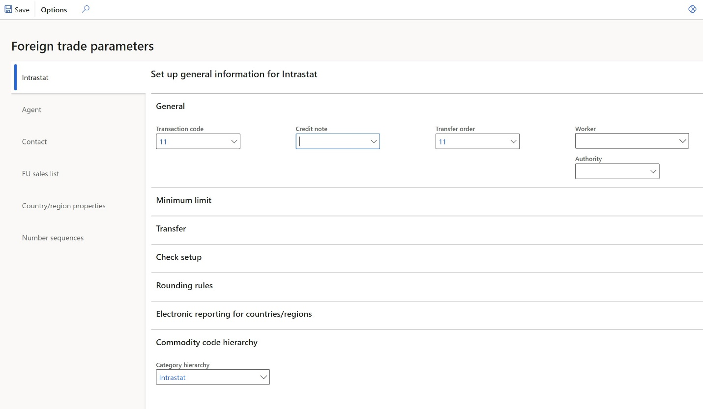

3. Go to **Tax** \> **Setup** \> **Foreign trade** \> [**Compression of Intrastat**](emea-intrastat.md#compressing-rules) to set up Intrastat compression rules. All tax registrations have the same setup for compression rules.

For more information about how to configure Intrastat, see [Intrastat overview](emea-intrastat.md).

#### Set up Intrastat reporting formats

1. Go to **Tax** > **Set up** > **Foreign trade** > **Foreign trade parameters**.
2. On the **Intrastat** tab, on the **Electronic reporting for countries/regions** FastTab, select the Intrastat reporting format for each country of your tax registration.
3. In the **File format mapping** field, select the Electronic reporting (ER) format for Intrastat file export, for example, select **Intrastat (NL)** for Netherlands.
4. In the **Report format mapping** field, select the ER format for printable report layout, for example, select **Intrastat report**.

    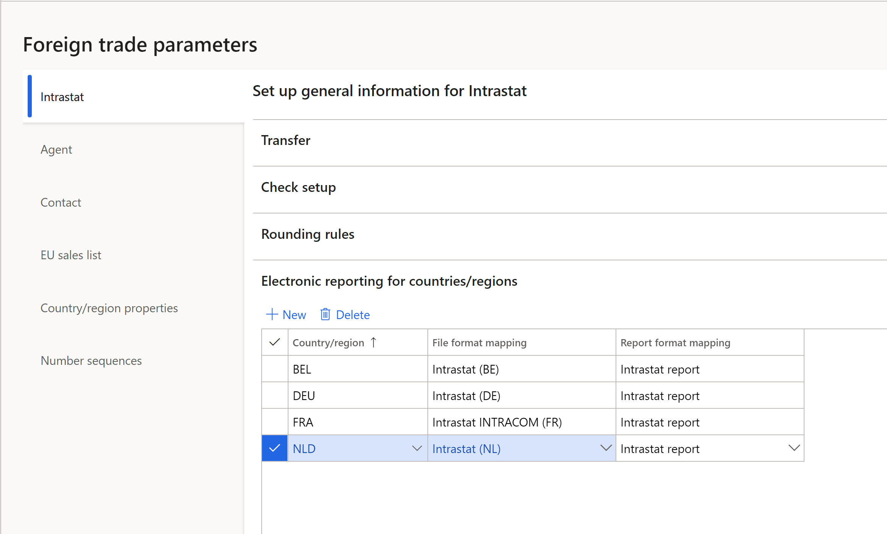

    > [!NOTE]
    > You can select an ER format if the **ISO Country/region codes** field on the **ISO Country/region codes** FastTab is blank in this format.

    The following table shows the earliest ER format versions that you can select the format for.

    | Release | Country | ER format |
    |---------|---------|-----------|
    | 10.0.19 | All | Intrastat model.version.16 |
    | 10.0.19 | Netherlands | Intrastat (NL).version.1.3 |
    | 10.0.20 | France | Intrastat INTRACOM (FR).version.13.5 Intrastat SAISUNIC (FR).version.1.3 |
    | 10.0.20 | United Kingdom (Northern Ireland) | Intrastat (UK).version.1.2 |
    | 10.0.21 | Austria | Intrastat (AT).version.16.3 |
    | 10.0.21 | Germany | INSTAT XML (DE).version.22.9.9 |
    | 10.0.21 | Spain | Intrastat (ES).version.16.7 |
    | 10.0.21 | Sweden | Intrastat (SE).version.16.4 |
    | 10.0.23 | Finland | Intrastat (FI).version.2.3 |
    | 10.0.23 | Denmark | Intrastat (DK).version.25.4 |
    | 10.0.23 | Poland | Intrastat (PL).version.25.5 |
    | 10.0.25 | Belgium | Intrastat (BE).version.2.9 |
    | 10.0.34 | The Czech Republic | Intrastat (CZ).version.24.6 |

For more information, see [Download ER configurations from the Global repository of Configuration service](../../fin-ops-core/dev-itpro/analytics/er-download-configurations-global-repo.md).

### Transfer and report Intrastat

1. Go to **Tax** \> **Declarations** \> **Foreign trade** \> **Intrastat**.
2. Select **Transfer**.
3. In the **Tax registration number** dialog box, select the tax registration number to transfer transactions for, and then select **OK**.

    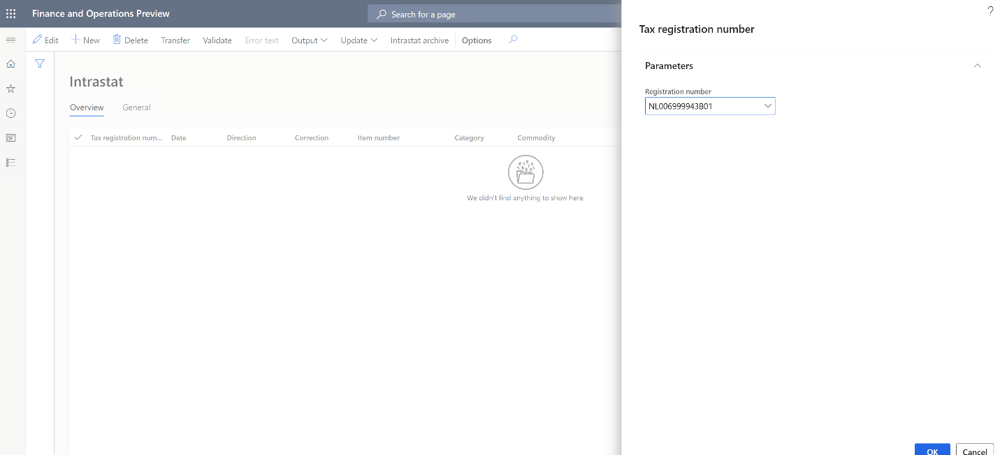

4. In the **Intrastat (Transfer)** dialog box, select the documents to transfer: **Free text invoice**, **Customer invoice**, **Customer packing slips**, **Vendor invoice**, **Vendor product receipts**, **Project invoice**, or **Transfer order**. Then select **OK**.

    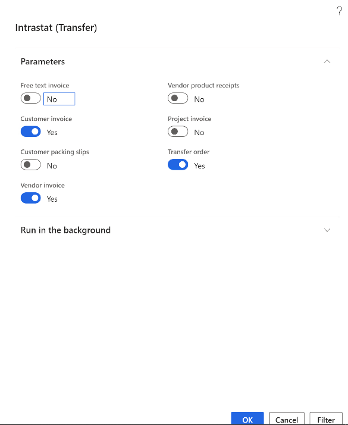

5. Transactions for the selected tax registration and documents are transferred. Review the transactions, and make any adjustments that are required.

    > [!NOTE]
    > In the 10.0.19 and 10.0.20 releases, the Intrastat **Transfer** function has country/region-specific logic that isn't yet covered in the **Intrastat transfer for Multiple Tax ID** feature for the following countries: the Czech Republic, Finland, Germany, Hungary, Italy, Latvia, Lithuania, Poland, and Spain.

6. Select **Output** \> **Report**.
7. In the **Tax registration number** dialog box, select the tax registration number to generate the Intrastat report for, and then select **OK**.
8. In the **Intrastat Report** dialog box, in the **From date** and **To date** fields, define the period to generate the Intrastat report for.
9. Set the **Generate file** option to **Yes** to generate an electronic reporting file. Then, in the **File name** field, enter the name of the output electronic file, if applicable.
10. Set the **Generate report** option to **Yes** to generate a Microsoft Excel report. Then, in the **Report file name** field, enter the name of the output Excel file, if applicable.

    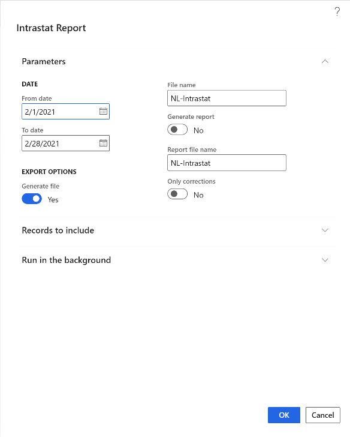

11. The dialog box also contains country/region-specific fields that are required in the country/region-specific Intrastat report. Set these fields as required.
12. Select **OK** to generate the report.

## EU sales list reporting for multiple VAT registrations 

### Set up the EU sales list

#### Set up sales tax codes

1. Go to **Tax** > **Sales tax** > **Sales tax codes**.
2. Create unique sales tax codes for each of your tax registrations.
3. On the **Report setup** FastTab, in the **EU sales list** section, set the **Excluded** option to **Yes** if tax transactions that have a selected sales tax code should **not** be transferred to the EU sales list.
4. In the **Country/region type** section, in the **Country/region type** field, define the tax transaction type for VAT reporting: **EU**, **Domestic**, or **Third country**.

    This setting is mandatory in some countries, such as the United Kingdom.

    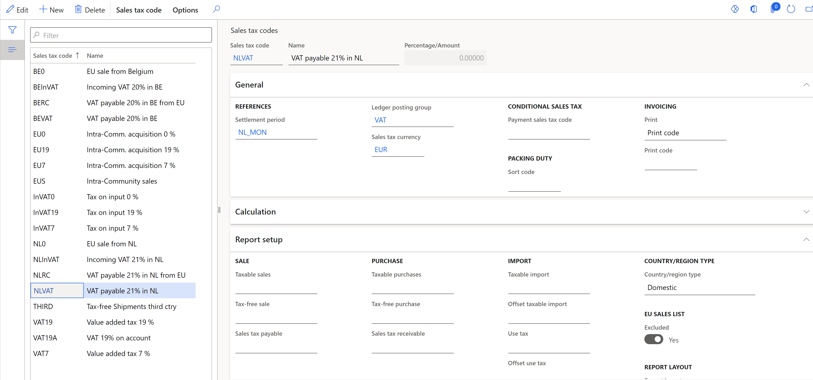

#### Set up item sales tax groups

1. Go to **Tax** > **Sales tax** > **Item sales tax groups**.
2. In the **Reporting type** field, select the reporting type for EU sales list reporting: **Item**, **Service**, or **Investment** (for Belgium).

#### Set up EU sales list parameters

All tax registrations have the same settings for EU sales list parameters.

1. Go to **Tax** > **Setup** > **Foreign trade** > **Foreign trade parameters**.
2. On the **EU sales list** tab, set up the parameters on the **Transfer** and **Rounding rules** FastTabs.

> [!NOTE]
> If one of your tax registrations is in Poland or Hungary (countries that report purchases in addition to sales), set the **Transfer purchases** option to **Yes**.

#### Set up EU sales list reporting formats

1. Go to **Tax** > **Set up** > **Foreign trade** > **Foreign trade parameters**.
2. On the **EU sales list** tab, on the **Electronic reporting for countries/regions** FastTab, select EU sales list reporting formats for each country of your tax registration.
3. In the **File format mapping** field, select the ER format for EU sales list report electronic format. For example, for Netherlands, select **EU Sales list (NL)**.
4. In the **Report format mapping** field, select the ER format for printable report layout. For example, select either **EU sales list by rows report**, or **EU sales list by columns report**.
5. In the **Report cash discount** field, select **Yes** if the selected country/region cash discount must be transferred to the EU sales list. Select **No** if the selected country/region cash discount must not be transferred to EU sales list. Leave the value set to **Default** if the value that's specified in the **Report cash discount** field on **Transfer** FastTab must be applied to the selected country/region.

    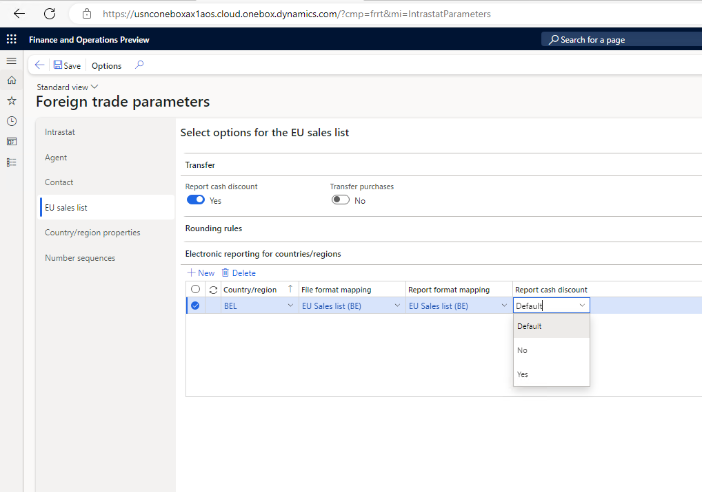

    > [!NOTE]
    > You can select an ER format if the **ISO Country/region codes** field on the **ISO Country/region codes** FastTab is blank in this format.

    The following table shows the earliest ER format versions that you can select the format for.

    | Release | Country | ER format |
    |---------|---------|-----------|
    | 10.0.19 | All | EU Sales list model.version.9 |
    | 10.0.19 | Netherlands | EU Sales list (NL).version.1.10 |
    | 10.0.20 | France | EU Sales list (FR).version.1.2 |
    | 10.0.20 | United Kingdom (Northern Ireland) | EU Sales list XML (UK).version.9.6 EU Sales list TXT (UK).version.9.7 |
    | 10.0.21 | Austria | EU Sales list (AT).version.9.5 |
    | 10.0.21 | Germany | EU Sales list (DE).version.9.5 |
    | 10.0.21 | Spain | EU Sales list (ES).version.9.2 |
    | 10.0.21 | Sweden | EU Sales list (SE).version.13.7 |
    | 10.0.23 | Finland | EU Sales list (FI).version.2.5 |
    | 10.0.23 | Denmark | EU Sales list (DK).version.13.4 |
    | 10.0.24 | Poland | EU Sales list (PL).version.14.7 |
    | 10.0.25 | Belgium | EU Sales list (BE).version.2.3 |
    | 10.0.33 | The Czech Republic | EU Sales list (CZ).version.15.9 |

### Transfer and report the EU sales list

1. Go to **Tax** > **Declarations** > **Foreign trade** > **EU sales list**.
2. Select **Transfer**.
3. In the **Tax registration number** dialog, select the tax registration number to transfer transactions for, and then select **OK**.

    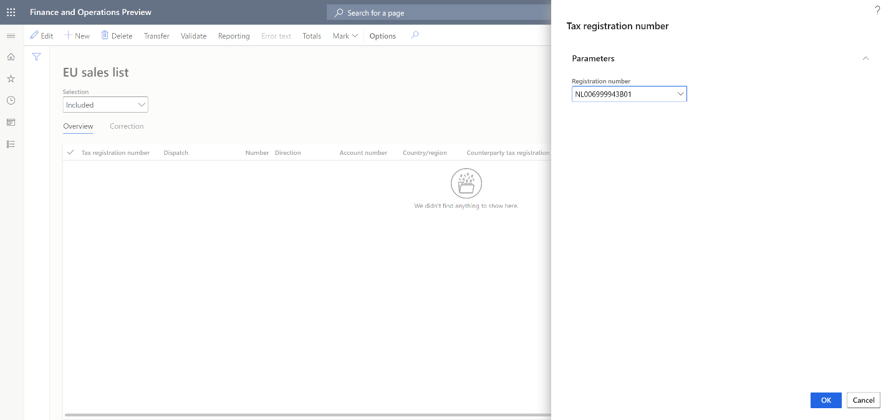

4. In the **Transfer transactions for EU sales list** dialog box, select the documents and reporting types to transfer.

    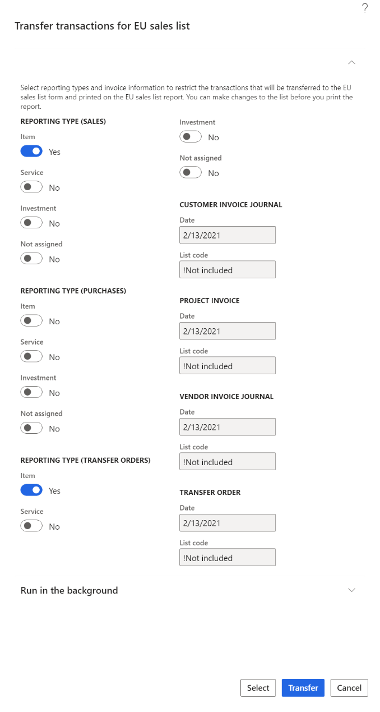

5. Select **Select** to adjust the default filter for transactions that should be transferred, and then select **Transfer**.
6. Transactions for the selected tax registration, documents, and reporting types are transferred. Review the transactions, and make any adjustments that are required.
7. Select **Reporting**.
8. In the **Tax registration number** dialog box, select the tax registration number to generate the EU sales list report for, and then select **OK**.
9. In the **EU reporting** dialog box, in the **From date** field, specify the first date to generate the EU sales list report for.
10. Set the **Generate file** option to **Yes** to generate an electronic reporting file. Then, in the **File name** field, enter the name of the output electronic file.
11. Set the **Generate report** option to **Yes** to generate an Excel report. Then, in the **Report file name** field, enter the name of the output Excel file.

    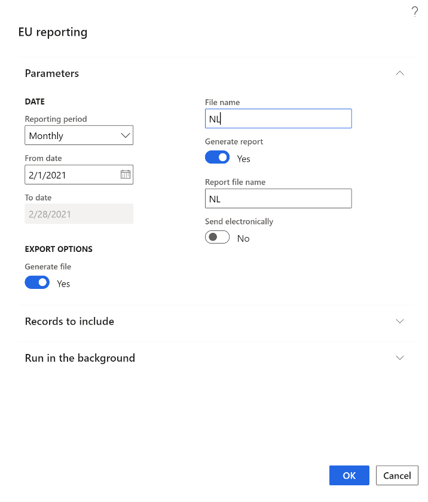

12. The dialog box also contains country-specific fields that are required in the country-specific EU sales list report. Set these fields as required.
13. Select **OK** to generate the report.

## VAT declaration reporting for multiple VAT registrations

### Set up for VAT declaration reporting 

1. Go to **Tax &gt; Set up &gt; Parameters &gt; General ledger parameters**.
2. On the **Sales tax** tab, on the **Electronic reporting for countries/regions** FastTab, select the VAT reporting formats for each country of your tax registration.

    

    > [!NOTE]
    > You can select an ER format if the **ISO Country/region codes** field on the **ISO Country/region codes** FastTab is blank in this format.

    The following table shows the earliest ER format versions that you can select the format for. For more information about how to run VAT declaration for specific country, review the related article.
    
    | Release | Country | ER format | Link to article |
    |---------|---------|-----------|---------------|
    | 10.0.19 | All | Tax declaration model.version.85 Tax declaration model mapping.version.85.138 | |
    | 10.0.13 | The Czech Republic | VAT declaration XML (CZ).version.64.66 VAT Control statement XML (CZ).version.64.66.65 VAT Declaration Excel (CZ).version.64.66.25 | [VAT declaration (Czech Republic)](emea-cze-vat-declaration-tax-declaration-model.md) |
    | 10.0.19 | Netherlands | VAT Declaration XML (NL).version.85.14 VAT Declaration Excel (NL).version.85.14.17| [VAT declaration (Netherlands)](emea-nl-vat-declaration-netherlands.md) |
    | 10.0.20 | France | VAT Declaration Excel (FR).version.85.15 | [VAT declaration (France)](emea-fra-vat-declaration-preview-france.md) |
    | 10.0.21 | United Kingdom | MTD VAT importing model mapping (UK).version.31.36 Tax declaration model mapping.version.95.158 VAT Declaration Excel (UK).version.32.30.16 VAT Declaration JSON (UK).version.32.31 | [Prepare for integration with MRD for VAT](emea-gbr-mtd-vat-integration.md) |
    | 10.0.21 | Sweden | VAT Declaration XML (SE).version.95.11 VAT Declaration Excel (SE).version.95.11.13 | [VAT declaration (Sweden)](emea-swe-vat-declaration-sweden.md) |
    | 10.0.21 | Switzerland | Tax declaration model.version.96 Tax declaration model mapping.version.96.164 VAT Declaration XML (CH).version.96.16 VAT Declaration Excel (CH).version.96.16.9 | [VAT declaration (Switzerland)](emea-che-vat-declaration-switzerland.md) |
    | 10.0.22 | Austria | VAT Declaration XML (AT).version.101.23 VAT Declaration Excel (AT).version.101.23.17 | [VAT declaration (Austria)](emea-aut-vat-declaration-austria.md) |
    | 10.0.23 | Germany | VAT Declaration XML (DE).version.101.16 VAT Declaration Excel (DE).version.101.16.12 | [VAT declaration (Germany)](emea-deu-vat-declaration-germany.md) |
    | 10.0.21 | Norway | Tax declaration model.version.112 Tax declaration model mapping.version.112.192 VAT Declaration XML (NO).version.112.54 VAT Declaration Excel (NO).version.112.54.39 | [VAT return with direct submission to Altinn](emea-nor-vat-return.md) |
    | 10.0.23 | Spain | VAT Declaration TXT(ES).version.101.28 VAT Declaration Excel (ES).version.101.28.17 | [VAT declaration (Spain)](emea-esp-vat-declaration-spain.md) |
    | 10.0.25 | Denmark | VAT Declaration Excel (DK).version.101.8 | [VAT declaration (Denmark)](emea-dnk-vat-declaration-denmark.md) |
    | 10.0.29 | Poland  | Standard Audit File (SAF-T).version.129 Standard Audit File model mapping.version.131.283 JPK-V7M XML format (PL).version.129.221 JPK-V7M Excel format (PL).version.129.221.70 | [VAT declaration (Poland)](emea-pol-vat-declaration.md) |

    > [!NOTE]
    > The VAT declaration of Poland (JPK-V7M) is supported by using the Electronic messaging functionality only. For more information, see [VAT declaration with registers (JPK-V7M, VDEK)](emea-pol-vdek.md).

### Generate a VAT declaration for multiple VAT registrations

1. Go to **Tax** > **Declarations** > **Sales tax** > **Report sales tax for settlement period**.
2. In the **Report sales tax for settlement period** dialog box, in the **Settlement period** field, select a settlement period.
3. In the **From date** field, specify the first date to generate the VAT declaration for.
4. In the **Sales tax payment version** field, select one of the following values:

    - **Original:** Generate a report for sales tax transactions of the original sales tax payment or before the sales tax payment is generated.
    - **Corrections:** Generate a report for sales tax transactions of all subsequent sales tax payments for the period.
    - **Total list:** Generate a report for all sales tax transactions for the period, including the original and all corrections.

    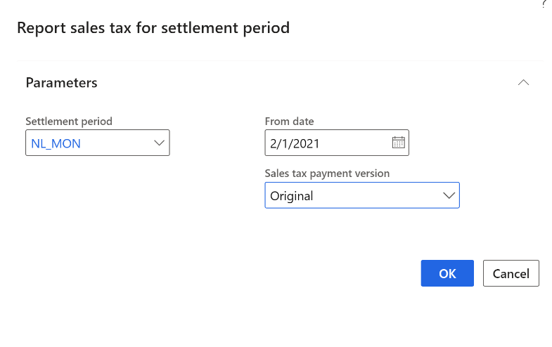

5. Select **OK** to generate the report.

<!--## Known limitations-->

[!INCLUDE[footer-include](../../includes/footer-banner.md)]

