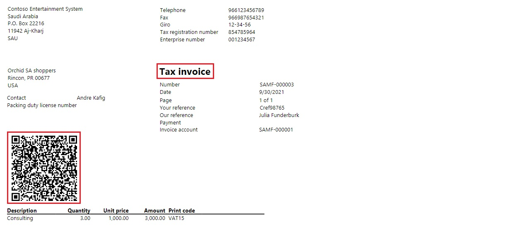

# Customer electronic invoices in Saudi Arabia

[!include [banner](../includes/banner.md)]

According to Saudi Arabian legal requirements, invoices that are issued to customers must be generated in an electronic format. To generate electronic invoices, the following two-part system configuration is required.

- **Electronic invoicing service** configuration. For more information, see [Get started with the Electronic invoicing add-in for Saudi Arabia](e-invoicing-sa-get-started.md).
- **Microsoft Dynamics 365 Finance** configuration, which is covered in this article.

## Prerequisites

- Electronic invoicing service configuration must be completed, and all required parts for Saudi Arabia must be ready to use.
- The primary address of the legal entity must be in Saudi Arabia.
- In the **Feature management** workspace, the **(Saudi Arabia) QR codes in Tax and Simplified invoices** feature must be enabled. For more information, see [Feature management overview](../../fin-ops-core/fin-ops/get-started/feature-management/feature-management-overview.md).

## Configure registration numbers

If the **Enterprise ID (COID)** registration category already exists and has been assigned to a registration type, you can skip this procedure.

1. Go to **Organization administration** \> **Global address book** \> **Registration types** \> **Registration types**.
2. Create a registration type.
3. In the **Country/region** field, select **SAU - Saudi Arabia**.
4. Go to **Organization administration** \> **Global address book** \> **Registration types** \> **Registration categories**.
5. Create a registration category.
6. In the **Registration types** field, select the registration type that you created in step 2.
7. In the **Registration categories** field, select **Enterprise ID (COID)**.

## Configure legal entity data

### Enter a legal entity's address

1. Go to **Organization administration** \> **Organizations** \> **Legal entities**.
2. Select a legal entity, and then, on the **Addresses** FastTab, add a valid primary address for the legal entity.

### Enter a legal entity's tax registration number

1. Go to **Organization administration** \> **Organizations** \> **Legal entities**.
2. Select a legal entity, and then, on the **Tax registration** FastTab, in the **Tax registration number** field, enter a valid tax registration number for the legal entity. This number will be used as the seller's value-added tax (VAT) identifier.

### Enter a legal entity's commercial registration number

1. Go to **Organization administration** \> **Organizations** \> **Legal entities**.
2. Select a legal entity, and then, on the Action Pane, select **Registration IDs**.
3. On the **Registration ID** FastTab, select **Add** to create a registration ID.
4. In the **Registration type** field, select the registration type that you created earlier.
6. In the **Registration number** field, enter a valid registration number for the legal entity. This number will be used as the seller's commercial registration identifier.

## Configure customer data

### Enter a customer's address

1. Go to **Accounts receivable** \> **Customers** \> **All customers**.
2. Select a customer, and then, on the **Addresses** FastTab, add a valid address for the customer.

### Enter a customer's tax registration number

1. Go to **Accounts receivable** \> **Customers** \> **All customers**.
2. Select a customer, and then, on the **Invoice and delivery** FastTab, in the **Tax exempt number** field, enter a valid tax registration number for the customer. This number will be used as the buyer's VAT identifier.

### Enter a customer's registration number

1. Go to **Accounts receivable** \> **Customers** \> **All customers**.
2. Select a customer, and then, on the Action Pane, on the **Customer** tab, in the **Registration** group, select **Registration IDs**.
3. On the **Registration ID** FastTab, select **Add** to create a registration ID.
5. In the **Registration type** field, select the registration type that you created earlier.
6. In the **Registration number** field, enter a valid registration number for the customer. This number will be used as the buyer's commercial registration identifier.

## Configure sales tax codes

1. Go to **Tax** \> **Indirect taxes** \> **Sales tax** \> **Sales tax codes**.
2. Select a sales tax code, and then, on the Action Pane, on the **Sales tax code** tab, in the **Sales tax code** group, select **External codes**.
3. In the **Overview** section, create a line for the selected unit. In the **External code** field, enter the sales tax code you selected in step 2.
4. In the **Value** section, in the **Value** field, enter an external code to use for the selected sales tax code, according to the official codification.

## Configure unit codes

1. Go to **Organization administration** \> **Setup** \> **Units** \> **Units**.
2. Select a unit, and then, on the Action Pane, select **External codes**.
3. In the **Overview** section, create a line for the selected unit.
4. In the **Value** section, in the **Value** field, enter an external code to use for the selected unit, according to the official codification.

## Enter product codes

1. Go to **Product information management** \> **Products** \> **Released products**.
2. Select a product, and then, on the Action Pane, on the **Manage inventory** tab, in the **Warehouse** group, select **GTIN codes**.
3. Enter the Global Trade Item Number (GTIN) for the selected product. This number will be used as a standard product identifier.
4. On the Action Pane, on the **Sell** tab, in the **Related information** group, select **External item description**.
5. In the **External item number** field, enter a customer-specific code for the selected product. This code will be used as the buyer's product identifier.

> [!NOTE]
> By default, internal item numbers that are defined in the system will be used as the seller's product identifiers.

## Define the invoice type

You can define an invoice's type as **Tax invoice** or **Simplified invoice**.

1. Go to **Accounts receivable** \> **Orders** \> **All sales orders**.
2. Create a new sales order, or select an open order.
3. On the order header, on the **General** FastTab, in the **Status** group, in the **Invoice type** field, select the required value.

Similarly, you can define the invoice type for free text invoices.

1. Go to **Accounts receivable** \> **Invoices** \> **All free text invoices**.
2. Create a new free text invoice, or select an open free text invoice.
3. On the invoice header, on the **General** FastTab, in the **Invoice** group, in the **Invoice type** field, select the required value.

## Define default invoice types for customers

You can define an invoice type at the customer record level. That invoice type is then used by default for new sales orders and free text invoices.

1. Go to **Accounts receivable** \> **Customers** \> **All customers**.
2. Select a customer.
3. On the **Invoice and delivery** FastTab, in the **Invoice** group, in the **Invoice type** field, select the required value.

> [!NOTE]
> If no invoice type is defined in a customer record, the **Tax invoice** type is used by default for new sales orders and free text invoices.

## Configure printable invoice layouts

### Enable specific invoice layouts for Saudi Arabia

1. Go to **Accounts receivable** \> **Setup** \> **Forms** \> **Form setup**.
2. Select **Print management**.
3. Select the **Customer invoice** report, and then, in the **Report format** field, refer to the **SalesInvoice.Report_SA** layout.
4. Select the **Free text invoice** report, and then, in the **Report format** field, refer to the **FreeTextInvoice.Report_SA** layout.

### Enable VAT numbers to be printed on invoices

1. Go to **Accounts receivable** \> **Setup** \> **Forms** \> **Form setup**.
2. In the **Invoice** section, turn on the **Print tax exempt number on invoice** option.
3. In the **Free text invoice** section, turn on the **Print tax exempt number on invoice** option.
4. Go to **Project management and accounting** \> **Setup** \> **Forms** \> **Form setup**.
5. In the **Invoice** section, turn on the **Print tax exempt number on invoice** option.

## Print invoices

When you print customer invoices that are based on sales orders or free text invoices, the title of an invoice reflects the type: **Tax invoice** or **Simplified invoice**. Additionally, QR codes are printed.

## Issue electronic invoices

When you've completed all the required configuration steps, you can generate electronic invoices for posted invoices. For more information about how to generate electronic invoices, see [Issue electronic invoices in Finance and Supply chain management](e-invoicing-issuing-electronic-invoices-finance-supply-chain-management.md).

## Related topics

- [Get started with the Electronic invoicing add-in for Saudi Arabia](e-invoicing-sa-get-started.md)

[!INCLUDE[footer-include](../../includes/footer-banner.md)]
