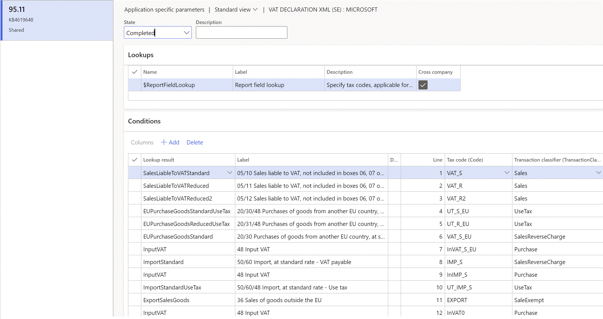
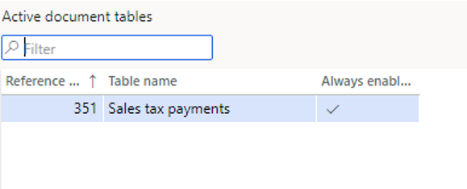

# VAT declaration (Sweden)

[!include [banner](../includes/banner.md)]

This article describes how to set up and generate a value-added tax (VAT) declaration for Sweden. You can generate a preview VAT declaration in Microsoft Excel. You can also generate a VAT declaration in [Document Type Definition (DTD) format](https://www.skatteverket.se/omoss/samverkan/forprogramkonstruktorer/dtdfil.4.65fc817e1077c25b83280000.html?q=dtd) and upload it to the [Skatteverket offical portal](https://www.skatteverket.se/foretag/moms/deklareramoms.4.7459477810df5bccdd480006935.html).

To automatically generate the report, you must first create enough sales tax codes to keep a separate VAT accounting for each box on the VAT declaration. Additionally, in the application-specific parameters of the Electronic reporting (ER) format for the VAT declaration, you must associate sales tax codes with the lookup result of the lookups for the boxes on the VAT declaration.

For Sweden, you must configure one lookup: **Report field lookup**. For more information about how to set up application-specific parameters, see the [Set up application-specific parameters for VAT declaration fields](#set-up-application-specific-parameters-for-vat-declaration-boxes) section later in this article.

In the following table, the **Lookup result** column shows the lookup result that is preconfigured for a specific VAT declaration row in the VAT declaration format. Use this information to correctly associate sales tax codes with the lookup result and then with the row of the VAT declaration.

## VAT declaration overview

The VAT declaration in Sweden contains the following information.

**Section A. Sales or Self-supply liable to VAT**

| Line | Description                                             | XML file element | Lookup result                                                                                                    |
|------|---------------------------------------------------------|------------------|------------------------------------------------------------------------------------------------------------------|
| 05   | Sales liable to VAT, not included in boxes 06, 07 or 08 | ForsMomsEjAnnan  | SalesLiableToVATStandard (05/10) SalesLiableToVATReduced (05/11) SalesLiableToVATReduced2 (05/12)                |
| 06   | Self-supply liable to VAT                               | UttagMoms        | SelfSupplyLiableToVATStandard (06/10) SelfSupplyLiableToVATReduced (06/11)  SelfSupplyLiableToVATReduced2 (06/12) |
| 07   | Tax assessment basis for profit margin taxation         | UlagMargbesk     | TaxBaseProfitMarginStandard (07/10) TaxBaseProfitMarginReduced (07/11)  TaxBaseProfitMarginReduced2 (07/12)       |
| 08   | Rental income – voluntary tax liability                 | HyrinkomstFriv   | RentalIncomeStandard (08/10) RentalIncomeReduced (08/11) RentalIncomeReduced2 (08/12)                            |

**Section B. Output VAT on sales in boxes 05 – 08**

| Line | Description     | XML file element | Lookup result                                                                                                                           |
|------|-----------------|------------------|-----------------------------------------------------------------------------------------------------------------------------------------|
| 10   | Output VAT 25 % | MomsUtgHog       | SalesLiableToVATStandard (05/10) SelfSupplyLiableToVATStandard (06/10) TaxBaseProfitMarginStandard (07/10)  RentalIncomeStandard (08/10) |
| 11   | Output VAT 12 % | MomsUtgMedel     | SalesLiableToVATReduced (05/11) SelfSupplyLiableToVATReduced (06/11) TaxBaseProfitMarginReduced (07/11) RentalIncomeReduced (08/11)     |
| 12   | Output VAT 6 %  | MomsUtgLag       | SalesLiableToVATReduced2 (05/12) SelfSupplyLiableToVATReduced2 (06/12) TaxBaseProfitMarginReduced2 (07/12)  RentalIncomeReduced2 (08/12) |

**Section C. Purchases liable to VAT**

| Line | Description                                                        | XML file element   | Lookup result                                                                                                                                                                                                                                                                        |
|------|--------------------------------------------------------------------|--------------------|--------------------------------------------------------------------------------------------------------------------------------------------------------------------------------------------------------------------------------------------------------------------------------------|
| 20   | Purchases of goods from another EU country/region                         | InkopVaruAnnatEg   | EUPurchaseGoodsStandard (20/30) EUPurchaseGoodsReduced (20/31)  EUPurchaseGoodsReduced2 (20/32) EUPurchaseGoodsStandardUseTax (20/30/48) EUPurchaseGoodsReducedUseTax (20/31/48) EUPurchaseGoodsReduced2UseTax (20/32/48)                                                             |
| 21   | Purchases of services from another EU country/region as per the Main Rule | InkopTjanstAnnatEg | EUPurchaseServicesStandard (21/30) EUPurchaseServicesReduced (21/31)  EUPurchaseServicesReduced2 (21/32) EUPurchaseServicesStandardUseTax (21/30/48) EUPurchaseServicesReducedUseTax (21/31/48) EUPurchaseServicesReduced2UseTax (21/32/48)                                           |
| 22   | Purchases of services from a country/region outside the EU                | InkopTjanstUtomEg  | PurchaseServicesOutsideEUStandard (22/30) PurchaseServicesOutsideEUReduced (22/31) PurchaseServicesOutsideEUReduced2 (22/32) PurchaseServicesOutsideEUStandardUseTax (22/30/48) PurchaseServicesOutsideEUReducedUseTax (22/31/48)  PurchaseServicesOutsideEUReduced2UseTax (22/32/48) |
| 23   | Purchases of goods in Sweden that the buyer is liable for          | InkopVaruSverige   | PurchaseGoodsDomesticRCStandard (23/30) PurchaseGoodsDomesticRCReduced (23/31) PurchaseGoodsDomesticRCReduced2 (23/32) PurchaseGoodsDomesticRCStandardUseTax (23/30/48) PurchaseGoodsDomesticRCReducedUseTax (23/31/48)  PurchaseGoodsDomesticRCReduced2UseTax (23/32/48)             |
| 24   | Other purchases of services                                        | InkopTjanstSverige | OtherPurchaseGoodsRCStandard (24/30) OtherPurchaseGoodsRCReduced (24/31)  OtherPurchaseGoodsRCReduced2 (24/32) OtherPurchaseGoodsRCStandardUseTax (24/30/48) OtherPurchaseGoodsRCReducedUseTax (24/31/48) OtherPurchaseGoodsRCReduced2UseTax (24/32/48)                               |

**Section D. Output VAT on purchases in boxes 20 – 24**

| Line | Description     | XML file element  | Lookup result                                                                                                                                                                                                                                                                                                                                                                                                                    |
|------|-----------------|-------------------|----------------------------------------------------------------------------------------------------------------------------------------------------------------------------------------------------------------------------------------------------------------------------------------------------------------------------------------------------------------------------------------------------------------------------------|
| 30   | Output VAT 25 % | MomsInkopUtgHog   | EUPurchaseGoodsStandard (20/30) EUPurchaseGoodsStandardUseTax (20/30/48) EUPurchaseServicesStandard (21/30)  EUPurchaseServicesStandardUseTax (21/30/48) PurchaseServicesOutsideEUStandard (22/30) PurchaseServicesOutsideEUStandardUseTax (22/30/48)  PurchaseGoodsDomesticRCStandard (23/30) PurchaseGoodsDomesticRCStandardUseTax (23/30/48) OtherPurchaseGoodsRCStandard (24/30) OtherPurchaseGoodsRCStandardUseTax (24/30/48) |
| 31   | Output VAT 12 % | MomsInkopUtgMedel | EUPurchaseGoodsReduced (20/31) EUPurchaseGoodsReducedUseTax (20/31/48) EUPurchaseServicesReduced (21/31)  EUPurchaseServicesReducedUseTax (21/31/48) PurchaseServicesOutsideEUReduced (22/31) PurchaseServicesOutsideEUReducedUseTax (22/31/48) PurchaseGoodsDomesticRCReduced (23/31) PurchaseGoodsDomesticRCReducedUseTax (23/31/48) OtherPurchaseGoodsRCReduced (24/31) OtherPurchaseGoodsRCReducedUseTax (24/31/48)           |
| 32   | Output VAT 6 %  | MomsInkopUtgLag   | EUPurchaseGoodsReduced2 (20/32) EUPurchaseGoodsReduced2UseTax (20/32/48) EUPurchaseServicesReduced2 (21/32)  EUPurchaseServicesReduced2UseTax (21/32/48) PurchaseServicesOutsideEUReduced2 (22/32) PurchaseServicesOutsideEUReduced2UseTax (22/32/48)  PurchaseGoodsDomesticRCReduced2 (23/32) PurchaseGoodsDomesticRCReduced2UseTax (23/32/48) OtherPurchaseGoodsRCReduced2 (24/32) OtherPurchaseGoodsRCReduced2UseTax (24/32/48) |

**Section H. Import**

| Line | Description             | XML file element | Lookup result                                                                                                                                                      |
|------|-------------------------|------------------|--------------------------------------------------------------------------------------------------------------------------------------------------------------------|
| 50   | Taxable basis on import | MomsUlagImport   | ImportStandard (50/60) ImportReduced (50/61) ImportReduced2 (50/62) ImportStandardUseTax (50/60/48) ImportReducedUseTax (50/61/48) ImportReduced2UseTax (50/62/48) |

**Section I. Output VAT on import in box 50**

| Line | Description     | XML file element   | Lookup result                                          |
|------|-----------------|--------------------|--------------------------------------------------------|
| 60   | Output VAT 25 % | MomsImportUtgHog   | ImportStandard (50/60) ImportStandardUseTax (50/60/48) |
| 61   | Output VAT 12 % | MomsImportUtgMedel | ImportReduced (50/61) ImportReducedUseTax (50/61/48)   |
| 62   | Output VAT 6 %  | MomsImportUtgLag   | ImportReduced2 (50/62) ImportReduced2UseTax (50/62/48) |

**Section E. Sales etc. exempt from VAT**

| Line | Description                                                             | XML file element      | Lookup result                          |
|------|-------------------------------------------------------------------------|-----------------------|----------------------------------------|
| 35   | Sales of goods to another EU country/region                             | ForsVaruAnnatEg       | EUSalesGoods                           |
| 36   | Sales of goods outside the EU                                           | ForsVaruUtomEg        | ExportSalesGoods                       |
| 37   | Intermediary purchases of goods in case of triangulation                | InkopVaruMellan3p     | IntermediaryPurchaseGoodsTriangulation |
| 38   | Intermediary sales of goods in case of triangulation                    | ForsVaruMellan3p      | IntermediarySalesGoodsTriangulation    |
| 39   | Sales of services to traders in another EU country/region as per the main rule | ForsTjSkskAnnatEg     | EUSalesServices                        |
| 40   | Other sales of services supplied outside of Sweden                      | ForsTjOvrUtomEg       | SalesServicesOutsideEU                 |
| 41   | Sales where the purchaser is liable to VAT in Sweden                    | ForsKopareSkskSverige | SalesGoodsDomesticRC                   |
| 42   | Other sales etc.                                                        | ForsOvrigt            | OtherSales                             |

**Section F. Input VAT**

| Line | Description         | DTD file element | Lookup result                                                                                                                                                                                                                                                                                                                                                                                                                                                                                                                                                                                                                                                                                                                                                                                                           |
|------|---------------------|------------------|-------------------------------------------------------------------------------------------------------------------------------------------------------------------------------------------------------------------------------------------------------------------------------------------------------------------------------------------------------------------------------------------------------------------------------------------------------------------------------------------------------------------------------------------------------------------------------------------------------------------------------------------------------------------------------------------------------------------------------------------------------------------------------------------------------------------------|
| 48   | Input VAT to deduct | MomsIngAvdr      | InputVAT EUPurchaseGoodsStandardUseTax (20/30/48) EUPurchaseGoodsReducedUseTax (20/31/48) EUPurchaseGoodsReduced2UseTax (20/32/48) EUPurchaseServicesStandardUseTax (21/30/48) EUPurchaseServicesReducedUseTax (21/31/48) EUPurchaseServicesReduced2UseTax (21/32/48)  PurchaseServicesOutsideEUStandardUseTax (22/30/48) PurchaseServicesOutsideEUReducedUseTax (22/31/48) PurchaseServicesOutsideEUReduced2UseTax (22/32/48)  PurchaseGoodsDomesticRCStandardUseTax (23/30/48) PurchaseGoodsDomesticRCReducedUseTax (23/31/48) PurchaseGoodsDomesticRCReduced2UseTax (23/32/48)  OtherPurchaseGoodsRCStandardUseTax (24/30/48) OtherPurchaseGoodsRCReducedUseTax (24/31/48) OtherPurchaseGoodsRCReduced2UseTax (24/32/48) ImportStandardUseTax (50/60/48) ImportReducedUseTax (50/61/48) ImportReduced2UseTax (50/62/48) |

### Purchase reverse charge VAT

If you configure sales tax codes to post incoming reverse charge VAT by using use tax, associate your sales tax codes with the lookup result of **Report field lookup** that contains "UseTax" in the name.

Alternatively, you can configure two separate sales tax codes: one for VAT due and one for VAT deduction. Then associate each code with the corresponding lookup results of **Report field lookup**.

For example, for purchases of goods at a standard rate in Sweden that the buyer is liable for, you configure sales tax code **UT_S_RC** with use tax, and associate it with the **PurchaseGoodsDomesticRCStandardUseTax** lookup result of **Report field lookup**. In this case, amounts that use the **UT_S_RC** sales tax code are reflected in boxes 23 (tax base), 30 (tax payable), and 48 (tax deduction).

Alternatively, you configure two sales tax codes:

   - **VAT_S_RC**, which has a tax rate value of -25 percent
   - **InVAT_S_RC**, which has a tax rate value of 25 percent

You then associate the codes with lookup results in the following way:

   - Associate **VAT_S_RC** with the **PurchaseGoodsDomesticRCStandard** lookup result of **Report field lookup**.
   - Associate **InVAT_S_RC** with the **InputVAT** lookup result of **Report field lookup**.

In this case, amounts that use the **VAT_S_RC** sales tax code are reflected in boxes 23 (tax base) and 30 (tax payable). Amounts that use the **InVAT_S_RC** sales tax code are reflected on line 48.

For more information about how to configure reverse charge VAT, see [Reverse charges](emea-reverse-charge.md).

## Set up VAT declaration for Sweden

### Import ER configurations

Open the **Electronic reporting** workspace, and import the following versions or later version of these ER formats:

   - VAT Declaration XML (SE) version 95.11
   - VAT Declaration Excel (SE) version 95.11.13

For more information about how to import ER formats, see [Download ER configurations from the Global repository of Configuration service](../../fin-ops-core/dev-itpro/analytics/er-download-configurations-global-repo.md).

### Set up application-specific parameters for VAT declaration boxes

To automatically generate a VAT declaration, associate sales tax codes in the application and lookup results in the ER configuration.

> [!NOTE]
> We recommend that you enable the feature, **Use application specific parameters from previous versions of ER formats** in the **Feature management** workspace. When this feature is enabled, parameters that are configured for the earlier version of an ER format automatically become applicable for the later version of the same format. If this feature is not enabled, you must configure application-specific parameters explicitly for each format version. The **Use application specific parameters from previous versions of ER formats** feature is available in the **Feature management** workspace starting in Finance version 10.0.23. For more information about how to set up the parameters of an ER format for each legal entity, see [Set up the parameters of an ER format per legal entity](../../fin-ops-core/dev-itpro/analytics/er-app-specific-parameters-set-up.md).

1. Go to **Workspaces** > **Electronic reporting**, and select **Reporting configurations**.
2. Select the **VAT declaration XML (SE)** configuration, and then select **Configurations** > **Application specific parameters setup**.
3. On the **Conditions** FastTab, associate the sales tax codes and report fields.

    > [!NOTE]
    >  Be sure to associate all sales tax codes with lookup results. If any sales tax codes should not generate values in VAT declaration, associate them with the **Other** lookup result.
    >  
    >  If you create enough sales tax codes to generate VAT declaration boxes based on assosiation of sales tax code only, select in the column **Transaction classifier** the value **Not blank**. Alternatively if you use the same sales tax code for different transaction types, select value in the column **Transaction classifier**. For example, if you use the same sales tax code for sales and purchases, you should have at least four lines for the same sales tax code with **Transaction classifier** values: **Sales**, **SalesCreditNote**, **Purchase**, **PurchaseCreditNote**.

      

4. On the Action Pane, select **Export** to export the settings in an XML file. Then close the page.
5. Select the **VAT declaration Excel (SE)** configuration, and then select **Configurations** > **Application specific parameters setup**.
6. Select **Import**, and select the file that you exported earlier.

    > [!NOTE]
    > When you create a new sales tax code, adjust the settings of application-specific parameters according to the lookup result for that new sales tax code.

    When you import a new version of an ER configuration, import the settings of application-specific parameters into that new version.

### Set up the VAT reporting format

1. In the **Feature management** workspace, enable the **VAT statement format reports** feature.
2. Go to **General ledger** > **Setup** > **General ledger parameters**.
3. On the **Sales tax** tab, on the **Tax options** FastTab, in the **VAT statement format mapping** field, select the **VAT declaration Excel (SE)** ER format.

   This format will be printed when you run the **Report sales tax for settlement period** report and also when you select **Print** on the **Sales tax payments** page.

4. If you must report the corrections, in the **Special report** section, set **Include corrections** to **Yes**.
5. On the **Tax authorities** page, select the tax authority, and in the **Report layout** field, select **Default**.

If you're configuring the VAT declaration in a legal entity where there are [multiple VAT registrations](emea-reporting-for-multiple-vat-registrations.md), follow these steps.

1. Go to **General ledger** > **Setup** > **General ledger parameters**.
2. On the **Sales tax** tab, on the **Electronic reporting for countries/regions** FastTab, on the line for **SWE**, select the **VAT Declaration Excel (SE)** ER format.

### Activate the capability to add notes to the VAT declaration XML (SE) report

1. Go to **Organization administration** > **Document management** > **Active document tables**.
2. Add a line, and then, in the reference grid, select the **Sales tax payments** table.
3. In the **Always enabled** column, select the checkbox.

    

## Settle and post sales tax and preview the VAT declaration in Excel

### Preview the VAT declaration in Excel from the Report sales tax for settlement period periodic task

1. Go to **Tax** > **Periodic tasks** > **Declarations** > **Sales tax** > **Report sales tax for settlement period**.
2. Set the following fields.

    <table>
    <tbody>
    <tr>
    <td>
    
<strong>Field</strong>

    </td>
    <td>
    
<strong>Description</strong>

    </td>
    </tr>
    <tr>
    <td>
    
Settlement period

    </td>
    <td>
    
Select the settlement period.

    </td>
    </tr>
    <tr>
    <td>
    
Sales tax payment version

    </td>
    <td>
    
Select one of the following values:

    
&middot;&nbsp;&nbsp;&nbsp;&nbsp;&nbsp;&nbsp;&nbsp; <strong>Original</strong> &ndash; Generate a report for sales tax transactions of the original sales tax payment or before the sales tax payment is generated.

    
&middot;&nbsp;&nbsp;&nbsp;&nbsp;&nbsp;&nbsp;&nbsp; <strong>Corrections</strong> &ndash; Generate a report for sales tax transactions of all the subsequent sales tax payments for the period.

    
&middot;&nbsp;&nbsp;&nbsp;&nbsp;&nbsp;&nbsp;&nbsp; <strong>Total list</strong> &ndash; Generate a report for all sales tax transactions for the period, including the original and all corrections.

    </td>
    </tr>
    <tr>
    <td>
    
From date

    </td>
    <td>
    
Select the start date of the reporting period.

    </td>
    </tr>
    </tbody>
    </table>

3. Select **OK**, and review the Excel report.

### Settle and post sales tax

1. Go to **Tax** > **Periodic tasks** > **Declarations** > **Sales tax** > **Settle and post sales tax**.
2. Set the following fields.

    <table>
    <tbody>
    <tr>
    <td>
    
<strong>Field</strong>

    </td>
    <td>
    
<strong>Description</strong>

    </td>
    </tr>
    <tr>
    <td>
    
Settlement period

    </td>
    <td>
    
Select the settlement period.

    </td>
    </tr>
    <tr>
    <td>
    
Sales tax payment version

    </td>
    <td>
    
Select one of the following values:

    
&middot;&nbsp;&nbsp;&nbsp;&nbsp;&nbsp;&nbsp;&nbsp; <strong>Original</strong> &ndash; Generate the original sales tax payment for the settlement period.

    
&middot;&nbsp;&nbsp;&nbsp;&nbsp;&nbsp;&nbsp;&nbsp; <strong>Latest corrections</strong> &ndash; Generate a correction sales tax payment after the original sales tax payment for the settlement period was created.

    </td>
    </tr>
    <tr>
    <td>
    
From date

    </td>
    <td>
    
Select the first date of the reporting period.

    </td>
    </tr>
    </tbody>
    </table>

3. Select **OK**.

### Add notes to the sales tax payment

1. Go to **Tax** > **Inquiries and reports** > **Sales tax inquiries** > **Sales tax payments**.
2. Select the sales tax payment line, and then select the **Attachments** button (paper clip symbol) in the upper-right corner of the page.
3. Add a new note that should be exported to the VAT declaration XML (SE) report.

### Preview the VAT declaration in Excel from a sales tax payment

1. Go to **Tax** > **Inquiries and reports** > **Sales tax inquiries** > **Sales tax payments**, and select a sales tax payment line.
2. Select **Print report**, and review the Excel file that is generated for the selected sales tax payment line.

    > [!NOTE]
    > The report is generated only for the selected line of the sales tax payment. If you must generate, for example, a corrective declaration that contains all corrections for the period, or a replacement declaration that contains original data and all corrections, use the **Report sales tax for settlement period** periodic task.

## Generate a VAT declaration from electronic messages

If you use electronic messages to generate the report, you can generate the report in XML format. You can also collect tax data from multiple legal entities. For more information, see the [Run a VAT declaration for multiple legal entities](#run-a-vat-declaration-for-multiple-legal-entities) section later in this article.

### Set up electronic messages

#### Download and import the Data management package that includes example settings for electronic messages

The data package that includes example settings contains electronic message settings that are used to generate the VAT declaration for Sweden. You can extend these settings or create your own. For more information about how to work with electronic messaging and create your own settings, see [Electronic messaging](../general-ledger/electronic-messaging.md).

1. In [LCS](https://lcs.dynamics.com/v2), in the Shared asset library, select **Data package** as the asset type, and then download the **SE VAT declaration EM package** package. The downloaded file is named **EM VAT declaration EM package.zip**.
2. In Finance, in the **Data management** workspace, select **Import**.
3. On the **Import** FastTab, in the **Group name** field, enter a name for the job.
4. On the **Selected entities** FastTab, select **Add file**.
5. In the **Add file** dialog box, make sure that the **Source data format** field is set to **Package**, select **Upload and add**, and then select the zip file that you downloaded earlier.
6. Select **Close**.
7. After the data entities are uploaded, on the Action Pane, select **Import**.
8. Go to **Tax** > **Inquiries and reports** > **Electronic messages** > **Electronic messages**, and validate the electronic message processing that you imported (**SE VAT declaration EM package**).

#### Configure electronic messages

1. Go to **Tax** > **Setup** > **Electronic messages** > **Populate records actions**.
2. Select the **SE Populate VAT return records** line, and then select **Edit query**.
3. Use the filter to specify the sales tax settlement period to include in the report.
4. If you must report tax transactions from other settlement periods in a different declaration, create a new **Populate records** action, and select the appropriate settlement periods.

### Generate a VAT declaration from electronic messages

The following procedure applies to the example electronic message processing that you imported earlier from the LCS Shared asset library (**SE VAT declaration EM package**).

1. Go to **Tax** > **Inquiries and reports** > **Electronic messages** > **Electronic messages**.
2. In the left pane, select **SE VAT declaration**.
3. On the **Messages** FastTab, select **New**, and then, in the **Run processing** dialog box, select **OK**.
4. Select the message line that is created, enter a description, and then specify the start and end dates for the declaration period.

    > [!NOTE] 
    > Steps 5 through 7 are optional.

5. Optional: On the **Messages** FastTab, select **Collect data**, and then select **OK**. Sales tax payments that were generated earlier are added to the message. For more information, see the [Settle and post sales tax](#settle-and-post-sales-tax) section earlier in this article. If you skip this step, you can still generate a VAT declaration by using the **Tax declaration version** field in the **Electronic report parameters** dialog box.
6. Optional: On the **Message items** FastTab, review the sales tax payments that are transferred for processing. By default, all sales tax payments of the selected period that weren't included in any other message of the same processing are included.
7. Optional: Select **Original document** to review the sales tax payments, or select **Delete** to exclude sales tax payments from processing. If you skip this step, you can still generate a VAT declaration by using the **Tax declaration version** field in the **Electronic report parameters** dialog box.
8. On the **Messages** FastTab, select **Update status**.
9. In the **Update status** dialog box, select the **Ready to generate** action, and then select **OK**. Verify that the message status is changed to **Ready to generate**.
10. Select **Generate report**.
11. To preview the VAT declaration amounts, in the **Run processing** dialog box, select **Preview report**, and then select **OK**.
12. In the **Electronic reporting parameters** dialog box, set the following fields, and then select **OK**.

    <table>
    <tbody>
    <tr>
    <td>
    
<strong>Field</strong>

    </td>
    <td>
    
<strong>Description</strong>

    </td>
    </tr>
    <tr>
    <td>
    
Settlement period

    </td>
    <td>
    
Select the settlement period.

    
If you selected <strong>Collect data</strong> in step 5, you can disregard this field. The report will be generated for the sales tax transactions that are included in the collected sales tax payments.

    </td>
    </tr>
    <tr>
    <td>
    
Tax declaration version

    </td>
    <td>
    
Select one of the following values:

    
&middot;&nbsp;&nbsp;&nbsp;&nbsp;&nbsp;&nbsp;&nbsp; <strong>Original</strong> &ndash; Generate a report for sales tax transactions of the original sales tax payment or before the sales tax payment is generated.

    
&middot;&nbsp;&nbsp;&nbsp;&nbsp;&nbsp;&nbsp;&nbsp; <strong>Corrections</strong> &ndash; Generate a report for sales tax transactions of all the subsequent sales tax payments for the period.

    
&middot;&nbsp;&nbsp;&nbsp;&nbsp;&nbsp;&nbsp;&nbsp; <strong>Total list</strong> &ndash; Generate a report for all sales tax transactions for the period, including the original and all corrections.

    
If you selected <strong>Collect data</strong> in step 5, you can disregard this field. The report will be generated for the sales tax transactions that are included in the collected sales tax payments.

    </td>
    </tr>
    </tbody>
    </table>

13. Select the **Attachments** button (paper clip symbol) in the upper-right corner of the page, and then select **Open** to open the Excel file. Review the amounts in the Excel document.
14. Select **Generate report**.
15. To generate a report in XML format, in the **Run processing** dialog box, select **Generate report**, and then select **OK**.
16. Select the **Attachments** button (paper clip symbol) in the upper-right corner of the page, and download the electronic file that was generated. You should manually upload this file to the government portal.
    
    > [!NOTE]
    > You may need to manually add the following line to the generated file before you upload the file to the government portal. It should be the second line in the file: 
    >
    >  <!DOCTYPE eSKDUpload PUBLIC "-//Skatteverket, Sweden//DTD Skatteverket eSKDUpload-DTD Version 6.0//SV" "https://www1.skatteverket.se/demoeskd/eSKDUpload_6p0.dtd">
    

## Run a VAT declaration for multiple legal entities

To use the formats to report the VAT declaration for a group of legal entities, you must first set up the application-specific parameters of the ER formats for sales tax codes from all required legal entities.

### Set up electronic messages to collect tax data from multiple legal entities

Follow these steps to set up electronic messages to collect data from multiple legal entities.

1. Go to **Workspaces** > **Feature management**.
2. Find and select the **Cross-company queries for the populate records actions** feature in the list, and then select **Enable now**.
3. Go to **Tax** > **Setup** > **Electronic messages** > **Populate records actions**.
4. On the **Populate records action** page, select the **SE Populate VAT return records** line.

   In the **Datasources setup** grid, a new **Company** field is available. For existing records, this field shows the identifier of the current legal entity.

5. In the **Datasources setup** grid, add a line for each additional legal entity that must be included in reporting. For each new line, set the following fields.

    | Field                  | Description                                                                                                                   |
    |------------------------|-------------------------------------------------------------------------------------------------------------------------------|
    | Name                   | Enter a value that will help you understand where this record comes from. For example, enter **VAT payment of Subsidiary 1**. |
    | Message item type      | Select **VAT return**. This value is the only value that is available for all the records.                                    |
    | Account type           | Select **All**.                                                                                                               |
    | Master table name      | Specify **TaxReportVoucher** for all the records.                                                                             |
    | Document number field  | Specify **Voucher** for all the records.                                                                                      |
    | Document date field    | Specify **TransDate** for all the records.                                                                                    |
    | Document account field | Specify **TaxPeriod** for all the records.                                                                                    |
    | Company                | Select the ID of the legal entity.                                                                                            |
    | User query             | The checkbox is automatically selected when you define criteria by selecting **Edit query**.                                  |

6. For each new line, select **Edit query**, and specify a related settlement period for the legal entity that is specified in the **Company** field on the line.

   When the setup is completed, the **Collect data** function on the **Electronic messages** page collects sales tax payments from all legal entities that you defined.

[!INCLUDE[footer-include](../../includes/footer-banner.md)]
