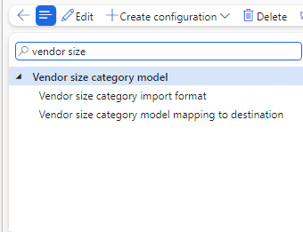
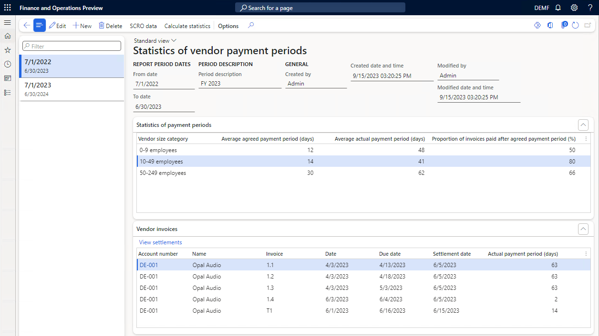
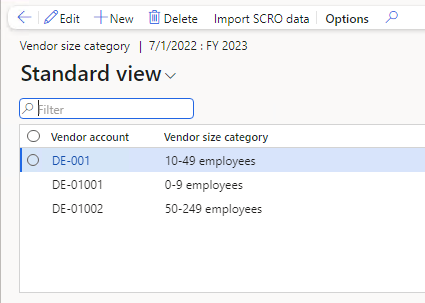
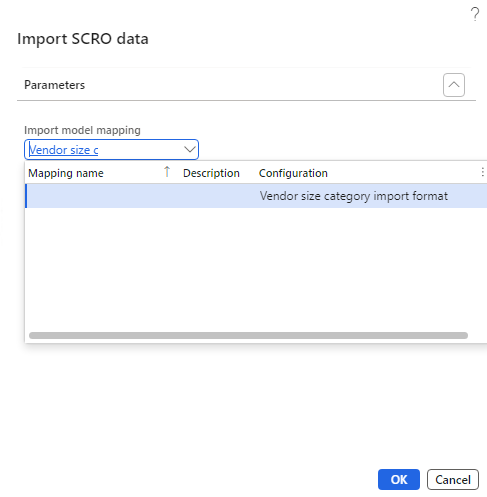
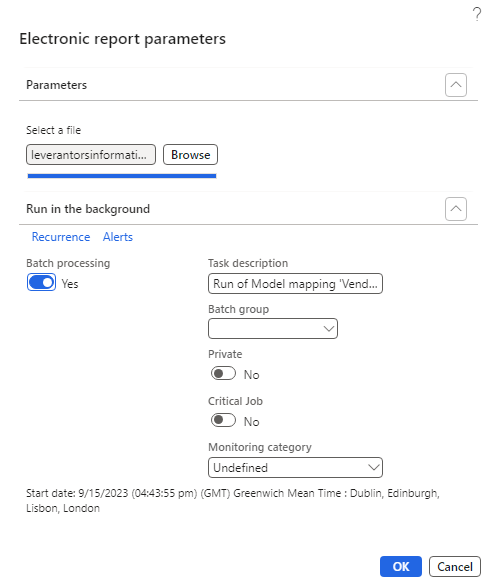
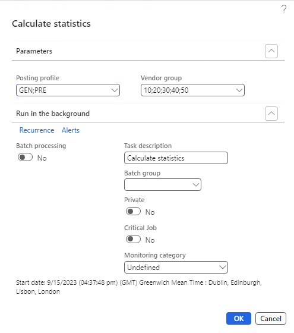

# Reporting statistics of vendor payment periods

This article explains how to set up and generate Statistics of vendor payment periods required in Sweden.

## Introduction

Starting from March 1, 2022, a new regulation has been implemented in Sweden that mandates large companies, specifically those with more than 249 employees, to report their payment terms with subcontractors to the Swedish Companies Registration Office (Bolagsverket). This initiative is designed to counteract the trend of extending payment terms and aims to foster growth among smaller Swedish companies by creating the best possible conditions for them to develop and grow.

The information that these companies are required to report includes the average agreed payment term, the average actual payment term, and the percentage of invoices paid after the agreed term. It’s important to note that payment terms must be reported separately for subcontractors of different sizes: those with 0 – 9 employees, 10 – 49 employees, and 50 – 249 employees. If a company uses reverse factoring, it must report that information separately. This means that an additional nine items must be reported if reverse factoring is used for all three size categories of subcontractors.

The large companies must then report payment terms statistics for the period from July 1 of the previous year through June 30 of the current year. The company must then submit the information by the end of September. For more information contact Swedish Companies Registration Office or visit their e-service portal at [www.bolagsverket.se](https://www.bolagsverket.se).

## General Configuration
Before you generate the report with statistics of vendor payment periods, you must ensure about complete setup following steps. 

## Import electronic configurations
In the Dynamics 365 Finance, import the following components of Electronic reporting (ER) configurations from the Global repository selecting latest available version:
-	Vendor size category model
-	Vendor size category import format 
-	Vendor size category model mapping to destination

Compare imported configurations in Reporting configurations in the Electronic Reporting workspace with following picture:

For more information about how to import ER configurations, see [Download Electronic reporting configurations from Lifecycle Services](https://learn.microsoft.com/en-us/dynamics365/fin-ops-core/dev-itpro/analytics/download-electronic-reporting-configuration-lcs)

## Create reporting period and import SCRO vendor size definition data
The definition of size of Swedish based companies is published every year by the Swedish Companies Registration Office (Bolagsverket) in the e-service. The SCRO publish a file with all small companies under 250 employees in scope for the vendor payment periods reporting. 

In order to configure the **Statistics of vendor payment periods** report in Dynamics 365 Finance the reporting company must obtain that file by accessing the SCRO e-service using for accessing their registered business credentials.

The downloaded file from SCRO (Bolagsverket) e-service must be imported to Dynamics 365 Finance. For that purpose navigate to **Accounts Payable > Periodic Tasks > Statistics of vendor payment periods**.

1. In the form **Statistics of vendor payment periods** create new reporting period adding **New** record for new report and fill reporting period dates. 
2. After creating period choose menu **SCRO data** to open **Vendor size category** form.

3. In the form **Vendor Size Category** choose menu option **Import SCRO Data**. That will open a sequence of two dialog forms with a procedure to import and process SCRO data file. In the first open dialog form select earlier imported format: **Vendor size category import format** dedicated to reading structure of the SCRO data file and choose **OK**.

4. In the following dialog browse for previously downloaded file and select it for importing. The system will import the file to temporary storage and will start processing data from the file. The processing will run search for vendors created in a legal entity and match with provided in the SCRO data file. The matching process is based on Swedish company official identification number or tax registration number whichever match first. Make sure all vendors in your vendor table have either of those numbers filled.

   >[!NOTE]
   > The processing and matching vendors size category can take significant time depending on number of vendor records in a legal entity. Therefore, you may choose batch processing for this task. To enable batch mode for this task there is required activation of optional Electronic Reporting feature. Therefore, navigate to **Feature management** and activate feature **Run ER import of manually uploaded documents in batch**

   >[!NOTE]
   > 1.	The SCRO data file is provided as a CSV file in the Bolagsverket e-service. Most antivirus services may interrupt downloading the file or saving and processing the downloaded file. It needs to be assured that file is downloaded completely and not corrupted. Verify size of downloaded file with information provided by SCRO. In the reporting period of the year 2023 the file size was approximately 92MB.
   > 2.	In case of any complication with importing and matching file you may search for vendor at the Bolagsverket e-service and manually add record for your vendor and its size category in the **Vendor Size Category** form.

## Calculate vendor payment statistics

After the vendors size category classification of your vendors have been configured, you may run calculation of statistics. The Swedish Companies Registration Office (Bolagsverket) is interested in following statistical information for each size category of small vendor companies:
-	The average agreed payment term,
-	The average actual payment term,
-	The percentage of invoices paid after the agreed payment term.

Statistics of payment delays is based on rule calculating days of payment delays for each vendor invoice transaction. The calculation formula subtracts the invoice date from the payment date and round down the result to the nearest integer. For example, if an invoice was issued on January 1 and paid on January 15, the delay would be 14. If an invoice date was January 1 and paid on January 31, the delay days would be 30. 

For calculation of payment terms, the actual information about agreed payment terms is taken for each transaction effectively from invoice **Payment due date**. The calculation formula subtracts the invoice date from the payment due date and round the result to the nearest integer. For example, if an invoice date was January 1 and payment due date was January 11, the actual payment term days would be 10.

The report considers invoices paid after the agreed payment term if the payment date is later than payment due date. The latest delayed payment date of the invoice is taken for statistics in case an invoice is paid multiple times.

The percentage of invoices paid after the agreed payment term is calculated taking into consideration all invoices paid in the reporting period. 

1.	Navigate to **Accounts Payable > Periodic Tasks > Statistics of vendor payment periods** to run calculation of statistics. 

2.	Choose menu **Calculate Statistics**. The system opens a dialog form starting process of calculating statistics of payment delays. 

In case your company transacts frequently with many small companies resulting with large number of transactions, you may choose dividing the process filtering vendors by a **Posting profile** or a **Vendor group**. 

You may also choose to use those filters to prepare separate report for groups of vendors which are paid using reverse factoring services. You may also choose to run the processing in batch and check on results after batch task completes. 

In the result of calculation statistics the system will calculate all data required for reporting. You may verify calculations in provided data for the form for each vendor size category. In the **Vendor invoices** form you may navigate through all transactions considered in the statistics calculation. For each transaction you may navigate to settlement and original documents and payments using menu **View Settlements**. 

   >[!Note]
   >In the **Vendor invoices** form there are hidden fields which you may add to the form by choosing form customization options. You may also choose to export data from the form to excel spreadsheet for further analysis. 

## Reporting to Swedish Companies Registration Office
At the moment of the first release of this report the Swedish Companies Registration Office requires filing by entering manually the report in the Bolagsverket e-service. Therefore, navigate to the reporting area in the e-service and fill in the required statistics in the office forms online.
