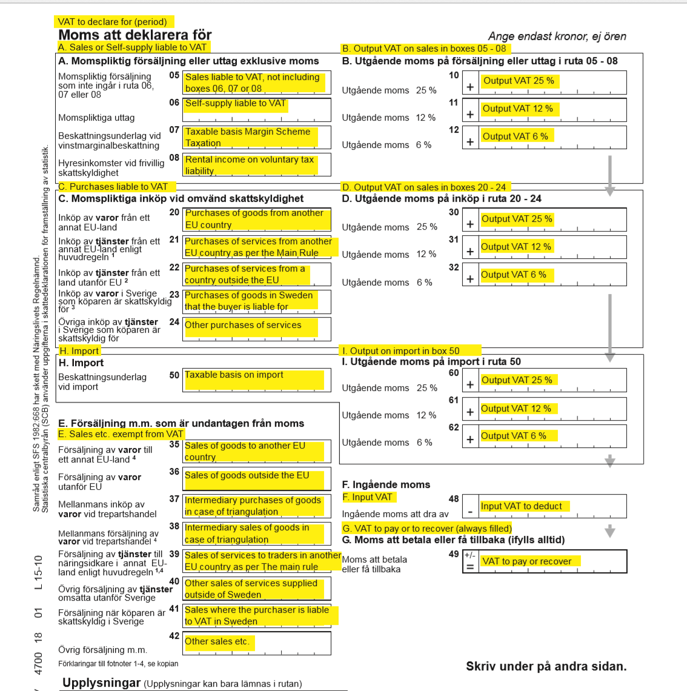

# Sales tax report for Sweden

[!include [banner](../includes/banner.md)]

> [!IMPORTANT]
  > This feature is deprecated. For more information, see [Removed and deprecated features](../get-started/removed-deprecated-features-finance.md#sales-tax-report-for-sweden-design-based-on-reporting-codes).
  > For more information about VAT declaration, see [VAT declaration (Sweden)](emea-swe-vat-declaration-sweden.md)
  
For general information about how to set up the value-added tax (VAT) statement, see [VAT reporting for Europe](emea-vat-reporting.md).

## Set up the report layout for sales tax authorities

To generate a sales tax report in the correct format for the appropriate tax authority, you must first set up the report layout for sales tax authorities.

1. Go to **Tax** \> **Indirect taxes** \> **Sales tax** \> **Sales tax authorities.**
2. On the **Sales tax authorities** page, select the sales tax authority that will be used in the sales tax codes for the sales tax settlement period.
3. In the **Report layout** field, select **Swedish report layout**.

## Set up sales tax reporting codes for VAT reporting

Set up sales tax reporting codes by following the instructions in [Set up sales tax reporting codes](../general-ledger/tasks/set-up-sales-tax-reporting-codes.md). The following table provides an example of sales tax reporting codes for Sweden.

| **Code and corresponding box in the VAT declaration** | **Description**                                                                                                                                                                                    |
|-------------------------------------------------------|----------------------------------------------------------------------------------------------------------------------------------------------------------------------------------------------------|
| 05                                                    | Sales that are subject to VAT, excluding boxes 06, 07 and 08                                                                                                                                       |
| 06                                                    | Self-supply that is subject to VAT                                                                                                                                                                 |
| 07                                                    | Taxable basis on Margin Scheme Taxation                                                                                                                                                            |
| 08                                                    | Rental income on voluntary tax liability                                                                                                                                                           |
| 10                                                    | Output VAT of 25 percent on sales in boxes 05 through 08                                                                                                                                           |
| 11                                                    | Output VAT of 12 percent on sales in boxes 05 through 08                                                                                                                                           |
| 12                                                    | Output VAT of 6 percent on sales in boxes 05 through 08                                                                                                                                            |
| 20                                                    | Purchases of goods from another European Union (EU) country/region                                                                                                                                        |
| 21                                                    | Purchases of services from another EU country/region                                                                                                                                                      |
| 22                                                    | Purchases of services from a country or region outside the EU                                                                                                                                      |
| 23                                                    | Purchases of goods in Sweden that the buyer is liable for                                                                                                                                          |
| 24                                                    | Other purchases of services                                                                                                                                                                        |
| 30                                                    | Output VAT of 25 percent on sales in boxes 20 through 24                                                                                                                                           |
| 31                                                    | Output VAT of 12 percent on sales in boxes 20 through 24                                                                                                                                           |
| 32                                                    | Output VAT of 6 percent on sales in boxes 20 through 24                                                                                                                                            |
| 50                                                    | Taxable basis on import                                                                                                                                                                            |
| 60                                                    | Output VAT of 25 percent on the import in box 50                                                                                                                                                   |
| 61                                                    | Output VAT of 12 percent on the import in box 50                                                                                                                                                   |
| 62                                                    | Output VAT of 6 percent on the import in box 50                                                                                                                                                    |
| 35                                                    | Sales of goods to another EU country/region                                                                                                                                                               |
| 36                                                    | Sales of goods outside the EU                                                                                                                                                                      |
| 37                                                    | Intermediary purchases of goods in cases that involve triangulation                                                                                                                                |
| 38                                                    | Intermediary sales of goods in cases that involve triangulation                                                                                                                                    |
| 39                                                    | Sales of services to traders in another EU country/region                                                                                                                                                 |
| 40                                                    | Other sales of services that are supplied outside Sweden                                                                                                                                           |
| 41                                                    | Sales where the purchaser is liable for VAT in Sweden                                                                                                                                              |
| 42                                                    | Other sales, and so on                                                                                                                                                                             |
| 48                                                    | The input VAT to deduct                                                                                                                                                                            |
| 49                                                    | The VAT to pay or recover On the sales tax report, the value in this box is automatically calculated as the sum of reporting codes 10, 11, 12, 30, 31, 32, 60, 61, and 62, plus reporting code 48. |

## Set up sales tax codes

Set up sales tax codes by following the instructions in the topics, [Sales tax codes for VAT reporting](emea-vat-reporting.md#sales-tax-codes-for-vat-reporting) and [Sales tax overview](../general-ledger/indirect-taxes-overview.md).

##  Generate a sales tax payment and print the Swedish sales tax report

At the end of the VAT reporting period, calculate the sales tax amounts for the settlement period.

1. Go to **Tax** \> **Declarations** \> **Sales tax** \> **Settle and post sales tax**.
2. In the **Report sales tax for settlement period** dialog box, set the following fields.

    | **Field**                 | **Description**                                                                                                                                                                                                                                                                         |
    |---------------------------|-----------------------------------------------------------------------------------------------------------------------------------------------------------------------------------------------------------------------------------------------------------------------------------------|
    | Settlement period         | Select the applicable reporting period.                                                                                                                                                                                                                                                 |
    | From date                 | Enter the first date of the sales tax settlement period that sales tax should be calculated for. This value corresponds to the date in the **From** field on the **Sales tax settlement periods** page.                                                                                 |
    | Transaction date          | Enter the date when the sales tax report is calculated. The default value is the current date. The sales tax payment is calculated for all transactions that were posted during the settlement period.                                                                                  |
    | Sales tax payment version | Select the type of sales tax settlement. If this sales tax settlement is the first sales tax settlement for the period, select **Original**. If a sales tax settlement has already been generated, select **Latest corrections**. For more information, see [Create a sales tax payment](../general-ledger/tasks/create-sales-tax-payment.md). |

3. Select **OK**. Fill in the following fields on the dialog **Swedish sales tax report**.

    | **Field**                       | **Description**                                                                                                                                                                                                                                                 |
    |---------------------------------|-----------------------------------------------------------------------------------------------------------------------------------------------------------------------------------------------------------------------------------------------------------------|
    | Tax currency                    | Select the currency that determines which transactions are included on the report. The report will include both transactions that are generated by using the tax currency and transactions that are generated by using the tax codes that use the tax currency. |
    | Reporting currency              | Select the foreign currency that the report should be generated in.                                                                                                                                                                                             |
    | Currency rate on reporting date | Set this option to **Yes** to specify that that the currency rate on the reporting date should be used for all transactions on the report.                                                                                                                      |

4. Select **OK** to generate the sales tax payment.

## Print a sales tax payment report from a sales tax payment

1. Go to **Tax** \> **Inquiries and reports** \> **Sales tax payments**.
2. On the **Sales tax payment** page, select the record, and then select **Print report**.
3. In the dialog box, set the fields as described in the previous section, and then select **OK**.

## Report sales tax for a settlement period

You can also generate a Swedish sales tax report by using the **Report sales tax for settlement period** inquiry.

1. Go to **Tax** \> **Declarations** \> **Sales tax** \> **Report sales tax for settlement period**.
2. Set the **Settlement period**, **From date**, **Tax currency**, and **Reporting currency** fields as described in the [Generate a sales tax payment and print the Swedish sales tax report](#generate) section earlier in this article.
3. In **Sales tax payment version** field, select one of the following options:

    - **Original** – Generate a report for sales tax transactions of the first posted settlement calculation for the period.
    - **Corrections** – Generate a report for sales tax transactions of subsequent settlement calculations for the period.
    - **Total list** – Generate a report for all sales transactions for the period. These transactions include original and corrected transactions.

4. Select **OK**.
5. Set the **Tax currency**, **Reporting currency**, and **Currency rate on reporting date** fields as described in the section, [Generate a sales tax payment and print the Swedish sales tax report](#generate).

## Example

The following example shows how you can set up sales tax codes and sales tax reporting codes, post transactions, and generate the Swedish sales tax report.

1. Go to **Tax** \> **Indirect taxes** \> **Sales tax** \> **Sales tax codes**, and set up the following sales tax codes.

    | **Sales tax code** | **Percentage** | **Description**                                                                        |
    |--------------------|----------------|----------------------------------------------------------------------------------------|
    | SE25               | 25             | Domestic sales and purchases at a rate of 25 percent                                   |
    | SE12               | 12             | Domestic sales and purchases at a rate of 12 percent                                   |
    | SE6                | 6              | Domestic sales and purchases at a rate of 6 percent                                    |
    | SEEU25             | 25             | EU purchases at a rate of 25 percent where the **Use tax** option is set to **Yes**.   |
    | SEEU12             | 12             | EU purchases at a rate of 12 percent where the **Use tax** option is set to **Yes**.   |
    | SEEU6              | 6              | EU purchases at a rate of 6 percent where the **Use tax** option is set to **Yes**.    |
    | SEImp25            | 25             | Import at a rate of 25 percent where the **Use tax** option is set to **Yes**.         |
    | SEImp12            | 12             | Import at a rate of 12 percent where the **Use tax** option is set to **Yes**.         |
    | SEImp6             | 6              | Import at a rate of 6 percent where the **Use tax** option is set to **Yes**.          |
    | SERC25             | 25             | Reverse charge at a rate of 25 percent where the **Use tax** option is set to **Yes**. |
    | SERC12             | 12             | Reverse charge at a rate of 12 percent where the **Use tax** option is set to **Yes**. |
    | SERC6              | 6              | Reverse charge at a rate of 6 percent where the **Use tax** option is set to **Yes**.  |
    | SEEUS              | 0              | EU sales where the **Exempt** option is set to **Yes**.                                |
    | SEThird            | 0              | Export sales where the **Exempt** option is set to **Yes**.                            |

2. On the **Sales tax codes** page, on the **Report setup** FastTab, assign reporting codes to sales tax codes.

   The following table shows how to assign the sales tax reporting codes to sales tax codes.

    | **Sales tax code** | **Taxable sales** | **Tax-free sale** | **Sales tax payable** | **Taxable purchases** | **Sales tax receivable** | **Taxable import** | **Use tax** | **Offset use tax** |
    |--------------------|-------------------|-------------------|-----------------------|-----------------------|--------------------------|--------------------|-------------|--------------------|
    | SE25               | 05                |                   | 10                    |                       | 48                       |                    |             |                    |
    | SE12               | 05                |                   | 11                    |                       | 48                       |                    |             |                    |
    | SE6                | 05                |                   | 12                    |                       | 48                       |                    |             |                    |
    | SEEU25             |                   |                   |                       |                       |                          | 20                 | 48          | 30                 |
    | SEEU12             |                   |                   |                       |                       |                          | 20                 | 48          | 31                 |
    | SEEU6              |                   |                   |                       |                       |                          | 20                 | 48          | 32                 |
    | SEImp25            |                   |                   |                       |                       |                          | 50                 | 48          | 60                 |
    | SEImp12            |                   |                   |                       |                       |                          | 50                 | 48          | 61                 |
    | SEImp6             |                   |                   |                       |                       |                          | 50                 | 48          | 62                 |
    | SERC25             |                   |                   |                       |                       |                          | 23                 | 48          | 30                 |
    | SERC12             |                   |                   |                       |                       |                          | 23                 | 48          | 31                 |
    | SERC6              |                   |                   |                       |                       |                          | 23                 | 48          | 32                 |
    | SEEUS              |                   | 35                |                       |                       |                          |                    |             |                    |
    | SEThird            |                   | 36                |                       |                       |                          |                    |             |                    |

   > [!NOTE]
   > The preceding configuration is just an example and depends on the structure of the sales tax codes that are used. If you want values to be calculated and transferred to the sales tax report, for each tax code that is used in the sales tax payment process, you must set a relevant sales tax reporting code in one or more fields on the **Report setup** tab.
   
3. Post the following transactions. For example for Customer invoices go to **Accounts receivable** \> **Invoices** \> **All free text invoices**, for Vendor invoices go to **Accounts payable** \> **Invoices** \> **Invoice journal**.

    | **Date**        | **Transaction type**            | **Amount net** | **VAT amount** | **Sales tax code** | **Expected tax base – reporting code** | **Expected tax amount – reporting code** |
    |-----------------|---------------------------------|----------------|----------------|--------------------|----------------------------------------|------------------------------------------|
    | January 1, 2020 | Customer invoice                | 100            | 25             | SE25               | 5                                      | 10                                       |
    | January 1, 2020 | Vendor invoice (EU)             | 100            | 12             | SEEU12             | 20                                     | 31 – Tax payable 48 – Tax deduction      |
    | January 1, 2020 | Vendor invoice (import)         | 100            | 6              | SEImp6             | 50                                     | 62 – Tax payable 48 – Tax deduction      |
    | January 1, 2020 | Customer invoice (EU)           | 100            | 0              | SEEUS              | 35                                     | Not applicable                           |
    | January 1, 2020 | Customer invoice (export)       | 100            | 0              | SEThird            | 36                                     | Not applicable                           |
    | January 1, 2020 | Vendor invoice (reverse charge) | 100            | 25             | SERC25             | 23                                     | 30 – Tax payable 48 – Tax deduction      |

4. Go to **Tax** \> **Declarations** \> **Sales tax** \> **Settle and post sales tax**. In the **Report sales tax for settlement period** dialog box in the **Sales tax payment version** field, select **Original**.
5. Print the report, and review the data.

    

6. Post the new transaction. For example, go to **Accounts receivable** \> **Invoices** \> **All free text invoices**.

    | **Date**        | **Transaction type**   | **Amount net** | **VAT amount** | **Sales tax code** | **Expected tax base – reporting code** | **Expected tax amount – reporting code** |
    |-----------------|------------------------|----------------|----------------|--------------------|----------------------------------------|------------------------------------------|
    | January 1, 2020 | Customer invoice (dom) | 100            | 6              | SE6                | 5                                      | 12                                       |

7. Go to **Tax** \> **Declarations** \> **Sales tax** \> **Settle and post sales tax**. In the **Report sales tax for settlement period** dialog box in the **Sales tax payment version** field, select **Latest corrections**.
8. Go to **Tax** \> **Declarations** \> **Sales tax** \> **Report sales tax for settlement period**. In the **Report sales tax for settlement period** dialog box in the **Sales tax payment version** field, select **Corrections**. The following illustration shows the result.

    

9. Go to **Tax** \> **Declarations** \> **Sales tax** \> **Report sales tax for settlement period**. In the **Report sales tax for settlement period** dialog box in the **Sales tax payment version** field, select **Total list**. The following illustration shows the result.

    

## Report VAT declaration to the Tax authority

After you've generated the Swedish sales tax report, use the data on it to fill in the VAT declaration for the Swedish Tax Agency in the official format. For example, the following illustration shows what the Swedish VAT declaration has looked like since 2016.

[!INCLUDE[footer-include](../../includes/footer-banner.md)]
