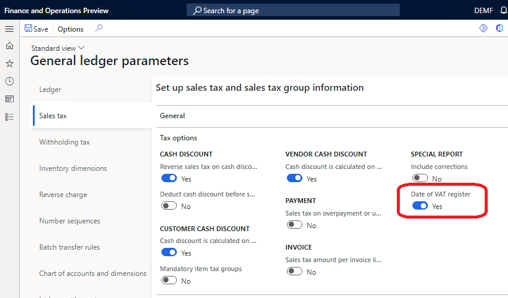

# Tax point date (Date of VAT register)

[!include [banner](../includes/banner.md)]

The **tax point date** for a transaction is the date on which the transaction occurs for VAT purposes. Use the **Date of VAT register** feature when the tax point date is different from the transaction date and it must be noted. To specify the tax point date, use the **Date of VAT register** field.

The **Date of VAT register** field is shared globally and can be enabled in legal entities with a primary address in any country/region.

## Activate the Date of VAT register feature

The **Date of VAT register** feature is enabled in the **Feature management** workspace.

After the feature is enabled, you can also define tax point transactions dates by using the **Date of VAT register** field in all of the legal entities in your application.

The **Date of VAT register** field appears on more than 20 pages. These pages include journals, sales orders, purchase orders, free-text invoices, vendor invoice journals, and project invoices. When you update or post the documents, all taxes are posted by using the corresponding date of the VAT register. The date is included on pages such as the Customer and Vendor invoice journals pages.

The **Date of VAT register** field is also included in the following reports:

- **Specification** report (**Tax** \> **Inquiries and reports** \> **Sales tax reports** \> **Specification**)
- **Sales tax transactions** report (**Tax** \> **Inquiries and reports** \> **Sales tax reports** \> **Sales tax transactions**)
- **Sales tax transactions - details** report (**Tax** \> **Inquiries and reports** \> **Sales tax reports** \> **Sales tax transactions – details**)
- **Sales tax specification by ledger transaction** report (**Tax** \> **Inquiries and reports** \> **Sales tax reports** \> **Sales tax specification by ledger transaction**)

## Auto-fill the **Date of VAT register** field

You can use the functionality in the **Date of VAT register** feature to auto-fill the **Date of VAT register** field. To set this up, set the **Date of VAT register filling** parameter on the **Sales tax groups** page.

When you create an invoice, the **Date of VAT register** field is automatically filled in. One of the following methods will be added based on the selection in the **Date of VAT register filling** field:

- **Manually** – No value will be defined. You can manually define the value before you post the invoice.
- **Document date** – The value will be defined automatically on the date that the invoice is updated.
- **Posting date** - The value will be the date that the invoice is posted.
- **Last delivery date** - The date of the last packing slip (for a sales order) or product receipt (for a purchase order) for the invoice. This option is not applicable in scenarios where a posted invoice is based on multiple sales orders.”
- **Customize** – The value can be calculated based on the posting date or the document date. The date of VAT register is determined by adding a number of periods (Day, Month, or Year) to the posting date or document date. The option is available under the **Date of VAT register filling: new calculation choice** feature in the **Feature management** workspace starting in version 10.0.17.

## Filling the **Date of VAT register** field after the invoice is posted

If for some reason an invoice is posted and the **Date of VAT register** field is empty, it is still possible to fill it in. To do this, go to **Tax** \> **Periodic tasks** \> **VAT register transactions**. The **VAT register transactions** page represents sales tax transactions where the field **Date of VAT register** is empty. Select one record to update, or select multiple records by using the filter function. To define the value for the field, select **Date of VAT register** on the Action Pane, and specify the value in the dialog. The updated records will be automatically filtered out from the list of records on the **VAT register transactions** page.

## Sales tax transactions extension consistency check

The **Date of VAT register** field is stored in a TaxTrans_W table. This table is an extension of the TaxTrans table. When a company enables the **Date of VAT register** feature, data source queries on some pages in the system start to work differently. Those queries now join the TaxTrans_W table. Therefore, users might not be able to see tax transactions that were posted in an earlier period. This issue occurs because the TaxTrans_W table wasn't previously used, and therefore there are no corresponding transactions in the table.

To help avoid this issue, you can run the **Sales tax transactions extension** consistency check. Go to **System administration** \> **Periodical tasks** \> **Database** \> **Consistency check**. In the **Consistency check** dialog box, expand **Program** \> **General ledger** \> **Sales tax**, and then select the **Sales tax transactions extension** check box. You don't have to select the parent check boxes if you want to run only the **Sales tax transactions extension** consistency check.

When you run the **Sales tax transactions extension** consistency check, set the following options:

- **Check** – Determine whether any transactions are missing in the TaxTrans_W table. The system will notify you about the number of transactions in the TaxTrans table that lack corresponding records in the TaxTrans_W table.
- **Fix** – Compensate for missing records in the TaxTrans_W table. The system will insert corresponding records into the TaxTrans_W table. Sales tax transactions that were posted in previous periods will again be seen everywhere in the system. 

Make sure that you select the correct date in the **From date** field in the **Consistency check** dialog box. Leave the **From date** field blank if you want to recover all the tax transactions in the system.

The **Sales tax transactions extension** consistency check is available in build version 10.0.234.21 and later for version 10.0.6 of the application, and for version 10.0.7 and later. In these versions, it's available only when the Date of VAT register feature is turned on in the **Feature management** workspace.

## Sales tax settlement by date of VAT register

Starting in release 10.0.25, the **Sales tax settlement and reporting by date of VAT register** feature is available. With this feature enabled, you can settle and report sales tax by using the VAT register date. When this feature is enabled, you can set the **Date of VAT register** option to **Yes** on the **General ledger parameters** page on the **Sales tax** tab. The periodic settlement will collect sales tax transaction by the date of VAT register instead of the transaction date.

  

> [!NOTE]
> To enable the **Sales tax settlement and reporting by date of VAT register** feature, the **Date of VAT register** feature should be enabled in the **Feature management** workspace.
> 
> To disable the **Sales tax settlement and reporting by date of VAT register** feature, make sure the **Date of VAT register** check box on the **General ledger parameters** page is set to **No**. A warning will display if the check box is active for some legal entities.

[!INCLUDE[footer-include](../../includes/footer-banner.md)]
