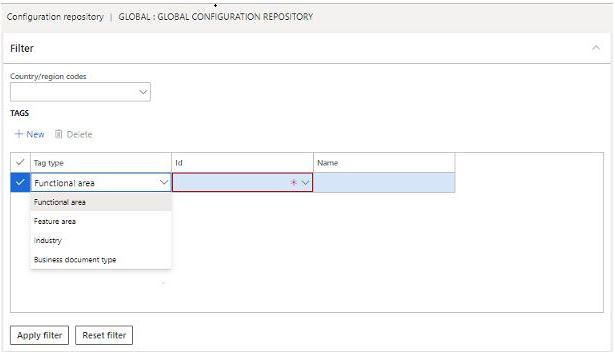
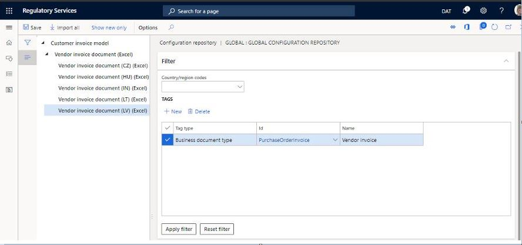

---
# required metadata

title: RCS enhanced filtering in the RCS/Global repository
description: This topic describes enhanced filtering capabilities for the RCS Global repository, which have been improved to include the additional filters.
author: JaneA07      
ms.date: 04/24/2020
ms.topic: article
ms.prod: 
ms.technology: 

# optional metadata

ms.search.form: ERSolutionTable, ERWorkspace
# ROBOTS: 
audience: Application User
# ms.devlang: 
ms.reviewer: kfend
# ms.tgt_pltfrm: 
ms.custom: 97423
ms.assetid: 
ms.search.region: Global
# ms.search.industry: 
ms.author: janeaug
ms.search.validFrom: 2020-02-01
ms.dyn365.ops.version: AX 10.0.9

---

# RCS enhanced filtering options for finding configurations in the RCS/Global repository

[!include [banner](../includes/banner.md)]

This topic describes enhanced filtering capabilities for Regulatory Configuration Services (RCS) Global repository, which have been improved to include the ability to filter with the following criteria: 
- **Country/region** - Based on ISO country codes  
- **Tags** types for:
  - Functional area
  - Feature area
  - Industry 
  - Business document 

To make it easier to discover specific or related configurations you can apply filters, either individually or as a group. For example, to find a single type of 'configurable business documents that are related to vendor invoices, you could apply a **Business document type** filter to search for that type of document. 

 

You can further refine the search by selecting document type, for example 'vendor invoice' and clicking **Apply filter**. The following example shows the results when filtering on **Business document type** with the document type added. 

 

Filtered results can be imported into a users RCS repository or a Dynamics 365 Finance environment, either individually or as a set. To do this, select the group of configurations, and click **Import**.

[!INCLUDE[footer-include](../../includes/footer-banner.md)]