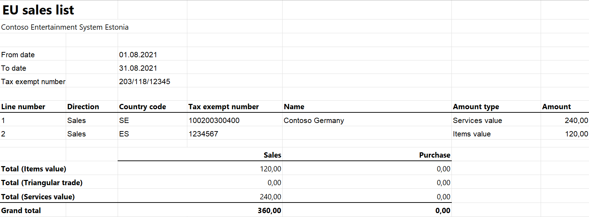

# EU Sales list for Estonia

This article provides information about the European Union (EU) sales list report for Estonia. The Estonian EU sales list report contains information about the sale of goods and services for reporting in XML format. The following fields are included on the Estonian EU sales list report:

- **EU sales list header:**
    
    - Company's enterprise number
    - Reporting period

-   **EU sales list lines:**
    
    -  Customer VAT ID
    -  Sum of all item invoices by customer
    -  Sum of triangular trade by customer
    -  Sum of all service invoices by customer

## Setup

For general setup information, see [EU Sales list reporting](../europe/emea-eu-sales-list.md#prerequisites).

> [!NOTE] 
> The value from the **Tax registration number** field on the **Tax registration** FastTab of the **Legal entities** page will be used in the .xlsx file for the EU sales list report.

### Set up company information

Create a registration type, and assign it to the **Enterprise ID (COID)** registration category for the company. For more information, see [Registration IDs](../europe/emea-registration-ids.md).

1. In Microsoft Dynamics 365 Finance, go to **Organization administration** > **Organizations** > **Legal entities**.
2. In the grid, select your company.
3. On the Action Pane, select **Registration IDs**.
4. On the **Registration ID** FastTab, select **Add**.
5. On the **Overview** tab, in the **Registration type** field, select the registration type that is assigned to the **Enterprise ID (COID)** registration category.
6. Enter your company's enterprise number.
7. Optional: On the **General** tab, in the **General** section, you can change the period that the enterprise ID is used for.
8. Close the page.

### Import Electronic reporting configurations

In [Microsoft Dynamics Lifecycle Services (LCS)](https://lcs.dynamics.com/Logon/Index), import the latest versions of the following Electronic reporting (ER) configurations for the EU sales list:

- EU Sales list model
- EU Sales list by columns report
- EU Sales list by rows report
- EU Sales list (EE)

For more information, see [Download Electronic reporting configurations from Lifecycle Services](../../../fin-ops-core/dev-itpro/analytics/download-electronic-reporting-configuration-lcs.md).

### Set up foreign trade parameters

1. In Finance, go to **Tax** > **Setup** > **Foreign trade** > **Foreign trade parameters**.
2. On the **EU sales list** tab, set the **Report cash discount** option to **Yes** if a cash discount should be included in the value when a transaction is included in the EU sales list.
3. On the **Electronic reporting** FastTab, in the **File format mapping** field, select **EU Sales list (EE)**.
4. In the **Report format mapping** field, select **EU Sales list by rows report** or **EU Sales list by columns report**.
5. On the **Country/region properties** tab, select **New**, and specify the following information:
    
    - In the **Country/region** column, select **EST**.
    - In the **Country/region type** column, select **Domestic**.

6. List all the countries or regions that your company does business with. For each country that is part of the EU, in the **Country/region type** field, select **EU**.

## Work with the EU sales list

For information about the transaction types that are included in the EU sales list, how to generate the EU sales list report, and how to close the EU sales list reporting period, see [EU Sales list reporting](../europe/emea-eu-sales-list.md#working-with-the-esl).

### Generate the EU sales list report

1. Go to **Tax** > **Declarations** > **Foreign trade** > **EU sales list**.
2. Transfer transactions.
3. On the Action Pane, select **Reporting**.
4. In the **EU sales list reporting** dialog box, on the **Parameters** FastTab, set the following fields.

    | Field            | Description                                                                         |
    |------------------|-------------------------------------------------------------------------------------|
    | Reporting period | Select **Monthly**.                                                                 |
    | From date        | Select the start date for the report.                                               |
    | Generate file    | Set this option to **Yes** to generate an .xml file for your EU sales list report.  |
    | File name        | Enter the name of the .xml file.                                                    |
    | Generate report  | Set this option to **Yes** to generate an .xlsx file for your EU sales list report. |
    | Report file name | Enter the name of the .xlsx file.                                                   |

5. Select **OK**, and review the generated reports.

## Example

For information about how to create a general setup, create postings, and transfer transactions by using the **DEMF** legal entity for Estonia, see Example for generic EU Sales list. Additionally, for this example, create **EE123456789** as the company's enterprise ID, instead of the VAT ID.

**Create an EU sales list report**

1. Go to **Tax** > **Declarations** > **Foreign trade** > **EU sales list**.
2. On the Action Pane, select **Reporting**.
3. In the **EU sales list reporting** dialog box, on the **Parameters** FastTab, set the following fields:
    
    - In the **Reporting period** field, select **Monthly**.
    - In the **From date** field, select **8/1/2021** (August 1, 2021).

4. Select **OK**, and review the report in XML format that is generated. The following tables show the values on the example report.

    **EU sales list header**

    | Field            | Value       | Comment                          |
    |------------------|-------------|----------------------------------|
    | deklareerijaKood | EE123456789 | The company's enterprise number. |
    | perioodAasta     | 2021        | The reporting year.              |
    | perioodKuu       | 08          | The reporting month.             |

    **EU sales list lines**

    | Field          | Line 1 value | Line 2 value | Comment                                      |
    |----------------|--------------|--------------|----------------------------------------------|
    | kmkrKood riik  | ES1234567    | DE100200300  | The customer's VAT ID.                       |
    | kaup           | 120          |    &nbsp;    | The sum of all item invoices by customer.    |
    | kolmnurktehing | &nbsp;       |    &nbsp;    | The sum of triangular trade by customer.     |
    | teenusteMyyk   | &nbsp;       | 240          | The sum of all service invoices by customer. |

5.  Review the report in Excel format that is generated.

    
