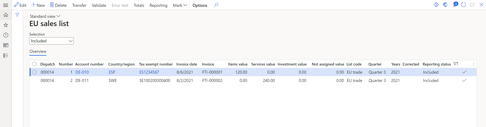

# Example for generic EU Sales list 

[!include [banner](../../includes/banner.md)]

This article explains how to set up and transfer a European Union (EU) sales list. The example uses the **DEMF** legal entity. It also uses Germany as a country of the **Domestic** country/region type, and Spain and Sweden as countries of the **EU** country/region type.

## Setup

### Set up country/region parameters

1. Go to **Tax** > **Setup** > **Sales tax** > **Country/region parameters**.
2. On the Action Pane, select **New**.
3. In the **Country/region** field, select **SWE**.
4. In the **Sales tax** field, enter **SE**.
5. On the Action Pane, select **New**.
6. In the **Country/region** field, select **DEU**.
7. In the **Sales tax** field, enter **DE**.
8. On the Action Pane, select **New**.
9. In the **Country/region** field, select **ESP**.
10. In the **Sales tax** field, enter **ES**.
11. On the Action Pane, select **Save**.

### Set up company information

1. Go to **Organization administration** > **Organizations** > **Legal entities**.
2. Select the **DEMF** legal entity.
3. In the **Name** field, enter **Contoso Entertainment System Germany**.
4. On the **Addresses** FastTab, select **Edit**.
5. In the **Edit address** dialog box, set the following fields.

   | **Field**           | **Value**       |
   |---------------------|-----------------|
   | Name or description | Primary address |
   | Purpose             | Business        |
   | Country/region      | DEU             |
   | ZIP/postal code     | 10115           |
   | Street              | Bahnhofstraße 5 |
   | City                | Berlin          |
   | Primary             | Yes             |

6. Select **OK**.
7. On the **Tax registration** FastTab, in the **Tax registration number** field, enter **203/118/12345**.

    > [!NOTE]
    > The value of the **Tax registration number** field can be used in EU sales list report files, depending on the specific country or region.

### Set up VAT IDs

#### Create a registration type for a company code

1. Go to **Organization administration** > **Global address book** > **Registration types** > **Registration types**.
2. On the Action Pane, select **New**.
3. In the **Enter registration type details** dialog box, in the **Name** field, enter **VAT ID**.
4. In the **Country/region** field, select **DEU**.
5. Select **Create**.
6. On the **Applicable countries/regions, uses, and validation rules** FastTab, select **Add**.
7. In the **Country/region** field, select **ESP**.
8. Select **Add**.
9. In the **Country/region** field, select **SWE**.

#### Match the registration type with a registration category

1. Go to **Organization administration** > **Global address book** > **Registration types** > **Registration categories**.
2. On the Action Pane, select **New** to create a link between a registration type and a registration category.
3. For the **VAT ID** registration type for Germany, Spain, and Sweden, select the **VAT ID** registration category.

#### Set up the VAT ID of a data provider for your company

1. Go to **Organization administration** > **Organizations** > **Legal entities**.
2. Select the **DEMF** legal entity.
3. On the Action Pane, select **Registration IDs**.
4. On the **Registration ID** FastTab, select **Add**.
5. In the **Registration type** field, select **VAT ID**.
6. In the **Registration number** field, enter **DE777666555**.
7. On the **General** tab, in the **General** section, in the **Effective** field, select **8/1/2021** (August 1, 2021).
8. Close the page.

    > [!NOTE]
    > Depending on the company localization, if the **VAT exempt number export** field in the **Intrastat** section of the **Foreign trade and logistics** FastTab is set (not blank) the value can be used, instead of the VAT ID that you created in steps 4 through 6, in EU sales list report files.

#### Create a customer's VAT registration number

1. Go to **Accounts receivable** > **Customers** > **All customers**.
2. In the grid, select **DE-010**.
3. On the Action Pane, on the **Customer** tab, in the **Registration** group, select **Registration Ids**.
4. On the **Registration ID** FastTab, select **Add** to create a registration ID.
5. In the **Registration type** field, select **VAT ID**.
6. In the **Registration number** field, enter **ES1234567**.
7. On the **General** tab, in the **General** section, in the **Effective** field, select **8/1/2021** (August 1, 2021).
8. On the Action Pane, select **Save**. Then close the page.
9. On the **Invoice and delivery** FastTab, in the **Sales tax** section, in the **Tax exempt number** field, select **ES1234567**.
10. On the **General** tab, in the **General** section, in the **Effective** field, select **8/1/2021**.
11. On the Action Pane, select **Save**. Then close the page.
12. In the grid, select **DE-011**.
13. Repeat steps 3 through 5.
14. In the **Registration number** field, enter **SE100200300400**.
15. On the Action Pane, select **Save**. Then close the page.
16. On the **Invoice and delivery** FastTab, in the **Sales tax** section, in the **Tax exempt number** field, select **SE100200300400**.

### Import Electronic reporting configurations

- In [Microsoft Dynamics Lifecycle Services (LCS)](https://lcs.dynamics.com/Logon/Index), import the latest versions of the following Electronic reporting (ER) configurations for the EU sales list:

    - EU Sales list model
    - EU Sales list by rows report
    - EU Sales list (DE)

### Set up foreign trade parameters

1. In Dynamics 365 Finance, go to **Tax** > **Setup** > **Foreign trade** > **Foreign trade parameters**.
2. On the **EU sales list** tab, on the **Rounding rules** FastTab, in the **Rounding rule** field, enter **0.01**.
3. In the **Number of decimals** field, enter **2**.
4. On the **Electronic reporting** FastTab, in the **File format mapping** field, select **EU Sales list (DE)**.
5. In the **Report format mapping** field, select **EU Sales list by rows report**.
6. On the **Country/region properties** tab, select **New**, and set the following fields:

    - In the **Country/region** field, select **DEU**.
    - In the **Country/region type** field, select **Domestic**.

7. Select **New**, and set the following fields:

    - In the **Country/region** field, select **ESP**.
    - In the **Country/region type** field, select **EU**.

8. Select **New**, and set the following fields:

    - In the **Country/region** field, select **SWE**.
    - In the **Country/region type** field, select **EU**.

9. On the **Number sequences** tab, verify that the **Number sequence code** field is set (not blank) for the **EU sales list** reference.

### Set up sales tax codes and sales tax groups

1. Go to **Tax** > **Indirect taxes** > **Sales tax** > **Sales tax codes**.
2. Select the **EUS** sales tax code.
3. Verify that the **Percentage/Amount** field is set to **0.00000**.
4. On the **Report setup** FastTab, in the **Country/region type** section, in the **Country/region type** field, select **EU**.
5. In the **EU sales list** section, verify that the **Excluded** option is set to **No**.
6. Go to **Tax** > **Indirect taxes** > **Sales tax** > **Sales tax groups**.
7. Verify that the **EUS** sales tax code is included in the **AR-EU** sales tax group.
8. On the **Setup** FastTab, verify that the **Exempt** checkbox is selected for the **EUS** sales tax code.
9. Go to **Tax** > **Indirect taxes** > **Sales tax** > **Item sales tax groups**.
10. Verify that the **FULL** item sales tax group includes the **EUS** sales tax code.
11. In the **Reporting type** field, select **Item**.

### Set up customer information

1. Go to **Accounts receivable** > **Customers** > **All customers**.
2. In the grid, select **DE-010**.
3. On the **Addresses** FastTab, select **Edit**.
4. In the **Edit address** dialog box, in the **Country/region** field, select **ESP**.
5. In the **Primary** field, select **Yes**.
6. Select **OK**.
7. On the **Invoice and delivery** FastTab, in the **Sales tax** section, in the **Sales tax group** field, select **AR-EU**.
8. Select **Save**, and close the page.
9. In the grid, select **DE-011**.
10. On the **Addresses** FastTab, select **Edit**.
11. In the **Edit address** dialog box, in the **Country/region** field, select **SWE**.
12. In the **Primary** field, select **Yes**.
13. Select **OK**.

### Create a free text invoice

1. Go to **Accounts receivable** > **Invoices** > **All free text invoices**.
2. On the Action Pane, select **New**.
3. On the **Free text invoice header** FastTab, in the **Customer account** field, select **DE-010**.
4. In the **Invoice** section, in the **Date** field, select **8/6/2021** (August 6, 2021).
5. On the **Invoice lines** FastTab, set the following fields:

    - In the **Main account** field, select **112010**.
    - In the **Sales tax group** field, select **AR-EU**.
    - In the **Item sales tax group** field, select **FULL**.
    - In the **Quantity** field, select **1**.
    - In the **Unit price** field, select **120**.

6. In the **Header** view, on the **Foreign trade** FastTab, verify that the **List code** field is set to **EU trade**.
7. Post the free text invoice.
8. Go to **Tax** > **Indirect taxes** > **Sales tax** > **Item sales tax groups**.
9. For the **FULL** item sales tax group, in the **Reporting type** field, select **Service**.
10. Repeat steps 1 through 7 for customer **DE-011**. However, set the invoice date to **8/2/2021** (August 2, 2021) and the unit price to **240**.

### Set up purchase transfers

Complete the following setup for countries or regions that include purchases in the EU sales list report.

#### Set up vendor information

1. Go to **Accounts payable** > **Vendors** > **All vendors**.
2. In the grid, select **DE-001**.
3. On the **Addresses** FastTab, select **Edit**.
4. In the **Edit address** dialog box, in the **Country/region** field, select **DEU**.
5. In the **Primary** field, select **Yes**.
6. Select **OK**.
7. Close the page.

#### Set up VAT IDs

##### Create a registration type for a company code

1. Go to **Organization administration** > **Global address book** > **Registration types** > **Registration types**.
2. On the Action Pane, select **New** to create a registration type for the VAT ID.
3. In the **Enter registration type details** dialog box, in the **Name** field, enter **VAT ID**.
4. In the **Country/region** field, select **DEU**.

##### Match the registration type with a registration category

1. Go to **Organization administration** > **Global address book** > **Registration types** > **Registration categories**.
2. On the Action Pane, select **New** to create a link between a registration type and a registration category.
3. For the **VAT ID** registration type for Germany, select the **VAT ID** registration category.

#### Create a vendor's VAT registration number

1. Go to **Accounts payable** > **Vendors** > **All vendors**.
2. In the grid, select **DE-001**.
3. On the Action Pane, on the **Vendor** tab, in the **Registration** group, select **Registration IDs**.
4. On the **Registration ID** FastTab, select **Add** to create a registration ID.
5. In the **Registration type** field, select **VAT ID**.
6. In the **Registration number** field, enter **DE100200400**.
7. On the **General** tab, in the **General** section, in the **Effective** field, select **8/1/2021** (August 1, 2021).
8. On the Action Pane, select **Save**. Then close the page.
9. On the **Invoice and delivery** FastTab, in the **Sales tax** section, in the **Tax exempt number** field, select **DE100200400**.
10. On the Action Pane, select **Save**. Then close the page.

#### Set up foreign trade parameters

1. Go to **Tax** > **Setup** > **Foreign trade** > **Foreign trade parameters**.
2. On the **EU sales list** tab, set the **Transfer purchases** option to **Yes**.
3. On the **Country/region properties** tab, select **New**.
4. In the **Country/region** field, select **DEU**.
5. In the **Country/region type** field, select **EU**.

#### Set up sales tax codes and sales tax groups

1. Go to **Tax** > **Indirect taxes** > **Sales tax** > **Sales tax codes**.
2. Select the **EUS** sales tax code.
3. Verify that the **Percentage/Amount** field is set to **0.00000**.
4. Go to **Tax** > **Indirect taxes** > **Sales tax** > **Sales tax groups**.
5. Verify that the **EUS** sales tax code is included in the **AP-EU** sales tax group.
6. On the **Setup** FastTab, verify that the **Exempt** checkbox is selected for the **EUS** sales tax code.
7. Go to **Tax** > **Indirect taxes** > **Sales tax** > **Item sales tax groups**.
8. Verify that the **FULL** item sales tax group includes the **EUS** sales tax code.
9. In the **Reporting type** field, select **Item**.

#### Create a vendor invoice

1. Go to **Accounts payable** > **Invoices** > **Invoice journal**.
2. On the Action Pane, select **New**.
3. In the **Name** field, select **APInvoice**.
4. On the Action Pane, select **Lines**.
5. On the **List** tab, select **New**.
6. In the **Date** field, select **8/6/2021** (August 6, 2021).
7. In the **Account** field, select **DE-001**.
8. In the **Invoice date** field, select **8/6/2021**.
9. In the **Invoice** field, enter **VI-001**.
10. In the **Credit** field, enter **120**.
11. In the **Offset account** field, enter **110130-001-022**.
12. In the **Sales tax group** field, select **AP-EU**.
13. In the **Item sales tax group** field, select **FULL**.
14. On the Action Pane, select **Post**.

## Work with the EU sales list

### Transfer transactions

1. Go to **Tax** > **Declarations** > **Foreign trade** > **EU sales list**.
2. On the Action Pane, select **Transfer**.
3. In the **Transfer transactions for EU sales list** dialog box, set the **Item** and **Service** options to **Yes**.
4. Select **Select**.
5. Find the line where the **Table** field is set to **Customer invoice journal** and the **Field** field is set to **Date**. In the **Criteria** field, select **8/1/2021..8/31/2021**.
6. Find the line where the **Table** field is set to **Customer invoice journal** and the **Field** field is set to **List code**. Verify that the **Criteria** field is set to **!Not included**.
7. Select **OK**.
8. Select **OK**, and verify that the free text invoices that you created earlier have been moved to the **EU sales list** page.

   

### Generate the EU sales list report

1. On the **EU sales list** page, on the Action Pane, select **Reporting**.
2. In the **EU sales list reporting** dialog box, on the **Parameters** FastTab, set the fields to generate a report for a specific country or region.

### Mark EU sales list lines as reported

1. On the **EU sales list** page, on the Action Pane, select **Mark** > **Mark as reported**.
2. Find the line where the **Field** field is set to **Reporting status**. In the **Criteria** field, select **Included**.
3. Select **OK**.
4. To view the reported transactions, in the **Selection** field, select **Reported**.

### Mark EU sales list lines as closed

1. On the **EU sales list** page, on the Action Pane, select **Mark** > **Mark as closed**.
2. Find the line where the **Field** field is set to **Reporting status**. In the **Criteria** field, select **Reported**.
3. Select **OK**.
4. To view the closed transactions, in the **Selection** field, select **Closed**.

[!INCLUDE[footer-include](../../../includes/footer-banner.md)]
