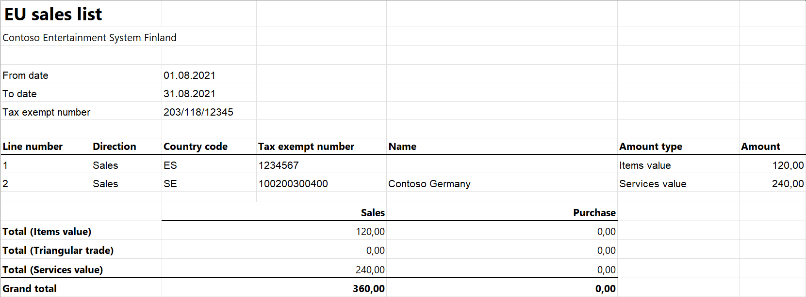

# EU Sales list for Finland

[!include [banner](../../includes/banner.md)]

This article provides information about the European Union (EU) sales list report for Finland. The Finnish EU sales list report contains information about the sale of goods and services for reporting in text format. The following fields are included on the Finnish EU sales list report:

- **EU sales list header:**
    - Date and time of the report creation
    - Information about the software
    - Company VAT ID without country/region code
    - Reporting period
    - Lines number
- **EU sales list lines:**
    - Customer VAT ID
    - Sum of all item invoices by customer
    - Sum of all service invoices by customer
    - Sum of triangular trade by customer
    - Line number

## Setup

For general setup information, see [EU Sales list reporting](../europe/emea-eu-sales-list.md#prerequisites).

> [!NOTE] 
> The value from the **Tax registration number** field on the **Tax registration** FastTab of the **Legal entities** page is used in the .xlsx file for the EU sales list report.

### Set up information about the company

Create a registration type, and assign it to the **VAT ID** registration category for Finland and all the countries or regions that your company does business with, as described in Registration IDs.

1. In Microsoft Dynamics 365 Finance, go to **Organization administration** > **Organizations** > **Legal entities**.
2. In the grid, select your company.
3. On the Action Pane, select **Registration IDs**.
4. On the **Registration ID** FastTab, select **Add**.
5. On the **Overview** tab, in the **Registration type** field, select the registration type that you created.
6. Enter your company's value-added tax (VAT) ID.
7. Optional: On the **General** tab, in the **General** section, change the period that the VAT ID is used for.
8. Close the page.

    > [!NOTE] 
    > If the **Routing number** field in the **Codes** section of the **Bank account information** FastTab or the **VAT exempt number export** field in the **Intrastat** section of the **Foreign trade and logistics** FastTab is set (that is, it isn't blank), the value (primarily the value of the **Routing number** field) will be used, instead of the VAT ID that you created in step 6, in the .txt file for the EU sales list report.

### Import Electronic reporting configurations

- In [Microsoft Dynamics Lifecycle Services (LCS)](https://lcs.dynamics.com/Logon/Index), import the latest versions of the following Electronic reporting (ER) configurations for the EU sales list:
    - EU Sales list model
    - EU Sales list by columns report
    - EU Sales list by rows report
    - EU Sales list (FI)

For more information, see [Download Electronic reporting configurations from Lifecycle Services](../../../fin-ops-core/dev-itpro/analytics/download-electronic-reporting-configuration-lcs.md).

### Set up foreign trade parameters

1. In Finance, go to **Tax** > **Setup** > **Foreign trade** > **Foreign trade parameters**.
2. On the **EU sales list** tab, set the **Report cash discount** option to **Yes** if a cash discount should be included in the value when a transaction is included in the EU sales list.
3. On the **Electronic reporting** FastTab, in the **File format mapping** field, select **EU Sales list (FI)**.
4. In the **Report format mapping** field, select **EU Sales list by rows report** or **EU Sales list by columns report**.
5. On the **Country/region properties** tab, select **New**, and specify the following information:
    - In the **Country/region** column, select **FIN**.
    - In the **Country/region type** column, select **Domestic**.
6. List all the countries or regions that your company does business with. For each country that is part of the EU, in the **Country/region type** field, select **EU**.

## Work with the EU sales list

For general information about the types of transactions that are included in the EU sales list, and how to generate the EU sales list report and close the EU sales list reporting period, see [EU Sales list reporting](../europe/emea-eu-sales-list.md#working-with-the-esl).

### Generate the EU sales list report

1. Go to **Tax** > **Declarations** > **Foreign trade** > **EU sales list**.
2. Transfer transactions.
3. On the Action Pane, select **Reporting**.
4. In the **EU sales list reporting** dialog box, on the **Parameters** FastTab, set the following fields.

    | Field            | Description                                                                         |
    |------------------|-------------------------------------------------------------------------------------|
    | Reporting period | Select **Monthly**.                                                                 |
    | From date        | Select the start date for the report.                                               |
    | Generate file    | Set this option to **Yes** to generate a .txt file for your EU sales list report.   |
    | File name        | Enter the name of the .txt file.                                                    |
    | Generate report  | Set this option to **Yes** to generate an .xlsx file for your EU sales list report. |
    | Report file name | Enter the name of the .xlsx file.                                                   |

5. Select **OK**, and review the generated reports.

## Example

For information about how to create a general setup, create postings, and transfer transactions by using the **DEMF** legal entity for Finland, see Example for generic EU Sales list. However, for this example, create **FI111222999** as the company's VAT ID.

### Create an EU sales list report

1. Go to **Tax** > **Declarations** > **Foreign trade** > **EU sales list**.
2. On the Action Pane, select **Reporting**.
3. In the **EU sales list reporting** dialog box, on the **Parameters** FastTab, set the following fields:
    - In the **Reporting period** field, select **Monthly**.
    - In the **From date** field, select **8/1/2021** (August 1, 2021).
4. Select **OK**, and review the report in text format that is generated. The following tables show the values on the example report.

    **EU sales list header**

    | Field | Value                 | Comment                                                                                          |
    |-------|-----------------------|--------------------------------------------------------------------------------------------------|
    | 000   | VSRALVYV              | The file indicator.                                                                              |
    | 198   | 14092021181209        | The date and time when the report was created (September 14, 2021, at 18:12:09 in this example). |
    | 048   | Microsoft Dynamics Ax | The software.                                                                                    |
    | 014   | \#\#\#\#\#\#\#-\#_AX  | The software ID.                                                                                 |
    | 010   | 111222999             | The company VAT ID without the country/region code.                                              |
    | 052   | 8                     | The reporting month.                                                                             |
    | 053   | 2021                  | The reporting year.                                                                              |
    | 001   | 2                     | The number of lines.                                                                             |

    **EU sales list lines**

    | Field | Line 1 value | Lina 2 value | Comment                                              |
    |-------|--------------|--------------|------------------------------------------------------|
    | 102   | SE           | ES           | The country/region code.                             |
    | 103   | 100200300400 | 12345678     | The customer VAT ID without the country/region code. |
    | 210   | 0            | 120          | The sum of all item invoices by customer.            |
    | 211   | 240          | 0            | The sum of all service invoices by customer.         |
    | 212   | 0            | 0            | The sum of triangular trade by customer.             |
    | 009   | 1            | 2            | The line number.                                     |
    | 999   |              | 1            | The end of file identifier.                          |

5. Review the report in Excel format that is generated.

    

[!INCLUDE[footer-include](../../../includes/footer-banner.md)]
