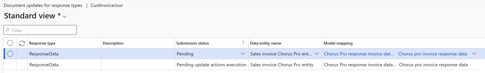

# Get started with Electronic invoicing for France

[!include [banner](../../includes/banner.md)]

Learn more about how to get started with Electronic invoicing for France. This article guides you through the configuration steps that are country/region-dependent in Microsoft Dynamics 365 Finance or Dynamics 365 Supply Chain Management. These steps complement the steps that are described in [Electronic invoicing setup](../global/gs-e-invoicing-set-up-overview.md).

> [!IMPORTANT]
> Starting from September 2024, all Electronic invoicing Globalization features can only be imported into the **Globalization Studio** workspace because Regulatory Configuration Service (RCS) has been decommissioned. For more information about migration to **Globalization Studio**, see [Regulatory Configuration Service merge to the Globalization Studio workspace](../global/workspace/merge-rcs-to-gsw.md)

## Country/region-specific configuration for the French Chorus Pro submission (FR) Electronic invoicing feature

Some steps are required to configure the **French Chorus Pro submission (FR)** Electronic invoicing feature. Some of the parameters from the configuration are published with default values. These values must be reviewed and updated so that they better reflect your business operations.

### Prerequisites

Before you begin the procedures in this article, complete the following prerequisites:

- Become familiar with Electronic invoicing. For more information, see [Electronic invoicing overview](../global/gs-e-invoicing-service-overview.md).
- Do the common part of Electronic Invoicing service configuration as it's described in [Electronic invoicing configuration](../global/gs-e-invoicing-set-up-overview.md).
- Your organization must be registered to operate with Chorus Pro. Microsoft provides integration with Chorus pro in OAuth2 Mode via an application programming interface (API). For detailed information about Chorus Pro registration and application activation, see the [official documentation](https://communaute.chorus-pro.gouv.fr/documentation/help-for-api-developers-in-oauth2-mode/).

    Follow these steps to register with Chorus Pro.

    1. Go to the [PISTE portal](https://piste.gouv.fr/en/component/apiportal/registration) to start your registration. 
    1. Register an application, and activate Open Authorization (OAuth) credentials. For more information, see [Set up a client ID and a client secret](../global/universal-tax-rate-api-how-to-setup-clientid-and-clientsecret.md#create-an-app-registration).
    1. Copy and save the client ID of the OAuth credentials and the secret key. You will use this information in later steps.
    1. Go to the [Chorus Pro portal](https://portail.chorus-pro.gouv.fr/aife_csm/?id=aife_enrollment) to register. 
    1. Create a technical account for API access. For more information, see [Creation of a technical account for API access in production](https://communaute.chorus-pro.gouv.fr/documentation/creation-of-a-technical-account-for-an-api-access-in-production/).
    1. Copy the user ID of the technical account and the password. You will use this information in later steps.

## Country/region-specific configuration of the application setup for the French Chorus Pro submission (FR) Electronic invoicing feature

Some of the parameters from the **French Chorus Pro submission (FR)** electronic invoicing feature are published with default values. 
Before you deploy the electronic invoicing feature to the service environment, add a feature that is based on the Microsoft-provided feature, 
and complete the common parameters on the **Feature parameters** tab. Review and update the default values as required, so that they better reflect your business operations.

For France, there are at least three interactions with Chorus Pro in the pipeline: first to submit the invoice, then to fetch the status, and finally to get the details of the submitted invoice. Each interaction requires common parameters, such as Chorus Pro connection and authentication details. These common parameters are reused in the feature setup for all document types. Chorus Provides provides the values when a company is onboarded.

> [!NOTE]
> The configuration of common parameters is simplified. You no longer have to go to each action and feature setup, and repeatedly specify the common connection parameters. Use of the **Feature parameters** tab is available only as of version 10.0.41 or later.

> [!IMPORTANT]
> The **French Chorus Pro submission (FR)** feature is provided by Microsoft. Before it can be used, additional configuration is required, as described in this article. For information about how to configure invoicing features and apply changes, see [Work with feature setups](../global/gs-e-invoicing-feature-setup.md). For example, in addition to the connection parameters, you can filter specific legal entities so that they are processed in applicability rules. By default, the feature is applicable to all legal entities that have a primary address in France.

1. Import the latest version of the **French Chorus Pro submission (FR)** globalization feature as described in [Import features from the repository](../global/gs-e-invoicing-import-feature-global-repository.md).
1. Create a copy of the imported globalization feature, and select your configuration provider. For more information, see [Create a Globalization feature](../global/gs-e-invoicing-create-new-globalization-feature.md).
1. On the **Versions** tab, verify that the **Draft** version is selected.
1. On the **Feature parameters** tab, specify values for the following connection and integration parameters that are required for interoperation with Chorus Pro's API:
    - In the **Client ID secret name in the KeyVault** field, select the secret name that you created for the client ID in the key vault.
    - In the **Client Secret secret name in the KeyVault** field, select the secret name you created for the client secret in the key vault.
    - In the **Login service URL** field, cpecify the service URL to connect to.
    - In the **Technical account login secret name in the KeyVault** field, select the secret name that you created for technical account sign-in in the key vault.
    - In the **Technical account password secret name in the KeyVault** field, select the secret name that you created for the technical account password in the key vault.
    - Select **URL address to send request**, and confirm the web address.
1. On the **Setups** tab, in the grid, select the **UBL Sales invoice derived** feature setup.
1. Select **Edit**, and then, on the **Processing pipeline** tab, in the **Processing pipeline** section, select **Integrate with French Chorus Pro** with the action name **French Chorus Pro submit**.
1. On the **Processing pipeline** tab, in the **Processing pipeline** section, select **Integrate with French Chorus Pro** with the action name **French Chorus Pro request status**.
1. Review the **Parameters** sections of the pipeline's steps and make adjustments, if needed.
1. Select **Save**, and then close the page.
1. Repeat steps 6 through 10 for the **UBL Project invoice derived** feature setup, **UBL Sales Credit Note derived** feature setup, and **UBL Project Credit Note derived** feature setup.

## Finance configuration

### Prerequisites

- The primary address of the legal entity must be in France.
- The following features must be enabled in Feature management:
    - **Electronic invoicing integration**
    - **E-Invoicing service workspace designer**
    - **(France) Electronic invoicing integration with Chorus Pro**.

> [!NOTE]
> If you want to be able to track the status of submitted documents in Chorus Pro, you must enable two additional features in the **Feature management** workspace: **Extended document identification in submission log** and **Execute update actions for submitted documents**.

### Configure legal entity data

#### Enter a legal entity's address

1. Go to **Organization administration** \> **Organizations** \> **Legal entities**.
2. Select a legal entity, and then, on the **Addresses** FastTab, add a valid French primary address for the legal entity. Make sure that the following mandatory address elements are defined:

    - Country/region code
    - ZIP/postal code
    - City
    - Building number

#### Enter a legal entity and a customer Siret number

Use the information in [NAF codes and siret numbers](emea-fra-naf-codes-siret-numbers.md) and [Set up NAF codes and Siret numbers](fr-00003-naf-codes-siret-numbers.md) to set up NAF codes and Siret numbers. Alternatively, you can use [registration IDs](../europe/emea-registration-ids.md) to set up Siret numbers.

### Set up the project manager account

When you submit work invoices, you can use the **Project manager** party. Before you use it, the new party type must be set up as a customer account. It can then be used when invoices are posted.

Follow these steps to enable the project manager for a project invoice.

1. Go to **Project management and accounting** \> **Projects** \> **Project contracts**.
2. On the **Funding sources** tab, in the **Project manager** field, select a customer account. Then select **Project contracts** \> **Project contracts** \> **Project contracts**.

    > [!NOTE]
    > The **Project manager** field is available only when the funding type is **Customer**.

### Set up Chorus Pro electronic document parameters

You can enable Siret numbers and service code validation before you post and invoice documents.

1. Go to **Organization administration** \> **Setup** \> **Electronic document parameters**.
2. On the **Chorus Pro** tab, add the following information:

    - Web service URL
    - Login service URL
    - Client ID
    - Client secret
    - Technical user name
    - Technical user password

    > [!NOTE]
    > We recommend that you use Azure Key Vault storage to store the secrets. For more information, see [Set up the Azure Key Vault client](../global/setting-up-azure-key-vault-client.md).

3. Enable the **SIRET and service code validation during invoice posting** parameter.
4. In the **Report format** field, select the configurable business document to use when a submission report is printed.

> [!NOTE]
> To create a new submission report instead of customizing a default report, use the **DocumentSubmitted** model name and the **SubmittedInvoice** mapping name for the integration point.

To obtain the latest processing details for the invoice from Chorus Pro in the submission log, you must configure the response types in Finance.

Follow these steps to complete the configuration.

1. Go to **Organization administration** \> **Setup** \> **Electronic document parameters**.
2. On the **Electronic document** tab, add records for the **Customer Invoice journal** and **Project invoice** tables.
3. For each table name, set the **Document context** and **Electronic document model mapping** fields as specified in [Electronic invoicing parameters](../global/gs-e-invoicing-set-up-parameters.md#set-up-electronic-document-parameters).
4. In the **Customer Invoice journal** table name field, select **Response types**.
5. Create a new response type that has the same name that was defined for the related variable in the corresponding feature setups.

    1. In the **Submission status** field, select **Pending**.
    2. In the **Data entity name** field, select **Sales invoice Chorus Pro entity**.
    3. In the **Configuration** field, select **Chorus Pro response invoice data import format (FR)**.

6. Create another new response type that has the same name that was defined for the related variable in the corresponding feature setups.

    1. In the **Submission status** field, select **Pending update actions execution**.
    2. In the **Data entity name** field, select **Sales invoice Chorus Pro entity**.
    3. In the **Configuration** field, select **Chorus Pro response invoice data import format (FR)**.

    

### Define electronic invoice frameworks

1. Go to **Accounts receivable** \> **Setup** \> **Electronic invoice frameworks**.
2. In the **Type** field, enter the electronic invoicing framework.

   If no electronic invoice framework is configured, all invoices are sent as **A1 - simple invoice**. Use the following codes for the invoice framework to attribute work invoices: A4 , A7, A8, A9, A10, A12, A13, A14, and A22. For more information, see [Invoicing framework and transmission modes](https://communaute.chorus-pro.gouv.fr/documentation/submit-works-invoices-for-suppliers-contracting-party-subcontracting-co-contracting/?lang=en#1530527446538-8a6bf25f-3ff8).

3. If **SIRET and service code validation during invoice posting** is enabled, to have more granular control over the validations that run in the invoice posting process, make the following additional setup:

   1. Go to **Accounts receivable** \> **Setup** \> **Electronic invoice frameworks**.
   2. Add the required setup lines to allow users to enable/disable validation per document and party type.
	
      > [!NOTE]
      > Where relevant (Project invoice proposal, Free text invoice, Sales order), **only enabled validations** will be run after selecting the Invoicing framework and during posting when **SIRET and Service code validation during invoice posting** is enabled. When validation for the Service code is enabled, it will validate ONLY when the MOE/MOA SIRET structure requires it, not indiscriminately.

## Issue electronic invoices

After you've completed all the required configuration steps, you can generate and submit electronic invoices for posted invoices. For more information about how to generate electronic invoices, see [Issue electronic invoices in Finance and Supply chain management](../e-invoicing-issuing-electronic-invoices-finance-supply-chain-management.md).

In France, you can add extra information before you run the standard invoice posting procedure. To add extra information for invoices, follow these steps in the applicable business process.

**For sales orders or free text invoices**

1. Go to **Accounts receivable** \> **Orders** \> **All sales orders** or **Accounts receivable** \> **Invoices** \> **All free text invoices**.
2. Switch to the **Header** view, and select the following information:

    - Electronic invoice framework type
    - Invoice account service code

        > [!NOTE]
        > If you enabled the **SIRET and service code validation during invoice posting** parameter in the previous section, the list of available service codes is obtained from Chorus Pro.

    - Project manager

**For project invoices**

1. Go to **Project management and accounting** > **Project invoices** \> **Project invoice proposals**.
2. Open an existing invoice proposal, or create a new one.
3. Switch to the **Header** view, and select the following information:

    - Electronic invoice framework type
    - Funding source service code
    - Project manager
    - Project manager service code

To view the submission results, go to **Organization administration** \> **Periodic** \> **Electronic documents** \> **Electronic document submission log**, and then select **Electronic document** \> **Generate report** to generate a submission report.

## Receive electronic invoices

To import documents from Chorus Pro, go to **Organization administration** \> **Periodic** \> **Electronic documents** \> **Receive electronic documents**. After the import process is completed, the received documents are available in the **Pending vendor invoice** workspace, where you can add more attributes to them as required. Here are some of the attributes that you can add:

- Electronic invoice framework type
- Invoice account service code
- Project manager
- Project manager service code

For more information, see [Use the electronic invoicing service to import vendor invoices](../global/e-invoicing-get-started-import-vendor-invoices.md)

## Additional resources

- [Electronic Invoicing service overview](../global/gs-e-invoicing-service-overview.md)
- [Electronic invoicing configuration](../global/gs-e-invoicing-set-up-overview.md)
- [Work with Globalization features overview](../global/gs-e-invoicing-working-globalization-features.md)
