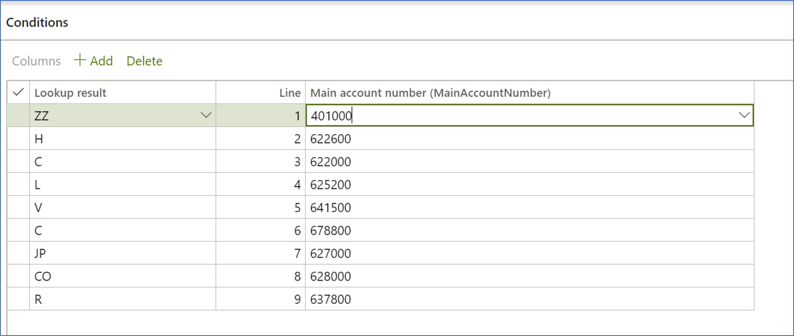

# DAS-2 report

[!include [banner](../../includes/banner.md)]

French legal entities that do business with self-employed professionals must provide a DAS-2 declaration report to the tax authorities. The DAS-2 report is an annual fiscal declaration that includes all payments to vendors of this type that exceed 1,200 euros. The report should be generated in Microsoft Excel format. After the report is generated, you save the file in your third-party software environment. The file will then be validated, converted into the electronic data interchange (EDI) structure, and transmitted.

The DAS-2 Excel report is generated by using by using the Electronic reporting (ER) tool. It includes the following worksheets:

- **Details** – All vendor invoices that were paid during the selected period and by using a specific vendor profile that has a DAS-2 classification
- **Summary by vendor** – The DAS-2 declaration grouped by vendor. Each column represents the amounts per DAS-2 classification.
- **DAS-2 form** – A summary of the declaration for each vendor. There is one form for each vendor.

Before you generate the report for the first time, you must download the following models and formats from Microsoft Dynamics Lifecycle Services (LCS):

- Statistics on invoices.version.36.xml or later versions.
- Statistics on invoices model mapping.version.36.37.xml or later versions.
- Statistics on invoices for DAS-2 model mapping.version.36.37.8 or later versions. This derived model supports partial payments and amounts with taxes.
- DAS-2 report.version.36.30 (FR) or later versions.
- DAS-2 form.version.36.30.15 (FR) or later versions.

> [!NOTE]
> For more information about how to download ER formats, see [Download Electronic reporting configurations from Lifecycle Services](../../../fin-ops-core/dev-itpro/analytics/download-electronic-reporting-configuration-lcs.md).

After you've finished downloading the ER configurations from LCS, follow these steps.

1. In Microsoft Dynamics 365 Finance, select the related French company.
2. Go to **Workspaces** \> **Electronic reporting**, and set the **Microsoft** provider to **Active**.
3. Select **Configurations** \> **Exchange**, and load the configurations from the XML files to import the Statistics model, model mapping, DAS-2 report and DAS-2 form format file.
4. Select **DAS-2 report** format.
5. In the **Electronic reporting** workspace, select **Configurations** \> **Setup**.
6. On the **Conditions** tab, select version **36.30** or later, and create the configuration that will let you set up the mapping between the main accounts that are configured in your company and the related tax authority classification of the DAS-2 report.

    1. In the **Lookup result** field, select the related classification.
    2. In the **Main account** field, select the main account that is used to post the related transactions that belong to the selected classification.
    3. Set the **Status** field to **Completed**.

### Example

]

On line 1 of the preceding configuration, main account **622000**, which is used to post fee expense transactions, is mapped to classification **C** (**Commissions**), which is established by the tax authority.

Line 5 includes the configuration that has the classification **ZZ** and is mapped to **Not Blanks**. It's used when the invoice journal has other expense transactions that won't be detailed on the DAS-2 report. This line should always be the last line. If you need to introduce additional classifications, remove this line and introduce the new ones.

> [!NOTE]
> Create the same configuration for the DAS-2 form format.

## Vendor configuration

Because the report includes the SIRET Système d'identification du répertoire des établissements (SIRET) registration and profession, follow these steps to add the related information.

1. Go to **Accounts payable > Vendors > All vendors**.
2. Select the vendor record that you want to update.
3. Expand the **Purchasing demographics** section.
4. Select **Edit**.
5. In the **French Siret** fields, type a value.
6. In the **NAF code** field, type a value to identify the profession.

## Statistics on invoices process

Before you generate DAS-2 report, run the process **Statistic on invoices** to calculate and generate all transactions that will be reported in the DAS-2 declaration. You can run the process in real time or schedule it to run in the background by using batch processing.

1. Go to **Accounts payable** > **Periodic tasks** > **Statistics on invoices**.
2. Select **Calculate statistics**.
3. Select the from and to dates.
4. Select the vendor posting profile. Vendor posting profiles let you easily include vendor transactions for all vendors, a group of vendors, or a single vendor on the report that is generated. This option allows you to select multiple vendor posting profiles and is required. 
5. Optional, select the vendor group. This selection allows you to introduce an additional transaction filter.  
6. Select **OK** to run the process.

## Generate the DAS-2 report

Follow these steps to generate the tax declaration report.

1. Go to **Accounts payable** \> **Inquiries and reports** \> **DAS-2 report**.
2. Select the format for the report:

    - **DAS-2 report (FR)** – Generate a detailed report that includes all transactions.
    - **DAS-2 form (FR)** – Generate a separate report for each vendor.

3. Select the from and to dates.
4. Select the vendor posting profile. 
5. Select the vendor group.

> [!NOTE]
> The DAS-2 report doesn't support transactions that are created and posted from a general journal entry, the accrual schema scenario, or one voucher functionality. 

[!INCLUDE[footer-include](../../../includes/footer-banner.md)]
