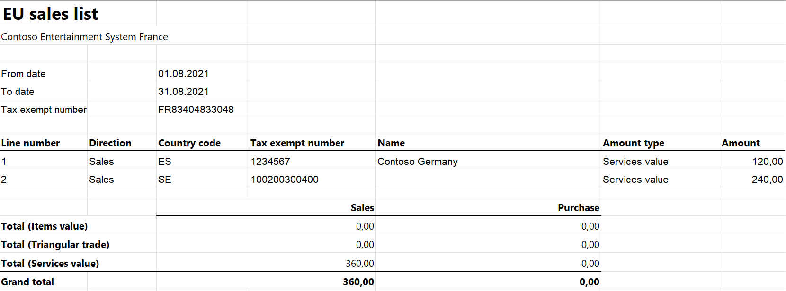

# EU Sales list for France

[!include [banner](../../includes/banner.md)]

This article provides information about the European Union (EU) sales list report for services (Déclaration européenne de services [DES]). The French EU sales list report contains information about the sale of services for reporting in XML format.

The following fields are included on the French EU sales list report:

- **EU sales list header:**

    - Company VAT ID
    - Reporting month
    - Reporting year

- **EU sales list lines:**

    - Customer VAT ID
    - Total amount of services

## Setup

For general setup information, see [EU Sales list reporting](../europe/emea-eu-sales-list.md#prerequisites).

### Set up company information

Create a registration type, and assign it to **VAT ID** registration category for France and all the countries or regions that your company does business with. For more information, see [Registration IDs](../europe/emea-registration-ids.md).

1. Go to **Organization administration** > **Organizations** > **Legal entities**.
2. In the grid, select your company.
3. On the Action Pane, select **Registration IDs**.
4. On the **Registration ID** FastTab, select **Add**.
5. On the **Overview** tab, in the **Registration type** field, select the registration type that you created.
6. Enter your company's value-added tax (VAT) ID.
7. Optional: On the **General** tab, in the **General** section, change the period when the VAT ID is used.
8. Close this page.

> [!NOTE] 
> If the **VAT exempt number export** field in the **Intrastat** section on the **Foreign trade and logistics** FastTab is set (that is, it isn't blank), that value will be used, instead of the VAT ID that you created, in the .xml and .xlsx files for the EU sales list report.

### Import Electronic reporting configurations

In [Microsoft Dynamics Lifecycle Services (LCS)](https://lcs.dynamics.com/Logon/Index), import the latest version of the following Electronic reporting (ER) configurations for the EU sales list:

- EU Sales list model
- EU Sales list by columns report
- EU Sales list by rows report
- EU Sales list (FR)

For more information, see [Download Electronic reporting configurations from Lifecycle Services](../../../fin-ops-core/dev-itpro/analytics/download-electronic-reporting-configuration-lcs.md).

### Set up foreign trade parameters

1. In Dynamics 365 Finance, go to **Tax** > **Setup** > **Foreign trade** > **Foreign trade parameters**.
2. On the **EU sales list** tab, set the **Report cash discount** option to **Yes** if a cash discount should be included in the value when a transaction is included in the EU sales list.
3. On the **Electronic reporting** FastTab, in the **File format mapping** field, select **EU Sales list (FR)**.
4. In the **Report format mapping** field, select **EU Sales list by rows report** or **EU Sales list by columns report**.
5. On the **Country/region properties** tab, select **New**, and set the following fields:

    - In the **Country/region** field, select **FRA**.
    - In the **Country/region type** field, select **Domestic**.

6. List all the countries or regions that your company does business with. For each country that is part of the EU, in the **Country/region type** field, select **EU** to show trade with those countries on the **EU sales list** page.

### Set up sales tax groups

1. Go to **Tax** > **Indirect taxes** > **Sales tax** > **Item sales tax groups**.
2. Create a sales tax group to use when lines are created for the report.
3. In the **Reporting type** field, select **Service**.

## Work with the EU sales list

For general information about which types of transactions are included in the EU sales list, how to generate the EU sales list report, and how to close the EU sales list reporting period, see [EU Sales list reporting](../europe/emea-eu-sales-list.md#working-with-the-esl).

### Generate the EU sales list report

1. Go to **Tax** > **Declarations** > **Foreign trade** > **EU sales list**.
2. Transfer service transactions in the usual way.
3. On the Action Pane, select **Reporting**.
4. In the **EU sales list reporting** dialog box, on the **Parameters** FastTab, set the following fields.

    | Field            | Description                                                                         |
    |------------------|-------------------------------------------------------------------------------------|
    | Reporting period | Select **Monthly**.                                                                 |
    | From date        | Select the start date for the report.                                               |
    | Generate file    | Set this option to **Yes** to generate an .xml file for your EU sales list report.  |
    | File name        | Enter the name of the .xml file.                                                    |
    | Generate report  | Set this option to **Yes** to generate an .xlsx file for your EU sales list report. |
    | Report file name | Enter the name of the .xlsx file.                                                   |

5. Select **OK**, and review the generated reports.

## Example

For information about how to create a general setup, create postings, and transfer transactions by using the **DEMF** legal entity for France, see [Example for generic EU Sales list](../europe/emea-eu-sales-list-example.md). However, for the example in this article, create **FR83404833048** as the company's VAT ID. Additionally, create postings by using item sales tax groups where the **Reporting type** field is set to **Service**.

### Create an EU sales list report

1. Go to **Tax** > **Declarations** > **Foreign trade** > **EU sales list**.
2. On the Action Pane, select **Reporting**.
3. In the **EU sales list reporting** dialog box, on the **Parameters** FastTab, set the following fields:

    - In the **Reporting period** field, select **Monthly**.
    - In the **From date** field, select **8/1/2021** (August 1, 2021).
    - Set the **Generate file** option to **Yes**.
    - In the **File name** field, enter **FR-001F**.
    -   Set the **Generate report** option to **Yes**.
    -   In the **Report file name** field, enter **FR -001R**.

4. Select **OK**, and review the report in XML format that is generated. The following tables show the values on the example report.

   **EU sales list header**

   | Field           | Value         |
   |-----------------|---------------|
   | Group number    | 000001        |
   | Company VAT ID  | FR83404833048 |
   | Reporting month | 08            |
   | Reporting year  | 2021          |

   **EU sales list lines**

   | Field                           | Line 1 value | Line 2 value   |
   |---------------------------------|--------------|----------------|
   | Line number                     | 000001       | 000002         |
   | Sum of all invoices by customer | 120.00       | 240.00         |
   | Customer VAT ID                 | ES1234567    | SE100200300400 |

5.  Review the report in Excel format that is generated.

    
    

[!INCLUDE[footer-include](../../../includes/footer-banner.md)]
