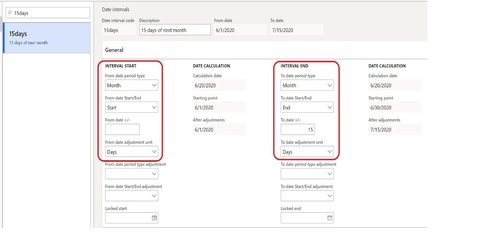
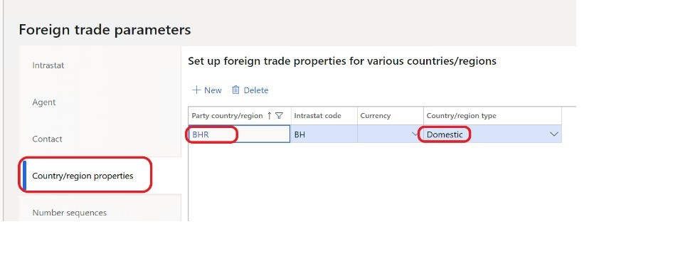
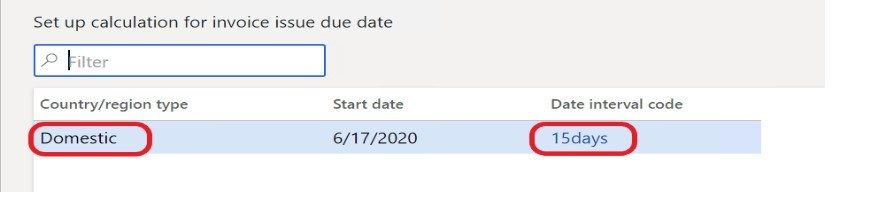
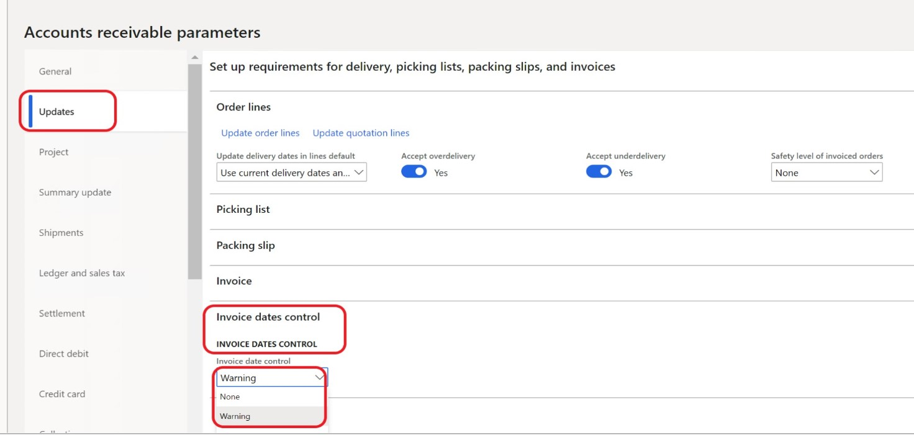

# Invoice issue deadline (GBL)

[!include [banner](../includes/banner.md)]

[!include [banner](../includes/preview-banner.md)]

This article explains how to configure Microsoft Dynamics 365 Finance so that it complies with legal requirements for the invoice issue deadline. For example, legislation can require that an invoice be issued no later than the fifteenth day of the month after the month when the sale occurs.

## Prerequisites

In the **Feature management** workspace, turn on the **Invoice issue deadline availability** feature. This feature is available for all countries and regions in version 10.0.15 and later.

For more information about how to turn on features, see [Feature management overview](../../fin-ops-core/fin-ops/get-started/feature-management/feature-management-overview.md).

> [!NOTE]
> This feature is the same as the out-of-box feature for European Union (EU) countries/regions. For more information, see [Invoice issue deadline](emea-invoice-issue-deadline.md).

## Setup

Follow these steps to set up the functionality for the invoice issue deadline.

1. Go to **General ledger** \> **Ledger setup** \> **Date intervals**.
2. On the **Date intervals** page, create a date interval.
3. On the **General** FastTab, in the **Interval start** and **Interval end** sections, set the fields to appropriate values.

    

    > [!NOTE]
    > The preceding illustration shows an interval of 15 days. If the date interval is set up in this way, the deadline for issuing the invoice will be the fifteenth day of the month after the month when the packing slip is issued. If you leave the **To date period type** and **To date Start/End** fields in the **Interval end** section blank, the deadline for issuing the invoice will be the fifteenth day after the packing slip is issued.

4. Go **Tax** \> **Setup** \> **Foreign trade**.
5. On the **Foreign trade parameters** page, on the **Country/region properties** tab, select **New**.
6. On the line for the new record, in the **Party country/region** field, select a country or region. Then, in the **Country/region type** field, select the type of country or region. For example, select **Domestic**.

    

7. Go to **Accounts receivable** \> **Setup** \> **Set up calculation for invoice issue date** or **Accounts payable** \> **Setup** \> **Set up calculation for invoice issue date**.
8. On the **Set up calculation for invoice issue due date** page, create a record.
9. Set the **Country/region type** and **Date interval code** fields.

    In the following illustration, the validation for the invoice issue deadline is applicable to posted packing slips or product receipts that have a domestic address.

    

10. Go to **Accounts receivable** \> **Setup** \> **Parameters**.
11. On the **Accounts receivable parameters** page, on the **Updates** tab, on the **Invoice date control** FastTab, in the **Invoice date control** field, select one of the following values:

    - **None** – Date control isn't run.
    - **Warning** – The invoice is posted, but a warning message appears afterward.
    - **Error** – The invoice isn't posted, and an error message appears.

    > [!NOTE]
    > If you select **Warning** or **Error**, the validation is applicable to sales invoices that were posted based on packing slips.

    

Based on the settings, the system enters a value in the **Invoice issue due date** field in the packing slip journal and the product receipt journal. You can view all the packing slips that aren't yet invoiced by going to **Sales and marketing** \> **Sales orders** \> **Order shipping** \> **Packing slip not invoiced**. You can view all the product receipts that aren't yet invoiced by going to **Procurement and sourcing** \> **Purchase orders** \> **Receiving products** \> **Product receipt not invoiced**.

> [!NOTE]
> If you set the **Invoice date control** field on the **Accounts receivable parameters** page to **None**, the system leaves the **Invoice issue due date** field in the packing slip journal blank.

[!INCLUDE[footer-include](../../includes/footer-banner.md)]
