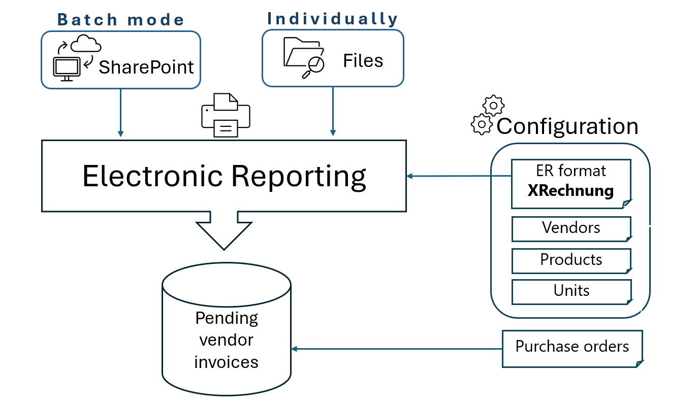

# Vendor electronic invoices in Germany

[!include [banner](../../includes/banner.md)]

This article provides information to help you get started with the import of incoming vendor electronic invoices in the Germany-specific **xRechnung** format based on the Universal Business Language (UBL) syntax in Microsoft Dynamics 365 Finance to comply with the country regulatory requirements.

The functionality is based on **Electronic Reporting** framework and implements the import workflow described in the diagram below.

## Configuration and usage of vendor electronic invoices import

For more information how to configure and use vendor electronic invoices import in Germany, see [Import vendor electronic invoices](../europe/emea-peppol-import.md).

> [!NOTE]
> The article covers the import of incoming electronic invoices in several supported formats including Germany-specific **xRechnung** format.

## More resources

- Watch the video how to import vendor electronic invoices into Microsoft D365 Finance.

  > [!VIDEO 2167036b-ff87-4473-9bf3-e2902cbdb21f]

- [Customer electronic invoices in Germany](emea-deu-cust-e-invoices.md)

[!INCLUDE[footer-include](../../../includes/footer-banner.md)]

