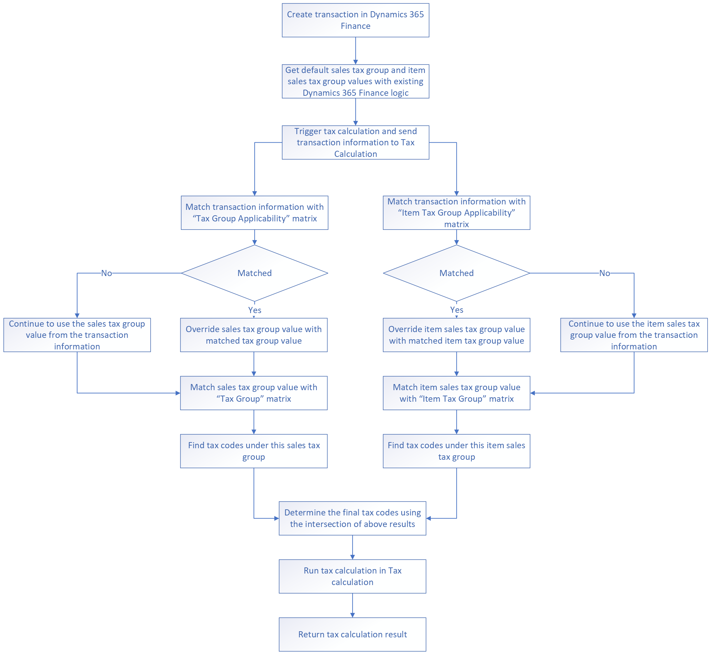

# Get started with Tax Calculation

[!include [banner](../includes/banner.md)]

This article provides information about how to get started with Tax Calculation. The sections in this article guide you through the high-level design and configuration steps in Microsoft Dynamics Lifecycle Services (LCS), Regulatory Configuration Service (RCS), Dynamics 365 Finance, and Dynamics 365 Supply Chain Management. 

The setup consists of three main steps.

1. In LCS, install the Tax Calculation add-in.
2. In RCS, set up the Tax Calculation feature. This setup isn't specific to a legal entity. It can be shared across legal entities in Finance and Supply Chain Management.
3. In Finance and Supply Chain Management, set up the Tax Calculation parameters by legal entity.

## High-level design

###  Runtime design

The following illustration shows the high-level runtime design of Tax Calculation. Because Tax Calculation can be integrated with multiple Dynamics 365 apps, the illustration uses the integration with Finance as an example.

1. A transaction, such as a sales order or purchase order, is created in Finance.
2. Finance automatically uses the default values of the sales tax group and the item sales tax group.
3. When the **Sales tax** button is selected on the transaction, the tax calculation is triggered. Finance then sends the payload to the Tax Calculation service.
4. The Tax Calculation Service matches the payload with predefined rules in the tax feature to find a more accurate sales tax group and item sales tax group simultaneously.

    - If the payload can be matched with the **Tax Group Applicability** matrix, it overrides the sales tax group value with the matched tax group value in the applicability rule. Otherwise, it continues to use the sales tax group value from Finance.
    - If the payload can be matched with the **Item Tax Group Applicability** matrix, it overrides the item sales tax group value with the matched item tax group value in the applicability rule. Otherwise, it continues to use the item sales tax group value from Finance.

5. The Tax Calculation Service determines the final tax codes by using the intersection of the sales tax group and the item sales tax group.
6. The Tax Calculation Service calculates tax, based on the final tax codes that it determined.
7. The Tax Calculation Service returns the tax calculation result to Finance.

### High-level configuration

The following steps provide a high-level overview of the configuration process for the Tax Calculation Service.

1. In LCS, install the **Tax Calculation** add-in in your LCS project.
2. In RCS, create the **Tax Calculation** feature.
3. In RCS, set up the **Tax Calculation** feature:

    1. Select the tax configuration version.
    2. Create tax codes.
    3. Create a tax group.
    4. Create an item tax group.
    5. Optional: Create tax group applicability if you want to override the default sales tax group that is entered from customer or vendor master data.
    6. Optional: Create item group applicability if you want to override the default item sales tax group that is entered from the item master data.

4. In RCS, complete and publish the **Tax Calculation** feature.
5. In Finance, select the published **Tax Calculation** feature.

After you complete these steps, the following setups are automatically synced from RCS to Finance.

- Sales tax codes
- Sales tax groups
- Item sales tax groups

The remaining sections in this article provide more detailed configuration steps.

## Prerequisites

Before you can complete the remaining procedures in this article, the following prerequisites must be met:<!--TO HERE-->

- You must have access to your LCS account, and you must have a deployed LCS project that has a Tier 2 or above environment that runs Dynamics 365 version 10.0.21 or later.
- You must create an RCS environment for your organization, and you must have access to your account. For more information about how to create a RCS environment, see [Regulatory Configuration Service Overview](rcs-overview.md).
- The following features must be turned on in the **Feature management** workspace of your deployed Finance or Supply Chain Management environment, based on your business needs:

    - Tax Calculation Service
    - Support multiple VAT registration numbers
    - Tax in transfer order

- The following features must be turned on in the **Feature management** workspace of your deployed RCS environment.

    - Globalization features

- The following roles should be assigned as appropriate to the users in your RCS environment:

    - Electronic reporting developer
    - Globalization feature developer
    - Tax engine developer
    - Tax engine functional consultant
    - Tax service developer

## Set up Tax Calculation in LCS

1. Sign in to [LCS](https://lcs.dynamics.com)
2. Complete the setup for Microsoft Power Platform integration. For more information, see [Add-ins overview](../../fin-ops-core/dev-itpro/power-platform/add-ins-overview.md).
3. Select one of your deployed environments, and then select **Install a new add-in**.
4. Select **Tax Calculation**.
5. Read and agree to the terms and conditions, and then select **Install**.

## Set up Tax Calculation in RCS

The steps in this section aren't related to a specific legal entity. You must complete this procedure only one time, and you can complete it in any legal entity in RCS.

1. Sign in to [RCS](https://marketing.configure.global.dynamics.com/).
2. In the **Electronic reporting** workspace, add a new configuration provider. Use your company name as the name of the provider. For more information, see [Create configuration providers and mark them as active](../../fin-ops-core/dev-itpro/analytics/tasks/er-configuration-provider-mark-it-active-2016-11.md).
3. Select the configuration provider that you just created, and then select **Set active**.
4. Select the **Microsoft** configuration provider, and then select **Repositories**.
5. In the **Type** field, select **Global**.
6. Select **Open**.
7. Go to **Tax Data Model**, expand the file tree, and then select **Tax Configuration**.
8. Select the correct [tax configuration version](global-tax-calcuation-service-overview.md#versions), based on you Finance version, and then select **Import**.
9. In the **Globalization features** workspace, select **Features**, select the **Tax Calculation** tile, and then select **Add**.

    > [!NOTE]
    > In version 10.0.26 and later, you can import a demo feature for the **DEMF** demo legal entity. For more information, see [Import feature demo data](tax-calculation-import-export-feature.md).

10. Select one of the following feature types:

    - **New feature** – Create a feature setup that has blank content.
    - **Based on existing feature** – Create a feature from an existing feature, and copy the content from the existing feature setup.

11. Enter a name and description for the feature, and then select **Create feature**.

    After the feature is created, a draft version of it is automatically created. You can select **Get this version** to rebase the draft version on any completed version.

12. Select the draft version of the feature, and then select **Edit**. The **Tax Calculation setup** page is filled in.
13. Select **Configuration version**. You should see the configuration version that you imported in step 8.

    Microsoft provides a default tax configuration for tax calculation. This configuration covers most of the requirements for tax calculation behaviors. It will be updated based on market feedbacks. If you must extend the configuration to meet specific requirements, see [How to build extension in tax service](./tax-service-add-data-fields-tax-integration-by-extension.md) for information about how to generate and select your own tax configuration.

14. After you select **Configuration version**, several additional tabs appear. Follow the order that is shown here to complete the mandatory tab setup.

    **Mandatory setup**

    - **Tax codes** – Maintain master data for tax codes. All tax codes that are created on this tab are automatically synchronized to Finance when you enable the current version.
    - **Tax group** – Define the tax group master data and the tax codes under the group.
    - **Item tax group** – Define the item tax group master data and the tax codes under the group.

    **Optional setup**

    - **Tax group applicability** – Define a matrix that determines the tax group. If no applicability rules in this matrix match the taxable document from Dynamics 365, Tax Calculation uses the default value on the taxable document line.
    - **Item tax group applicability** – Define a matrix that determines the item tax group. If no applicability rules in this matrix match the taxable document from Dynamics 365, Tax Calculation uses the default value on the taxable document line.
    - **Customer tax registration number applicability** – If you have multiple tax registration numbers for one customer, Tax Calculation can automatically determine the correct tax registration number. In the matrix on this tab, define the rules that should be used to make the determination. Otherwise, Finance and Supply Chain Management will continue to use the default tax registration number on taxable documents for sales transactions.
    - **Vendor tax registration number applicability** – If you have multiple tax registration numbers for one vendor, Tax Calculation can automatically determine the correct tax registration number. In the matrix on this tab, define the rules that should be used to make the determination. Otherwise, Finance and Supply Chain Management will continue to use the default tax registration number on taxable documents for purchase transactions.
    - **List code applicability** – Automatically determine the value of the **List code** field through more flexible and configurable rules. In the matrix on this tab, define the rules that should be used to make the determination. Otherwise, Finance and Supply Chain Management will continue to use the default code on taxable documents.

15. On the **Tax codes** tab, select **Add**, and enter the tax code and a description.
16. Select **Tax component**. The tax component is a group of methods that were defined in the previous version of the selected tax configuration. The following tax components are available:

    - By net amount
    - By gross amount
    - By quantity
    - By margin
    - Tax on tax

17. Select **Save**. More fields become available, based on the tax component that you selected.
18. Use the following options to identify the nature of the tax code:

    - Is exempt
    - Is use tax
    - Is reverse charge
    - Exclude from base amount calculation

    For a use tax scenario, set up a single tax code that has a positive tax rate, and mark it as **Is use tax**.

    For a reverse charge scenario, set up two tax codes, one of which has a positive tax rate, and the other of which has a negative tax rate but the same rate value. Mark the negative tax code as **Is reverse charge**. For more information about the reverse charge solution in Finance, see [Reverse charge mechanism for VAT/GST scheme](emea-reverse-charge.md).

    For some tax types that should be excluded from the calculation of the tax base amount for price-inclusive transactions (for example, custom duty in some countries or regions), select the **Exclude from Base Amount Calculation** checkbox. For more information about this parameter, see [Calculating tax on top of price when Prices include taxes is enabled](global-exclude-from-tax-base-amount-calculation.md).

    Maintain tax rates and the tax amount limits for this tax code.

19. Repeat steps 15 through 18 to add all other tax codes that are required.
20. On the **Tax group** tab, select the **Tax group** column, add it to the matrix as the input condition, and then add lines to maintain the tax group master data.

    Here is an example.

    | Tax group    | Tax codes           |
    | ------------ | ------------------- |
    | DEU_Dom | DEU_VAT19; DEU_VAT7 |
    | DEU_EU       | DEU_Exempt          |
    | BEL_Dom | BEL_VAT21; BEL_VAT6 |
    | BEL_EU       | BEL_Exempt          |

21. On the **Item tax group** tab, select **Item tax group** column, add it to the matrix as the input condition, and then add lines to maintain the item tax group master data.

    Here is an example.

    | Item tax group | Tax codes                                    |
    | -------------- | -------------------------------------------- |
    | Full           | DEU_VAT19; BEL_VAT21; DEU_Exempt; BEL_Exempt |
    | Reduced        | DEU_VAT7; BEL_VAT6; DEU_Exempt; BEL_Exempt   |

22. On the **Tax group applicability** tab, select the columns that are required to determine the correct tax group, and then select **Add**. Enter or select values for each column. The **Tax group** field will be the output of this matrix. If this tab isn't configured, the sales tax group on the transaction line will be used.

    Here is an example.

    | Business process | Ship from | Ship to | Tax group    |
    | ---------------- | --------- | ------- | ------------ |
    | Sales            | DEU       | DEU     | DEU_Dom |
    | Sales            | DEU       | FRA     | DEU_EU       |
    | Sales            | BEL       | BEL     | BEL_Dom |
    | Sales            | BEL       | FRA     | BEL_EU       |
    
    > [!NOTE]
    > If the default sales tax group on your taxable document lines is correct, leave this matrix blank. For more information, see the [Runtime design](#runtime) section in this article.

23. On the **Item tax group applicability** tab, select the columns that are required to determine the correct tax code, and then select **Add**. Enter or select values for each column. The **Item tax group** field will be the output of this matrix. If this tab isn't configured, the item sales tax group on the transaction line will be used.

    Here is an example.

    | Item code | Item tax group |
    | --------- | -------------- |
    | D0001     | Full           |
    | D0003     | Reduced        |

    > [!NOTE]
    > If the default item sales tax group on your taxable document lines is correct, leave this matrix blank. For more information, see the [Runtime design](#runtime) section in this article.

    For more information about how tax codes are determined in Tax Calculation, see [Sales tax group and item sales tax group determination logic](global-sales-tax-group-determination.md).

24. Set up the applicability of customer tax registration numbers, vendor tax registration numbers, and list codes based on the business needs.
25. Select **Save**, and then close the page.
26. Select **Change status** \> **Complete**. After the status is changed to **Complete**, the version can no longer be edited.
27. Select **Change status** \> **Publish**. This version of the tax feature setup will be pushed to the global repository and will be visible to each legal entity in Finance.

## Set up Tax Calculation in Dynamics 365

After you complete the setup in RCS, you will have a published version of the tax feature. Follow these steps to set up Tax Calculation in Finance.

The setup in this section is done by legal entity. You must configure it for each legal entity that you want to enable Tax Calculation for in Finance.

1. In Finance, go to **Tax** \> **Setup** \> **Tax configuration** \> **Tax calculation parameters**.
2. On the **General** tab, set the following fields:

    - **Enable Tax Calculation Service** – Select this checkbox to enable Tax Calculation for the legal entity. If it isn't enabled for the current legal entity, the legal entity will continue to use the existing tax engine to determine and calculate tax.
    - **Feature setup** – Select a published tax feature setup and version for the legal entity. For more information about how to set up and complete a published tax feature, see the previous section of this article.
    - **Business Process** – Select the business processes to enable.

3. On the **Calculation** tab, define the expected rounding rule for the legal entity. For more information about the rounding logic, see [Tax calculation rounding rules](https://go.microsoft.com/fwlink/?linkid=2166988).
4. On the **Error handling** tab, define the expected error handling method for the legal entity. Three options are available:

    - No
    - Warning
    - Error

    You can set up an error handling method for each result code in the **Details** section. Alternatively, if some result codes aren't synchronized from the tax calculation service, you can set up a default method in the **General** section.

5. On the **Multiple VAT registration** tab, you can turn on VAT declaration, EU Sales List, and Intrastat separately to work under a multiple VAT registrations scenario. For more information about tax reporting for multiple VAT registrations, see [Reporting for multiple VAT registrations](emea-reporting-for-multiple-vat-registrations.md).
6. Save the setup, and repeat the previous steps for each additional legal entity. When a new version is published, and you want it to be applied, set the **Feature setup** field on the **General** tab of the **Tax calculation parameters** page (see step 2).
