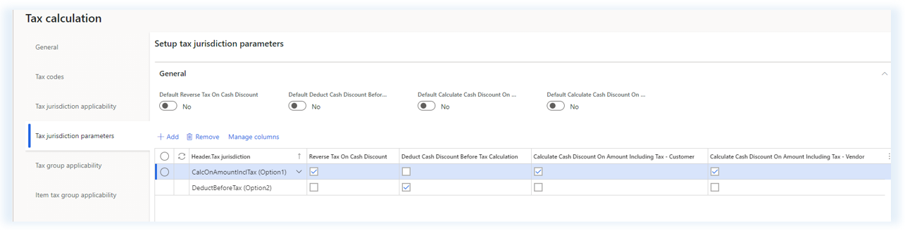
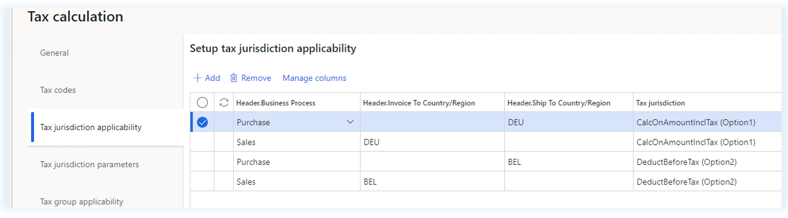

---
# required metadata

title: Using tax jurisdiction parameters for cash discount calculation setup
description: This topic provides information about the setup of cash discount calculation options.
author: epodkolz
ms.date: 10/13/2021
ms.topic: article
ms.prod: 
ms.technology: 

# optional metadata

# ms.search.form: 
# ROBOTS: 
audience: Application User
# ms.devlang: 
ms.reviewer: kfend
ms.search.scope: Core, Operations
# ms.tgt_pltfrm: 
# ms.custom: 
ms.search.region:
# ms.search.industry: 
ms.author: epodkolz
ms.search.validFrom:
ms.dyn365.ops.version: AX 10.0.23
---

# Using Tax jurisdiction parameters for Cash discount calculation setup

[!include [banner](../includes/banner.md)]

[!include [banner](../includes/preview-banner.md)]

This topic provides information about the setup of cash discount calculation options.
When a single legal entity has several VAT registrations in different countries/regions, the requirements for calculating cash discounts and sales tax may vary between these countries/regions. If different cash discount calculation options are required for different VAT registrations, set up the options in the **Tax calculation** page on the **Tax jurisdictions parameters** and **Tax jurisdictions applicability** tabs.

## Tax jurisdictions parameters setup
Dynamics 365 Finance supports the following generic combinations of cash discount calculation.

| Parameter/Option| Option1 | Option2 |
|-----------------------------------------------|-----|-----|
| Reverse sales tax on cash discount | Yes | No |
| Deduct cash discount before sales tax calculation | No | Yes |
| Cash discount is calculated on amount including sales tax (Parameter is available for Customer and Vendor side) | Yes | No |

> [!NOTE]
> The parameters **Deduct Cash Discount Before Tax Calculation** and **Calculate Cash Discount On Amount Including Tax** are mutually exclusive.
Currently, the tax calculation setup in RCS doesn’t support the cross-measure validation. The validation is in Finance when the parameters from the Tax calculation service are being retreived.
> 
> For a tax jurisdiction code, don't mark both **Deduct Cash Discount Before Tax Calculation** and **Calculate Cash Discount On Amount Including Tax** parameters as **Yes** on the **Tax calculation** page.

To set up the cash discount calculation option on the **Tax calculation** page, create a tax jurisdiction code on the **Tax jurisdiction parameters** tab.

The default parameters on the **General** tab are used if no matching rule on the **Tax jurisdiction applicability** tab is found.
Use the fields on the **Tax jurisdiction applicability** tab to create rules when a cash discount calculation option should be applied. You can pick header-level fields for the determination.

### Example - Cash discount parameters setup
To determine a tax jurisdiction code, you can use **Ship To/Ship From Country/Region** or **Invoice To country/Region**. When you create a sales order for a customer in DEU, **Option1** is selected, where the customer in BEL is **Option2**. 

The following table shows the results of the cash discount and sales tax calculation for the sales order with a net amount of 1000 and a 4% cash discount.
For tax calculation purposes, the tax rates used for **Option1** is 19% and 21% for **Option2**.

| Sales order / Tax jurisdiction code| Option1| Option2|
|-----------------------------------------------|-----|-----|
| Net amount | 1 000 | 1 000 |
| Invoice Amount | 1 190 | 1201.60 |
| Sales tax amount | 190 (1000 x 19%) | 201.60 ((1000-40) x 21%) |
| Cash discount amount | 47.60 (1190 x 4%) | 40 (1000 x 4%) |

