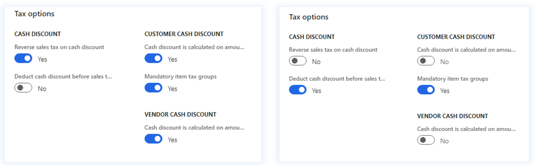
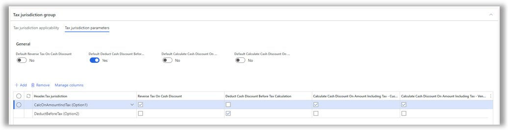
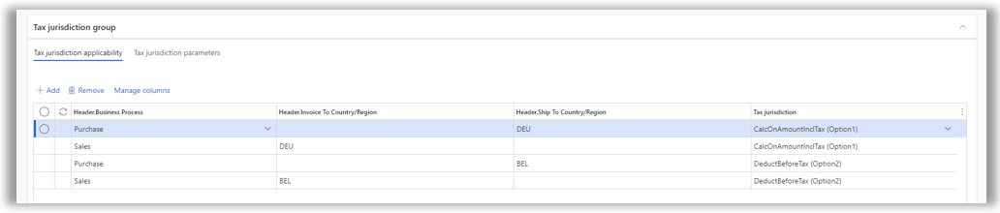

---
# required metadata

title: Tax jurisdiction parameters for cash discount calculation setup
description: This topic provides information about the setup of cash discount calculation options.
author: epodkolz
ms.date: 04/05/2022
ms.topic: article
ms.prod: 
ms.technology: 

# optional metadata

# ms.search.form: 
# ROBOTS: 
audience: Application User
# ms.devlang: 
ms.reviewer: kfend
ms.search.scope: Core, Operations
# ms.tgt_pltfrm: 
# ms.custom: 
ms.search.region:
# ms.search.industry: 
ms.author: epodkolz
ms.search.validFrom:
ms.dyn365.ops.version: AX 10.0.23
---

# Tax jurisdiction parameters for cash discount calculation setup

[!include [banner](../includes/banner.md)]

This topic provides information about the setup of cash discount calculation options.

When a single legal entity has several value-added tax (VAT) registrations in different countries or regions, the requirements for calculating cash discounts and sales tax might vary by country or region. If different cash discount calculation options are required for different VAT registrations, set up the options on the **Tax jurisdiction parameters** and **Tax jurisdiction applicability** tabs of the **Tax calculation** page.

## Tax jurisdiction parameters setup

Microsoft Dynamics 365 Finance supports the following generic combinations of cash discount calculation options.

| Parameter | Option1 | Option2 |
|---|---|---|
| Reverse sales tax on cash discount | Yes | No |
| Deduct cash discount before sales tax calculation | No | Yes |
| 
Cash discount is calculated on amount including sales tax

(This parameter is available for both the customer side and the vendor side.)
 | Yes | No |

The following illustration shows the parameter setup for both options.

> [!NOTE]
> The **Deduct Cash Discount Before Tax Calculation** and **Calculate Cash Discount On Amount Including Tax** parameters are mutually exclusive.
>
> Currently, the tax calculation setup in Regulatory Configuration Service (RCS) doesn't support cross-measure validation. The validation is done in Finance when the parameters from the Tax calculation service are retrieved.
> 
> For a tax jurisdiction code, don't set both the **Deduct Cash Discount Before Tax Calculation** parameter and the **Calculate Cash Discount On Amount Including Tax** parameter to **Yes** on the **Tax calculation** page.

To set up the cash discount calculation option in the tax calculation feature setup, create a tax jurisdiction code on the **Tax jurisdiction parameters** tab in the **Tax jurisdiction** group.

Use the fields on the **Tax jurisdiction applicability** tab in the **Tax jurisdiction** group to define rules that determine when a cash discount calculation option should be applied. You can select header-level fields for the determination.

If no matching rule is found on the **Tax jurisdiction applicability** tab, the default parameters on the **General** tab are used.

### Example: Cash discount parameters setup

To determine a tax jurisdiction code, you can use **Ship To/Ship From Country/Region** or **Invoice To Country/Region**. When you create a sales order for a customer in Germany (DEU), **Option1** is selected. When you create a sales order for a customer in Belgium (BEL), **Option2** is selected.

The following table shows the results of the cash discount and sales tax calculation for a sales order that has a net amount of 1,000 and a 4-percent cash discount. For tax calculation purposes, the tax rate that is used for **Option1** is 19 percent. For **Option2**, it's 21 percent.

| Sales order or tax jurisdiction code | Option1 | Option2 |
|---|---|---|
| Net amount | 1,000 | 1,000 |
| Invoice amount | 1,190 | 1,201.60 |
| Sales tax amount | 190 (= 1,000 × 19%) | 201.60 (= \[1000 – 40\] × 21%) |
| Cash discount amount | 47.60 (= 1,190 × 4%) | 40 (= 1,000 × 4%) |

> [!IMPORTANT]
> In the 10.0.23 monthly update, the functionality is supported only for sales order operations and only for sales orders that contain one sales tax code per sales order line.
> 
> In the 10.0.24 monthly update, the functionality is supported for sales order, purchase order, vendor invoice, and free text invoice operations.
