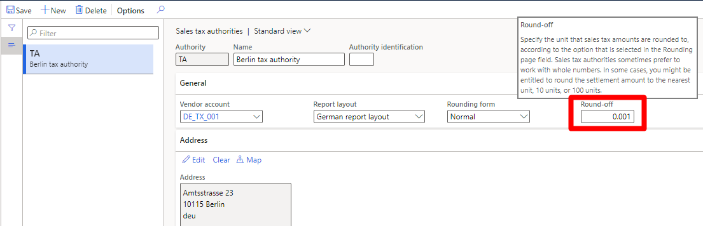

---
# required metadata

title: Tax settlement rounding based on customized currency decimal places
description: This topic explains how to perform tax settlement rounding based on customized currency decimal places.
author: shtao
ms.date: 09/15/2021
ms.topic: article
ms.prod: 
ms.technology: 

# optional metadata

# ms.search.form: 
# ROBOTS: 
audience: Application User
# ms.devlang: 
ms.reviewer: kfend
ms.search.scope: Core, Operations
# ms.tgt_pltfrm: 
# ms.custom: 
ms.search.region:
# ms.search.industry: 
ms.author: shtao
ms.search.validFrom:
ms.dyn365.ops.version: AX 10.0.23
---

# Tax settlement rounding based on customized currency decimal places

[!include [banner](../includes/banner.md)]

[!include [banner](../includes/preview-banner.md)]

This topic provides information about how to use tax settlement rounding based on the customized currency decimal places*.

## Requirements

Before you can use the feature, **Tax settlement rounding based on the customized currency decimal places**, your Dynamics 365 Finance version should be equal to or higher than 10.0.23.

## Background

Because of the high value of the currency in Gulf region countries, the **amount** data type is usually extended to three, four, or even more decimal places according to the topic [Extending decimal point precision for selected data types](../../fin-ops-core/dev-itpro/extensibility/decimal-point-precision.md). The tax settlement functionality, located under **Tax > Declarations > Sales tax > Settle and post sales tax**, also needs to round with the same precision. If the tax settlement doesn't use the same rounding precision as the customized currency, the tax settlement loses the accuracy of the amount. This loss results in a voucher imbalance.

## Functionality

Enable this feature when you have customized decimal places. For example, if you have extened to three or more decimal places for the amount data types. Tax settlements can round with the same precision. You can set up the round-off parameter to the corresponding precision when you configure sales tax authorities in the **Tax** module.

  

[!INCLUDE[footer-include](../../includes/footer-banner.md)]
