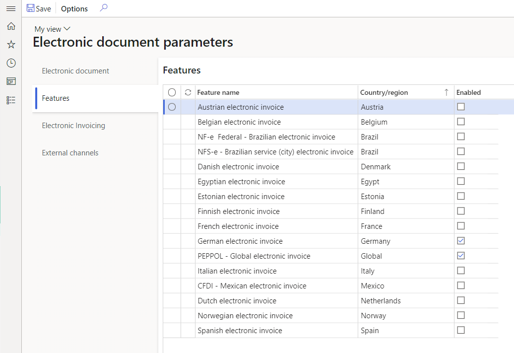

# Set up Electronic invoicing parameters 

[!include [banner](../../includes/banner.md)]

## Enable the Electronic invoicing integration feature

To enable communication between Electronic invoicing and Finance or Supply Chain Management, you must enable the **Electronic Invoicing integration** feature.

1. Sign in to your Finance or Supply Chain Management environment.
2. In the **Feature management** workspace, search for the **Electronic invoicing integration** feature. If this feature doesn't appear on the page, select **Check for updates**.
3. Select the feature, and then select **Enable now**.

## Import ER configurations from the repository

The process of submitting electronic documents to the Electronic invoicing service requires that a message be generated in your Microsoft Dynamics 365 Finance or Dynamics 365 Supply Chain Management environment in a unified structure that corresponds to the structure of the Electronic reporting (ER) invoice model and metadata that is known as *context*. Because the message is generated by ER, its structure is customizable and flexible.

Before you can submit documents to Electronic invoicing and process responses, you must import ER configurations from the repository and define them in parameters.

To set up, adjust, or review electronic documents directly in your Finance or Supply Chain Management environment, complete the following procedures.

1. In the **Globalization** workspace, select the **Electronic reporting** tile.
2. In the **Configuration providers** section, select the **Microsoft** configuration provider, and then select **Repositories**.
3. Select the repository of the **Dataverse** type, and then, on the Action Pane, select **Open**.
4. Import the following ER models:

    - **Customer invoice context model**
    - **Invoice model**
    - **Fiscal documents** (for Brazilian scenarios, if required)
    - **Retail channel data** (for Saudi Arabian Retail-specific scenarios, if required)
    - **Response message model**

5. Verify that the following mapping configurations were automatically imported. If they weren't, import them, and then close the page.
    - **Invoice model mapping**
    - **Fiscal documents mapping** (for Brazilian scenarios, if required)
    - **Advance invoice model mapping** (for Polish scenarios, if required) 
    - **Retail fiscal document mapping** (for Saudi Arabian Retail-specific scenarios, if required)

## Set up Electronic document parameters

1. Go to **Organization administration** \> **Setup** \> **Electronic document parameters**.
2. On the **Electronic document** tab, select **Add** above the **Electronic reporting** grid.
3. Depending on the scenarios that you want to support, enter the following information in the grid, and then save your changes.

    | Table name | Document context | Electronic document model mapping | Features that it's required for |
    |------------|------------------|-----------------------------------|-----------------------|
    | CustInvoiceJour | 
**Mapping name:** Customer invoice context

**Configuration:** Customer invoice context model
 | 
**Mapping name:** Customer Invoice

**Configuration:** Invoice model mapping
 | <ul><li>Austrian electronic invoices (AT)</li><li>Belgian electronic invoice (BE)</li><li>Danish electronic invoice (DK)</li><li>Egyptian electronic invoice (EG)</li><li>Estonian electronic invoice (EE)</li><li>Finish electronic invoice (FI)</li><li>French electronic invoice (FR)</li><li>German electronic invoice (DE)</li><li>FatturaPA (IT)</li><li>Dutch electronic invoice (NL)</li><li>Norwegian electronic invoice (NO)</li><li>Polish electronic invoice (PL)</li><li>Spanish electronic invoice (ES)</li><li>PEPPOL electronic invoice</li><li>Saudi Arabian electronic invoice (SA)</li><li>Australian electronic invoice (AU)</li><li>New Zealand electronic invoice (NZ)</li></ul> |
    | ProjInvoiceJour | 
**Mapping name:** Project invoice context

**Configuration:** Customer invoice context model
 | 
**Mapping name:** Project Invoice

**Configuration:** Invoice model mapping
 | <ul><li>Austrian electronic invoices (AT)</li><li>Belgian electronic invoice (BE)</li><li>Danish electronic invoice (DK)</li><li>Egyptian electronic invoice (EG)</li><li>Estonian electronic invoice (EE)</li><li>Finish electronic invoice (FI)</li><li>French electronic invoice (FR)</li><li>German electronic invoice (DE)</li><li>FatturaPA (IT)</li><li>Dutch electronic invoice (NL)</li><li>Norwegian electronic invoice (NO)</li><li>Polish electronic invoice (PL)</li><li>Spanish electronic invoice (ES)</li><li>PEPPOL electronic invoice</li><li>Saudi Arabian electronic invoice (SA)</li><li>Australian electronic invoice (AU)</li><li>New Zealand electronic invoice (NZ)</li></ul> |
    | CzCustAdvanceInvoiceTable | 
**Mapping name:** Advance invoice context

**Configuration:** Customer invoice context model
 | 
**Mapping name:** Advance invoice model mapping

**Configuration:** Advance invoice model mapping
 | Polish electronic invoice (PL) |
    | RetailTransactionFiscalTransDocumentView | 
**Mapping name:** Retail fiscal document context

**Configuration:** Customer invoice context model
 | 
**Mapping name:** Retail fiscal document

**Configuration:** Retail fiscal document mapping
 | Saudi Arabian electronic invoice (SA) |
    | FiscalDocument_BR | 
**Mapping name:** Fiscal document context

**Configuration:** Customer invoice context model
 | 
**Mapping name:** Fiscal documents mapping

**Configuration:** Fiscal documents mapping
 | Brazilian NF-e (BR) |
    | Correction letter | 
**Mapping name:** FD correction letter context

**Configuration:** Customer invoice context model
 | 
**Mapping name:** Correction letter mapping

**Configuration:** Fiscal documents mapping
 | Brazilian NF-e (BR) |
    | Service Fiscal document | 
**Mapping name:** Fiscal document context

**Configuration:** Customer invoice context model
 | 
**Mapping name:** Fiscal documents mapping

**Configuration:** Fiscal documents mapping
 | Brazilian NFS-e ABRASF Curitiba (BR) |

If you derive a configuration from the configuration that is mentioned in the preceding table, define the new configuration.

To set up the rules to process responses from the Electronic invoicing service, and to update Finance and Supply Chain Management data based on invoices that are processed by the service, set up response types. In most scenarios, this setup is country/region-specific. Therefore, we recommend that you follow the country/region-specific instructions. For more information, see [Availability of Electronic invoicing features by country or region](e-invoicing-country-specific-availability.md)
 
To inactivate old (legacy) ER functionality for some features and activate additional functionality in Finance and Supply Chain Management for some country/region-specific scenarios, enable the corresponding feature on the **Features** tab of the **Electronic document parameters** page.

When you enable a new feature, the legacy functionality will be inactivated for the corresponding country or region and feature name.
