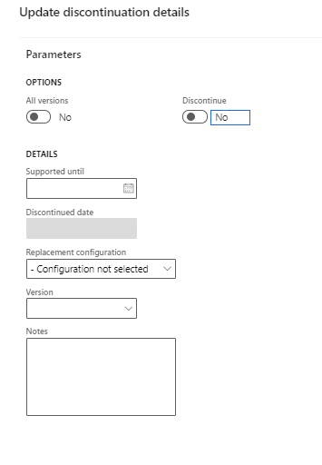

# Discontinue configurations in the RCS Global repository

[!include [banner](../../includes/banner.md)]
[!INCLUDE[banner](../../includes/rsc-to-gsw-banner.md)]

This article describes how to discontinue configuration in the RCS Global repository. Previously, it was possible only to delete configurations that were no longer required. However now you can mark a released configuration as **Discontinued** in the RCS Global repository. With this functionality, you can also do the following: 
 
 - Provide up front notifications when a configuration is planned to be discontinued.
 - Include applicable details about the replacement configuration.
 - Set a **Supported until** date for the specific configuration to inform the user when it will be discontinued.

When you discontinue a configuration version, you can specify the following optional information:

  - **Replacement configuration**
  - **Replacement configuration version**
  - **Free text note**: Use this field to provide documentation links or references
  - **Supported until**: This field provides the proposed date up to which the current configuration/version will be supported. This date must be updated manually.
  
To discontinue the configuration, complete the following steps. 

1. Select whether you want to discontinue a single version or all versions with the same settings in one operation by setting **All versions** to **Yes**. 
2. Set the **Discontinue** parameter to **Yes**.
3. Select **OK** to discontinue the configurations. The **Discontinued date** field will be populated when you save the changes.

  
You can revert configuration back to **Shared** or adjust discontinuation information at any time. If you share a configuration, specify the **Supported until** date and all other information related to the discontinuation to indicate your plans for future discontinuation.

If you want to share information about a planned discontinuation, prior to actually discontinuing the configuration, user is able to prefill all fields related to replacement but leave the **Discontinue** parameter set to **No**.

> [!NOTE]
> Discontinuation doesn't limit operations with configurations. You can continue to import, run, or derive the configurations, these fields are informational.

## Finance supports displaying this information starting in version 10.0.14

Starting in version 10.0.14, Dynamics 365 Finance supports displaying discontinuation information. On the **Global repository** page, you can view up to date information related to discontinuation. By default, configurations that are discontinued are filtered out.
  
The **Imported configurations** (ERSolutionTable) page, shows configurations that were already discontinued when there were imported. For those configurations that were discontinued after import, the discontinuation information can be synchronized by running the **Import configurations updates** job.

