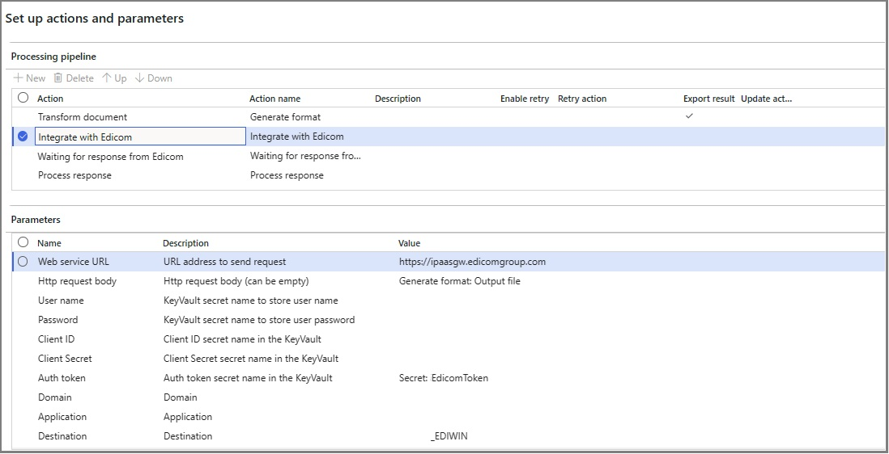
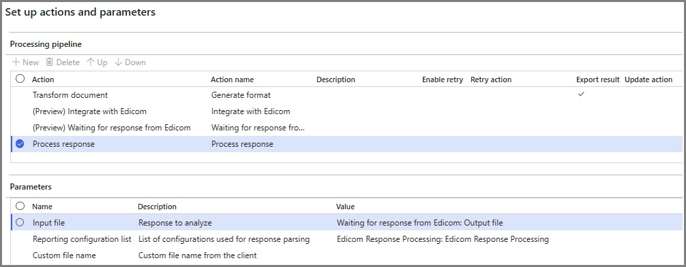
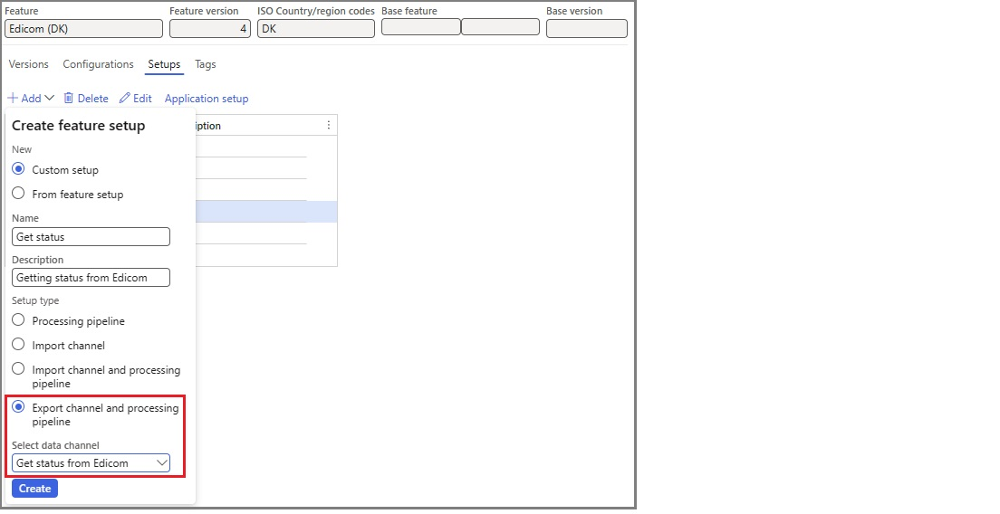
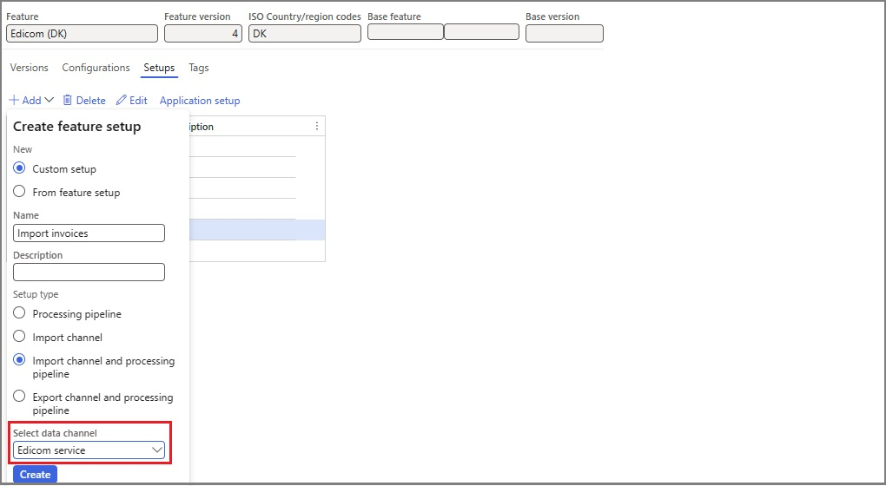

# Electronic Invoicing service ISV last-mile connector

[!include [banner](../../includes/banner.md)]

The independent software vendor (ISV) last-mile connector complements the standard Electronic Invoicing service functionality when no direct integration with government electronic invoicing platforms or final electronic invoice recipients is supported out of the box. In these scenarios, Microsoft Dynamics 365 Finance is used to generate electronic documents in legally required formats. The documents are then passed to the ISV last-mile connector for further communication. In the case of incoming electronic documents, the ISV last-mile connector is used as a source of inbound documents, which are then handled by Finance.

This article explains how to configure and use the Electronic Invoicing service ISV last-mile connector.

## Prerequisites

Before you begin the procedures in this article, the following prerequisites must be met:

- Your company must have a separate signed service agreement with an ISV that will provide electronic document delivery service. Additionally, you must obtain the required credentials to enable integration of the Electronic Invoicing service with the ISV last-mile connector.
- Become familiar with Electronic invoicing functionality. For more information, see [Electronic invoicing overview](../global/e-invoicing-service-overview.md).
- Consult the list of available country/region-specific [Electronic invoicing features](e-invoicing-country-specific-availability.md). The capability to use the ISV last-mile connector for submission complements this list.

## Integration with Edicom

You can configure and use the Electronic Invoicing service ISV last-mile connector's integration with the Global e-Invoicing Platform that [Edicom](https://edicomgroup.com/electronic-invoicing) provides. For more information refer to: [Edicom integration with Microsoft Dynamics 365](https://edicomgroup.com/edicom-microsoft?365).

To enable the integration of the Electronic Invoicing service with the ISV last-mile connector, you must obtain the following required credentials from Edicom:

- **Service ID** – The service ID number is used to identify the company to Edicom.
- **Group** – The group code is used for internal routing within the Edicom infrastructure.
- **Token** – The token is used to grant authorization to access the Edicom services.

The token that you obtain must be uploaded to the secret that you created in the Azure key vault that your company manages. For more information, see [Customer certificates and secrets](../global/e-invoicing-customer-certificates-secrets.md). The secret is used as a parameter in the related Electronic Invoicing feature pipeline actions.

> [!NOTE]
> With this integration, you are able to submit generated e-invoices' files either in the **OIOUBL** format to the Danish electronic invoicing infrastructure, **NemHandel**, or in the **PEPPOL** format to the PEPPOL Delivery Network. The format of a submitted file will be dynamically analyzed by Edicom and routed correspondingly.

### Electronic invoice submission

The following pipeline actions are introduced or updated to enable outbound document submission via the ISV last-mile connector.

- **Integrate with Edicom** – This new action submits electronic documents that were generated by using preceding actions to Edicom. You must configure the parameters for this action as described in the following table.

    | Parameter | Description |
    |-----------|-------------|
    | Domain | Enter the service ID number that Edicom provided.|
    | Application | Enter the same service ID number. |
    | Destination | Enter the service ID number concatenated with the string **\_EDIWIN**. For example, if the service ID number is **123456**, enter **123456\_EDIWIN**. |
    | Group | Enter the group code that Edicom provided. |
    | Auth token | Select the name of the secret that you created for the token that Edicom provided. |

    The following parameters are Edicom-specific. You can leave them set to the default values that Microsoft provides in related Globalization features.

    | Parameter | Description |
    |-----------|-------------|
    | Web service URL | Default value for Edicom: `https://ipaasgw.edicomgroup.com`. |
    | Http request body | Default value: **Generate format: Output file**. |
    | Schema | Default value for Edicom: **OUTBOUND\_DOCUMENT\_MICROSOFT\_DK**. |

    You can leave all remaining parameters blank.

    

- **Waiting for response from Edicom** – This new action waits for the response from Edicom. No specific parameters must be configured.
- **Process response** – For this existing action, two new Electronic reporting (ER) configurations, **Edicom Response Processing** and **Error log import Json**, were created to handle the response that the **Waiting for response from Edicom** action receives from Edicom.

    The following parameters are Edicom-specific. You can leave them set to the default values that Microsoft provides in related Globalization features.

    | Parameter | Description |
    |-----------|-------------|
    | Input file | Default value for Edicom: **Waiting for response from Edicom: Output file**. |
    | Reporting configuration list | The first new ER configuration. Default value for Edicom: **Edicom Response Processing: Edicom Response Processing**. |
    | Reporting configuration list | The second new ER configuration. Default value for Edicom: **Error log import Json: Error log import Json**. |

    

A new data channel type, **Get status from Edicom**, is implemented for feature setups of the **Export channel and processing pipeline** type. You must create a new feature setup where you select **Get status from Edicom** as the data channel.

Configure the export channel's parameters as described in the following table.

| Parameter | Description |
|-----------|-------------|
| Domain | Enter the service ID number that Edicom provided.|
| Application | Enter the same service ID number. |
| Data channel | 
Enter the name of the export channel to use. Enter the same name in each of the following places:
<ul><li>In the applicability rules of the parent's feature setup</li><li>In the value of the **$Context\_Channel** variable in the **DataChannel** definition in the **Customer invoice context model** ER configuration that's used</li><li>At **Organization administration** \> **Setup** \> **Electronic document parameters** \> **Integration channels** in Finance</li></ul> |
| Group | Enter the group code that Edicom provided. |
| Auth token | Select the name of the secret that you created for the token that Edicom provided. |

You can leave the following parameters set to the default values that Microsoft provides in related Globalization features.

| Parameter | Description |
|-----------|-------------|
| Web service URL | Default value: `https://ipaasgw.edicomgroup.com`. |
| Document limit | Default value: **100**. |
| Schema | Default value: **IN\_DOCUMENT\_STATUS\_MICROSOFT\_DK**. |

You can leave all remaining parameters blank.

### Electronic invoice receipt

A new data channel type, **Edicom service**, is implemented for feature setups of the **Import channel** or **Import channel and processing pipeline** type. You must create a new feature setup where you select **Edicom service** as the data channel.

Configure the import channel's parameters as described in the following table.

| Parameter | Description |
|-----------|-------------|
| Domain | Enter the service ID number that Edicom provided. |
| Application | Enter the same service ID number. |
| Data channel | 
Enter the name of the import channel to use. Enter the same name in each of the following places:
<ul><li>In the applicability rules of the parent's feature setup<li>
In the value of the **$Context\_Channel** variable in the **DataChannel** definition in the derived version of the **Customer invoice context model** ER configuration that's used for the import scenario.

<strong>Important:</strong> The derived configuration must differ from the configuration that's used for the invoice *submission* setup.
</li><li>At **Organization administration** \> **Setup** \> **Electronic document parameters** \> **Integration channels** in Finance</li></ul> |
| Group | Enter the group code that Edicom provided. |
| Auth token | Select the name of the secret that you created for the token that Edicom provided. |

You can leave all remaining parameters set to the default values that Microsoft provides in related Globalization features.

Additionally, you must configure the following feature setup variable to use for the decoded file:

- **Name:** ResponseXml
- **Description:** Decoded file
- **Type:** From client
- **Data type:** file

The name of this variable must be used as the name of the import source for the import channel on **Integration channels** tab of the **Electronic document parameters** page in Finance.

### Electronic invoicing in Chile

For more information about electronic invoicing in Chile, see [Get started with Electronic invoicing for Chile](../iberoamerica/ltm-chile-elec-invo-conncection.md).

### Electronic invoicing in Denmark

For more information about electronic invoicing in Denmark, including the integration with the [NemHandel](https://nemhandel.dk/) electronic invoicing infrastructure, see [Get started with Electronic invoicing for Denmark](../denmark/e-invoicing-dk-get-started.md).

## Additional resources

- [Electronic invoicing administration and integration components](../global/e-invoicing-administration-integration-components.md)
- [Electronic invoicing setup](../global/e-invoicing-set-up-overview.md)
- [Work with Globalization features](../global/e-invoicing-working-globalization-features.md)

[!INCLUDE[footer-include](../../../includes/footer-banner.md)]
