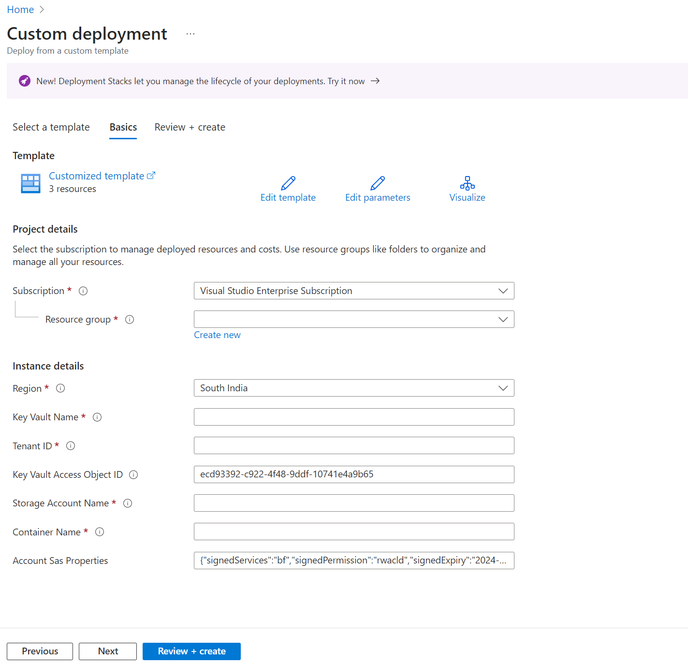

# Create Azure resources using Azure PowerShell or ARM templates

[!include [banner](../../includes/banner.md)]

This article explains how to use Microsoft Azure PowerShell or Azure Resource Manager (ARM) templates to create Azure resources that are required for Electronic invoicing.

To enable e-invoicing in Dynamics 365 Finance, you must create and configure several Azure resources, such as an Azure key vault, an Azure storage account, and an Azure storage account container. This process can be time-consuming and error-prone if it's done manually. To simplify and automate this process, you can use a PowerShell script or an [ARM template](/azure/azure-resource-manager/templates/overview) that creates and configures all the required Azure resources for you.

## Use Azure PowerShell

### Prerequisites

Before you run the PowerShell script, the following prerequisites must be met:

- You have an Azure subscription that has sufficient permissions to create and manage resources.
- You've installed the [Azure PowerShell](/powershell/azure/install-azure-powershell) module. (A supported version of [PowerShell version 7 or later](/powershell/scripting/install/installing-powershell-on-windows) is recommended for use with the Azure PowerShell module.)
- You have the PowerShell script file.

### PowerShell script

``` powershell
param (
    [Parameter(Mandatory=$true)]
    [string]$subscriptionId,

    [Parameter(Mandatory=$true)]
    [string]$resourceGroup,

    [Parameter(Mandatory=$true)]
    [string]$location,

    [Parameter(Mandatory=$true)]
    [string]$storageAccountName,

    [Parameter(Mandatory=$true)]
    [string]$keyVaultName,

    [Parameter(Mandatory=$true)]
    [string]$containerName,

    [Parameter(Mandatory=$true)]
    [string]$storageAccountKeyVaultSecretName
)

if (!(Get-Module -ListAvailable -Name Az)) {
    throw "Az PowerShell module is required to run this script. Please install from https://learn.microsoft.com/en-us/powershell/azure/install-azure-powershell."
} 

function Write-ErrorMessage {
    param (
        [string]$errorMessage
    )
    Write-Host "Error: $errorMessage" -ForegroundColor Red
    exit 1
}

function Write-VerboseMessage {
    param (
        [string]$message
    )
    Write-Host "Verbose: $message" -ForegroundColor DarkYellow
}

function Confirm-ResourceExists {
    param (
        [string]$resourceType,
        [string]$resourceName,
        [string]$resourceGroup = ''
    )

    try {
        switch ($resourceType) {
            'ResourceGroup' {
                Get-AzResourceGroup -Name $resourceName -ErrorAction Stop | Out-Null
            }
            'StorageAccount' {
                Get-AzStorageAccount -ResourceGroupName $resourceGroup -Name $resourceName -ErrorAction Stop | Out-Null
            }
            'StorageContainer' {
                Get-AzStorageContainer -Name $resourceName -ErrorAction Stop | Out-Null
            }
            'KeyVault' {
                $kv = Get-AzKeyVault -ResourceGroupName $resourceGroup -VaultName $resourceName

                if ($null -eq $kv)
                {
                    return $false
                }
            }
        }
        return $true
    } catch {
        return $false
    }
}

# Connect to Azure account and set the subscription context
try {
    Write-VerboseMessage "Connecting to Azure account..."
    Connect-AzAccount -Subscription $subscriptionId -ErrorAction Stop -Verbose
} catch {
    Write-Host $_.Exception.Message
    Write-ErrorMessage "Failed to connect to the Azure account or set subscription context."
}

try {
    Write-VerboseMessage "Checking if the e-invoice service principal exists."
    $objectId = (Get-AzADServicePrincipal -ApplicationId "ecd93392-c922-4f48-9ddf-10741e4a9b65" -ErrorAction SilentlyContinue -Verbose).Id 

    if ($null -eq $objectId)
    {
        Write-VerboseMessage "The e-invoice service principal does not exist. Trying to create now."
        New-AzADServicePrincipal -AppId "ecd93392-c922-4f48-9ddf-10741e4a9b65" -ErrorAction Stop -Verbose
    }
    else {
        Write-VerboseMessage "The e-invoice service principal already exists. No action required."
    }
}
catch {
    Write-Host $_.Exception.Message
    Write-ErrorMessage "Adding e-Invoicing Service to your tenant as a service principal failed."
}

# Check if the resource group exists
if (-not (Confirm-ResourceExists -resourceType 'ResourceGroup' -resourceName $resourceGroup)) {
    try {
        Write-VerboseMessage "Creating Azure resource group..."
        New-AzResourceGroup -Name $resourceGroup -Location $location -ErrorAction Stop -Verbose
        $msg = "Resource group {0} created successfully in at location: {1}." -f $resourceGroup, $location
        Write-VerboseMessage $msg
    } catch {
        Write-Host $_.Exception.Message
        Write-ErrorMessage "Failed to create Azure resource group."
    }
} else {
    Write-VerboseMessage "Resource group '$resourceGroup' already exists."
}

# Check if the Azure Key Vault exists
if (-not (Confirm-ResourceExists -resourceType 'KeyVault' -resourceName $keyVaultName -resourceGroup $resourceGroup)) {
    try {
        Write-VerboseMessage "Creating Azure Key Vault..."
        New-AzKeyVault -Name $keyVaultName -ResourceGroupName $resourceGroup -Location $location -ErrorAction Stop -Verbose
        $msg = "Key vault {0} created successfully in resource group: {1} at location: {2}." -f $keyVaultName, $resourceGroup, $location
        Write-VerboseMessage $msg
    } catch {
        Write-Host $_.Exception.Message
        Write-ErrorMessage "Failed to create Azure Key Vault."
    }
} else {
    Write-VerboseMessage "Azure Key Vault '$keyVaultName' already exists."
}

# Check if the storage account exists
if (-not (Confirm-ResourceExists -resourceType 'StorageAccount' -resourceName $storageAccountName -resourceGroup $resourceGroup)) {
    try {
        Write-VerboseMessage "Creating Azure Storage Account..."
        New-AzStorageAccount -ResourceGroupName $resourceGroup `
          -Name $storageAccountName `
          -Location $location `
          -SkuName Standard_LRS `
          -Kind StorageV2 `
          -AllowBlobPublicAccess $true -ErrorAction Stop -Verbose

          $msg = "Storage account {0} created successfully in resource group: {1} at location: {2}." -f $storageAccountName, $resourceGroup, $location
          Write-VerboseMessage $msg
    } catch {
        Write-Host $_.Exception.Message
        Write-ErrorMessage "Failed to create Azure Storage Account."
    }
} else {
    Write-VerboseMessage "Storage account '$storageAccountName' already exists."
}

# Check if the storage container exists
$ctx = (Get-AzStorageAccount -ResourceGroupName $resourceGroup -Name $storageAccountName).Context
Set-AzCurrentStorageAccount -Context $ctx
if (-not (Confirm-ResourceExists -resourceType 'StorageContainer' -resourceName $containerName -resourceGroup $resourceGroup)) {
    try {
        Write-VerboseMessage "Creating storage container..."
        New-AzStorageContainer -Name $containerName -Context $ctx -ErrorAction Stop -Verbose
        $msg = "Storage container {0} created successfully in storage account: {1}." -f $containerName, $storageAccountName
        Write-VerboseMessage $msg
    } catch {
        Write-Host $_.Exception.Message
        Write-ErrorMessage "Failed to create storage container."
    }
} else {
    Write-VerboseMessage "Storage container '$containerName' already exists."
}

# Set the start and end time for the SAS token
$StartTime = Get-Date
$EndTime = $StartTime.AddYears(3)

# Generate SAS token for the container
try {
    Write-VerboseMessage "Generating SAS token for the container..."
    $sasToken = New-AzStorageContainerSASToken -Name $containerName -Permission racwdli -Protocol HttpsOnly -StartTime $StartTime -ExpiryTime $EndTime -Context $ctx -ErrorAction Stop -Verbose
    $msg = "SAS token for container {0} generated successfully with full permissions. The token would expire on {1}." -f $containerName, $EndTime
    Write-VerboseMessage $msg
} catch {
    Write-Host $_.Exception.Message
    Write-ErrorMessage "Failed to generate SAS token for the container."
}

# Construct the SAS URL
$sasURL = "https://$($storageAccountName).blob.core.windows.net/$($containerName)?$($sastoken)"

# Set access policy for the application to get and list secrets
try {
    Write-VerboseMessage "Setting access policy for Azure Key Vault..."
    Set-AzKeyVaultAccessPolicy -VaultName $keyVaultName -ObjectId $objectId -PermissionsToSecrets get,list -ErrorAction Stop -Verbose
    $msg = "Get and list access policies set successfully on key vault {0} for the e-invoicing application {1}." -f $keyVaultName, $objectId
    Write-VerboseMessage $msg
} catch {
    Write-Host $_.Exception.Message
    Write-ErrorMessage "Failed to set access policy for Azure Key Vault."
}

# Convert SAS URL to secure string
$secretvalue = ConvertTo-SecureString $sasURL -AsPlainText -Force

# Create a new secret in Azure Key Vault
try {
    Write-VerboseMessage "Creating secret in Azure Key Vault..."
    Set-AzKeyVaultSecret -VaultName $keyVaultName -Name $storageAccountKeyVaultSecretName -SecretValue $secretvalue -Expires $EndTime -ContentType "" -ErrorAction Stop -Verbose
    $msg = "Secret {0} created successfully in {1} and will expire on {2}." -f $storageAccountKeyVaultSecretName, $keyVaultName, $EndTime
    Write-VerboseMessage $msg
} catch {
    Write-Host $_.Exception.Message
    Write-ErrorMessage "Failed to create secret in Azure Key Vault."
}

# Display the secret
Write-Host "Secret created successfully."
```

### Run the PowerShell script

To run the PowerShell script, follow these steps.

1. Open PowerShell, and go to the folder where the PowerShell script file and the configuration file are located.
1. To run the PowerShell script by using your own parameters, run the following command.
 
    ``` script
    .\Create-AzureResourcesForEInvoice.ps1 -subscriptionId <azure_subscription_id> -resourceGroup <resource_group_name> -location <resource_group_location> -storageAccountName <storage_account_name> -containerName <container_name> -storageAccountKeyVaultSecretName <SAS_token_keyvault_secret_name>
    ```

The PowerShell script performs the following actions.

1. The script prompts you to sign in to your Azure account. Enter your credentials, and then select **Sign in**.
1. The script determines whether the e-invoice service principal already exists. If it doesn't exist, the script creates it.
1. The script determines whether the following Azure resources already exist: an Azure resource group, Azure key vault, Azure storage account, and Azure storage account container. If any of them don't exist, the script creates and configures them.
1. The script generates a shared access signature (SAS) token for the storage account container and adds it as a Key Vault secret in the key vault.
1. The script sets the access policy on the key vault to provide *get* and *list* permissions to the e-invoicing application.
1. As output, the script generates the details of the Azure resources that were created. These details include names and URLs.

> [!NOTE]
> You can run the same script if you must renew a SAS token that has expired. In this case, the script doesn't create the resources. Instead, it just generates a new SAS token and updates it in the key vault.

## Use an ARM template

### ARM template

``` json
{
    "$schema": "https://schema.management.azure.com/schemas/2015-01-01/deploymentTemplate.json#",
    "contentVersion": "1.0.0.0",
    "parameters": {
        "keyVaultName": {
            "type": "string",
            "metadata": {
                "description": "Name of KeyVault to Store secrets/certificates/SaS Token"
            }
        },
        "tenantID": {
            "type": "string",
            "metadata": {
                "description": "Azure AD Tenant ID"
            }
        },
        "keyVaultAccessObjectID": {
            "type": "string",
            "metadata": {
                "description": "ID of user or App to grant access to KV"
            },
			"defaultValue": "ecd93392-c922-4f48-9ddf-10741e4a9b65"
        },
        "StorageAccountName": {
            "type": "string",
            "metadata": {
                "description": "Name of Storage Account to Create"
            }
        },
		 "ContainerName": {
            "type": "string",
            "metadata": {
                "description": "Name of container for einvoice upload"
            }
        },
        "accountSasProperties": {
            "type": "object",
            "defaultValue": {
                "signedServices": "bf",
                "signedPermission": "rwacld",
                "signedExpiry": "2024-12-01T00:00:00Z",
                "signedResourceTypes": "o"
            }
        }
    },
    "variables": {},
    "resources": [
        {
			"name": "[parameters('StorageAccountName')]",
            "type": "Microsoft.Storage/storageAccounts",
            "apiVersion": "2018-07-01",  
            "location": "[resourceGroup().location]",
            "tags": {
                "displayName": "[parameters('StorageAccountName')]"
            },
            "sku": {
                "name": "Standard_LRS"
            },
            "kind": "StorageV2",
			"properties": {
				"allowBlobPublicAccess": true
			},
			"resources":[
				{
            "type": "blobServices/containers",
            "apiVersion": "2018-03-01-preview",
            "name": "[concat('default/', parameters('ContainerName'))]",
            "dependsOn": [
                "[parameters('StorageAccountName')]"
            ],
            "properties": {
                "publicAccess": "None"
            }
        }
			]
        },
        {
            "type": "Microsoft.KeyVault/vaults",
            "apiVersion": "2018-02-14",
            "name": "[parameters('keyVaultName')]",
            "location": "[resourceGroup().location]",
            "tags": {
                "displayName": "[parameters('keyVaultName')]"
            },
            "properties": {
                "enabledForDeployment": true,
                "enabledForTemplateDeployment": true,
                "enabledForDiskEncryption": true,
                "tenantId": "[parameters('tenantID')]",
                "accessPolicies": [
                    {
                        "tenantId": "[parameters('tenantID')]",
                        "objectId": "[parameters('keyVaultAccessObjectID')]",
                        "permissions": {
                            "keys": [
                                "get"
                            ],
                            "secrets": [
                                "list",
                                "get"
                            ]
                        }
                    }
                ],
                "sku": {
                    "name": "standard",
                    "family": "A"
                }
            }
        },
        {
            "apiVersion": "2018-02-14",
            "type": "Microsoft.KeyVault/vaults/secrets",
            "dependsOn": [
                "[concat('Microsoft.KeyVault/vaults/', parameters('keyVaultName'))]"
            ],
            "name": "[concat(parameters('keyVaultName'), '/', 'StorageSaSToken')]",
            "properties": {
                "value": "[concat('https://', parameters('StorageAccountName'), '.blob.core.windows.net/', parameters('ContainerName'), '?', listAccountSas(parameters('StorageAccountName'), '2018-07-01', parameters('accountSasProperties')).accountSasToken)]"
            }
        }
    ],
    "outputs": {}
}
```

### Deploy the ARM template

To deploy the ARM template, follow these steps.

1. Sign in to the [Azure portal](https://portal.azure.com/), and search for **Deploy a custom template**.
1. Select **Build your own template in the editor**.
1. Copy the ARM template that's provided in the previous section of this article, paste it into the editor, and then select **Save**.
1. Provide the required parameters.

    

1. Select **Review \+ Create**.
1. Review the details, and then select **Create**.

## Verify the Azure resources

To verify that the Azure resources were created and configured correctly, you can follow these steps.

- Sign in to the Azure portal, and go to the resource group that contains the Azure resources. You should see resources that have the names that you specified in the PowerShell script or ARM template parameters.
- Open the Key Vault resource, and confirm that the SAS token for the Azure storage account was created and has the correct value.

[!INCLUDE[footer-include](../../../includes/footer-banner.md)]
