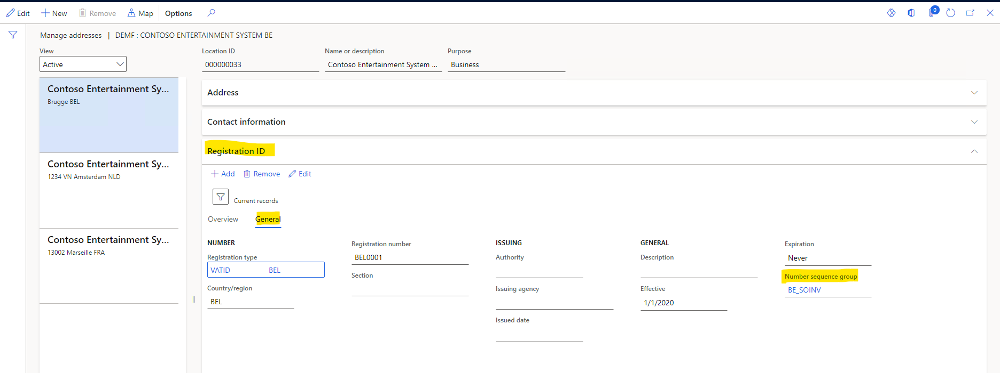

# Multiple VAT registration numbers

[!include [banner](../../includes/banner.md)]

This article provides information about the functionality for multiple value-added tax (VAT) registration numbers. This functionality lets users set up the tax registration numbers of a legal entity and its customers and vendors in different countries/regions, and then post and settle taxes according to registration in the appropriate country/region.

Here are the main steps to configure and use this functionality:

- Assign the registration type for VAT registration to the VAT ID registration category.
- Set up the legal entity's, customers', and vendors' VAT registration numbers on the **Registration ID** FastTab on the **Manage addresses** page.
- Specify the legal entity's VAT registration number for the sales tax authority, and specify the settlement period. The sales tax codes that are assigned to the settlement period will identify the legal entity's VAT registration.

The customer and vendor VAT registration numbers for transactions can be identified by the tax calculation feature. The identified tax registration numbers are available in the sales tax transactions.

The sales tax settlement procedure uses the country/region code of the registration ID.

## Prerequisites

Before you begin, Tax Calculation must be configured. For more information, see [Tax Calculation](global-tax-calcuation-service-overview.md).

## Enable the feature

1. In the **Feature management** workspace, turn on the **Support multiple VAT registration numbers** feature.
2. Go to **Tax** \> **Setup** \> **Tax configuration** \> **Tax calculation parameters**, and turn on the **Enable advanced tax calculation** option.

> [!NOTE]
> In the 10.0.39 update, this feature can no longer be enabled through Feature management. It's now controlled by the **Support multiple VAT registration numbers** parameter on the **Tax calculation parameters** page.

## Set up a VAT ID for a legal entity, customers, and vendors

To set up the VAT registration numbers for a legal entity and its customers and vendors, you must use the registration ID framework to create these registration numbers. For more information, see [Registration IDs](../europe/emea-registration-ids.md).

### Set up registration types and categories

1. Go to **Organization administration** \> **Global address book** \> **Registration types** \> **Registration types**, and create a new registration type, such as **VATID**.

    

2. On the **Applicable countries/regions, uses, and validation rules** FastTab, create a registration type line for each country or region where the legal entity, customers, and vendors have registrations

    

3. Go to **Organization administration** \> **Global address book** \> **Registration types** \> **Registration categories**, and assign the registration types that you just created to the **VAT ID** registration category.

    

### Create VAT registration numbers for a legal entity, customers, and vendors

1. Go to **Organization administration** \> **Organizations** \> **Legal entities**.
2. Select **Registration IDs**, and assign VAT ID registration to each address where the legal entity has VAT registrations.

    

> [!NOTE]
> To automatically identify customer and vendor VAT registration numbers for sales tax transactions, sales documents, and purchase documents, you can either create the numbers in the tax calculation feature on the **Customer tax registration number applicability** and **Vendor tax registration number applicability** tabs or enable the **Update tax exempt number from customer address** parameter on the **Multiple VAT registrations** tab of the **Tax calculation parameters** page.

### Set up number sequences for a legal entity's registration numbers

To generate separate number sequences for documents such as packing slips and invoices, create a number sequence group. Then, on the **Manage addresses** page, on the **Registration ID** FastTab, on the **General** tab, assign the number sequence group to the VAT ID of the legal entity.

Next, on the **Number sequence groups** page, in the **Reference** section, set up the required number sequences codes for the supported references.

The code for the number sequence group is then entered by default on the sales order or purchase order header after the legal entity's tax registration is determined. The documents are numbered according to the number sequences that are assigned to the references.

> [!NOTE]
> The default logic supports only sales orders, purchase orders, and free text invoices.

### Set up tax authorities

1. Go to **Tax** \> **Indirect taxes** \> **Sales tax** \> **Sales tax authorities**, and create all the tax authorities that the legal entity must report to.
2. On the **Tax registration** FastTab, add the appropriate VAT registration number.

> [!NOTE]
> The lookup for the **Tax registration number** field on the **Tax registration** FastTab contains only the registration numbers of the legal entity that have a VAT ID registration category. The list of registration IDs is available for the corresponding country or region of the tax authority.
>
> Date effectivity isn't supported for assigned registration numbers. If the registration number of the legal entity is changed or expired, you must manually update the tax registration in the setup of the tax authority and sales tax settlement period.

### Set up the sales tax settlement period

On the **Sales tax settlement periods** page, create sales tax settlement periods. In the **Tax registration number** field, verify that the corresponding legal entity's VAT registration number is assigned.

### Set up customer and vendor tax registration numbers in the Tax feature setup

1. Open the tax calculation feature setup. 
2. On the **Customer Tax Registration Number Applicability** tab, under **Applicability rules**, verify that the registration IDs for customers are defined. 
3. On the **Vendor Tax Registration Number Applicability** tab, under **Applicability rules**, verify that the registration IDs for vendors are defined.

    

    > [!NOTE]
    > This step is optional unless the customer or vendor has multiple tax registration numbers, and you want the Tax Calculation feature to determine the ID. As the default value for the customer/vendor tax registration number, the Tax Calculation feature will use the value that is entered in the **Tax exempt number** field on the header of sales and purchase documents. It will replace that default value with the value that you defined in customer/vendor tax registration number applicability rules.
    >
    > During sales tax calculation and document posting, the tax feature returns the customer's or vendor's tax registration number to Dynamics 365 Finance and updates the **Tax exempt number** field on the sales order or purchase order. If the corresponding value isn't set up on the **Registration ID** FastTab on the **Manage addresses** page for the customer or vendor, the registration ID is left blank, and you receive the following message: "Customer tax registration 'xxx' is not found in the customer's Registration IDs setup. To add customer tax registration to sales tax transactions and posted documents, make sure the registration is defined in the Registration IDs setup."

## Sales order and purchase order processing

On the **Tax calculation parameters** page, make sure that the **Enable advanced tax calculation** option is turned on, and that **Sales** and **Purchase** are selected in the **Business process** field.

If the sales tax codes on lines that are created for a sales order or purchase order are assigned to different sales tax settlement periods and tax registrations, there are multiple registration numbers for the order. To control the system behavior in this scenario, the **Check Tax registration number in document lines** option has been added on the **Accounts receivable parameters** and **Accounts payable parameters** pages.

Before version 10.0.41, assiging sales tax codes to different registration numbers on a sales order or purchase order wasn't supported. During sales tax calculation and document posting, you receive an error message and can't continue the process. For information about the item ID, sales tax codes, settlement periods, and tax registration numbers that are identified for the order lines, view the message details.

Starting with version 10.0.41, sales orders and sales quotations can be created with lines having different tax registration numbers. The level of validation is still controlled by the **Check Tax registration number in document lines** option on the **Accounts receivable parameters**: *None*, *Warning*, or *Error*.

> [!IMPORTANT]
> Multiple tax registrations assigned to individual sales order document lines are not allowed. If tax calculation determines that different tax registrations numbers (VAT IDs) of the legal entity are assigned to an individual line, an error is displayed.

When posting, sales orders are automatically split into different sales confirmations, picking lists, packing slips, and invoices per the VAT IDs determined for document lines. Go to **Account receivable parameters** > **Summary update** > **Split based on** to select whether sales confirmation and/or picking list should be split based on the tax registration number. For packing slips and invoice postings, this option is mandatory and is set to **Yes**.

### Temporary sales tax and posted sales tax

On the **Temporary sales tax** page, you can preview the identified VAT registration numbers of the legal entity, customers, and vendors. The following new fields have been added to the page:

- **Tax registration number** – The VAT registration number of the legal entity.
- **Customer tax registration number** – The VAT registration number of the customer. This field is available only for sales orders.
- **Vendor tax registration number** – The VAT registration number of the vendor. This field is available only for purchase orders.

On the **Posted sales tax** page, the following new fields have been added. You can sort and filter sales tax transactions by these fields.

- **Tax registration number** – The VAT registration number of the legal entity.
- **Counterparty tax registration number** – The VAT registration number of the counterparty.

### Sales tax settlement procedure updates

The **Settle and post sales tax** periodic task has been updated so that it uses the country/region code of the legal entity's tax registration.

> [!NOTE]
> If the tax registration number isn't set for a tax period, you receive the following error message: "Tax registration number is not set up for the tax settlement period xxx" and settlement process is stopped.

After the settlement process is completed, no sales tax payment report is printed. Instead, you receive the following message: "The sales tax settlement and posting is completed. The voucher 'xxxx, m/d/yyyy' has been posted."

You can still manually run the sales tax payment report by going to **Tax** \> **Inquiries and reports** \> **Sales tax inquiries** \> **Sales tax payments**.

> [!NOTE]
> Even if the feature isn't enabled on the **Tax calculation parameters** page, the tax registration ID will be copied from the original sales tax transactions to the offset sales tax transactions.
