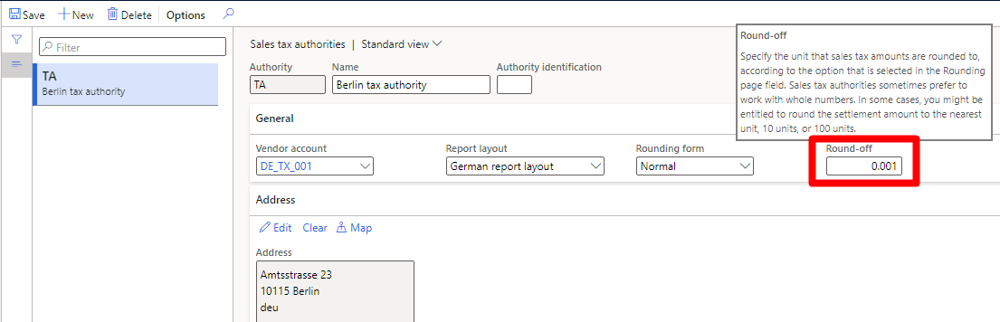

# Tax settlement rounding based on customized currency decimal places

[!include [banner](../../includes/banner.md)]

This article explains how to do tax settlement rounding that is based on customized currency decimal places.

## Requirements

Before you can use the **Tax settlement rounding based on the customized currency decimal places** feature, your version of Microsoft Dynamics 365 Finance should be at least 10.0.23.

## Background

Because of the high value of the currency in Gulf countries/regions, the **amount** data type is usually extended to three, four, or even more decimal places. (For information, see [Extending decimal point precision for selected data types](../../../fin-ops-core/dev-itpro/extensibility/decimal-point-precision.md).) The tax settlement functionality at **Tax \> Declarations \> Sales tax \> Settle and post sales tax** must use the same precision for rounding. If the tax settlement doesn't use the same rounding precision as the customized currency, the tax settlement loses the accuracy of the amount. This loss causes a voucher imbalance.

## Functionality

Enable this feature when you have customized decimal places For example, enable it if you've extended the **amount** data type to three or more decimal places. Tax settlements can use the same rounding precision. You can set the **Round-off** field to the corresponding precision when you configure sales tax authorities in the **Tax** module.

]

[!INCLUDE[footer-include](../../../includes/footer-banner.md)]
