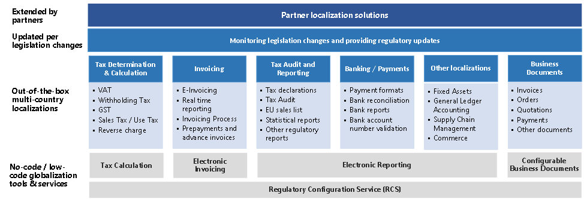

# Globalization Studio overview 

[!include [banner](../../includes/banner.md)]

To run their businesses globally, customers must meet multiple country/region-specific requirements for tax compliance and local business practices. This concept is referred to as *localization*. The requirements are complex and are frequently changed by local governments. They often have very tight law enforcement dates.

The Globalization Studio addresses these challenges by providing the following features:

- **No-code/low-code globalization tools and services** – These flexible, easy-to-use tools and services make localization easier for Microsoft. They also make it easier for partners and customers to create, extend, automate, and maintain the product.
- **Out-of-the-box multi-country/region localization content** – This Microsoft-provided content is continuously monitored and updated by Microsoft, and can be extended by partners.

Together, these features let you operate the solution in over 200 countries and regions, and help you meet multiple requirements for tax compliance and local business practices. 

The Globalization Studio consists of the following tools and services:

- [Regulatory Configuration Service (RCS)](rcs-overview.md) is a standalone designer and lifecycle management service for no-code/low-code globalization functionality.
- [Electronic Reporting (ER)](/dynamics365/unified-operations/dev-itpro/analytics/general-electronic-reporting) is a configurable tool that helps create and maintain regulatory electronic reporting, payment formats, and other features in a no-code/low-code format.
- [Configurable business documents](../../../fin-ops-core/dev-itpro/analytics/er-business-document-management.md) are built on top of the ER framework and enable business users to edit business document templates by using a Microsoft Dynamics 365 service or appropriate Microsoft Office desktop application.
- [Tax Calculation](global-tax-calcuation-service-overview.md) is a hyper-scalable multitenant service that significantly enhances the core tax determination and calculation capabilities of Dynamics 365 finance and operations apps with a more flexible and fully configurable engine.
- [Electronic Invoicing](e-invoicing-service-overview.md) is a hyper-scalable multitenant service that extends the existing electronic invoicing capabilities to more countries and regions, and enables configurable processing of electronic invoices and configurable electronic document exchange.
- [Out-of-the-box multi-country/region localizations](../../../fin-ops-core/fin-ops/lcs/country-region.md) and [regulatory updates](regulatory-updates.md) are provided by Microsoft and updated per legislation changes in the supported countries and regions.
- Partner localization solutions that are published on [Microsoft AppSource](https://appsource.microsoft.com/) or provided directly by partners.

[!INCLUDE[footer-include](../../../includes/footer-banner.md)]
