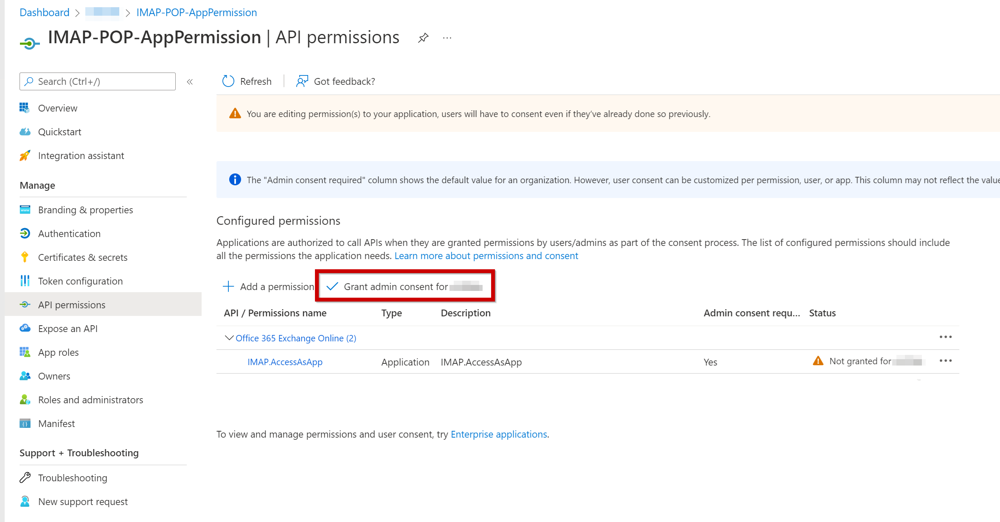

# Configure an email channel for Office 365 Exchange Online

[!INCLUDE[banner](../../includes/banner.md)]

If the Electronic invoicing feature that you created imports electronic vendor invoices from attached files that are received by email, you should configure an email account channel.

## Add the IMAP permissions to your Microsoft Azure AD application

1. In the Microsoft Azure portal, select the **App registrations** service.
1. Select **New registration** to create an app registration.
1. Enter a name.
1. In the **Supported account types** section, select the **Accounts in this organizational directory only** option.
1. After the app registration is created, select **API Permissions**.
1. Select **Add permission**.
1. On the **APIs my organization uses** tab, search for **Office 365 Exchange Online**.
1. Select **Application permissions**.
1. For Internet Message Access Protocol (IMAP) access, select the **IMAP.AccessAsApp** permission.

    

1. Select **Add permissions**.
1. To access Exchange mailboxes via IMAP, your Azure Active Directory (Azure AD) application must get tenant admin consent for each tenant. For more information, see [Introduction to permissions and consent](/azure/active-directory/develop/v2-permissions-and-consent).

    1. In the management view for your Azure AD application, select **API Permissions**.
    1. Under **Configured permissions**, select **Grant admin consent for \<*name*\>**.

    

1. Select **Overview**.
1. Copy the **Application (client) ID** and **Directory (tenant) ID** values.
1. Select **Certificates & secrets**.
1. On the **Client secrets** tab, select **New client secret**, and notice the value in the **Expiration** field. When a secret expires, it can no longer be used, and a new secret must be created.
1. After a secret is created, copy the **Value** value, and save it in the Azure key vault that's associated with the Electronic Invoicing Service service environment.
1. Add a link to this secret in the Regulatory Configuration Service (RCS) service environment. For more information, see [Customer certificates and secrets](e-invoicing-customer-certificates-secrets.md).
1. Save the **Application (client) ID** value as a secret in the same key vault, and add a link to this secret in the Electronic Invoicing Service service environment in RCS.
1. In the Azure portal, select the **Enterprise Applications** service.
1. Find the application that has the same name as the app registration that you created in step 2.
1. Select **Overview**.
1. Copy the **Object ID** value.

## Register service principals in Exchange

After a tenant admin consents to your Azure AD application, they must register the application's service principal in Exchange by running a series of PowerShell snippets via Exchange Online PowerShell. Some of these snippets use values that you copied in the previous procedure:

- **\<ORGANIZATION\_ID\>** is the **Directory (tenant) ID** value that you copied.
- **\<APPLICATION\_ID\>** is the **Application (client) ID** value that you copied.
- **\<OBJECT\_ID\>** is the **Object ID** value that you copied.

Follow these steps to register service principals in Exchange.

1. Install the **ExchangeOnlineManagement** module.

    ```powershell
    Install-Module -Name ExchangeOnlineManagement -allowprerelease
    Import-module ExchangeOnlineManagement
    ```

    > [!NOTE]
    > The **ExchangeOnlineManagement** module has to be installed only once on the Exchange administrator's machine.

1. Connect to Exchange Online.

    ```powershell
    Connect-ExchangeOnline -Organization <ORGANIZATION_ID>
    ```

1. The following example shows how to register the Azure AD application's service principal in Exchange.

    ```powershell
    New-ServicePrincipal -AppId <APPLICATION_ID> -ServiceId <OBJECT_ID> -Organization <ORGANIZATION_ID>
    ```

    > [!NOTE]
    > If you receive an error when you run the **New-ServicePrincipal** cmdlet, you probably don't have sufficient permissions in Exchange Online to perform the operation. Alternatively, you're trying to use a guest account to perform the operation.

1. The following example shows how to give the application's service principal access to one mailbox.

    ```powershell
    Add-MailboxPermission -Identity "john.smith@contoso.com" -User <OBJECT_ID> -AccessRights FullAccess
    ```

## Create a feature setup in RCS

1. In RCS, select the Electronic invoicing feature that you created. Select the version that has a status of **Draft**.
1. On the **Setups** tab, select **Add**.
1. In the **Create feature setup** dropdown dialog box, in the **New** field group, select the **Custom setup** option.
1. In the **Setup type** field group, select the **Data channel** option.
1. In the **Select data channel** field, enter **Incoming e-mail on Exchange**.
1. Select **Create**.
1. Select the line that was created, and then select **Edit**.
1. On the **Data channel** tab, in the **Parameters** section, set the following required fields.

    | Field              | Description |
    |--------------------|-------------|
    | Data channel       | Enter a unique name to identify the data channel. The name can have a maximum of 10 characters. It will be referenced in applicability rules and in the Dynamics 365 Finance application during the communication process. |
    | Server address     | Enter the server address of Exchange Online. For example, the default value for Office 365 Exchange Online is **outlook.office365.com**. |
    | Server port        | Enter the number of the port that the email account provider uses. For example, the default value for Office 365 Exchange Online is **993**. |
    | User name secret   | Enter the name of the Key Vault secret that contains the ID of the email user account. This secret must be created in Key Vault and set up in your service environment. |
    | Client Id          | Enter the name of the Key Vault secret that contains the **Application (client) ID** value for the app registration. |
    | Client Secret      | Enter the name of the Key Vault secret that contains the **Value** value of the app registration client secret. |
    | Timeout            | The maximum time limit, in milliseconds (ms), that the system should wait for a response. The default value is 10,000 ms (10 seconds). |
    | Main folder        | Specify the email import source, or the folder that the service should process emails from. |
    | Archive folder     | Specify the folder where processed emails should be stored. If you don't set a value, a folder will automatically be created. |
    | Error folder       | Specify the folder that emails should be moved to if the processing fails. If you don't set a value, a folder will automatically be created. |
    | Max message size   | Enter the maximum size, in bytes, of a single message that's processed. The default value is 20,000,000 bytes. |
    | Max message number | Enter the maximum number of messages to process for a single action. If you don't want to limit the number of messages, set the value to **0** (zero). |
    | From filter        | Enter a string to filter by sender address. Only emails where the sender address matches the filter will be processed. This field is optional. To specify multiple sender addresses, use semicolons (;) as separators. |
    | Subject filter     | Enter a string to filter by subject. Only emails where the subject matches the filter will be processed. This field is optional. A simple mask such as **\*smth\*.ext** is supported. Here, each asterisk (\*) represents zero or more occurrences of any character. |
    | Date filter        | Specify a date to define the maximum age, in days, of messages that are processed. This field is optional. The default value is 30 days. |
    | Processing mode    | <p>Select one of the following options to specify whether all the attachments in an email can be processed together, or whether each attachment should be processed separately:</p><ul><li><b>By attachment</b> – A new electronic document will be created for each attachment in the email. For example, if one email includes several files that contain e-invoice data, each file will be considered a new e-invoice.</li><li><b>By email</b> – One attachment will be considered a base attachment, and one electronic invoice will be created. Other attachments can be used as supporting files.</li></ul> |

1. In the **Attachments filter** section, add the file filtering information. Only attachments that satisfy the defined filter will be processed. For example, **\*.xml** filters for attachments that have the .xml file name extension. The name of the attachment is used in Dynamics 365 Finance or Dynamics 365 Supply Chain Management during setup.

    - If you set the **Processing mode** field to **By email** in the previous step, you can add multiple filters here. The name identifies the specific document.
    - If you set the **Processing mode** field to **By attachment**, you can add only one filter.

1. On the **Applicability rules** tab, review and update the criteria as required. The value of the **Channel** field must equal the value that you entered in the **Data channel** field in step 8.
1. Select **Save**, and close the page.
