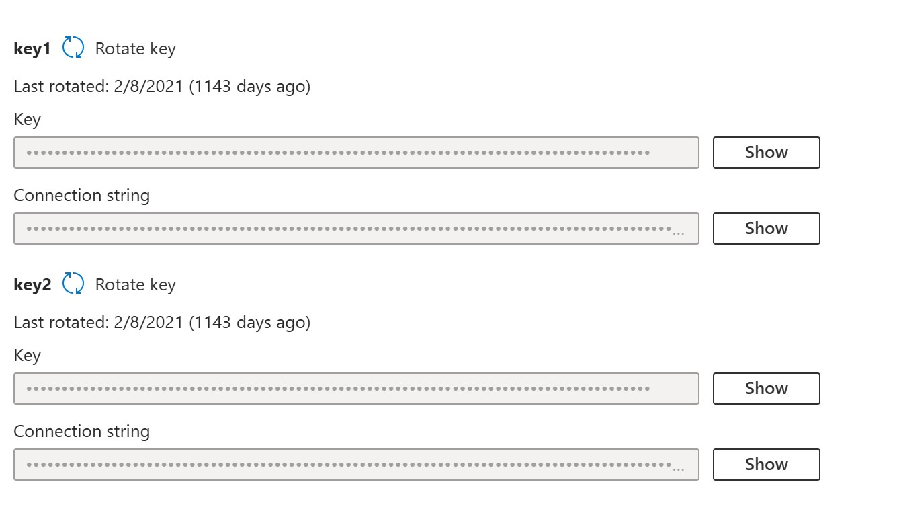

# Create an Azure file share in the Azure portal 

[!include [banner](../../includes/banner.md)]

Electronic documents generated by the Electronic invoicing service can be stored in a Microsoft Azure file share that's provisioned under a storage account. To ensure that Electronic invoicing can access the file share, you must provide the connection string to the Electronic invoicing service. Also, to ensure that the connection string is securely stored, don't provide the connection string directly. Instead, store it in an Azure key vault and provide an Azure Key Vault secret.

## Prerequisites

Before you begin the procedures in this article, provision an Azure storage account. For more information and the steps to provision an Azure storage account, see [Provision Azure storage account](../global/gs-e-invoicing-create-azure-storage-account-azure-portal.md).

## Create an Azure file share

To create an Azure file share, follow these steps.

1. Select the storage account from your dashboard.
1. In the service menu, under **Data storage**, select **File shares**.

     

1. On the menu at the top of the **File shares** page, select **+ File share**. from the **New file share** page dropdown.
1. In the **Name** field, enter a file share name. File share names must be all lower-case letters, numbers, and single hyphens, and must begin and end with a lower-case letter or number. The name can't contain two consecutive hyphens.
1. To create the Azure file share, select **Review + create** and then **Create**.

To get a connection string, follow these steps.

1. Go to Azure portal (portal.azure.com) with your subscription and locate to the corresponding Storage account resource.
1. Go to **Security + Networking** \> **Access keys**
1. Copy the value from the **key 1 Connection string**.

   
   
1. Store the Connection string value in the Key vault secret. For information about how to setup Azure Key vault, see [Configure Azure key vault](../global/gs-e-invoicing-create-azure-key-vault-azure-portal.md).
1. Refer to the Key vault secret in key vault parameters. For more information, see [Configure key vault parameters](../global/gs-e-invoicing-set-up-parameters.md).
 

> [!NOTE]
> Ensure that you don't confuse the **Connection string** value with the **Storage shared access signature (SAS)** token.

[!INCLUDE[footer-include](../../../includes/footer-banner.md)]
