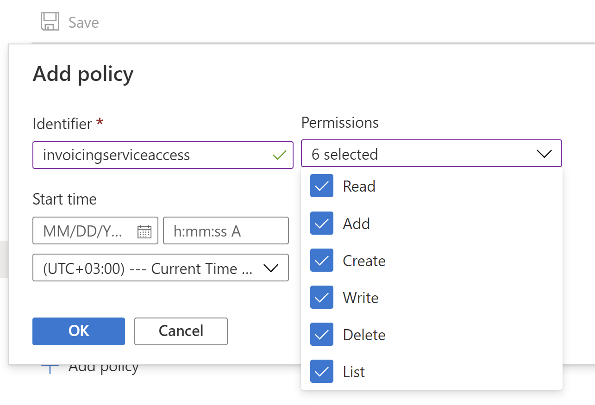

# Configure an Azure storage account in the Azure portal

[!INCLUDE[banner](../../includes/banner.md)]

All electronic files that the Electronic Invoicing service generates or that go to the service during processing are stored in containers in your Microsoft Azure storage account. To ensure that Electronic invoicing can access those containers, you must provide the shared access signature (SAS) token of the storage account to the Electronic Invoicing service. Additionally, to ensure that the token is securely stored, don't provide the SAS token directly. Instead, store it in an Azure key vault, and provide a Key Vault secret.

1. Open the storage account that you plan to use with the Electronic Invoicing service.
1. Go to **Settings** \> **Configuration**, and make sure that the **Allow Blob public access** parameter is set to **Enabled**.
1. Go to **Data storage** \> **Containers**, and create a container.
1. Enter a name for the container, and set the **Public access level** field to **Private (no anonymous access)**.
1. Open the new container, and go to **Settings** \> **Access policy**.
1. Select **Add policy** to add a stored access policy.
1. Set the **Identifier** field as appropriate.
1. In the **Permissions** field, select all permissions.

    

1. Enter the start and end dates. The end date should be in the future.
1. Select **OK** to save the policy, and then save your changes to the container.
1. Go to **Settings** \> **Shared access tokens**, and set the field values.
1. Enter the start and end dates. The end date should be in the future.
1. In the **Permissions** field, select the following permissions:

    - Read
    - Add
    - Create
    - Write
    - Delete
    - List

1. Select **Generate SAS token and URL**.
1. Copy and store the value of the **Blob SAS URL** field. This value will be used later in this procedure and will be referred to as the *shared access signature URI*.
1. Open the key vault that you intend to use with Electronic invoicing.
1. Go to **Settings** \> **Secrets**, and select **Generate/Import** to create a secret.
1. On the **Create a secret** page, in the **Upload options** field, select **Manual**.
1. Enter the name of the secret. This name will be used during the setup of the service in Dynamics 365 Finance and will be referred to as the *key vault secret name*. For more information about how to set up Electronic invoicing parameters, see [Configure Electronic invoicing parameters](gs-e-invoicing-set-up-parameters.md).
1. In the **Value** field, enter the shared access signature URI that you copied earlier.
1. Select **Create**.
