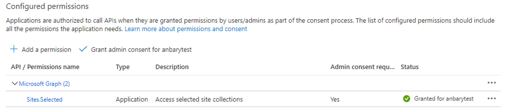
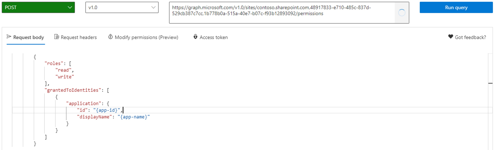

# Create a SharePoint connection

[!INCLUDE[banner](../../includes/banner.md)]

The Electronic Invoicing service can read files from Microsoft SharePoint folders and upload files to SharePoint. To ensure that Electronic invoicing can access a specific SharePoint site, you must provide the site credentials to the Electronic Invoicing service. Additionally, to ensure that the credentials are securely stored, don't provide them directly. Instead, store them in an Azure key vault, and provide a Key Vault secret.

## Grant access to a SharePoint folder

1. Create an app registration in the tenant where Dynamics 365 Finance environment is installed.

    1. Sign in to the [Azure portal](https://portal.azure.com/).
    1. Go to **App registrations**.
    1. Select **New registration**.
    1. Enter a name, such as **SharePoint App for Electronic Invoicing**, and complete the registration.
    1. Select the new app registration.
    1. On the **Authentication** tab, enable the **Allow public client flows** option.
    1. On the **Certificates & secrets** tab, select **New client secret** to create a client secret.
    1. Copy the value of the secret that was created.

    Follow these guidelines:

    - Don't use the same app registration for different services.
    - Follow the [password policy recommendations](/microsoft-365/admin/misc/password-policy-recommendations).
    - Set up rotation of passwords. During rotation, create a new client secret for the app registration, update the key vault, and then delete the old secret.

1. Save the **App Registration secret** and **Application (client) ID** values as two new secrets in the key vault in the setup of your Electronic invoicing parameters.
1. Add the secrets that you created to the Key Vault parameters in the setup of your Electronic invoicing parameters, see [Set up Electronic invoicing parameters](gs-e-invoicing-set-up-parameters.md).
1. In the Azure portal, grant access to SharePoint. This step should be completed by the tenant administrator.

    1. Select the app registration that you created.
    1. On the **API permissions** tab, select **Add a permission**.
    1. Select **Microsoft graph (Application permissions)** \> **Sites.Selected**.
    1. Select **Grant admin consent for \<*user&nbsp;name*\>**.
    1. Review the **Status** field to make sure that permissions are granted.

        

    1. Open [Graph Explorer](https://developer.microsoft.com/graph/graph-explorer), and sign in.
    1. In the left pane, on the **Sample queries** tab, under **SharePoint Sites**, select **get SharePoint site based on relative path of the site**.
    1. Fill in the **\{host-name\}** and **\{server-relative-path\}** parameters. For example, fill in `<domain>.sharepoint.com` for **\{host-name\}** and `sites/<siteName>` for **\{server-relative-path\}**.

        > [!NOTE]
        > For the default website, leave the **\{server-relative-path\}** parameter blank.

    1. Select **Run query**, and save the result.
    1. Configure the following query.

        `POST https://graph.microsoft.com/v1.0/sites/{site-id}/permissions`

        In this query, **\{site-id\}** is the value of the **id** node from the previous query response.

        Here's the request body.

        ```json
        {
            "roles": [
                "read",
                "write"
            ],
            "grantedToIdentities": [
                {
                    "application": {
                        "id": "{app-id}",
                        "displayName": "{app-name}"
                    }
                }
            ]
        }
        ```

        In this request body, **\{app-id\}** is the **Application (client) ID** value, and **\{app-name\}** is the **Application name** value.

        

    1. On the **Modify permissions** tab, select **Open the permissions panel**, and then select **Sites** \> **Sites.FullControl.All** \> **Consent**.
    1. Select **Run query**.

The Electronic Invoicing service now has access to your SharePoint site.
