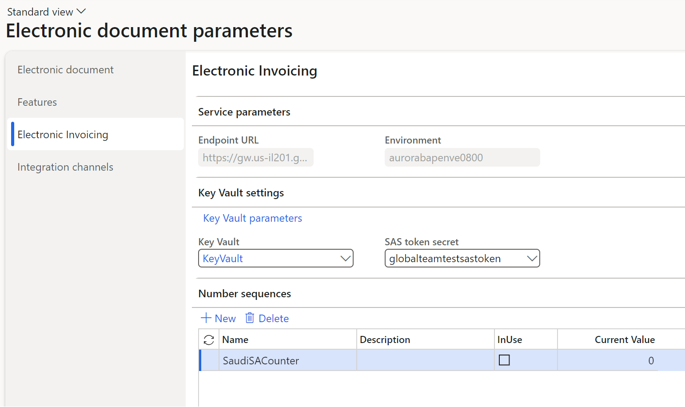

# Electronic invoicing setup (preview)

[!INCLUDE[banner](../../includes/banner.md)]
[!INCLUDE [preview-banner](~/../shared-content/shared/preview-includes/preview-banner.md)]

The article provides an overview of the process for setting up and configuring Electronic invoicing. You must complete the setup steps in the order that's specified here. If a step is mandatory, but you skip it, the functionality won't work correctly, and multiple failures will occur during subsequent steps or when you use the functionality.

## Install the add-in for Electronic invoicing microservices

The Electronic Invoicing service is a set of microservices that's hosted in Microsoft datacenters. By default, customers of Dynamics 365 Finance and Dynamics 365 Supply Chain Management don't have access to the Electronic Invoicing service. You must install it as an add-in in Microsoft Dynamics Lifecycle Services. When you install the add-in, your Finance or Supply Chain Management environment is registered in the register of applications that are allowed to connect to the Electronic Invoicing service.

To register an environment, follow these steps.

1. Sign in to your Lifecycle Services account.
1. On the project dashboard, select a Lifecycle Services project.
1. In the project, on the **Environments** dashboard, select your deployed environment. The environment that you select must be running.
1. On the **Power Platform Integration** tab, in the **Environment add-ins** section, select **Install a new add-in**.
1. Select **Electronic Invoicing**.
1. In the **AAD application ID** field, enter the fixed value **091c98b0-a1c9-4b02-b62c-7753395ccabe**. This value is always fixed. Make sure that you enter only a globally unique identifier (GUID). Don't include any other symbols, such as spaces, commas, periods, or quotation marks.
1. In the **AAD tenant ID** field, enter the Azure Active Directory (Azure AD) tenant ID of your Azure subscription account.
1. Review the terms and conditions, and then select the checkbox.
1. Select **Install**. After a few minutes, the status should change from **Installing** to **Installed**. You might have to refresh the page to see this change.

> [!NOTE]
> Companies usually have several Finance or Supply Chain Management environments. These environments include production environments, user acceptance testing (UAT) environments, and development (sandbox) environments. You must complete the preceding procedure for all environments that you want to connect to Electronic invoicing.

## Enable Electronic invoicing integration

To enable communication between Electronic invoicing and Microsoft Dynamics 365 Finance or Dynamics 365 Supply Chain Management, you must enable the **Electronic Invoicing integration** feature.

1. In the **Feature management** workspace, on the **All** tab, search for the **Electronic invoicing integration** feature. If this feature doesn't appear on the page, select **Check for updates**.
2. Select the feature, and then select **Enable now**.

## Service environment configuration

> [!NOTE]
> The steps described in the following chapter are required if **Regulatory Configuration Service** (RCS) experience was previously used for Invoicing Service configuration. If the Invoicing Service is being initially configured via **Globalization Studio** then the following chapter can be skipped.

1. Determine one of the already deployed service environments. This will be the only environment to be configured in the Globalization Studio and then used by the Electronic Invoicing Service.
2. Go to **Organization administration** \> **Setup** \> **Electronic document parameters**.
3. In the **Electronic invoicing** tab, in the **Service parameters** FastTab, in the **Environment** field, enter the name of the environment determind during the first step.

> [!IMPORTANT]
> After the **Globalization Studio** and **E-invoicing service workspace designer** features are enabled, the field for the service environment name becomes unavailable. Therefore, you need to finalize the name of the relevant service environment before you enable the new Globalization Studio experience.
  
## Configure Globalization Studio for Electronic invoicing

Make sure that the **Globalization Studio** workspace is available in the system. For more information, see [Globalization Studio workspace](workspace/merge-rcs-to-gsw.md).

To activate Electronic invoicing in Globalization Studio, enable the following features in the **Feature management** workspace. For more information, see [Feature management overview](../../../fin-ops-core/fin-ops/get-started/feature-management/feature-management-overview.md).

- Globalization features
- E-invoicing service workspace designer
- Enable Globalization feature setup for Tax Calculation Service
- Electronic reporting globalization feature Key Vault parameters
- Electronic reporting globalization feature JSON import/export
- Dataverse repository

## Configure the Azure resources for Electronic invoicing

Set up the Azure resources that Electronic invoicing requires to do its work. For more information, see [Set up Azure resources for Electronic invoicing](e-invoicing-set-up-azure-resources.md).

## Configure Globalization features

Different scenarios for processing electronic documents are implemented via Globalization features. A Globalization feature is a set of components that define the rules for data transformation and further processing of electronic documents, such as sending them to or receiving them from external channels. You can use Globalization features that Microsoft provides, or you can create your own. For more information about how to work with Globalization features, see [Work with Globalization features](gs-e-invoicing-working-globalization-features.md).

> [!NOTE]
> If your scenarios require integration with email or SharePoint to process inbound electronic documents, see [Processing incoming electronic documents](e-invoicing-process-incoming-electronic-documents.md) for information about how to set up and use those channels.

## Configure Finance and Supply Chain Management

Set up Finance and Supply Chain Management parameters that are related to Electronic invoicing. For more information, see [Set up Electronic invoicing parameters](gs-e-invoicing-set-up-parameters.md).
