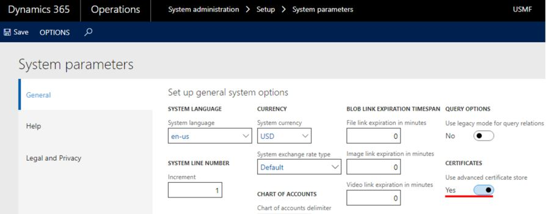
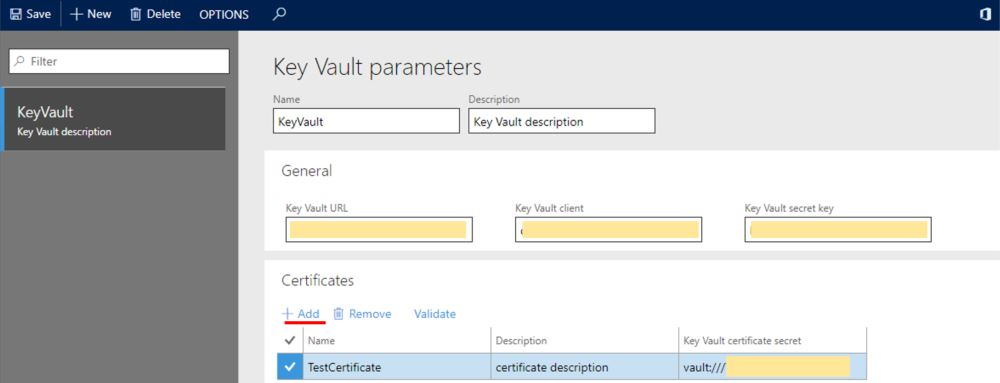

# Set up the Azure Key Vault client
[!include [banner](../../includes/banner.md)]

The functionality for storing advanced certificates lets you define the type of certificate storage that is used in finance and operations apps.

The functionality provides two options for storing certificates: local storage and Microsoft Azure Key Vault storage. You can define the option that is used by setting the new **Use advanced certificate store** option on the **General** tab of the **System parameters** page (**System administration** \> **Setup** \> **System parameters**).

- **Local storage** – This storage option can be used with on-premises deployments and any kind of on-premises development environment. To use it, set the **Use advanced certificate store** option to **No**. This storage option is recommended for development environments that are used for development and validation purposes, where it's necessary to validate the certificate and work with it.
- **Azure Key Vault storage** – This storage option is required for cloud deployments, but it can also be used with on-premises deployed environments and any kind of on-premises development environment. To use it, set the **Use advanced certificate store** option to **Yes**. This storage option is the only option for a production environment in the Azure cloud.

Some setup is required before you can work with certificates that are stored in Key Vault. For information about the required settings, see the following Microsoft Knowledge Base (KB) article: [4040294 - Maintaining Azure Key Vault storage](https://support.microsoft.com/en-us/help/4040294/maintaining-azure-key-vault-storage). After you set up the Key Vault storage, you should link to the certificates in finance and operations apps.

After the certificate is installed in Key Vault, it must be set up in the application.

1. Go to **System administration** \> **Setup** \> **Key Vault parameters**.
2. Select **New** to create a new instance.
3. Enter a name and description, and then, on the **General** FastTab, set the fields that are required for the integration with Key Vault storage:

- **Key Vault URL** – Enter the default Key Vault URL if it isn't already defined by the secret reference.
- **Key Vault client** – Enter the interactive client ID of the Microsoft Entra application that is associated with the Key Vault storage for authentication.
- **Key Vault secret key** – Enter the secret key that is associated with the Microsoft Entra application that is used for authentication with the Key Vault storage.

   > [!NOTE]
   > If several Key Vault storages are used, you should set up a separate instance for each instance on the **Key Vault parameters** page.

4. On the **Certificates** FastTab, select **Add** to add your certificates. For each certificate, set the following fields:

- **Name**
- **Description**
- **Key Vault certificate secret** – Enter a secret reference to the certificate.

The format of a Key Vault certificate secret must resemble the following example:

vault://\<KeyVaultName\*\>/\<SecretName\>/\<SecretVersion\*\>

Attributes that are marked with an asterisk (\*) are optional. However, the **\<SecretName\>** attribute is required. In most cases, you can define a Key Vault secret key in the following format:

vault:///\<SecretName\>

If the secret version isn't defined in the Key Vault secret key, the system retrieves the active certificate that has the latest expiration date.

   > [!NOTE]
   > The Key Vault storage functionality has been extended so that it includes caching of certificates. The following configuration is recommended:

- Specify a secret version in the Key Vault certificate secret.
- After you upload a new version of the existing certificate to the Key Vault storage, update the **\<SecretVersion\>** attribute in the **Key Vault certificate secret** field.

Use the **Validate** function to verify that you've correctly defined the reference to the certificate, and that the certificate is valid.

[!INCLUDE[footer-include](../../../includes/footer-banner.md)]
