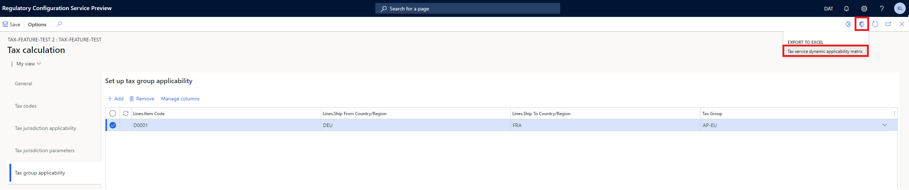

# Import and export tax calculations

This article provides information about the import and export functionality of the tax calculation feature. This functionality helps ensure a flexible and efficient configuration experience.

> [!NOTE]
> The functionality of Regulatory Configuration Service (RCS) is merged to the **Globalization Studio** workspace in Microsoft Dynamics Finance in version 10.0.39. For more information, see [Regulatory Configuration Service merge to the Globalization Studio workspace](workspace/merge-rcs-to-gsw.md).
>
> If you're using version 10.0.39 or later, use the **Globalization Studio** workspace in Finance instead of RCS.

## Import and export tax codes

### Export templates

1. Follow one of these steps, depending on where you're completing the procedure:

    - In [RCS](https://marketing.configure.global.dynamics.com/), open the **Globalization features** workspace, select **Features**, and then select the **Tax Calculation** tile.
    - In Finance, open the **Globalization Studio** workspace, select **Globalization services**, and then select the **Tax Calculation** tile.

2. On the **Tax calculation features** page, select an existing feature, or [create a new feature](global-get-started-with-tax-calculation-service.md#configure-the-tax-calculation-feature).
3. In the **Versions** grid, select **Edit**.
4. On the **Tax calculation** feature page, set the [configuration version](global-get-started-with-tax-calculation-service.md#configure-the-tax-calculation-feature).
5. On the **Tax codes** tab, select **Import**.
6. Select **Export a tax code template** to download the **TaxCodesTemplate.zip** file.
7. Unzip the **TaxCodesTemplate.zip** file. The tax code templates are compressed separately according to **Calculation origin** value.
8. Unzip the **By Net Amount.zip** file to get the following comma-separated values (CSV) files:

    - **TaxCode.csv** – Enter the tax codes.
    - **TaxLimit.csv** – Enter the tax limits for each tax code.
    - **TaxRate.csv** – Enter the tax rates for each tax code.

> [!NOTE]
> By default, entries for the **Sample** tax code are available in the templates. If the **Sample** tax code isn't removed from the CSV files, it will be imported into the feature.

### Import tax codes

Follow these steps to import the **Sample** tax code in the template into your tax calculation feature.

1. On the **Tax calculation features** page, select the feature, and then, in the **Versions** grid, select **Edit**.
2. On the **Tax codes** tab, select **Import**.
3. Select **Browse**, find and select the **TaxCode.csv** file, and then, in the **Target table** field, select **Tax code**.
4. Select **OK** to import the tax code.
5. Find and select the **TaxRate.csv** file, and then, in the **Target table** field, select **Tax rate**.
6. Select **OK** to import the tax rate.
7. Find and select the **TaxLimit.csv** file, and then, in the **Target table** field, select **Tax limit**.
8. Select **OK** to import the tax limit.

You can also directly import the zip file that includes all three CSV files. In this way, you can quickly and easily complete the import.

1. On the **Tax calculation** feature page, on the **Tax codes** tab, select **Import**.
2. Select **Browse**, find and select the **By Net Amount.zip** file, and then select **OK**.

### Export tax codes

1. On the **Tax calculation features** page, select the feature, and then, in the **Versions** grid, select **Edit**.
2. On the **Tax codes** tab, select **Export**.

    The **Export** button is available when there is at least one tax code in the **Tax codes** grid.

3. Select **OK** to export all tax codes of the feature in a zip file.

> [!NOTE]
> Use the exported file as a template to import tax codes into the corresponding feature.

## Import and export applicability rules

### Export applicability rules

1. On the **Tax calculation features** page, select an existing feature, or [create a new feature](global-get-started-with-tax-calculation-service.md#configure-the-tax-calculation-feature).
2. In the **Versions** grid, select **Edit**.
3. On the **Tax calculation** feature page, set the [configuration version](global-get-started-with-tax-calculation-service.md#configure-the-tax-calculation-feature).
4. On the **Tax group applicability** tab, select the rows in the **Set up tax group applicability** grid.
5. Select the **Open in Microsoft Office** button, and then select **Tax service dynamic applicability matrix**.

    

6. Select **Download** to export the selected rows to a Microsoft Excel worksheet.

### Import applicability rules

The Excel worksheet that you downloaded contains the structure of the **Set up tax group applicability** grid. You can add new rules directly in the worksheet. When you've finished, follow these steps to import the new rules back into the **Set up tax group applicability** grid.

1. In the Excel worksheet, select and copy the rows to import.
2. On the **Tax group applicability** tab, select **Add** to insert an empty record at the bottom of the **Set up tax group applicability** grid.
3. Select **Ctrl+V** to paste the copied rows into the grid.
4. Select **Save**.

## Import feature demo data

Follow these steps to import feature demo data.

1. On the **Tax calculation features** page, select **Import**, and then, on the **Import feature from Dataverse repository** page, select **Synchronize**. 
2. In the table, select the **tax-calculation-feature-demo-data** feature, and then select **Import**.
3. Select **View** to review the tax codes, groups, and applicability rules that are defined in the imported feature.
4. Switch to the **DEMF** legal entity, and then go to **Tax** \> **Setup** \> **Tax configuration** \> **Tax calculation parameters**.
5. On the **General** tab, select **Enable advanced tax calculation**.
6. In the **Feature setup name** field, select **tax-calculation-feature-demo-data**.
7. Select a settlement period and a ledger posting group for the new demo tax codes, and then select **Confirm**.
8. Select **Save**.

> [!NOTE]
> The **tax-calculation-feature-demo-data** demo feature is based on feature version **40.54.234** and is designed for the **DEMF** demo legal entity.
