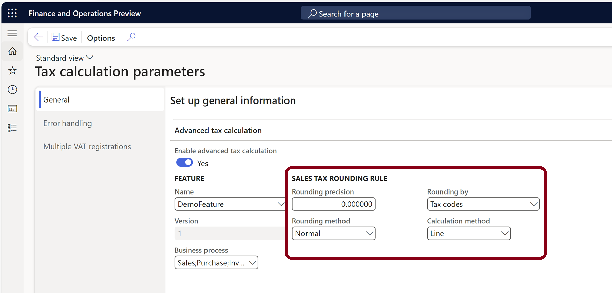

# Tax calculation rounding rules

[!include [banner](../../includes/banner.md)]

This article provides information about how the rounding rules work on the **Tax calculation parameters** page.

> [!NOTE] 
> When the **Enable advanced tax calculation** parameter is enabled, the rounding rules on the **Sales tax code** and **Sales tax group** pages aren't effective.

You can view the configuration of rounding rules for the tax calculation service in the **Sales tax rounding rule** section on the **Calculation** FastTab on the **General** tab of the **Tax calculation parameters** page (**Tax** \> **Setup** \> **Tax configuration** \> **Tax calculation parameters**).

The **Rounding precision** and **Rounding method** fields determine how calculated amounts in the payload from the tax calculation service are rounded.

## Rounding precision

The **Rounding precision** fields supports a value that has up to six decimal places. For example, if you set the **Rounding precision** field to **0.000000**, calculated amounts are rounded to six decimal places and then sent to Microsoft Dynamics 365 Finance. For example, if the **Normal** rounding method is used, the amount **987.1234567** is rounded to **987.123457**.

> [!NOTE]
> Finance rounds amounts according to the currency rounding rules. Therefore, the tax amounts that are shown and recorded in transactions are affected by both tax calculation rounding rules and currency rounding rules.

## Rounding method

The rounding method for tax calculation can be configured for each legal entity. In the **Rounding method** field, you can select among three options: **Normal**, **Downward**, and **Rounding-up**.

### Rounding example

The following table provides an example that shows how the amount **987.345** is rounded for different combinations of rounding precisions and rounding methods.

<table>
<thead>
<tr>
<th rowspan="2">Rounding method</th>
<th colspan="8">Rounding precision</th>
</tr>
<tr>
<th>0.00</th>
<th>0.01</th>
<th>0.10</th>
<th>1.00</th>
<th>10.00</th>
<th>0.02</th>
<th>0.05</th>
<th>0.25</th>
</tr>
</thead>
<tbody>
<tr>
<td>Normal</td>
<td>987.35</td>
<td>987.35</td>
<td>987.30</td>
<td>987.00</td>
<td>990.00</td>
<td>987.34</td>
<td>987.35</td>
<td>987.25</td>
</tr>
<tr>
<td>Downward</td>
<td>987.00</td>
<td>987.34</td>
<td>987.30</td>
<td>987.00</td>
<td>980.00</td>
<td>987.34</td>
<td>987.30</td>
<td>987.25</td>
</tr>
<tr>
<td>Rounding-up</td>
<td>988.00</td>
<td>987.35</td>
<td>987.40</td>
<td>988.00</td>
<td>990.00</td>
<td>987.36</td>
<td>987.35</td>
<td>987.50</td>
</tr>
</tbody>
</table>

The calculation and rounding logic of tax amounts can be configured according to taxation rules.

## Rounding by 

In the **Rounding by** field, select the rounding principle that applies to the taxes. The following options are available:

- **Tax codes** – Round the tax amount inside each tax code.
- **Tax code combinations** – Round the tax amount inside the tax code combination on the line.

## Calculation method

In the **Calculation method** field, select whether taxes on invoices are calculated for each line or all lines. The following options are available:

- **Line** – Calculate the tax amount on a line-by-line basis. The tax amount on each line is unaffected by the tax amount on other lines.
- **Total** – Calculate the tax amount across all the lines on one document.

### Rounding calculation example

This example shows the different calculations that can be done for one invoice, for different combinations of **Rounding by** and **Calculation method** values. For this example, the following setup is in place:

- The invoice has four lines.
- There are two tax codes: **VAT1** (10 percent) and **VAT2** (10 percent).
- The rounding precision is set to **0.01**.
- The rounding method is set to **Rounding-up**.

#### Rounding by = Tax codes and Calculation method = Line

| Line number | Line net amount | Determined tax codes | Tax amount before rounding | Rounded tax amount |
|-------------|-----------------|----------------------|----------------------------|--------------------|
| 1           | 11.11           | VAT1                 | 1.111                      | 1.12               |
| 2           | 22.22           | VAT1; VAT2           | 2.222; 2.222               | 2.23; 2.23         |
| 3           | 33.33           | VAT1                 | 3.333                      | 3.34               |
| 4           | 44.44           | VAT1; VAT2           | 4.444; 4;444               | 4.45; 4.45         |

#### Rounding by = Tax code combinations and Calculation method = Line

| Line number | Line net amount | Determined tax codes | Tax amount before rounding | Rounded tax amount |
|-------------|-----------------|----------------------|----------------------------|--------------------|
| 1           | 11.11           | VAT1                 | 1.111                      | 1.12               |
| 2\*         | 22.22           | VAT1; VAT2           | 2.222; 2.222               | 2.23; 2.22         |
| 3           | 33.33           | VAT1                 | 3.333                      | 3.34               |
| 4\*\*       | 44.44           | VAT1; VAT2           | 4.444; 4;444               | 4.45; 4.44         |

\* Line 2 = Round\[22.22 × (10 percent + 10 percent)\] = 2.23 + 2.22

\*\* Line 4 = Round\[44.44 × (10 percent + 10 percent)\] = 4.45 + 4.44

#### Rounding by = Tax codes and Calculation method = Total

| Line number | Line net amount | Determined tax codes | Tax amount before rounding | Rounded tax amount |
|-------------|-----------------|----------------------|----------------------------|--------------------|
| 1           | 11.11           | VAT1\*               | 1.111                      | 1.12               |
| 2           | 22.22           | VAT1\*; VAT2\*\*     | 2.222; 2.222               | 2.22; 2.23         |
| 3           | 33.33           | VAT1\*               | 3.333                      | 3.33               |
| 4           | 44.44           | VAT1\*; VAT2\*\*     | 4.444; 4;444               | 4.44; 4.44         |

\* VAT1(Line 1, Line 2, Line 3, Line 4) = Round\[(11.11 + 22.22 + 33.33 + 44.44) × 10 percent\] = 1.12 + 2.22 + 3.33 + 4.44

\*\* VAT2(Line 2, Line 4) = Round\[(22.22 + 44.44) × 10 percent\] = 2.23 + 4.44

#### Rounding by = Tax code combinations and Calculation method = Total

| Line number | Line net amount | Determined tax codes | Tax amount before rounding | Rounded tax amount |
|-------------|-----------------|----------------------|----------------------------|--------------------|
| 1\*         | 11.11           | VAT1                 | 1.111                      | 1.12               |
| 2\*\*       | 22.22           | VAT1; VAT2           | 2.222; 2.222               | 2.23; 2.22         |
| 3\*         | 33.33           | VAT1                 | 3.333                      | 3.33               |
| 4\*\*       | 44.44           | VAT1; VAT2           | 4.444; 4;444               | 4.44; 4.45         |

\* Line 1, Line 3 = Round\[(11.11 + 33.33) × 10 percent\] = 1.12 + 3.33

\*\* Line 2, Line 4 = Round\[(22.22 + 44.44) × (10 percent + 10 percent)\] = 2.23 + 2.22 + 4.44 + 4.45

[!INCLUDE[footer-include](../../../includes/footer-banner.md)]
