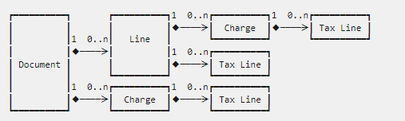

# Add data fields in the tax integration by using extension

[!include [banner](../../includes/banner.md)]


This article explains how to use X++ extensions to add data fields in the tax integration. These fields can be extended to the tax data model of the tax service and used to determine tax codes. For more information, see [Add data fields in tax configurations](tax-service-add-data-fields-tax-configurations.md).

## Data model

The data in the data model is carried by objects and implemented by classes.

Here is a list of the major objects:

* AxClass/TaxIntegration**Document**Object
* AxClass/TaxIntegration**Line**Object
* AxClass/TaxIntegration**TaxLine**Object

The following illustration shows how these objects are related.

]

A **Document** object can contain many **Line** objects. Each object contains metadata for the tax service.

- `TaxIntegrationDocumentObject` has `originAddress` metadata, which contains information about the source address, and `includingTax` metadata, which indicates whether the line amount includes sales tax.
- `TaxIntegrationLineObject` has `itemId`, `quantity`, and `categoryId` metadata.

> [!NOTE]
> `TaxIntegrationLineObject` also implements **Charge** objects.

## Integration flow

The data in the flow is manipulated by activities.

### Key activities

* AxClass/TaxIntegration**Calculation**ActivityOnDocument
* AxClass/TaxIntegration**CurrencyExchange**ActivityOnDocument
* AxClass/TaxIntegration**DataPersistence**ActivityOnDocument
* AxClass/TaxIntegration**DataRetrieval**ActivityOnDocument
* AxClass/TaxIntegration**SettingRetrieval**ActivityOnDocument

Activities are run in the following order:

1. Setting Retrieval
2. Data Retrieval
3. Calculation Service
4. Currency Exchange
5. Data Persistence

For example, extend **Data Retrieval** before **Calculation Service**.

#### Data Retrieval activities

**Data Retrieval** activities retrieve data from the database. Adapters for different transactions are available to retrieve data from different transaction tables:

- AxClass/TaxIntegration**PurchTable**DataRetrieval
- AxClass/TaxIntegration**PurchParmTable**DataRetrieval
- AxClass/TaxIntegration**PurchREQTable**DataRetrieval
- AxClass/TaxIntegration**PurchRFQTable**DataRetrieval
- AxClass/TaxIntegration**VendInvoiceInfoTable**DataRetrieval
- AxClass/TaxIntegration**SalesTable**DataRetrieval
- AxClass/TaxIntegration**SalesParm**DataRetrieval

In these **Data Retrieval** activities, data is copied from the database to `TaxIntegrationDocumentObject` and `TaxIntegrationLineObject`. Because all these activities extend the same abstract template class, they have common methods.

#### Calculation Service activities

The **Calculation Service** activity is the link between the tax service and the tax integration. This activity is responsible for the following functions:

1. Construct the request.
2. Post the request to the tax service.
3. Get the response from the tax service.
4. Parse the response.

A data field that you add to the request will be posted together with other metadata. 

## Extension implementation

This section provides detailed steps that explain how to implement the extension. It uses the **Cost center** and **Project** financial dimensions as examples.

### Step 1. Add the data variable in the object class

The object class contains the data variable and getter/setter methods for the data. Add the data field to either `TaxIntegrationDocumentObject` or `TaxIntegrationLineObject`, depending on the level of the field. The following example uses the line level, and the file name is `TaxIntegrationLineObject_Extension.xpp`.

> [!NOTE]
> If the data field that you're adding is at the document level, change the file name to `TaxIntegrationDocumentObject_Extension.xpp`.

```X++
[ExtensionOf(classStr(TaxIntegrationLineObject))]
final class TaxIntegrationLineObject_Extension
{
    private OMOperatingUnitNumber costCenter;
    private ProjId projectId;

    /// <summary>
    /// Gets a costCenter.
    /// </summary>
    /// <returns>The cost center.</returns>
    public final OMOperatingUnitNumber getCostCenter()
    {
        return this.costCenter;
    }

    /// <summary>
    /// Sets the cost center.
    /// </summary>
    /// <param name = "_value">The cost center.</param>
    public final void setCostCenter(OMOperatingUnitNumber _value)
    {
        this.costCenter = _value;
    }

    /// <summary>
    /// Gets a project ID.
    /// </summary>
    /// <returns>The project ID.</returns>
    public final ProjId getProjectId()
    {
        return this.projectId;
    }

    /// <summary>
    /// Sets the project ID.
    /// </summary>
    /// <param name = "_value">The project ID.</param>
    public final void setProjectId(ProjId _value)
    {
        this.projectId = _value;
    }
}
```

**Cost center** and **Project** are added as private variables. Create getter and setter methods for these data fields to manipulate the data.

### Step 2. Retrieve data from the database

Specify the transaction, and extend the appropriate adapter classes to retrieve the data. For example, if you use a **Purchase order** transaction, you must extend `TaxIntegrationPurchTableDataRetrieval` and `TaxIntegrationVendInvoiceInfoTableDataRetrieval`. 

> [!NOTE]
> `TaxIntegrationPurchParmTableDataRetrieval` is inherited from `TaxIntegrationPurchTableDataRetrieval`. It should not be changed unless the logic of the `purchTable` and `purchParmTable` tables differs.

If the data field should be added for all transactions, extend all `DataRetrieval` classes.

Because all **Data Retrieval** activities extend the same template class, the class structures, variables, and methods are similar.

```X++
protected TaxIntegrationDocumentObject document;

/// <summary>
/// Copies to the document.
/// </summary>
protected abstract void copyToDocument()
{
    // It is recommended to implement as:
    //
    // this.copyToDocumentByDefault();
    // this.copyToDocumentFromHeaderTable();
    // this.copyAddressToDocument();
}
 
/// <summary>
/// Copies to the current line of the document.
/// </summary>
/// <param name = "_line">The current line of the document.</param>
protected abstract void copyToLine(TaxIntegrationLineObject _line)
{
    // It is recommended to implement as:
    //
    // this.copyToLineByDefault(_line);
    // this.copyToLineFromLineTable(_line);
    // this.copyQuantityAndTransactionAmountToLine(_line);
    // this.copyAddressToLine(_line);
    // this.copyToLineFromHeaderTable(_line);
}
```

The following example shows the basic structure when the `PurchTable` table is used.

```X++
public class TaxIntegrationPurchTableDataRetrieval extends TaxIntegrationAbstractDataRetrievalTemplate
{
    protected PurchTable purchTable;
    protected PurchLine purchLine;

    // Query builder methods
    [Replaceable]
    protected SysDaQueryObject getDocumentQueryObject()
    [Replaceable]
    protected SysDaQueryObject getLineQueryObject()
    [Replaceable]
    protected SysDaQueryObject getDocumentChargeQueryObject()
    [Replaceable]
    protected SysDaQueryObject getLineChargeQueryObject()

    // Data retrieval methods
    protected void copyToDocument()
    protected void copyToDocumentFromHeaderTable()
    protected void copyToLine(TaxIntegrationLineObject _line)
    protected void copyToLineFromLineTable(TaxIntegrationLineObject _line)
    ...
}
```

When the `CopyToDocument` method is called, the `this.purchTable` buffer already exists. The purpose of this method is to copy all the required data from `this.purchTable` to the `document` object by using the setter method that was created in the `DocumentObject` class.

Likewise, a `this.purchLine` buffer already exists in the `CopyToLine` method. The purpose of this method is to copy all the required data from `this.purchLine` to the `_line` object by using the setter method that was created in the `LineObject` class.

The most straightforward approach is to extend the `CopyToDocument` and `CopyToLine` methods. However, we recommend that you try the `copyToDocumentFromHeaderTable` and `copyToLineFromLineTable` methods first. If they don't work as you require, implement your own method, and call it in `CopyToDocument` and `CopyToLine`. There are three common situations where you might use this approach:

- The required field is in `PurchTable` or `PurchLine`. In this situation, you can extend `copyToDocumentFromHeaderTable` and `copyToLineFromLineTable`. Here is the sample code.

    ```X++
    /// <summary>
    /// Copies to the current line of the document from.
    /// </summary>
    /// <param name = "_line">The current line of the document.</param>
    protected void copyToLineFromLineTable(TaxIntegrationLineObject _line)
    {
        next copyToLineFromLineTable(_line);
        // if we already added XXX in TaxIntegrationLineObject
        _line.setXXX(this.purchLine.XXX);
    }
    ```

- The required data isn't in the default table of the transaction. However, there are some join relationships with the default table, and the field is required on most lines. In this situation, replace `getDocumentQueryObject` or `getLineObject` to query the table by join relationship. In the following example, the **Deliver Now** field is integrated with the sales order at the line level.

    ```X++
    public class TaxIntegrationSalesTableDataRetrieval
    {
        protected MCRSalesLineDropShipment mcrSalesLineDropShipment;

        /// <summary>
        /// Gets the query for the lines of the document.
        /// </summary>
        /// <returns>The query for the lines of the document</returns>
        [Replaceable]
        protected SysDaQueryObject getLineQueryObject()
        {
            return SysDaQueryObjectBuilder::from(this.salesLine)
                .where(this.salesLine, fieldStr(SalesLine, SalesId)).isEqualToLiteral(this.salesTable.SalesId)
                .outerJoin(this.mcrSalesLineDropShipment)
                .where(this.mcrSalesLineDropShipment, fieldStr(MCRSalesLineDropShipment, SalesLine)).isEqualTo(this.salesLine, fieldStr(SalesLine, RecId))
                .toSysDaQueryObject();
        }
    }
    ```

    In this example, a `mcrSalesLineDropShipment` buffer is declared, and the query is defined in `getLineQueryObject`. The query uses the relationship `MCRSalesLineDropShipment.SalesLine == SalesLine.RecId`. While you're extending in this situation, you can replace `getLineQueryObject` with your own constructed query object. However, note the following points:

    * Because the return value of the `getLineQueryObject` method is `SysDaQueryObject`, you must construct this object by using the SysDa approach.
    * Can't remove existed table.

- The required data is related to the transaction table by a complicated join relationship, or the relation isn't one to one (1:1) but one to many (1:N). In this situation, things become a little complicated. This situation applies to the example of financial dimensions. 

    In this situation, you can implement your own method to retrieve the data. Here is the sample code in the `TaxIntegrationPurchTableDataRetrieval_Extension.xpp` file.

    ```X++
    [ExtensionOf(classStr(TaxIntegrationPurchTableDataRetrieval))]
    final class TaxIntegrationPurchTableDataRetrieval_Extension
    {
        private const str CostCenterKey = 'CostCenter';
        private const str ProjectKey = 'Project';

        /// <summary>
        /// Copies to the current line of the document from.
        /// </summary>
        /// <param name = "_line">The current line of the document.</param>
        protected void copyToLineFromLineTable(TaxIntegrationLineObject _line)
        {
            Map dimensionAttributeMap = this.getDimensionAttributeMapByDefaultDimension(this.purchline.DefaultDimension);
            if (dimensionAttributeMap.exists(CostCenterKey))
            {
                _line.setCostCenter(dimensionAttributeMap.lookup(CostCenterKey));
            }
            if (dimensionAttributeMap.exists(ProjectKey))
            {
                _line.setProjectId(dimensionAttributeMap.lookup(ProjectKey));
            }
            next copyToLineFromLineTable(_line);
        }
        private Map getDimensionAttributeMapByDefaultDimension(RefRecId _defaultDimension)
        {
            DimensionAttribute dimensionAttribute;
            DimensionAttributeValue dimensionAttributeValue;
            DimensionAttributeValueSetItem dimensionAttributeValueSetItem;
            Map ret = new Map(Types::String, Types::String);

            select Name, RecId from dimensionAttribute
                join dimensionAttributeValue
                    where dimensionAttributeValue.dimensionAttribute == dimensionAttribute.RecId
                join DimensionAttributeValueSetItem
                    where DimensionAttributeValueSetItem.DimensionAttributeValue == DimensionAttributeValue.RecId
                        && DimensionAttributeValueSetItem.DimensionAttributeValueSet == _defaultDimension;

            while(dimensionAttribute.RecId)
            {
                ret.insert(dimensionAttribute.Name, dimensionAttributeValue.DisplayValue);
                next dimensionAttribute;
            }
            return ret;
        }
    }
    ```

### Step 3. Add data to the request

Extend the `copyToTaxableDocumentHeaderWrapperFromTaxIntegrationDocumentObject` or `copyToTaxableDocumentLineWrapperFromTaxIntegrationLineObjectByLine` method to add data to the request. Here is the sample code in the `TaxIntegrationCalculationActivityOnDocument_CalculationService_Extension.xpp` file.

```X++
[ExtensionOf(classStr(TaxIntegrationCalculationActivityOnDocument_CalculationService))]
final static class TaxIntegrationCalculationActivityOnDocument_CalculationService_Extension
{
    // Define the field name in the request
    private const str IOCostCenter = 'Cost Center';
    private const str IOProject = 'Project';
    // private const str IOEnumExample = 'Enum Example';

    /// <summary>
    /// Copies to <c>TaxableDocumentLineWrapper</c> from <c>TaxIntegrationLineObject</c> by line.
    /// </summary>
    /// <param name = "_destination"><c>TaxableDocumentLineWrapper</c>.</param>
    /// <param name = "_source"><c>TaxIntegrationLineObject</c>.</param>
    protected static void copyToTaxableDocumentLineWrapperFromTaxIntegrationLineObjectByLine(Microsoft.Dynamics.TaxCalculation.ApiContracts.TaxableDocumentLineWrapper _destination, TaxIntegrationLineObject _source)
    {
        next copyToTaxableDocumentLineWrapperFromTaxIntegrationLineObjectByLine(_destination, _source);
        // Set the field we need to integrated for tax service
        _destination.SetField(IOCostCenter, _source.getCostCenter());
        _destination.SetField(IOProject, _source.getProjectId());

        // If the field to be extended is an enum type, use enum2Symbol to convert an enum variable exampleEnum of ExampleEnumType to a string
        // _destination.SetField(IOEnumExample, enum2Symbol(enumNum(ExampleEnumType), _source.getExampleEnum()));
    }
}
```

In this code, `_destination` is the wrapper object that is used to generate the request, and `_source` is the `TaxIntegrationLineObject` object.

> [!NOTE]
> Define the field name that is used in the request as **private const str**. The string should be exactly the same as the node name (not the label) added in the article [Add data fields in tax configurations](tax-service-add-data-fields-tax-configurations.md).
> 
> Set the field in the **copyToTaxableDocumentLineWrapperFromTaxIntegrationLineObjectByLine** method by using the **SetField** method. The data type of the second parameter should be **string**. If the data type isn't **string**, convert it to string.
> If the data type is X++ **enum type**, we recommend you use the **enum2Symbol** method to convert the enum value to a string. The enum value added in the tax configuration should be exactly the same as the enum name. The following is a list of differences between enum value, label, and name.
> 
>   - The name of enum is a symbolic name in code. **enum2Symbol()** can convert the enum value to its name.
>   - The value of the enum is integer.
>   - The label of the enum can be different across preferred languages. **enum2Str()** can convert the enum value to its label.

## Model dependency

To successfully build the project, add the following reference models to the model dependencies:

- ApplicationPlatform
- ApplicationSuite
- Tax Engine
- Dimensions, if financial dimension is used
- Other necessary models referenced in the code

## Validation

After you complete the previous steps, you can validate your changes.

1. In Finance, go to **Accounts payable** and add **&debug=vs%2CconfirmExit&** to the URL. For example, `https://usnconeboxax1aos.cloud.onebox.dynamics.com/?cmp=DEMF&mi=PurchTableListPage&debug=vs%2CconfirmExit&`. The final **&** is essential.
2. Open the **Purchase order** page and select **New** to create a purchase order.
3. Set the value for the customized field, and then select **Sales tax**. A troubleshooting file with prefix, **TaxServiceTroubleshootingLog** is downloaded automatically. This file contains the transaction information posted to the Tax Calculation Service. 
4. Check if the customized field added is present in the **Tax service calculation input JSON** section and if its value is correct. If the value isn't correct, double check the steps in this document.

File example:

```
===Tax service calculation input JSON:===
{
  "TaxableDocument": {
    "Header": [
      {
        "Lines": [
          {
            "Line Type": "Normal",
            "Item Code": "",
            "Item Type": "Item",
            "Quantity": 0.0,
            "Amount": 1000.0,
            "Currency": "EUR",
            "Transaction Date": "2022-1-26T00:00:00",
            ...
            /// The new fields added at line level
            "Cost Center": "003",
            "Project": "Proj-123"
          }
        ],
        "Amount include tax": true,
        "Business Process": "Journal",
        "Currency": "",
        "Vendor Account": "DE-001",
        "Vendor Invoice Account": "DE-001",
        ...
        // The new fields added at header level, no new fields in this example
        ...
      }
    ]
  },
}
...
```

## Appendix

This appendix shows the complete sample code for the integration of the financial dimensions, **Cost center** and **Project** at the line level.

### TaxIntegrationLineObject_Extension.xpp

```X++
[ExtensionOf(classStr(TaxIntegrationLineObject))]
final class TaxIntegrationLineObject_Extension
{
    private OMOperatingUnitNumber costCenter;
    private ProjId projectId;

    /// <summary>
    /// Gets a costCenter.
    /// </summary>
    /// <returns>The cost center.</returns>
    public final OMOperatingUnitNumber getCostCenter()
    {
        return this.costCenter;
    }

    /// <summary>
    /// Sets the cost center.
    /// </summary>
    /// <param name = "_value">The cost center.</param>
    public final void setCostCenter(OMOperatingUnitNumber _value)
    {
        this.costCenter = _value;
    }

    /// <summary>
    /// Gets a project ID.
    /// </summary>
    /// <returns>The project ID.</returns>
    public final ProjId getProjectId()
    {
        return this.projectId;
    }

    /// <summary>
    /// Sets the project ID.
    /// </summary>
    /// <param name = "_value">The project ID.</param>
    public final void setProjectId(ProjId _value)
    {
        this.projectId = _value;
    }
}
```

### TaxIntegrationPurchTableDataRetrieval_Extension.xpp

```X++
[ExtensionOf(classStr(TaxIntegrationPurchTableDataRetrieval))]
final class TaxIntegrationPurchTableDataRetrieval_Extension
{
    private const str CostCenterKey = 'CostCenter';
    private const str ProjectKey = 'Project';

    /// <summary>
    /// Copies to the current line of the document from.
    /// </summary>
    /// <param name = "_line">The current line of the document.</param>
    protected void copyToLineFromLineTable(TaxIntegrationLineObject _line)
    {
        Map dimensionAttributeMap = this.getDimensionAttributeMapByDefaultDimension(this.purchline.DefaultDimension);
        if (dimensionAttributeMap.exists(CostCenterKey))
        {
            _line.setCostCenter(dimensionAttributeMap.lookup(CostCenterKey));
        }
        if (dimensionAttributeMap.exists(ProjectKey))
        {
            _line.setProjectId(dimensionAttributeMap.lookup(ProjectKey));
        }
        next copyToLineFromLineTable(_line);
    }
    private Map getDimensionAttributeMapByDefaultDimension(RefRecId _defaultDimension)
    {
        DimensionAttribute dimensionAttribute;
        DimensionAttributeValue dimensionAttributeValue;
        DimensionAttributeValueSetItem dimensionAttributeValueSetItem;
        Map ret = new Map(Types::String, Types::String);
        select Name, RecId from dimensionAttribute
            join dimensionAttributeValue
                where dimensionAttributeValue.dimensionAttribute == dimensionAttribute.RecId
            join DimensionAttributeValueSetItem
                where DimensionAttributeValueSetItem.DimensionAttributeValue == DimensionAttributeValue.RecId
                    && DimensionAttributeValueSetItem.DimensionAttributeValueSet == _defaultDimension;
        while(dimensionAttribute.RecId)
        {
            ret.insert(dimensionAttribute.Name, dimensionAttributeValue.DisplayValue);
            next dimensionAttribute;
        }
        return ret;
    }
}
```

### TaxIntegrationCalculationActivityOnDocument_CalculationService_Extension.xpp

```X++
[ExtensionOf(classStr(TaxIntegrationCalculationActivityOnDocument_CalculationService))]
final static class TaxIntegrationCalculationActivityOnDocument_CalculationService_Extension
{
    // Define the field name in the request
    private const str IOCostCenter = 'Cost Center';
    private const str IOProject = 'Project';

    /// <summary>
    /// Copies to <c>TaxableDocumentLineWrapper</c> from <c>TaxIntegrationLineObject</c> by line.
    /// </summary>
    /// <param name = "_destination"><c>TaxableDocumentLineWrapper</c>.</param>
    /// <param name = "_source"><c>TaxIntegrationLineObject</c>.</param>
    protected static void copyToTaxableDocumentLineWrapperFromTaxIntegrationLineObjectByLine(Microsoft.Dynamics.TaxCalculation.ApiContracts.TaxableDocumentLineWrapper _destination, TaxIntegrationLineObject _source)
    {
        next copyToTaxableDocumentLineWrapperFromTaxIntegrationLineObjectByLine(_destination, _source);
        // Set the field we need to integrated for tax service
        _destination.SetField(IOCostCenter, _source.getCostCenter());
        _destination.SetField(IOProject, _source.getProjectId());
    }
}
```
