# Enable master data lookup for tax calculation configuration 

[!include [banner](../../includes/banner.md)]

This article explains how to set up and enable the tax calculation master data lookup functionality. A dropdown list is available to select values in the tax calculation configuration for fields such as **Legal entity**, **Vendor account**, **Item code**, and **Delivery term**. These values come from the connected Microsoft Dynamics 365 Finance environment using the Microsoft Dataverse data source.

> [!NOTE] 
> The tax calculation master data lookup functionality is optional functionality. You can skip the following steps if you disable the **Tax Service Dataverse datasources support** feature in Regulatory Configuration Service (RCS). However, in that case, the dropdown list won't be available in the tax calculation configuration.
>
> If you're using version 10.0.39 or later, and you use the **Globalization Studio** workspace in Finance instead of RCS, you can control the lookup functionality by using the **Enable applicability rules value lookup for Tax Calculation Service** feature in the **Feature management** workspace in Finance.

If you're using version 10.0.39 or later, follow these steps in Finance to enable the dropdown list in the feature version configuration of Tax Calculation.

1. In the **Feature management** workspace, enable the **Enable applicability rules value lookup for Tax Calculation Service** feature.
2. Make sure that you imported the latest configuration and model mapping versions. If you didn't, follow the steps in [Import Electronic reporting (ER) configurations from Dataverse](workspace/gsw-import-er-config-dataverse.md) to import them.

    - Tax Data Model.version.40.xml
    - Tax Calculation Data Model 40.65.xml
    - FNO Model Mapping 40.65.35.xml (For this model mapping, set the **Default for model mapping** parameter to **Yes**.)
    - Tax Calculation Configuration 40.65.249.xml

3. On the tax **Feature version** setup page, select configuration version 40.65.249.

    > [!NOTE] 
    > If you have a customized configuration, you must rebase the configuration and then use the customized configuration. 

4. In the **Source legal entity** field, select legal entities. You'll be able to choose master data from these legal entities.

If you're using version 10.0.38 or earlier, follow these steps to enable the dropdown list in the feature version configuration of Tax Calculation. 

1. [Enable Microsoft Power Platform integration and open the Dataverse environment.](#enable)
2. [Install finance and operations virtual entities.](#install)
3. [Register a Microsoft Entra application.](#register)
4. [Grant app permissions in finance and operations apps.](#grant)
5. [Configure the virtual entity data source.](#configure)
6. [Enable Dataverse virtual entities.](#virtual)
7. [Set up the connected application for Tax Calculation.](#set-up)
8. [Import and set up the Dataverse Model Mapping configuration.](#import)

## Enable Microsoft Power Platform integration and open the Dataverse environment

The integration of finance and operations apps with Microsoft Power Platform can be enabled when you create a new finance and operations apps environment in Microsoft Dynamics Lifecycle Services. For more information, see [Microsoft Power Platform integration - Add-ins overview](../../../fin-ops-core/dev-itpro/power-platform/add-ins-overview.md). When you've finished, the name of a Microsoft Power Platform environment will appear in the **Power Platform Integration** section.

1. In Lifecycle Services, in your finance and operations environment, in the **Power Platform Integration** section, find and make a note of the **Environment name** value for the linked environment.

    [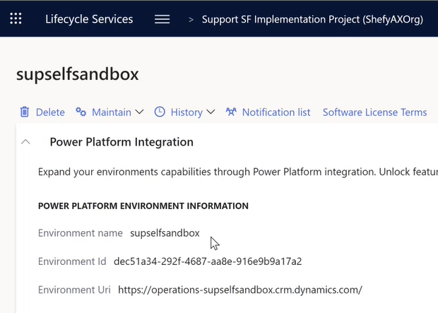](../media/tcs-dataverse-master-data-lookup-1.png)

2. In the [Power Platform admin center](https://admin.powerplatform.microsoft.com/environments), on the **Environments** tab, select the environment that matches the **Environment name** value that you made a note of.
3. On the **Details** page, find the **Environment URL** value of the Dataverse environment. Make a note of this value, because you will need it in [Step 7. Set up the connected application for Tax Calculation](#set-up).
4. Make sure that you can open the Dataverse environment in your browser by selecting the **Environment URL** value.

    [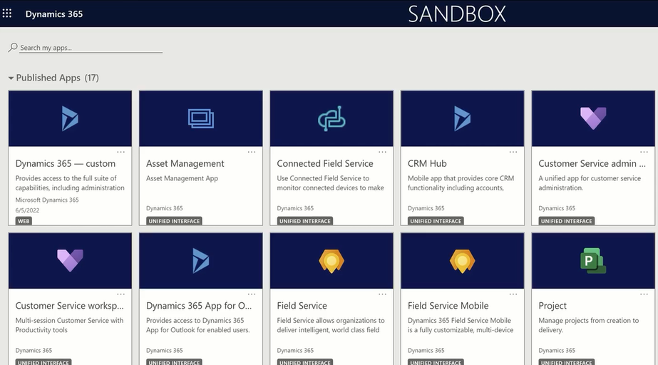](../media/tcs-dataverse-master-data-lookup-2.png)

    > [!NOTE]
    > Keep the Dataverse environment open in your browser. You will need it in [Step 5. Configure the virtual entity data source](#configure).

For more information, see [Enable the Microsoft Power Platform integration](../../../fin-ops-core/dev-itpro/power-platform/enable-power-platform-integration.md).

## Install finance and operations virtual entities

The Dataverse solution for finance and operations virtual entities must be installed from Microsoft AppSource virtual entity solution.

1. In AppSource, find the [Finance and operations virtual entity](https://appsource.microsoft.com/product/dynamics-365/mscrm.finance_and_operations_virtual_entity).
2. Select **Get it now**.
3. In the **Select an environment** field, enter the **Environment name** value that you made a note of earlier.
4. Select the checkboxes, and then select **Install**.

When the installation is completed, you can find the **Finance and operations virtual entity** app in the [Power Platform admin center](https://admin.powerplatform.microsoft.com/), under **Resources** \> **Dynamics 365 apps**.

For more information, see [Getting the virtual entity solution](../../../fin-ops-core/dev-itpro/power-platform/admin-reference.md#get-virtual-entity-solution).

## Register a Microsoft Entra application

You must register a Microsoft Entra application on the same tenant as the finance and operations apps, so that they can be called by Dataverse.

1. In the [Azure portal](https://portal.azure.com), go to **Microsoft Entra \> App registrations**.
2. Select **New registration**, and enter the following information:

    - **Name** – Enter a unique name.
    - **Account type** – Enter **Any Microsoft Entra directory** (single-tenant or multi-tenant).
    - **Redirect URI** – Leave this field blank.

3. Select **Register**.
4. Make a note of the **Application (client) ID** value, because you will need it later.

    [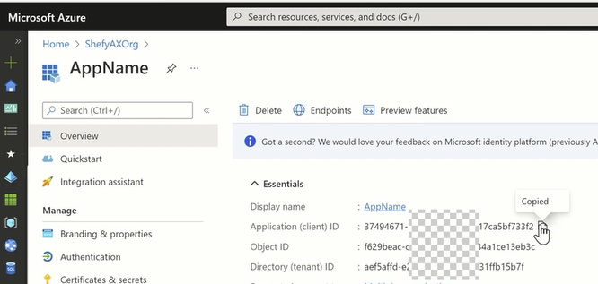](../media/tcs-dataverse-master-data-lookup-3.png)

5. Create a symmetric key for the application.
6. In the new application, select **Certificates & secrets**.
7. Select **New client secret**.
8. Enter a description, select an expiration date, and then select **Save**. A key will be created and shown. Copy the value for later use.

For more information, see [Register Microsoft Entra application](../../../fin-ops-core/dev-itpro/power-platform/admin-reference.md#register-the-app-in-the-azure-portal).

## Grant app permissions in finance and operations apps

Dataverse uses the Microsoft Entra application that you created to call finance and operations apps. Therefore, the application must be trusted by the finance and operations apps and associated with a user account that has the appropriate rights. In the finance and operations apps, you must create a special service user that has rights **only** to the virtual entity functionality. This service user must have no other rights. After you complete this step, any application that has the secret of the Microsoft Entra application that you created will be able to call the finance and operations apps environment and access the virtual entity functionality.

1. In your environment, go to **System Administration** \> **Users** \> **Users**.
2. Select **New** to add a new user, and enter the following information:

    - **User ID** – Enter **dataverseintegration** or another value.
    - **User name** – Enter **dataverse integration** or another value.
    - **Provider** – Set this field to **NonMicrosoft Entra ID**.
    - **Email** – Enter **dataverseintegration** or another value. (The value doesn't have to be a valid email account.)

3. Assign the **Dataverse Virtual entity integration app** security role to the user.
4. Remove all other roles, including **System user**.
5. Go to **System Administration** \> **Setup** \> **Microsoft Entra applications** to register Dataverse. 
6. Add a row, and then, in the **Client ID** field, enter the **Application (client) ID** value that you made a note of earlier.
7. In the **Name** field, enter a name. For example, enter **Dataverse Integration**.
8. In the **User ID** field, enter the user ID that you created earlier.

For more information, see [Grant app permissions in Finance and Operations apps](../../../fin-ops-core/dev-itpro/power-platform/admin-reference.md#grant-app-permissions-in-finance-and-operations-apps).

## Configure the virtual entity data source

You must provide Dataverse with the finance and operations app instance to connect to.

1. Your Dataverse environment should still be open in your browser from [Step 1. Enable Microsoft Power Platform integration and open the Dataverse environment](#enable). Select the settings button (gear symbol) in the upper right, and then select **Advanced Settings**.

    [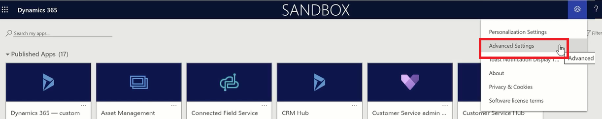](../media/tcs-dataverse-master-data-lookup-4.png)

2. On the **Settings** dropdown menu, select **Administration**.

    [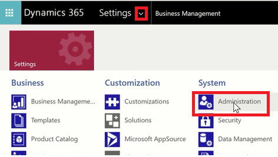](../media/tcs-dataverse-master-data-lookup-5.png)

3. Select **Virtual Entity Data Sources**.

    [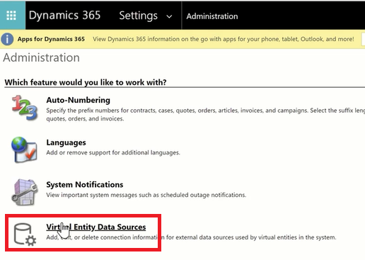](../media/tcs-dataverse-master-data-lookup-6.png)

4. Select the data source that is named **Finance and Operations**.

    [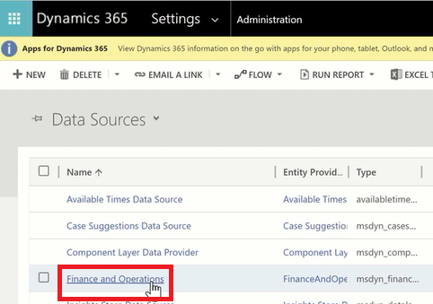](../media/tcs-dataverse-master-data-lookup-7.png)

5. Enter the following information from earlier steps:

    - **Target URL** – Enter the URL where you can access finance and operations apps.
    - **OAuth URL** – Enter `https://login.windows.net/`.
    - **Tenant ID** – Specify your tenant. This value can be the domain name of your company email (such as contoso.com).
    - **Microsoft Entra Application ID** – Enter the **Application (client) ID** value that was created earlier.
    - **Microsoft Entra Application Secret** – Enter the secret that was generated earlier.
    - **Microsoft Entra Resource** – Enter **00000015-0000-0000-c000-000000000000**. This value is the Microsoft Entra application that represents finance and operations apps. It should always be this same value.

6. Save your changes.
7. Close the page to return to the **Administration** page, where you will begin [Step 6. Enable Dataverse virtual entities](#virtual).

    [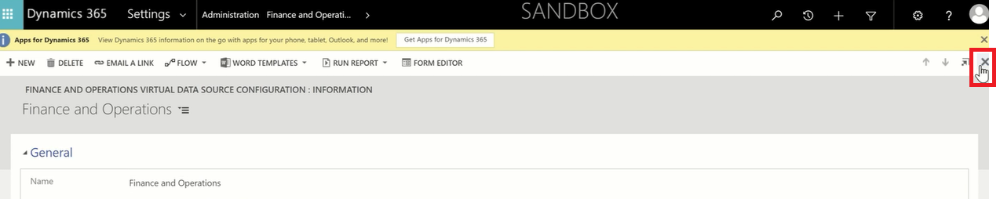](../media/tcs-dataverse-master-data-lookup-8.png)

For more information, see [Configure the virtual entity data source](../../../fin-ops-core/dev-itpro/power-platform/admin-reference.md#configure-the-virtual-entity-data-source).

## Enable Dataverse virtual entities

The visibility of the virtual entities from finance and operations apps must be set to **Yes** before they can be consumed by the Tax Calculation configuration.

> [!NOTE]
> You can skip this step by enabling the Tax Calculation–related virtual entities in just one click in [Step 8. Set up the connected application for Tax Calculation](#import). However, we recommend that you manually enable at least one virtual entity, to indicate that the connection between finance and operations apps and Dataverse is well established.

1. In your Dataverse environment, on the **Administration** page, select the filter button (funnel symbol) in the upper-right corner.

    [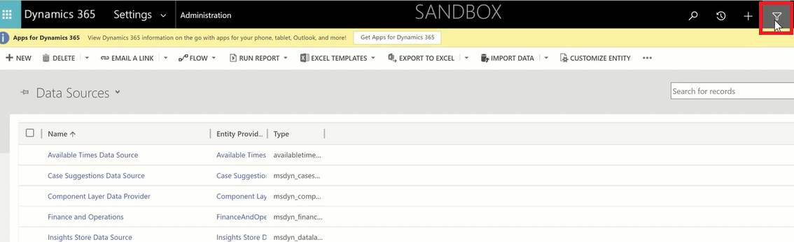](../media/tcs-dataverse-master-data-lookup-9.png)

2. In the **Advanced find** window, in the **Look for** field, select **Available Finance and Operations Entities**.
3. Add the following rule: **Name** – **Contains** – **CompanyInfoEntity**. Then select **Results**.

    [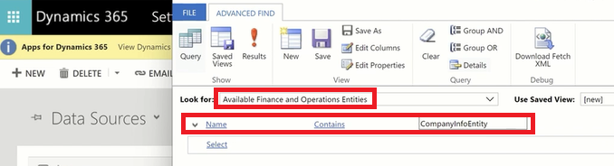](../media/tcs-dataverse-master-data-lookup-10.png)

4. Select **CompanyInfoEntity** in the search results, select the **Visible** checkbox, and then select **Save**.

    [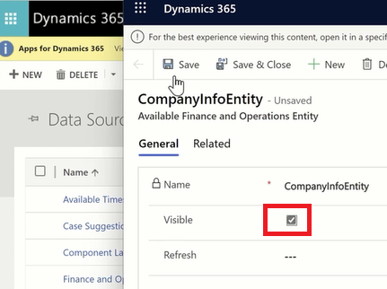](../media/tcs-dataverse-master-data-lookup-11.png)

5. Repeat the preceding steps for the following entities that are referred to in the Tax Calculation configuration:

    - CompanyInfoEntity
    - CurrencyEntity
    - CustCustomerV3Entity
    - DeliveryTermsEntity
    - EcoResProductCategoryEntity
    - EcoResReleasedProductV2Entity
    - LogisticsAddressCountryRegionTranslationEntity
    - LogisticsAddressStateEntity
    - PurchProcurementChargeCDSEntity
    - SalesChargeCDSEntity
    - TaxGroupEntity
    - TaxItemGroupHeadingEntity
    - VendVendorV2Entity
    - InventOperationalSiteV2Entity
    - TaxExemptCodeEntity
    - InventWarehouseEntity

    > [!NOTE]
    > Only the first 5,000 records of an entity can be retrieved by Dataverse and made available in the dropdown list of the Tax Calculation configuration.

For more information, see [Enable Microsoft Dataverse virtual entities](../../../fin-ops-core/dev-itpro/power-platform/enable-virtual-entities.md).

## Set up the connected application for Tax Calculation

1. Go to **Electronic reporting**, and then, in the **Related links** section, select **Connected applications**.

    [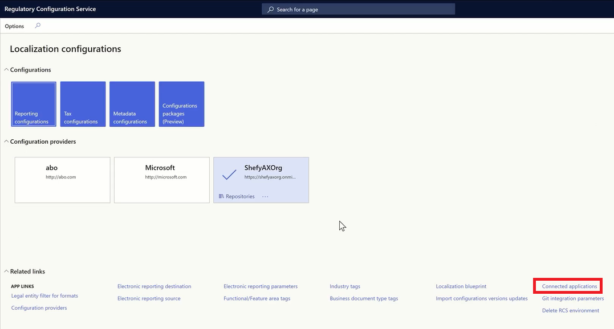](../media/tcs-dataverse-master-data-lookup-12.png)

2. Select **New** to add a record, and enter the following information.

    - **Name** – Enter a name.
    - **Type** – Select **Dataverse**.
    - **Application** – Enter your Dataverse environment's **Environment URL** value, which you made a note of in [Step 1. Enable Microsoft Power Platform integration and open your Dataverse environment](#enable).
    - **Tenant** – Enter your tenant.
    - **Custom URL** – Enter your Dataverse URL, and append **/api/data/v9.1** to it.

3. Select **Check connection**, and then, in the dialog box, select **Click here to connect to selected remote application**.

    [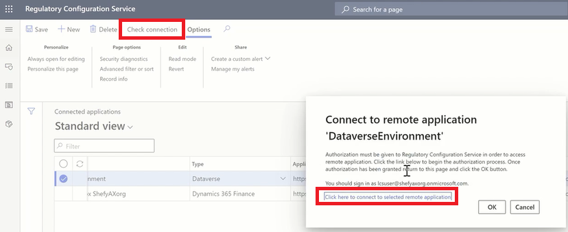](../media/tcs-dataverse-master-data-lookup-13.png)
4. Make sure that you receive a "Success!" message that indicates that the connection was successfully established.

    [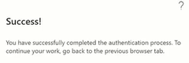](../media/tcs-dataverse-master-data-lookup-14.png)
    
5. In RCS, open the **Feature management** workspace, and enable the following features:

    - Globalization features
    - Electronic reporting Dataverse datasources support
    - Tax Service Dataverse datasources support

## Import and set up the Dataverse Model Mapping configuration

Microsoft provides default model mapping configurations for entities from finance and operations apps to Tax Calculation.

1. In RCS, go to **Electronic reporting**.
2. In the **Configuration providers** section, on the tile for the **Microsoft** provider, select **Repositories**.

    [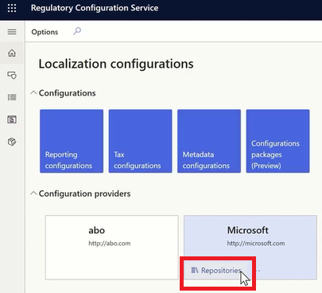](../media/tcs-dataverse-master-data-lookup-15.png)

3. Select the **Global configuration repository** record, and then select **Open**.
4. Under **Tax Data Model** \> **Tax Calculation Data Model**, select the **Dataverse Model Mapping** configuration.
5. On the **Versions** FastTab, select a version that matches your finance and operations apps version, and then select **Import**.

    [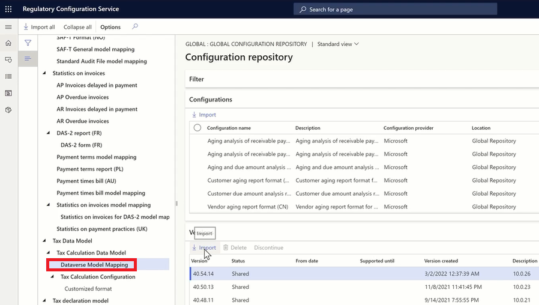](../media/tcs-dataverse-master-data-lookup-16.png)

    > [!IMPORTANT]
    > The **Dataverse Model Mapping** configuration is effective only on its highest imported version. Therefore, you should not import a version of the **Dataverse Model Mapping** configuration that is higher than the version of the Tax Calculation configuration that you plan to implement. For example, if you plan to implement version 40.50.225 of the Tax Calculation configuration, you should import only version 40.50.13 of the **Dataverse Model Mapping** configuration. You should not import version 40.54.14. Otherwise, there will be a data model mismatch in the configuration.

6. Go back to **Electronic reporting**, and select the **Tax configurations** tile.
7. Select the imported **Dataverse Model Mapping** configuration, and then select **Edit**.
8. Set the **Default for model mapping** option to **Yes**.
9. In **Connected application** field, select the connected application that you set up in [Step 7. Set up the connected application for Tax Calculation](#set-up).
10. Set the **Set virtual table visibility** option to **Yes** to set all Tax Calculation–related virtual entities to visible.

You've now completed the setup for the master data lookup functionality. A dropdown list for fields such as **Legal entity**, **Vendor account**, **Item code**, and **Delivery term** from Dynamics 365 Finance will now be enabled in the **Tax Calculation feature version** setup.

[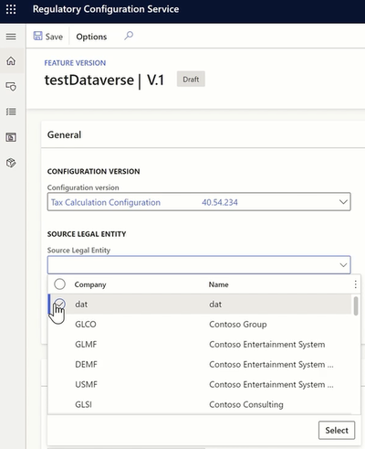](../media/tcs-dataverse-master-data-lookup-17.png)

[!INCLUDE[footer-include](../../../includes/footer-banner.md)]