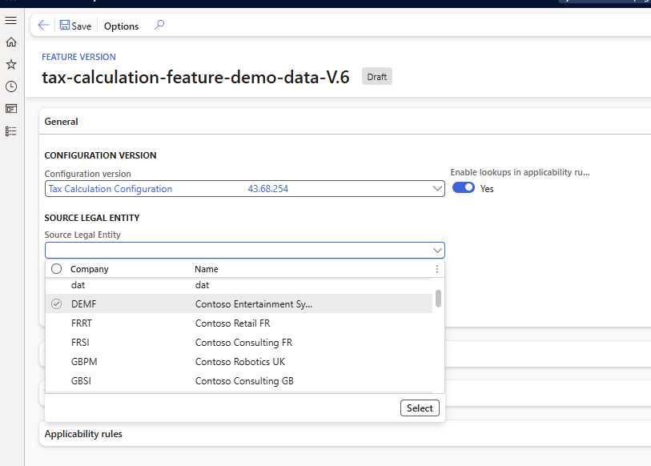

# Enable master data lookup for tax calculation configuration 

[!include [banner](../../includes/banner.md)]

This article explains how to set up and enable the tax calculation master data lookup functionality. A dropdown list is available to select values in the tax calculation configuration for fields such as **Legal entity**, **Vendor account**, **Item code**, and **Delivery term**.

1. In the **Feature management** workspace, enable the **Enable applicability rules value lookup for Tax Calculation** feature.
    > [!NOTE] 
    > Starting from the 10.0.43 version, this feature can no longer be enabled through the feature management and is controlled by the “Enable lookups in applicability rules” parameter in the Tax feature setup.
    > 
2. Make sure that you imported the latest configuration and model mapping versions. If you didn't, follow the steps in [Import Electronic reporting (ER) configurations from Dataverse](workspace/gsw-import-er-config-dataverse.md) to import them.

    - Tax Data Model.version.40.xml
    - Tax Calculation Data Model 40.65.xml
    - FNO Model Mapping 40.65.35.xml (For this model mapping, set the **Default for model mapping** parameter to **Yes**.)
    - Tax Calculation Configuration 40.65.249.xml

3. On the tax **Feature version** setup page, select configuration version 40.65.249.

    > [!NOTE] 
    > If you have a customized configuration, you must rebase the configuration and then use the customized configuration. 

4. In the **Source legal entity** field, select legal entities. You'll be able to choose master data from these legal entities.

[!INCLUDE[footer-include](../../../includes/footer-banner.md)]
