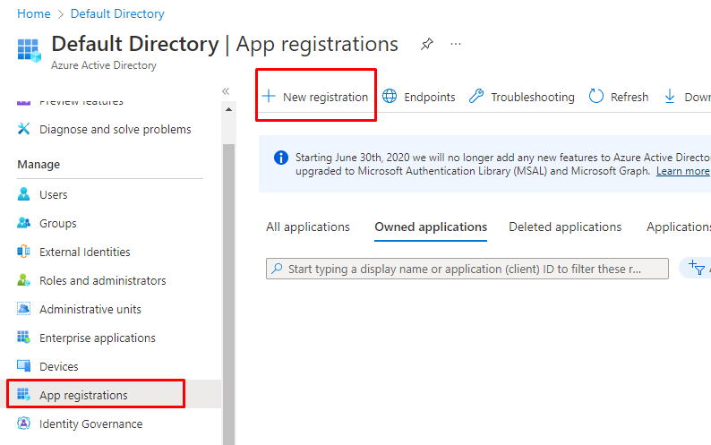
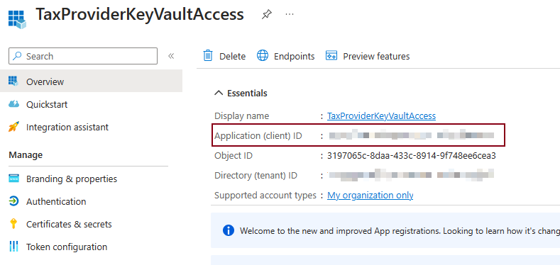
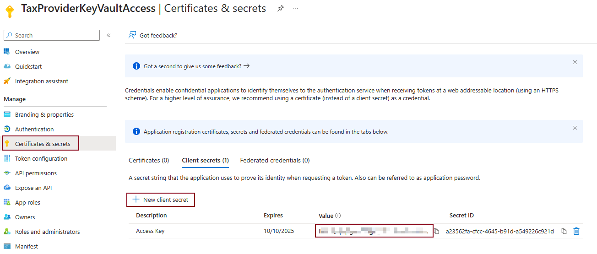
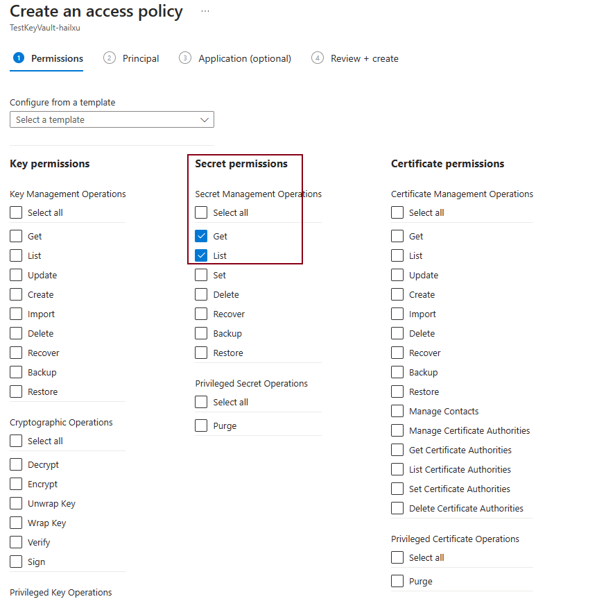
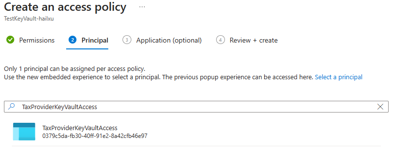
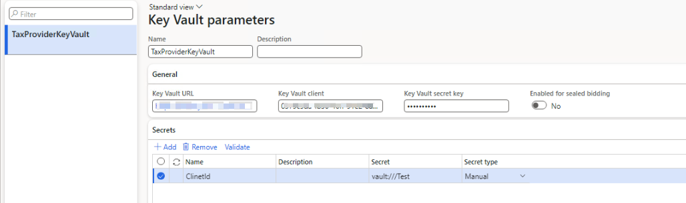

# Set up Client ID and Client Secret

[!INCLUDE[banner](../includes/banner.md)]

This article explains how to set up ClientId and ClientSecret for the universal tax rate API.

## Prerequisites

Before you can access a tax provider's service, you must set up your ClientId and ClientSecret for the Universal tax rate API. Your tax provider supplies you with the Client ID and Client Secret. When you recieve them, store them in an Azure key vault and configure the key vault parameters for Dynamics 365 finance and operations apps. After these are set up in the key vault, you can select the corresponding key vault secrets name in the tax feature setup.

:::image type="content" source="../media/CustomerISVFeatureCredential-GTEPlus.png.png" alt-text="Screenshot of the General setting section with the Credential section highlighted."::: 

## Create an Azure key vault in the Azure portal

All of the secrets and certificates used in the Tax Calculation service must be stored in a Microsoft Azure key vault. This approach helps ensure that you don't work directly with the secrets, and that the secrets are securely stored. When you must use digital signing or secure a connection to external web services, set the reference to the Key Vault secrets instead of using the secrets and certificates directly. For more information, see [About Azure Key Vault](/azure/key-vault/general/overview).

### Create a Key vault

To create a Key vault, follow these steps.

1. From the [Azure portal](https://ms.portal.azure.com/) menu, or from the **Home** page, select **Create a resource**.
2. In the Search box, enter **Key vault**.
3. From the results list, choose **Key vault**.
4. On the Key Vault section, choose **Create**.
5. On the **Create key vault** section provide the following information:
    - **Subscription**: Choose a subscription.
    - **Resource group**: Choose a Resource group or Create new.
    - **Name**: A unique name is required. E.g., we use **TaxProvider-vault**.
    - In the **Location** pull-down menu, choose a location.
    - Leave the other options to their defaults.
      
    > [!NOTE]
    > The **Name** above will be referred in the section [Setup Key Vault parameters in Dynamics 365 Finance and Operations](#setup-key-vault-parameters-in-dynamics-365-finance-and-operations) as **\<KeyVaultName\>**.
    
6. Select next and set the **Permission model** to **Vault access policy**.
7. Select **Review + Create**.
8. After the deployment completes, expand the **Deployment details** section and select the **Key vault** detail.

   :::image type="content" source="../media/items.png" alt-text="Screenshot of the TaxProvider-vault Overview page with the Deployment details expanded and the key vault highlighted.":::

   > [!NOTE]
   > Copy and save the **Vault URI**, you need it when you complete the [Setup Key Vault parameters in Dynamics 365 Finance and Operations](#setup-key-vault-parameters-in-dynamics-365-finance-and-operations) section for the **\<Key Vault URI\>** value.
    
   :::image type="content" source="../media/items1.png" alt-text="creenshot of the TaxProvider-vault Secrets page with the Secrets object and Generate/Import highlighted.":::

10. Select next and set the **Permission model** to **Vault access policy**.
11. Select **Secrets**, and then select **Generate/Import**. Next, complete the following fields.
    - **Upload options**: **Manual**.
    - **Name**: A name for the seceret. For example, **ClientID**.
    - **Secret value**: Enter the Client ID that you get from the Tax provider.
12. Select **Create**.

    > [!NOTE]
    > The **Secret Name** is a mandatory parameter for integration with the key vault, therefore it should be specified in the application. It is referred in [Setup Key Vault parameters in Dynamics 365 Finance and Operations](#setup-key-vault-parameters-in-dynamics-365-finance-and-operations) as **SecretName** parameter.
    
    :::image type="content" source="../media/items2.png" alt-text="Screenshot of the TaxProvider-vault Secrets page with the ClientSecret and ClientID highlighted.":::

13. Repeate step 10 for Client secret.

:::image type="content" source="../media/items3.png" alt-text="Screenshot of the TaxProvider-vault Secrets page with the Deployment details expanded and the key vault highlighted.":::

### Setup Permissions

This section explains how to complete the following procedures.

- Create App registration
- Set Access policy of the Key Vault
- Setup Key Vault parameters in Dynamics 365 finance and operations apps

#### Create App registration

To access Azure key vault you need to create App registration in Azure Active Directory. To create an App registration, follow these steps.

1. In Azure Active Directory search for **register**, and then select **App registration**.
   
   
   :::image type="content" source="media/folder-with-same-name-as-article-file/image-description.png" alt-text="Alt text that describes the content of the image.":::
2. Set the **Name** and **Supported account types**, and then click **Register**
3. Copy and save **Application (Client) ID**. It should be specified in the application, and referred in [Setup Key Vault parameters in Dynamics 365 Finance and Operations](#setup-key-vault-parameters-in-dynamics-365-finance-and-operations) as **\<Key Vault client\>** parameter.
   
   :::image type="content" source="media/folder-with-same-name-as-article-file/image-description.png" alt-text="Alt text that describes the content of the image.":::

4. Create a new **Client secret**.
   > [!NOTE]
   > The **Client secret** is a mandatory parameter for integration with the key vault. It should be copied and then specified in the application. It is referred in [Setup Key Vault parameters in Dynamics 365 Finance and Operations](#setup-key-vault-parameters-in-dynamics-365-finance-and-operations) as **\<Key Vault secret key\>** parameter.

   
   :::image type="content" source="media/folder-with-same-name-as-article-file/image-description.png" alt-text="Alt text that describes the content of the image.":::

#### Set Access policy of the Key Vault

You must set up the access policy to grant the App registration above the correct level of secure access to the secret that you created.

1. Open the Key Vault storage that you created above.
2. Go to **Settings** \> **Access policies**, and click **Create**.
3. In the **Secret permissions**, select the **Get** and **List** operations.
   
   :::image type="content" source="media/folder-with-same-name-as-article-file/image-description.png" alt-text="Alt text that describes the content of the image.":::
5. Click **Next**, in the **Select principal**, select the App registration that you created above.
   
   :::image type="content" source="media/folder-with-same-name-as-article-file/image-description.png" alt-text="Alt text that describes the content of the image.":::
7. Click **Next** till to "Review + create" and the click **Create**.

## Setup Key Vault parameters in Dynamics 365 finance and operations apps

After finishing the prerequisite steps, you setup the key vault parameters to link to the azure key vault in Dynamics 365 Finance and Operations.

1. Go to **System administration > Setup > Key Vault parameters**.
2. Select New to create a new instance.
3. Enter a name and description, and then, on the General FastTab, set the fields that are required for the integration with Key Vault storage:
   - **Key Vault URL** – The Vault URI that we saved in the section [Create a Key Vault](#create-a-key-vault).
   - **Key Vault client** – Enter the interactive client ID of the Azure Active Directory (Azure AD) application that is associated with the Key Vault storage for authentication.
   - **Key Vault secret key** – Enter the secret key that is associated with the Azure AD application that is used for authentication with the Key Vault storage.
4. On the Secrets FastTab, click Add to add your secret. For each secret, set the following fields:
    - **Name**
    - **Description**
    - **Secret** – Enter a secret reference to the key vault secret.

    The format of a secret must resemble the following example:
    **vault://<KeyVaultName*>/<SecretName*>/<SecretVersion*>**

    Attributes that are marked with an asterisk (*) are **optional**. However, the **\<SecretName>** attribute is required. In most cases, you can define a Key Vault secret key in the following format:
    **vault:///\<SecretName>**

    If the secret version isn't defined in the Key Vault secret key, the system retrieves the active secret that has the latest expiration date.
    

[!INCLUDE[footer-include](../../../includes/footer-banner.md)]
