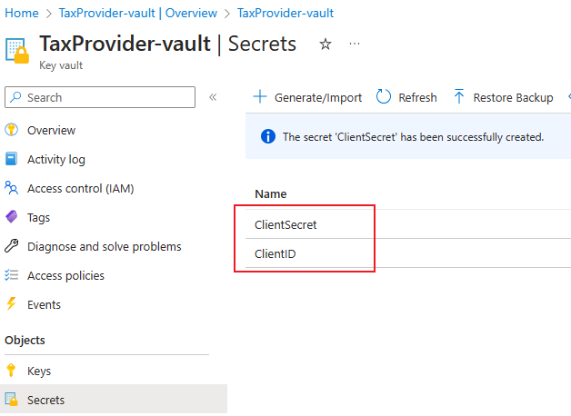

# Setup Client ID and Client Secret

## Introduction

You need to setup your credential information to access the Tax provider's service. You should get Client ID and Client Secret from your Tax provider, and then store them in Azure key vault and config Key vault parameters in in Dynamics 365 Finance and Operations. And then you would be able to select the corresponding key vault secrets name in the tax feature setup.

## Prerequisite Steps - Create an Azure key vault in the Azure portal

All the secrets and certificates that are used in the Tax Calculation service must be stored in a Microsoft Azure key vault. This approach helps ensure that you don't work directly with the secrets, and that the secrets are securely stored. When you must use digital signing or secure a connection to external web services, set the reference to the Key Vault secrets instead of using the secrets and certificates directly. For more information, see [About Azure Key Vault](https://learn.microsoft.com/en-us/azure/key-vault/general/overview).

### Create a Key Vault

1. From the [Azure portal](https://ms.portal.azure.com/) menu, or from the **Home** page, select **Create a resource**.
2. In the Search box, enter **Key Vault**.
3. From the results list, choose **Key Vault**.
4. On the Key Vault section, choose **Create**.
5. On the **Create key vault** section provide the following information:
    - **Subscription**: Choose a subscription.
    - **Resource group**: Choose a Resource group or Create new.
    - **Name**: A unique name is required. E.g., we use **TaxProvider-vault**.
    - In the **Location** pull-down menu, choose a location.
    - Leave the other options to their defaults.
    >**NOTE:**
    > The **Name** above will be referred in the section [Setup Key Vault parameters in Dynamics 365 Finance and Operations](#setup-key-vault-parameters-in-dynamics-365-finance-and-operations) as **\<KeyVaultName\>**.
6. Click next and set the **Permission model** to **Vault access policy**.
7. Select **Review + Create**.
8. Waiting for the deployment complete. Expand the Deployment details go to the Key Vault detail.

    >**NOTE:**
    > Please copy and save the **Vault URI** above, it will be referred in the section [Setup Key Vault parameters in Dynamics 365 Finance and Operations](#setup-key-vault-parameters-in-dynamics-365-finance-and-operations) as **\<Key Vault URL\>**.

9. Click next and set the **Permission model** to **Vault access policy**.

10. Select Secrets, Click **Generate/Import**

    - **Upload options**: **Manual**.
    - **Name**: A name for the seceret. E.g.: **ClientID**
    - **Secret value**: Enter the Client ID that you get from the Tax provider.
    - Click **Create**
    >**NOTE:**
    > The **Secret Name** is a mandatory parameter for integration with the key vault, therefore it should be specified in the application. It is referred in [Setup Key Vault parameters in Dynamics 365 Finance and Operations](#setup-key-vault-parameters-in-dynamics-365-finance-and-operations) as **SecretName** parameter.
11. Repeate step 10 for Client secret.

### Setup Permissions

#### Create App registration

To access Azure key vault you need to create App registration under Azure Active Directory.

1. Create a new App registration.
   
   
2. Set the **Name** and **Supported account types**, and then click **Register**
3. Copy and save **Application (Client) ID**. It should be specified in the application, and referred in [Setup Key Vault parameters in Dynamics 365 Finance and Operations](#setup-key-vault-parameters-in-dynamics-365-finance-and-operations) as **\<Key Vault client\>** parameter.
   

4. Create a new **Client secret**.
   >**Note**
   > The **Client secret** is a mandatory parameter for integration with the key vault. It should be copied and then specified in the application. It is referred in [Setup Key Vault parameters in Dynamics 365 Finance and Operations](#setup-key-vault-parameters-in-dynamics-365-finance-and-operations) as **\<Key Vault secret key\>** parameter.

   

#### Set Access policy of the Key Vault

You must set up the access policy to grant the App registration above the correct level of secure access to the secret that you created.

1. Open the Key Vault storage that you created above.
2. Go to **Settings** \> **Access policies**, and click **Create**.
3. In the **Secret permissions**, select the **Get** and **List** operations.
   
4. Click **Next**, in the **Select principal**, select the App registration that you created above.
   
5. Click **Next** till to "Review + create" and the click **Create**.

## Setup Key Vault parameters in Dynamics 365 Finance and Operations

After finishing the prerequisite steps, you setup the key vault parameters to link to the azure key vault in Dynamics 365 Finance and Operations.

1. Go to **System administration > Setup > Key Vault parameters**.
2. Select New to create a new instance.
3. Enter a name and description, and then, on the General FastTab, set the fields that are required for the integration with Key Vault storage:
   - **Key Vault URL** – The Vault URI that we saved in the section [Create a Key Vault](#create-a-key-vault).
   - **Key Vault client** – Enter the interactive client ID of the Azure Active Directory (Azure AD) application that is associated with the Key Vault storage for authentication.
   - **Key Vault secret key** – Enter the secret key that is associated with the Azure AD application that is used for authentication with the Key Vault storage.
4. On the Secrets FastTab, click Add to add your secret. For each secret, set the following fields:
    - **Name**
    - **Description**
    - **Secret** – Enter a secret reference to the key vault secret.

    The format of a secret must resemble the following example:
    **vault://<KeyVaultName*>/<SecretName*>/<SecretVersion*>**

    Attributes that are marked with an asterisk (*) are **optional**. However, the **\<SecretName>** attribute is required. In most cases, you can define a Key Vault secret key in the following format:
    **vault:///\<SecretName>**

    If the secret version isn't defined in the Key Vault secret key, the system retrieves the active secret that has the latest expiration date.
    
