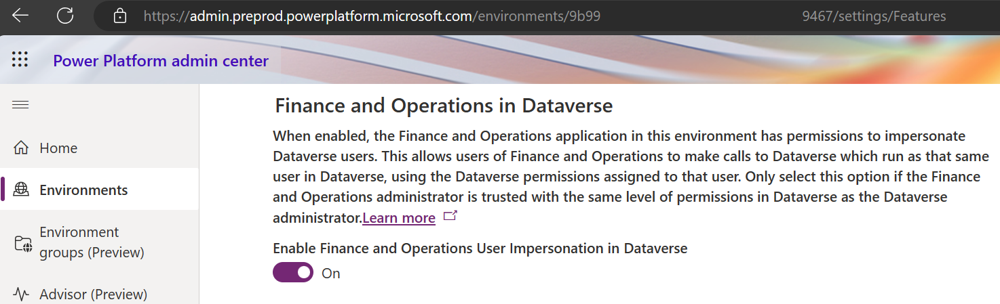

# Connect to an external tax solution provider via the Universal Tax Rate API

[!INCLUDE[banner](../../includes/banner.md)]

A connection to an external tax solution provider helps simplify and reduce the effort of maintaining the tax rates and tax applicability rules for Tax calculation. This result is especially critical when you implement Tax calculation for countries or regions where a significant number of tax jurisdictions must be covered.

The Universal Tax Rate API is a set of standard application programming interfaces that Microsoft has defined in Tax calculation, based on the tax calculation data model. It's an extended feature of Tax calculation that enables external tax services to be connected under the same framework.

Through this extension, external tax solution providers can provide tax rate determination, tax calculations, and extended tax functionality via standardized APIs. This extension introduces the following benefits:

- **Seamless integration with Microsoft Dynamics 365 applications** – The external tax solution is seamlessly integrated into Dynamics 365 applications. This integration ensures a smooth and unified experience across Dynamics 365 applications.
- **Improved scalability** – By connecting to an external tax solution provider, you can take advantage of its infrastructure and expertise to efficiently handle large-scale tax calculations.
- **Reduced maintenance overhead** – External tax solution providers are responsible for maintaining up-to-date tax rates and tax applicability rules. Therefore, they can help save you time and effort.
- **Enhanced accuracy** – External tax services often have access to comprehensive tax databases and advanced algorithms. Therefore, tax calculations are more accurate.
- **Flexibility and customization** – The standardized APIs let you integrate with various external tax solution providers. Therefore, you can select the one that best fits your business needs.
- **Compliance with local regulations** – External tax solution providers are well-versed in local tax laws and regulations. Therefore, they can ensure that your tax calculations comply with the specific requirements of each jurisdiction.

> [!NOTE]
> The Universal Tax Rate API shares the same integration of Tax calculation. Different tax solution providers might support different regions, scopes, scenarios, and extended functionality. For more information, contact the [tax solution providers](#available-tax-solution-providers).

The following functionality is available via the Universal Tax Rate API that the tax solution providers support:

- **Encrypted connection** – The Universal Tax Rate API supports an encrypted connection via Azure Key Vault. This connection helps ensure the security and privacy of data that's transmitted to external tax solution providers.
- **Address validation** – This functionality lets you validate addresses that are maintained in the global address book. It helps ensure accurate tax calculations by confirming that addresses are valid and complete.
- **Sales tax calculation** – External tax solution providers can use the Universal Tax Rate API to calculate sales tax, based on factors such as the location and the product type.
- **Posted tax transactions** – This functionality enables tax transaction postings in the external tax solution system of the tax solution providers. Tax reporting is generated after the posting in the external tax solution system.
- **Accrual of use tax** – The Universal Tax Rate API enables external tax solution providers to accrue use tax. Use tax is a type of tax that's imposed on the use, storage, or consumption of taxable items or services that weren't taxed at the time of purchase in the United States.

## Availability

The Universal Tax Rate API is available in Dynamics 365 Finance or Dynamics 365 Supply Chain Management version 10.0.38 and later.

## Versions

We recommend that you import and set up your Tax calculation configuration with the version that matches your Finance or Supply Chain Management version.

| Finance or Supply Chain Management version | Tax configuration version |
|---|---|
| 10.0.39 | Tax Calculation Data Model for ISV Integration 40.65.5 |

## Enable a tax solution provider

To enable a tax solution provider, follow these steps.

1. Enable the following features in Feature management:

    - Tax calculation service
    - Enable external tax solution providers for Tax calculation service
    - Globalization features
    - Enable Globalization feature setup for Tax calculation service
    - Electronic reporting globalization feature Json import/export

1. Engage and select one [tax solution provider](#available-tax-solution-providers). Install the independent software vendor (ISV) application when the tax solution provider requires it for the complete and extended functionality.
1. [Set up a client ID and client secret](./universal-tax-rate-api-how-to-setup-clientId-and-clientsecret.md) for the application access credentials that your tax solution provider provides.
1. Import the tax calculation data models provided by Microsoft from the global repository or the Dataverse repository via Globalization Studio.
    - **Configuration providers** \> **Microsoft** \> **Repositories** \> **Global** \> **Open** \> **Import**
         
        - Tax Calculation Data Model for ISV integration.xml (version 40.65.5)
     
      > [!NOTE]
      > If you want to import the tax data model from the Dataverse repository, make sure you have enabled the option **Enable Finance and Operations User Impersonation in Dataverse** under **Power Platform admin center** \> **Environments** \> **your environment id** \> **settings** \> **Features**.
      >
      
1. Load the ISV provided tax configuration and tax features via Globalization Studio. Follow the implementation guidance that your tax solution provider provides.

    - **Tax configurations** \> **Exchange** \> **Load from XML**

        - ISV tax configuration.xml (version 40.65.5.x)

    - **Tax calculation** \> **Import from JSON**

        - ISV tax solution.json (version x)

    > [!NOTE]
    > The ISV distributes the preceding .xml and .json files for load and import into the Tax calculation setup. The name of the files can be vary per different ISV naming rules.

1. In Globalization Studio, select **Tax calculation** \> **Add**, and create and configure the customer ISV tax feature for your credentials, parameter values, mapping rules, and so on. Follow the implementation guidance that your tax solution provider provides.
1. Go to **Tax** \> **Setup** \> **Tax configuration** \> **Tax calculation parameters**.
1. On the **General** tab, in the **Tax solution provider** section, enable the **Enable tax solution provider** option.
1. Configure the [tax solution provider](#available-tax-solution-providers).
1. You can now perform transactions as usual. When Tax calculation is required, the client collects information from the transaction, such as the sales order or purchase order, and it packages that information as a payload. A request is then sent to your tax solution provider to calculate the tax.
1. The calculation result is returned from your tax solution provider to your Finance system and presented on the sales tax transaction page.
1. When you post a sales tax–related voucher in Finance, a Posted tax transaction request is sent to your tax solution provider to record the necessary tax information in its tax solution system for tax reporting.

## Supported countries/regions

The Universal Tax Rate API can be enabled for for any country/region.

For more information about supported countries/regions, contact your tax solution providers.

## Available tax solution providers

- [Vertex](https://go.microsoft.com/fwlink/?linkid=2258342) (available)
- [Avalara](https://go.microsoft.com/fwlink/?linkid=2258284) (planned)
- [Wolters Kluwer](https://go.microsoft.com/fwlink/?linkid=2265094) (planned)
- [Thomson Reuters](https://go.microsoft.com/fwlink/?linkid=2271303) (planned)

For additional details on release information, available solutions, and supported countries/regions, we recommend reaching out to your tax solution providers.

[!INCLUDE[footer-include](../../../includes/footer-banner.md)]
