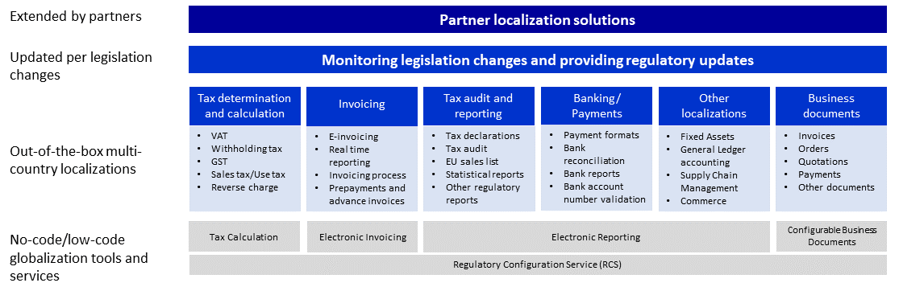

---
# required metadata
title: Globalization Studio overview
description: This article provides information about the the Globalization Studio.
author: Filatovm
ms.date: 09/19/2022
ms.topic: article
ms.prod: 
ms.technology: 
audience: Application User
ms.reviewer: kfend
ms.search.region: 
ms.author: wangchen
ms.search.validFrom: 2022-09-20
ms.dyn365.ops.version: 10.0.30
---

# Globalization Studio overview 

[!include [banner](../includes/banner.md)]

To run their businesses globally, customers must meet multiple country-specific requirements of tax compliance and local business practices. We refer to this as localization. These complex requirements are frequently changed by local governments, often with very tight law enforcement dates.

The Globalization Studio addresses these challenges by providing:

- **No-code/low-code globalization tools and services**: These tools and services make localizations easier for Microsoft and make it easier for partners and customers to create, extend, automate, and maintain the product.
- **Out-of-the-box multi-country localization content**: The content is provided and kept up-to-date by Microsoft and can be extended by partners.

The combination of these flexible, easy-to-use tools and services, and the out-of-the-box localization content which is continuously monitored and updated by Microsoft, and extended by partners, allows you to operate the solution in over 200 countries/regions while meeting multiple tax compliance and local business practice requirements. 

The Globalization Studio consists of the following tools and services:.
  - [Regulatory Configuration Service](rcs-overview.md) is a standalone designer and lifecycle management service for no-code/low-code globalization functionality.
  - [Electronic Reporting](/dynamics365/unified-operations/dev-itpro/analytics/general-electronic-reporting) (ER) is a configurable tool that helps to create and maintain regulatory electronic reporting, payment formats, and other features in a no-code/low-code format.
  - [Configurable Business Documents](er-business-document-management.md)) are built on top of the ER framework and enables business users to edit business document templates by using a Microsoft Dynamics 365 service or appropriate Microsoft Office desktop application.
  - [Tax Calculation](global-tax-calcuation-service-overview.md) is a hyper-scalable multitenant service that significantly enhances the core tax determination and calculation capabilities of Dynamics 365 finance and operations apps with a more flexible and fully configurable engine.
  - [Electronic Invoicing](e-invoicing-service-overview.md) is a hyper-scalable multitenant service that extends the existing electronic invoicing capabilities to more countries and enables configurable processing of electronic invoices and configurable electronic document exchange.
- [Out-of-the-box multi-country localizations](country-region.md) and [regulatory updates](regulatory-updates.md) are provided by Microsoft and updated per legislation changes in the supported countries/regions.
- Partner localization solutions that are published at [Appsource](https://appsource.microsoft.com/en-us/) or provided directly by partners.

[!INCLUDE[footer-include](../../includes/footer-banner.md)]
